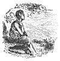
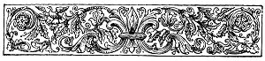

  
[Intangible Textual Heritage](../../../index.md) 
[Legends/Sagas](../../index)  [Celtic](../index)  [Index](index.md) 
[Previous](phy00)  [Next](phy02.md) 

------------------------------------------------------------------------

p. viii

[  
Click to enlarge](img/02700.jpg.md)

p. vii

 

# PREFACE.

|                      |
|----------------------|
|  |

N no part of the British Islands has the belief in the existence of
Fairies retained a stronger hold upon the people than in the Isle of
Man. In spite of the tendency of this matter-of-fact age to destroy what
little of poetry, romance, and chivalry Nineteenth Century education has
left to us, there lurks still in many countries, and especially in
mountainous districts, a half credulity in the supernatural.

Many legends of good and evil Fairies are still related by the country
people of Mona's Isle; and those who care to inquire into the habits and
customs of the Manx cottagers will see and hear much that will reward
their curiosity. It is not the mere excursionist, visiting the Island
for a summer holiday and keeping on the beaten track of sightseers, who
will ever learn or see anything of these customs, but he who branches
off the high road into the recesses of the mountain districts.

When gathering materials for the tale of the Communion Cup of Kirk
Malew, I visited the Vicarage to ascertain, if possible, the date of the
disappearance of the Fairy Silver Goblet, which Waldron in his "History"
speaks of as being then in existence and in safe keeping in the Church.
In the course of conversation on the lingering belief in Fairies, the
Vicar

p. viii

informed me that one of his own parishioners--a regular attendant at
Church, and a well-to-do farmer--had lately expressed his implicit
conviction that such people as fairies *did* frequent the Glen in which
he lived; and in reply to the Parsons question, "Have you ever, in your
life, seen a fairy?" he replied, "No! I can't exactly say I ever saw
one; but I've smelt them often enough."

Sir Walter Scott, in his "Peveril of the Peak," gives an outline of the
legend of the "Mough-dy-Dhoo," the Phantom Black Dog of Peel Castle; and
in his notes he refers to others. Waldron, in his quaint "History of the
Isle of Man," alludes to several legends, and relates a good deal that
is interesting on the superstitions of the Manx people and their belief
in Elves and Fairies.

To rescue from oblivion some of the legends that delighted my early
years, and present them in an entertaining shape before the reader, has
long been my wish; and if, by reading them, an interest in, and a desire
to visit, the beautiful Isle of Man is created in any who now only know
of its existence as an island somewhere in the Irish Sea, I shall not
have written in vain.

I am indebted to the late JAMES BURMAN, Esq., F.R.A.S., Secretary to the
Lieut.-Governor and the Council of the Island, to the late PAUL BRIDSON,
Esq., Honorary Secretary to the Manx Society, and others, for many of
the materials of these tales.

In the event of these tales being favourably received I shall be
encouraged to repeat this experiment, as there are many more Legends of
the Isle of Man that I am inclined to hope will be found both
interesting and entertaining.

EDWARD CALLOW.

HIGHGATE, *July*, 1882.

------------------------------------------------------------------------

[Next: Contents](phy02.md)
