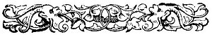

  
[Intangible Textual Heritage](../../../index.md) 
[Legends/Sagas](../../index)  [Celtic](../index)  [Index](index.md) 
[Previous](phy02)  [Next](phy04.md) 

------------------------------------------------------------------------

p. x

 

<table data-border="0">
<colgroup>
<col style="width: 100%" />
</colgroup>
<tbody>
<tr class="odd">
<td data-valign="top" width="362">
<em>Ah, Mona's isle, fair Mona's isle, 
No land so dear as thou to me; 
Thy gorse and heather covered hills, 
With waterfalls and sparkling rills, 
Which join the bright green sea</em>.

<em>I love to wander in solitude 
By the banks of thy gurgling streams, 
Or sit and muse on a mossy stone 
Of fairy-lore, buggane, and gnome, 
Screen’d from the sungod's beams</em>.

<em>’Tis sweet to ramble alone, 
At eve o’er the silvery sand, 
Watching the waves in the moonlight gleam, 
Now here, now there, in frolic they seem 
To coyley kiss the land.</em>

<em>Each valley, mountain, and glen, 
Waterfall, streamlet, and sea, 
Cavern, rock, harbour, and bay, 
Last home of the Elfin and Fay, 
Fair Mona, are all dear to me</em>.
</td>
</tr>
</tbody>
</table>

 

 

------------------------------------------------------------------------

[Next: Chapter I](phy04.md)
