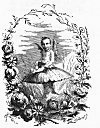
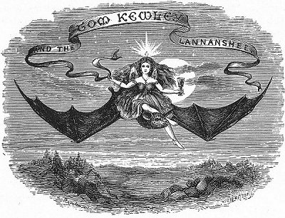
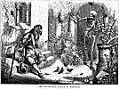
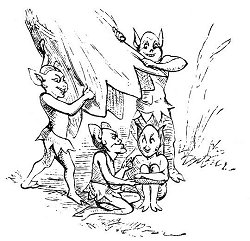

  
[Intangible Textual Heritage](../../../index) 
[Legends/Sagas](../../index)  [Celtic](../index)  [Index](index) 
[Previous](phy08)  [Next](phy10) 

------------------------------------------------------------------------

p. 29 p. 30

[  
Click to enlarge](img/03000.jpg)

p. 31

 

# TOM KEWLEY AND THE LANNANSHEE;

###### OR,

### THE FAIRY CUP OF KIRK MALEW.

### CHAPTER I.

|                     |
|---------------------|
|  |

ALLASALLA is a quiet little Manx village on the bank of a rushing,
leaping, murmuring trout stream, which, after tearing down from the
sides of South Barrule mountain, and winding in and out between the
stone boulders, and through the nooks and glens abounding in this part
of the island, eventually finds its way into the sea at Castletown, some
two miles distant, there mingling its pure fresh waters with those of
the "briny deep " close beneath the old grey limestone walls of Castle
Rushen. On the opposite side of the stream to the village are the
venerable ruins of what was, many years ago, the proud and stately
Rushen Abbey, the wealthiest monastic establishment in the Isle of Man;

p. 32

and between whose cloistered vaults and the dark dungeons of Castle
Rushen, tradition says there once existed a secret subterranean passage,
whose walls, had they tongues as well as the ears attributed to mural
constructions, could doubtless tell many a dismal tale of persecution
and wrong.

In a cottage in the outskirts of Ballasalla, and removed but a few paces
from the Douglas road, dwelt, many years ago, one Tom Kewley with his
wife and one child. Tom was an honest fellow, and was industrious as
most of his neighbours, cultivating a patch of land, hardly of extent
sufficient to be called a farm, and occasionally, especially in the
herring season, taking a turn as one of the crew of a Peel or
Port-le-Mary fishing lugger.

Kewley might have been a more thriving man than he was but for the
falling he shared with so many of his neighbours--a liking for jovial
company, and not knowing when he had had enough of strong drink. The
consequence was that many a groat and many an hour were wasted with boon
companions that might have been employed otherwise, to the great
advantage of himself and family.

One evening in the early autumn Tom was trudging towards his home after
visiting his fields, whither he had been to see how soon his crops would
be ready for the sickle, when, casting his eye over his shoulder to
watch some clouds gathering upon the mountain top, which, he feared,
portended a storm not very favourable to his little expected harvest,
his attention was arrested by seeing a cloud of white mist apparently
roll from under a dark, threatening cloud hanging on the mountain side.
This mist had an appearance different to anything he had ever noticed
before, and while gazing at it he thought he perceived the figure of a
man emerge from it, waving his arms in a frantic manner, and running
with all speed down the hillside towards the village. He stood and
watched attentively what, at first, he thought must be some supernatural
being; but as the man drew nearer, hurrying on and scrambling over every
obstacle in his way, Tom thought he recognized the figure, and, mounting
to the top of a stone wall

p. 33

to get a better view, he himself became visible to the running man, who
altered his course and hastened on towards him with increased speed,
shouting at the top of his voice. As the fugitive--for there could be no
doubt he was one, and flying for his life--approached nearer, Kewley
recognized him as Philip Caine, a pedlar, who travelled the island over,
from end to end and from one side to the other, with his pack of useful
and tempting articles; and who was always a welcome guest, go where he
would, for he ever had a budget full of news as well as wares.

"Phil is that yourself? and what's your haste, man? You couldn't run
faster or look more scared if a buggane, or Cuttar McCulloch himself,
were at your heels. What on earth's the matter? Speak, man."

The flying pedlar could give no reply. He was far too exhausted with his
run down the mountain side to speak, and stood clinging to Tom's arm
panting for breath, and looking as Tom had said, "scared," and as if he
feared being followed and snatched away by some uncanny arm.

"Where's your pack, Phil?" asked Kewley, seeing he was without his usual
burden. "Is it robbed you've been, is it?"

"Robbed and murdered," gasped the pedlar, and sank into a sitting
posture on the ground.

"Nonsense, man," rejoined Tom, with a laugh. "Murdered men don't run
like you did. Come in the house and rest awhile. Maybe ye’ll be able to
tell us all what's befell ye."

Peggy Kewley was not a little surprised on seeing the scared pedlar
enter the cottage door with her husband, and it was not until Phil Caine
had rested some time and partaken of supper that he could give any
collected account of what had befallen him.

He had set out in the early morning from Peel with the intention of
working his way to Castletown, calling at the different villages and
farms on his way to dispose of his wares. His route lay over South
Barrule, and after visiting St. John's, where he had done some good
trade, he strapped his pack upon his shoulders, and started to cross the
mountain. On and on, ever upward, Philip Caine wended his way,

p. 34

bending beneath the burden of his pack as he trod the steep ascent.
Presently, after leaving the last house on the northern side of the
mountain, and nearing the highest part of the tract, that here served
the purposes of roadway, he became suddenly enveloped in a dense cloud;
but this was no unusual occurrence on such high ground, and Caine
thought nothing of it, and knowing by the peculiar fineness of the grass
that he must be very near the summit, he continued his journey without
fear.

The clouds getting denser, he stopped for a while to rest and take
breath for further progress, and then discovered he had wandered from
the roadway. The short soft grass being pleasanter to walk upon than the
stony road, he had chosen it, and had not noticed the fact of his having
strayed from the road till he discovered he had actually lost his way.
He waited patiently for some time resting, and thinking that ere long
the clouds would disperse; but, to his surprise and dismay, they grew
denser and denser, till at last, although he knew it still wanted
several hours of sundown, it became as dark as night, and he could not
distinguish any object twenty yards away.

While conjecturing what he could do, and fearing every instant the
bursting of a violent storm, he watched eagerly all round for any
indications of a break in the darkness, some ray of light. Presently the
cloud gradually began to break and pass away. Slowly did the darkness
dissipate and the light return, revealing as it did so to his astonished
gaze a mighty castle, with tower above tower, battlemented walls, and
all the splendour of a royal residence, in comparison with which Castle
Rushen was a mere hovel. Never had he beheld so vast, so magnificent a
building, but what it was, and how it came there, he could not at all
imagine. He knew full well no such castle had ever been there before,
and he had travelled the same road scores of times. On looking to see if
he could discover any entrance or signs of life, he saw a large open
courtyard, flanked on either side with extensive corridors and piazzas.
At the further side was an open door, but no signs of life except a few
tame

p. 35

pigeons that took no notice of him as they flew about, and occasionally
alighted on the ground in search of food. The door was wide open, but he
dare not enter it. All was quiet and death-like. Not a sound was heard.
The very pigeons flew noiselessly, the flutter of their wings being like
everything around them, silent. He plucked up courage as the desire to
sell his wares predominated over his first fears, and determined to wait
outside in the courtyard to take advantage of any one's appearing whom
he could induce to become a customer. He feared to enter, lest he should
be turned out neck and crop, or perhaps seized and charged with doing so
for some unlawful purpose. After waiting some time, and no one
appearing, he sat himself down in full view of the door, so as to see
any one who might come out. Feeling hungry as well as tired, he opened a
small wallet, and taking out some bread, meat, and a little pinch of
salt screwed up in paper, he proceeded to make himself comfortable and
enjoy his meal. Scarcely had he commenced when he heard the strains of
soft music within the castle; and after listening for some moments, the
sounds of clattering footsteps were heard approaching down the hall
towards the door. Before he could clear up the remnants of his repast
and repack his wallet, which he proceeded in all haste to do, a weird
and ghastly figure appeared, revealing as it emerged from the door and
turned its head towards the horrified Philip Caine, a fleshless skeleton
with its empty eye-sockets and dreadful grinning jaws.

The poor pedlar at once discovered he was on enchanted ground. The
figure at the door beckoned with its fearful bony hand, and silently
invited him to enter. Phil felt that if he did not instantly make his
escape he would be lost for ever. He jumped up from his seat in a great
hurry, and in doing so upset everything that was upon his lap--bread,
meat, and with them the remains of the little pinch of SALT. No sooner
did the salt touch the ground than the ghastly figure gave an unearthly
yell and fell, with a noise like rattling hail, a *heap of bones*. The
mighty fabric of the castle, after rocking and tottering to and fro,
fell to the ground with a

p. 36

 

[  
Click to enlarge](img/03600.jpg)  
THE ENCHANTED CASTLE OF BARRULE.  

 

p. 37

crash that stunned the affrighted pedlar; the air was full of cries and
rushing sounds; and a dense cloud of dust rising from the ruins hid
everything from his view.

He took to his heels and ran for his bare life with all his might,
leaving pack, wallet, and everything behind, and, scampering straight on
as fast as his legs could carry him at last emerged from the mist scared
out of his wits, more dead than alive, and continued running down the
mountain side till he reached the spot where Tom Kewley was standing.

When Caine had concluded his narrative, which had been most attentively
listened to, not only by the Kewleys, but by several neighbours who had
dropped in to hear his strange adventures, Jemmie Quine, an old man well
versed in the traditions of his native land, explained that "'twas the
Enchanted Castle of Barrule," and proceeded in a most oracular way to
inform them all that had Phil Caine once entered into the open doorway
he would never have returned, but would have been detained by the
terrible magician, and the bugganes who attended him, as their slave;
and further, that it was the mystic power of the salt falling to the
ground which had caused the castle to collapse and disappear, and given
him the opportunity of escaping.

The pedlar was housed for the night, and every one in Ballasalla took
especial care in placing the usual crock of cold water at each of their
cottage doors before retiring to rest, for the fairies to drink, for
fear any of the wee folk or bugganes belonging to the Enchanted Castle
should be passing that way in the night, and, not finding the customary
offering provided for them, wreak their vengeance on the unlucky
defaulters.

In the morning several of Tom Kewley's friends accompanied him and
Philip Caine up the mountain road in search of the missing pack, the
loss of which would have entailed ruin upon the poor bewildered pedlar.
The pack was found, with its contents all safe, and beside it the wallet
and scattered remnants of Philip's meal, together with his kelpie and
staff.

p. 38

On their return walk much talk ensued as to the dangers of the mountain
road, and every one feared that for some time to come it would be unsafe
to travel alone until the bugganes' anger at Philip Caine had had time
to subside.

 

------------------------------------------------------------------------

[Next: Chapter II](phy10)
