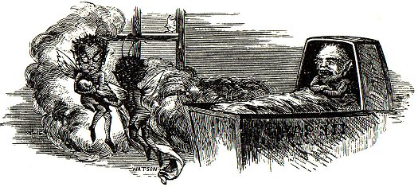
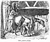

  
[Intangible Textual Heritage](../../../index.md) 
[Legends/Sagas](../../index)  [Celtic](../index)  [Index](index.md) 
[Previous](phy10)  [Next](phy12.md) 

------------------------------------------------------------------------

p. 49

 

### CHAPTER III

|                     |
|---------------------|
|  |

OW," said the king, so soon as his henchman had filled his jewelled
goblet with bright amber-coloured wine--"now let us resume our
merry-making. Let those near our mortal guest, Tom Kewley, see that he
is hospitably entertained, as so worthy a guest should be, and the
master of the revels can. proceed to call on the next in turn for their
song."

Up jumped a pretty, curly, fair-haired little elf, whose merry blue eyes
proclaimed him to be full of mischief; and without any further prelude
than a bow to his liege lord, and a very knowing wink as he looked
towards Tom, he began the following song:

#### THE ELFINS' RIDE.

When wild winds howl round Snaefell's crown,  
  And heavy clouds roll down his side,  
We love at midnight hour to roam,  
  Or on a gallant steed to ride. p. 49

A horse we catch, of rare good stock--  
  No common hack will suit our taste--  
A score or more will mount his back,  
  And round and round the fields we haste.

[  
Click to enlarge](img/05000.jpg.md)  
THE JADED STEED  

There's not a nag that's worth his keep  
  But we soon try his pace by night;  
We mount him, trot him, gallop, leap  
  O'er bank or stream, nought stays our flight.

On, on we ride, nor slack the speed  
  Till the grey east light gives warning; p.
51  
Back to his home to guide our steed,  
  And hide ourselves snug ere morning.

The farmer to his farmyard hies,  
  Bent on good care and feeding;  
His pet nag meets his bewildered eyes  
  All foam-bedecked and bleeding.

Then sure, he says, the elfin crew  
  Have held their demon races;  
Poor Dobbin's shaken through and through,  
  Lost looks, flesh, temper, paces.

The farmer then, without delay,  
  Nails on a lock to his stable door;  
Makes all secure by night and day,  
  Resolved we fays shall ride no more.

But we manage still to find some sport  
  Where stable locks are still unknown;  
And we train the pick of all the lot  
  After a fashion quite our own.

"We do! we do! we do indeed!" shrieked a hundred laughing elves and
bugganes, "and have our rides in spite of all."

"Bravo! bravo!" rang around the room from all sides as the singer
resumed his seat.

"No one knows better than he does where to pick out a decent bit of
horseflesh," said a mannikin seated next to Tom, addressing him and
pointing to the singer of the last song. "And it's many a farmer that he
has caused to stare in the morning when he has seen his horses, which he
expected to find refreshed by their night's rest and all ready for a
day's work, covered with mud and foam as if they had been galloped all
over the island in the night--very likely lamed, and not fit for work
for a week."

p. 52

Kewley made no reply, but eyed the singer with no friendly gaze as he
remembered only too sadly how sometimes his own horses had been used by
the elves in much the same way.

At the bidding of the master of the revels, a very lovely little
fair-haired lady now stood up, and, in the sweetest and clearest voice
Tom had ever heard warbled forth the following song:

#### THE FAY'S SONG.

Who would not be  
  An airy sprite,  
And lead a life of frolic gay?  
  From dawn till eve,  
  From eve till light,  
We laugh the hours away.

Now ’neath the moon's  
  Bright silvery ray  
We spread our fairy board,  
  Of honey sweet  
  On rose-leaf laid,  
As fits a festal board.

The pale moon wanes,  
  The morn is cold,  
Each fairy elf and fay,  
  Snug in a flower,  
  Enwraps herself,  
To wait the broad, bright day.

From our flow’ry beds  
  We rise again  
And bathe in the pearly dew; p. 53  
  Then take the air  
  With a butterfly pair  
Link’d to a petal blue.

The evening comes.  
  Adown the streams,  
We sail to Rushen Glen  
  On a lily leaf  
  And meet once more  
In song and dance again.

On the little Prima Donna resuming her seat she became the centre of a
small select circle of admirers, all eager to lay the incense of their
compliments and praises at her feet; while the uproarious applause of
the rest of the rollicking assemblage made the room ring again. In the
midst of the noise and confusion a party of bugganes and elves entered,
tumbling over each other with most extraordinary capers and tricks,
which only ceased on their being summoned into the immediate presence of
the king, and ordered to give an account of their doings and the reason
of their late arrival.

"Most mighty king," said one, who was the merriest and most active of
the whole party, and was evidently the leader and prime mover of all
their mischief and pranks, "we have been high busy, you may be sure, or
we should not have been away from your gracious presence and so glorious
a feast. A new-born mortal child has been changed by us to-night, and a
long-standing score of vengeance paid off on that old miser Bobby
Cottier, of Ballagaraghan."

"Let us hear all about it," shouted a score of voices.

"Order! order!" cried the king, flourishing his sceptre and looking as
fierce as so pleasant and merry a little face could do. "You, sir, give
us full particulars of the changed child first," singling out the active
leader to be spokesman, "and Bobby Cottier's affair will come after."

"May it please your majesty to listen," began the merry elf, bowing

p. 54

with great stateliness of body and turning his head to wink at his
companions with the most grotesque humour. "May it please your majesty,
knowing that the wife of Paul Quiggin, of the Ballabeg Farm at Jurby,
had early yester morn had an addition to her family, we determined to
steal the babe and leave one of ourselves in its place. We commenced by
drawing lots who should be the one to be left in the cradle and be
nursed by the mother as her own child. The lot fell on RUSTIN-WEE, whom
we prepared to take the place of the baby directly we could get a chance
to make the exchange. On arriving at Ballabeg we divided into two
parties. I, with RUSTIN-WEE and six others, hid beneath the grass and
between the stones near the door; while the others scampered off to the
stable and cow-house, setting all the horses and cattle loose. They then
began driving them about and making a terrible noise, for the animals
were all mad with fright, that, one after the other, every one came
running out of the house to see what was the matter and all the
disturbance about--Paul Quiggin, his brother Joe, several others, and
among them the woman who was nursing Mrs. Quiggin and the bairn. No
sooner had they all come out, leaving Betty Quiggin and the child alone
in the house, than in we rushed, and in the twinkling of an eye had the
little one out of the cradle and RUSTIN-WEE snugly wrapped up in his
place. Off we started, and before poor Paul and the others had got the
horses and cattle into their stalls again, we were miles away, with the
bantling, who is now safe in fairy keeping--where, you all very well
know."

"Ha! Ha! Ha! Ho! Ho! Ho! He! He-e!! He-e-e!!!" burst out in chorus from
every one of the elfin crew. As for Tom Kewley, he was frightened out of
his wits at hearing of what had happened to the Quiggins, and wished
himself safe back at Ballasalla, though he almost despaired of ever
reaching there again.

He had most rigidly heeded the warning given to him on first entering,
and had not tasted either meat or drink, though strongly pressed by his
neighbours. Hitherto he had managed to evade their importunities; but
could he do so much longer was very doubtful.

"Pray what have you done to old Bobby Cottier?" asked the king.

p. 55

"Oh, not half what he deserves, your majesty. Nothing could be too bad
for such a miserly old curmudgeon; and he so seldom gives any of us a
chance. The roof of his hen-roost is old; and the stingy old beggar,
grudging the cost of a little new thatch, the winds have made free with
it, so that we very easily got in, sucked all the fresh eggs, and
pricked all those under the setting hens. We then got through into the
cow-house by shifting a loose board, which old Robby would not afford a
nail on. We milked every beast quite dry; cast an EVIL EVE on the two
best cows, who will give nought but bitter milk as long as they live.
Then we hied us off to the pigs, and turning the great fierce boar into
the same stye with a sow and her litter of a dozen young pigs, he
savagely set to and began to worry the lot; when, the sow turning on him
to defend her children, a regular scrimmage ensued. When we left, eight
of the little piggies were dead--trampled to death in the fight--and the
sow is so gored by her savage old lord's tusks, that the best thing
Master Cottier can do in the morning will be to kill her at once to save
her from dying. Just as we were coming away you could have heard the old
man's shouts a mile off, for, having got up to see what the row was all
about, he tumbled over a barrow standing in the doorway of his house,
and broke either his shins or his head.

"Ha! Ha! Ha! Ho! Ho! Ho! He! He-e!! He-e-e!!!" shouted a host of
approving bugganes.

"Serve him right if he had broken both, and his neck to boot," cried one
shrill voice.

"If he had left a crock of clean water or a bowl of new milk at his
door, instead of his barrow, he would have saved his shins and his
pate," said another.

When the merriment at the old miser's misfortunes had somewhat subsided,
and every one had made their remarks on the subject, a very important
little fairy-man, who seemed by his dress and manner to be some one of
great importance--a Lord Chamberlain at the very least--called every one
to order, and commanded all the assembly to charge their glasses and
goblets to the brim, to drink a bumper toast, and no heel-taps, to the

p. 56

health of their beloved royal master the great king of the Manx fairies,
emperor of all elves, and lord of all bugganes.

The whole company instantly rose to their feet with brimming goblets in
their hands, prepared to do full honours to the toast.

Poor Tom Kewley knew that now was the critical moment of his adventure.
He feared it was all up with his ever returning to his wife and child,
and was beginning to speculate in his mind how it would be possible to
avoid drinking, when his eye caught sight of the same little man from
whom he had received his friendly warning on entering. The little fellow
was seated on the opposite side of the table some little distance off;
and was gesticulating most anxiously to draw his attention and renew the
caution. Tom's fears and perplexities were great indeed. If he drank, he
was doomed to remain with the fairies for ever; if he refused, what
vengeance would they not wreak upon him for so great an insult to their
king?

He clenched his teeth in desperation, and stood up with the rest, cup in
hand, and, hoping his actions would escape notice, he raised his hand
and cup to his lips, and, watching his opportunity, when he thought all
were too intent upon their own drinking to pay any heed to him, and had
their eyes hidden in their own cups, he tilted his own over and poured
the contents upon the ground.

A roar!

A most unearthly yell!

A thousand shrieks!

A most terrific peal of thunder, with a flash of lightning that seemed
to burn up everything around him

Tom Kewley saw or heard no more.

Fairies, elves, feast, and bugganes, everything vanished, and he had an
indistinct feeling of being suddenly lifted up as high as the top of
Snaefell, and as suddenly let fall upon the ground.

------------------------------------------------------------------------

[Next: Chapter IV](phy12.md)
