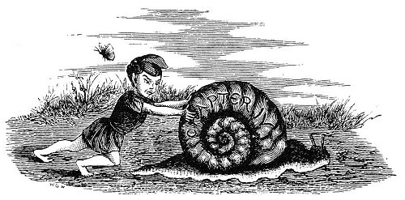
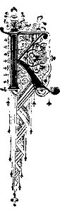
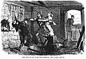
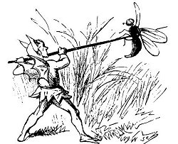

  
[Intangible Textual Heritage](../../../index) 
[Legends/Sagas](../../index)  [Celtic](../index)  [Index](index) 
[Previous](phy15)  [Next](phy17) 

------------------------------------------------------------------------

p. 80

 

### CHAPTER IV.

|                     |
|---------------------|
|  |

ING OLAVE and the one-legged hammerman journeyed on day after day,
neither one gaining much advantage over the other. They both reached the
Point of Ayre, the northernmost coast of the Isle of Man, the day after
leaving Peel Castle. Here each had a boat in readiness to cross the
narrow sea to the neighbouring shores of Scotland, and on landing there
they both started off again on their pedestrian race to cross the land
of the Thistle to the north-eastern coast, where they hoped to find
vessels to convey them over the sea to Norway.

Ever near the king, flying over his head by day and roosting near his
pillow at night, the faithful raven kept constant watch. The Norwegian
and was at last reached, and then commenced the real race, each of them
being eager to be the first to enter the smithy of Loan Maclibhuin at
Drontheim. So close did they keep together that, on arriving within
sight of their destination, they were neck and neck.

Now was the time for the sable bird to do the king a good service. This
he did by adroitly and unseen dropping a small but very sharp pebble
into the one shoe of Hiallus-nan-urd, which, getting under his foot,
caused urn great pain, and to limp worse than he did before on account
of his

p. 81

artificial leg. The hammerman was compelled to stop and take off his
shoe to remove the pebble, while the king made a vigorous effort and
pushed forward rapidly, the raven having whispered into the king's ear.
Olave Goddardson's increased speed enabled him to leave the hammerman
behind some distance, and to enter the smithy of Loan Maclibhuin before
his competitor. On entering he closed the door behind him, much to the
surprise and chagrin of the swarthy smith, who recognized him at once.
Without taking any notice of Loan Maclibhuin, the king determined to
show that he was not distressed or tired by the fatigues of his long and
hurried journey, seized hold of a huge sledge-hammer, and swinging it
round his head, struck it with such force upon the anvil that he clove
the massive block of iron in twain, and shivered the stone bed, upon
which it rested, into pieces.

The wizard-smith looked out eagerly to see if his ally and messenger,
Hiallus-nan-urd, was near at hand, when Olave, hearing the ominous
croaking of his attendant raven, suddenly bethought him of the witch's
warning that the challenge was a mere ruse to decoy him there for his
destruction, looked round for any signs of the great sword he knew Loan
Maclibhuin was engaged in making, and which he was convinced must be
somewhere near at hand. On casting his eyes towards the fire he beheld
what he sought; and walking boldly across the smithy he seized it in his
hand, greatly to the dark smith's confusion and amazement.

At the same moment that the king had entered, a door at the side of the
smithy, and placed considerably in the shade, might have been seen to
open, and from it had entered, unseen by him, a Norwegian maiden of
surpassing fairness and beauty, who was a witness of his prowess with
the sledge-hammer and the anvil. She advanced into the light as the king
had laid his hand upon the great sword, when, for the first time, he
perceived her and was immediately struck with her beauty.

Hearing the stumping of the artificial leg of the hammerman drawing near
to the door outside, and being again reminded by the croaking of the
faithful raven, which began now to flap his wings in great impatience,
and

p. 82

peck at the king's feet, he had but little time for compliments or
admiration; so, addressing himself to the maiden, and pointing with his
left hand to the dark smith, he said, "Say, fair maid, is not this your
father, Loan Maclibhuin, the seventh son of old Windy Cap, king of
Norway?"

"He is, Sir knight," replied Emergaid, for so was the beauteous daughter
of the royal blacksmith named.

"Then!" exclaimed the king of Man, drawing forth the red-hot steel from
the fire before either the smith or his hammerman, who was now about to
enter, had time to prevent him--"then thus do I fulfil the wizard's
prophecy! Your blood, old man, is royal blood like my own, and in royal
living blood shall this good blade be tempered."

With his left arm he gently pushed aside the fair Emergaid, who had
stepped forward to protect her father, and springing towards him,
plunged the red-hot sword into the old smith's heart.

"And," continued King Olave, withdrawing the hissing blade from the body
as it fell at his daughter's feet, and turning towards the door, "thus
do I punish you my one-legged travelling companion, and prove the temper
of his wondrous sword."

Before the now affrighted Hiallus-nan-urd could reach the door again to
make his escape, the king made one cut at him, and, striking on the top
of his head, the sword went down through his body, severing it in two.

No sooner had the divided hammerman fallen to the ground than the
white-spotted raven pounced upon one half. Seizing the still quivering
heart, he tore it out, and flew off with it in the direction of the Isle
of Man, croaking quite triumphantly as he passed out of the open window.

The fair Emergaid had swooned directly she saw her father fall, and thus
was spared the dreadful sight of the hammerman's fate.

To her the twice-saved monarch now turned his attention, and raising her
gently in his arms, he bore her from the smithy, gazing with admiration
on her lovely face. As he did so he felt his own heart struck by as hot
and sharp a pang as that by which he had slain her father.

p. 83

 

[  
Click to enlarge](img/08300.jpg)  
THE DEATH OF LOAN MACLIBHUIN, THE DARK SMITH.  

 

p. 84

At first the wooing of King Olave Goddardson did not progress. Grief for
the loss of her father forbade her listening to the love of him who had
made her an orphan. Still her first sight of him, when he proved how
stalwart a knight he was by cleaving her father's anvil, had more than
favourably impressed her, and she could not but admire so gallant a
suitor; so as he was as resolute in love as in other matters, he finally
won her consent and made the best amends he possibly could for depriving
her of one protector in her father by becoming himself her protector and
her husband.

Suffice to say that his frank and manly bearing won her heart, and she
consented to share with him the royal honours and duties of his little
island kingdom.

King Olave conducted his lovely bride with a large fleet in great state
to the Isle of Man, where he had her crowned queen; and though history
is silent on the subject, we may naturally conclude they lived happily
together.

From the union were descended a long line of kings of Man, one of whom
was the great Olave the Black, the boldest sea rover of his day. The
last descendants of Olave Goddardson and Emergaid the Fair, who reigned
in Mona, was Magnus, and in him ended the royal race of Goddard Crovan,
surnamed the Conqueror.

 

 

------------------------------------------------------------------------

[Next: Chapter I](phy17)
