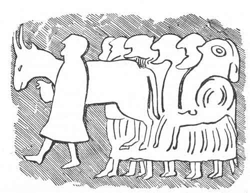

  
[Intangible Textual Heritage](../../../index.md)  [Legends &
Sagas](../../index)  [Celtic](../index)  [Index](index.md) 
[Previous](pt325)  [Next](pt327.md) 

------------------------------------------------------------------------

p. 194

 

<table>
<colgroup>
<col style="width: 100%" />
</colgroup>
<tbody>
<tr class="odd">
<td>
 
AN OX ''THE POINTS OF WHOSE HORNS WERE BACKWARDS INSTEAD OF BEING FORWARDS.''--From a stone at Fowlis Wester, near Crieff.--<em>Sculptured Stones of Scotland</em>, Pl. lx. The sculpture probably represents a procession leading an ox to be sacrificed.</td>
</tr>
</tbody>
</table>

 

### LXXV.

### GUAIGEAN LADHRACH 'S LOIREAN SPAGACH.

From Kate MacFarlane, as early as 1810, John Dewar, October, 1860.

THERE was at some time a king in Albainn whose name was Cumhal, and he
had a great dog that used to watch the herds. When the cattle were sent
out, the dog would lead them to a place where there might be good grass;
and the dog would herd them there for the day, and in the evening he
would bring them home.

There were certain people dwelling near to the king's house, and they
had one son, and they used to send the

p. 195

son on matters to the king's house every evening. There was one
beautiful sunny evening, and the boy was going to the king's house on a
matter, and he had a ball and a shinny, and he was playing shinny
forwards on the way to the king's house. [1](#fn_33.md) A dog met him, and the dog began to play
with the ball; he would lift it in his mouth and run with it. At last
the boy struck a blow on the ball while it was in the dog's mouth, and
he drove the ball down the dog's throat; he stuffed it down with the
shank of the shinny, and he choked the dog; and since he had choked the
dog, he himself had to go and keep the king's cattle instead of the dog.
He had to drive out the cattle in the morning, to drive them to good
grass, and to stay and to herd them all day, for fear they should be
stolen, and to bring them home in the evening, as the dog used to do. So
since he killed the dog, and since it was in the place of the king's dog
that he was, it was "Cu Chumhail" (Cual's dog) that they used to say to
him; and afterwards they altered the name to "Cuthullain." [2](#fn_34.md)

On a day of the days, Cuchullin put out the cattle, and be drove them to
a plain that was there, and he was herding them; and he saw a giant who
was so big that he thought he could see the lift between his legs,
coming to the side where he was, and driving a great ox before him; and
there were two great horns on the ox, and their points were backwards
instead of being forwards. The giant came forward with the ox where
Cuchullin was, and he said,

p. 196

"I am going to take a while of sleep here, and if thou seest any other
man of the giants coming after me, awaken me. It may be that I will not
easily be wakened, but waken thou me if thou canst."

"What is waking to thee?" said Cuchullin.

"It is," said the giant, "to take the biggest stone thou canst find and
strike me on the chest with it, and that will wake me."

The giant lay and slept, and his snoring was as loud as thunder. But
sleep was not long for him, till Cuchullin saw another giant coming, who
was so big that he thought he could see the lift between his legs.

Cuchullin ran and he began to awaken the first giant that came, but
waken he would not. Cuchullin was shoving him, but his wakening could
not be done; but at last he lifted a great stone, and he struck the
giant in the chest with it. The giant awoke, and he rose up sitting, and
he said, "Is there another giant coming?"

"There is; yonder he is," said Cuchullin, as he held his forefinger
towards him.

The giant struck his two palms on each other, and he said "Ach, he is!"
and he sprang on his feet.

The other giant came forwards, and he said, "Yes Ghuaigean
làdhraich, [1](#fn_35.md) thou hast stolen my ox."

"I did not steal it, Loirean Spàgaich," [2](#fn_36.md) said he, "I took it with me in the sight
of every man as my own."

Shamble Shanks seized one horn of the ox to take it with him, and
Crumple Toes seized the other. Shamble Shanks gave a swift jerk at the
horn which he had in his hand, and he took it off the bone; he threw it
from

p. 197

him with all his strength, and he drove it into the earth, point
foremost, and it went down into the earth to the root. Then he seized
the bone, and the two hauled at the ox to drag it from each other.

At last the head of the ox split, and the ox tore asunder down through
his very middle to the root of the tail. Then they threw the ox from
them, and they began at wrestling; and that was the wrestling! there was
no knowing which of them was the stronger.

Cuchullin came to bring aid to Crumple Toes; he could not reach up aloft
to give a blow to Shamble Shanks with a sword which he had, but he began
to cut at the back of his legs to try to make a stair up the back of the
giant's legs, up which he might climb to give him a blow of his sword.

Shamble Shanks felt something picking the back of his legs, and he put
down his hand and he threw Cuchullin away; and where should Cuchullin go
but foot foremost into the horn of the ox, and oat of the horn he could
not come. But at that time that Shamble Shanks was throwing Cuchullin
away, Crumple Toes got a chance at him, and Shamble Shanks was levelled,
and Crumple Toes got him killed.

When that was done he looked about for Cuchullin, but he could not see
him; and he shouted, "Where art thou now, thou little hero that wert
helping me?"

Quoth Cuchullin, "I am here in the horn of the ox."

The giant went to try to take him out, but he could not put his hand far
enough down into the horn; but at last he straddled his legs, and he
drove his hand down into the horn, and he got hold. of Cuchullin between
his two fingers, and he brought him up. Cuchullin went home with the
cattle at the going down of the sun, and I heard no more of the tale.

JOHN DEWAR.

p. 198

I have not given the Gaelic of this, because there is nothing peculiar
in the language. It is curious as having a general resemblance to the
adventures of Jack the Giant Killer and Tom Thumb, Thor, and other such
worthies; and as showing two well-known Ossianic heroes in a nursery
tale, as "early as 1810." Cumhal the father of Fionn, and Cuchullin.

I have another version of these incidents in a story dictated by Neil
Macalister, Port Charlotte, Islay, and written by Mr. Carmichael at the
request of my old friend, John MacLean, of Coulabus.

 

The Feinn were all in Islay to drive away the Lochlanners, and when they
had succeeded, Cuchullin fell in with a fairy sweetheart, who had flocks
and herds, and he staid, while the rest went north to fight the
Lochlanners in Skye. The fairy sweetheart bore a son, and by desire of
his father, called him Conlaoch. There was a neighbour called Garbh Mac
Stairn, who was far stronger than Cuchullin, and one day he went to take
his fine light-coloured bull. Cuchullin disguised himself as a herd, met
the giant, told him his mistress was ill in bed, and then ran round, and
got into the bed behind her. The wife said she had got a baby, and the
giant poked his finger into his mouth, to see if he would make "fisean
Cuin," a whelp of Conn, and the hero bit him to the bone. The wife
complained of the draught from the door, lamenting her husband's
absence, for he would turn the house away from the wind. The big man
tried, but could not, so he made off to the cattle. The seeming herd got
there before him, and they seized the bull by the horns, and tore him in
two. Then they try the feats which Cuchullin could do. The giant carries
a millstone which the herd cannot lift, to a hill top, and the herd
rides it to the bottom. The giant tries, and gets many a hard fall. They
go to a rock more than a hundred fathoms high, and perform a feat which
used to be attributed to Islay boys; they "measure two feet and two
fists" over the edge. The giant puts one heel on the edge, the other
against his toe, stoops, and places his clenched hands on each other, on
the other toe; and tumbles headlong into the "fierce black green sea."

Cuchullin gives a feast, and then goes to Skye to help Fionn, leaving a
ring for his son. He grows up and follows, and his

p. 199

mother swears him never to tell his name till forced. Conlaoch finds the
Feinn fighting at "Taigh Mheile ann an Dura." Fionn sends to find out
his name. Conan goes; they fight, and Conan is beat. Cuchullin goes, and
the son keeps him off with his sword. They go out into the sea, to the
bands of their kilts, to try "cath builg," and they cast their spears at
each other, but the son casts shaft foremost. At last he is pierced by
his father, and discovers himself; and they curse the fairy mother. The
last few lines are fragments of a poem, and make six verses. "The death
of Conlaoch" is told in an undated quarto MSS. in the Advocates'
Library; the action is partly in Scythia, and there is much more
incident. The poem of "Carthon," is founded on the incidents, but the
names are different. This then is old, Ossianic, mythological, and
Celtic; it is common to Scotland and Ireland; to MSS., print, and
tradition.

See Carleton Irish stories, Dublin, 1846, p. 107, etc.

------------------------------------------------------------------------

### Footnotes

[195:1](pt326.htm#fr_33.md) This is a common
practice among Highland laddies now.

[195:2](pt326.htm#fr_34.md) The writer means the
Ossianic hero, commonly called Cuchullin; so I have followed the usual
spelling rather than Dewar's, which is bat another way of expressing the
same sound.

[196:1](pt326.htm#fr_35.md) Crump-footed, toe-ish.

[196:2](pt326.htm#fr_36.md) Straddling tracker, or
shambling shanks. A bandy-legged man is spágach.

------------------------------------------------------------------------

[Next: Introduction](pt327.md)
