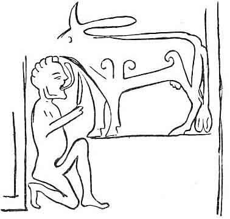

  
[Intangible Textual Heritage](../../../index)  [Legends &
Sagas](../../index)  [Celtic](../index)  [Index](index) 
[Previous](pt338)  [Next](pt340) 

------------------------------------------------------------------------

p. 367

### LXXXIV.

### MANUS.

From Donald MacPhie; Iochdar, South Uist.

THERE was a King of Lochlann, and be married, and two sons were born to
him. Oireal was the name of one, and Iarlaid of the other. Their father
and mother died. A "Parlamaid" sat to put "Cileadearachd," a regency on
the realm, till the children should come to age, and till they should
take the vows of the realm on themselves. They sent word for the lads,
and Oireal was a feeble man, and Iarlaid was the bigger. Oireal said to
the "Parlamaid" that he would not have anything to do with the realm as
yet.

"Clod of it you shall not have," said the Parliament, "unless you take
it this day."

Said Iarlaid to Oireal, "take thou the one half, and I will take the
other half."

"Well, then," said Oireal; "I will do that."

The realm was written upon the lads. In a few years Iarlaid married the
daughter of the King of Greece, and Oireal married the daughter of King
Sgiath Sgial, King of the Arcuinn. [1](#fn_186)

Sgiath Sgial gave six maids of honour with his daughter, and the King of
Greece gave the very like with his own daughter.

p. 368

Three quarters from that night the ailment of children struck the
daughter of the King of Greece; and besides, the ailment of children
struck the daughter of Sgiath Sgial, and sons were born to them, and
twelve sons were born to maids of honour. Manus was given (as a name) to
the son of Oireal, and Eochaidh to the son of Iarlaid. The sons began to
come on; Manus was growing big, and Eochaidh was but little. They were
sent to school, and his own foster brethren were together with each one
of them.

They were playing shinny on the field, coming from school, and Manus
drove the ball against Eochaidh.

"I will have my own father's realm," said Manus.

Said the daughter of the King of Greece, "It were my wish to put an end
to Manus, of murdering and spoiling and slaying."

"Well, then, that were the great pity to put that (end) to the son of
our brother," said the king.

"If thou wilt not do it, I will do it," said she.

She went in, and gave a slight box on the ear (Leideag) to her own son,
and she drove him out of the house.

"Begone," said she, "and betake thyself to the four brown boundaries of
the world, and let me not see thy sole on the same land as long as the
world is set. I will take Manus with me, and he shall be a son for
myself."

She took Manus in with herself, and she set her own son on a beautiful
sunny single-stemmed hill, where he could see every man, and no man him.

Manus was within with her, and he was not getting to see his mother at
all. Then his mother said that she would go where her muime was, and
that she would take her counsel.

p. 369

At the end of a year she sent word for Manus. And in a few years the
wife of his father's brother sent word for Manus.

"What, oh Manus!" said the daughter of the King of Greece, "art thou
thinking of doing this day? If thou wilt marry, thou wilt get the third
part of the realm; land, corn-land, and treasure."

"Well, then, I am not of age to marry at all," said he.

"Thou needst not (say) that," said she. "There is one man on my own land
that will suit thee. Thou shalt go to ask his daughter, and thou shalt
marry her. He is the Earl of Fiughaidh; thou shalt marry the daughter of
the Earl of Fiughaidh." [1](#fn_187)

She went away, and she took with her high families, and she would take
with her five hundred men. She reached the house of the Earl of
Fiughaidh, to give her to Manus to marry.

Said the wife of the Earl of the Fiughaidh to her, "My daughter is not
of age to marry yet, and Manus is not of age to marry."

"Well," said the daughter of the King of Greece, "house or heap thou
shalt not have upon my land unless thou givest thy daughter to him."

The man thought that there was no good for him to refuse her, and Manus
and the daughter of the Earl of the Fiughaidh were married to each
other.

They lay that night in the house of his father's brother.

"Is it thou that art here, Manus, mighty son, and

p. 370

bad man? dost thou know what wife yonder one gave to her own son,
Eochaidh? She gave him the swift March wind. It was not to a worldly
wife she married him, so that he might take the head off thee. Thou with
a wife on thy bed at this time of night! Thou wilt be going back every
day, and thou wilt not hold battle against him."

"Is it thus it is?" said Manus.

He went where she was.

"Be leaving the realm," said the wife of his father's brother to him,
"or else thou wilt have but what thou takest to its end."

"Clod thou shalt not have here," said she. "Thy share is under stones
and rough mountains in the old Bergen."

"Well, then, since thou art putting me away, give me the six foster
brothers of Eochaidh, that I may have twelve."

He got that; he went away, and he betook himself to the old Bergen.

When he reached the old Bergen, no man dared to come near his castle.
There were sheep in the old Bergen, and sheep of Corrachar, is what they
were called.

They fell to making pits in the earth; the sheep were going into the
pits, and they were catching them and they were killing them, and
keeping themselves in flesh thus in the old Bergen. [1](#fn_188)

"Be it from me! be it from me said Manus, "it

p. 371

is a year since I saw my muime; I had better go and see her."

"It were not my advice to thee to go there," said they; "but if thou art
going, thou hast twelve foster brothers, and take them with thee."

"They were no sorry company for me to be with me," said he.

He went. The daughter of the King of Greece was looking out of a window,
and she perceived Manus coming. She went down to where his father's
brother was.

"The son of thy brother is coming here," said she, "with costly coloured
belts on his left side, with which might be got the love of a young
woman, and the liking of maidens;" that it were for her pleasure to put
an end to him, of murdering, and misusing, and slaying.

His father's brother said that were a great pity, and that he would not
be to the fore to do that to him.

"If thou wilt not do it, I will do it," said she.

She went out of the house, and she took his twelve foster brethren from
him, and she swore them to herself. He went back to the Old Bergen by
himself, gloomy, tearful, sorrowful, and it was late. What should he see
but a man in a red vesture.

"It is thou that art here, Manus?" said he.

"It is I," said Manus.

"I think if thou hadst bad or good arms that thou would'st get to be
King over Lochlann."

"I have not that," said he.

"Well," said he of the red vesture, "if thou would'st give me a promise
I would give thee arms."

"What promise shall I give thee? I have not a jot to give thee."

p. 372

"Well, I will not ask thee much. I was the armourer of thy grandfather,
and thy great-grandfather, if thou would'st give me a promise that I
should be armourer with thee I would give thee arms this night."

"I will give thee that (promise), if so be that I am ever a king."

They went and they reached the house. The man of the red vesture took
out a key, and he opened a door, and when he had opened it the house was
full of arms, and not a jot in it but arms.

"Begin now and choose arms," said the man of the red vesture.

Manus seized a sword, and he broke it, and every one he caught he was
breaking it.

"Don't do that Manus, don't be breaking the arms, in case thou mightest
have need of them yet. When I was a young man thy grandsire had a war,
and I had an old sword, an old helmet, and an old mail shirt on, try
them," said the man of the red vesture.

Manus seized the sword, and it beat him to break it. He put the sword
and the helmet on. What should he see but a cloth (hanging) down from
the ridge of the house. "What is the use of that cloth?" said Manus. "It
is," said he "that when thou spreadest it, to seek food and drink, thou
wilt get as thou usest. There is another virtue in it. If a foe should
meet thee, he would give a kiss to the back of thy fist."

He gave the cloth to Manus, and he folded the cloth in his oxter. What
should he see but an iron chain (hanging) down from the ridge of the
house.

"What is the good of that chain?" said Manus.

"There is no creature in the world that if yonder thing should be put
about his neck the battle of a

p. 373

hundred men would not be upon him," said the man of the red vesture.

Manus took the chain with him. When he was going, what should he see but
two lions, and a whelp with them. The lions came in front of him to eat
him, and to put him to skaith. He spread the cloth, and the lions came,
and they kissed the back of his fist, and they went past him. The lion
whelp got in amongst the folds of the cloth, and he wrapped the cloth
about him, and he lifted him with him to the old Bergen. [1](#fn_189)

When he reached the old Bergen the daughter of the Earl of the Fiughaidh
was within. He put the chain about the neck of the lion whelp. The lion
whelp went, and he cleared the castle; he did Dot leave a creature or a
monster alive in it. He set fire to the castle. [2](#fn_190) He was there a year, and he had no want.

He went out one day, and he said he would go to see his muime.

He took the lion whelp with him, and he went away. She perceived him
coming. There was a sword at his side that day. She came out to meet
him, and she had a brown lap-dog. He went to meet Manus with his mouth
open, to put Manus to skaith, and to eat him.

p. 374

\[paragraph continues\] Away went the lion whelp, and he went before
Manus, and he set his paw at the back of the throat of her "measan," and
he let out his entrails on the earth.

"There, Manus," said she, "but put thy whelp in at the ridge of the
lion's house."

He put the lion whelp in at the ridge of the house, and he put the chain
about his neck, and he did not leave a lion under the ridge of the house
unslain, and laid himself (down) stretched for dead along with
them. [1](#fn_191)

Manus went home without whelp, without man, that night. What work should
his twelve foster brethren be set to, but to clear out the lion's house.
When they were put out there was not a lion under the ridge of the house
that had not his throat cut. The lion whelp was without a drop of sweat
upon him, and the iron chain that Manus had put on him (was) about his
neck. One of them said that the lion which was yonder seemed strange to
him, without a drop of sweat upon him, unlike the rest.

"That is the lion whelp of the man of my love," said one of the company.
"The lion whelp of Manus."

"Well, then," said one of them, "though we are sworn not to go out of
the town, before be rises we might go, and give a message."

"There is no man who goes out of this town," said the rest, "after the
coming of night that there is not the pain of seven years upon him
afterwards."

They went to the window, and when they went to the window the lion's
whelp opened his eyes, and he came alive.

p. 375

She went where her husband was, and she said to him to put the rough
traveller [1](#fn_192) in order, and five
hundred men in it.

He said that there would be the pain of seven years on any being who
should go out after the falling of the night.

She said though there should be the pain of seventeen years in it, that
they should go to seek the head of Manus.

The deaf haltman was what they used to call the man who was guarding the
realm at that time, and he could not hear a jot till there should be
nine nines shouting in his ear. He could kill nine nines backwards, and
nine nines forwards with his sword. What should awake him but the stormy
sound of the rough traveller coming, and he thought that it was a foe
that was there. He arose upon the rough traveller, and he did not leave
a mother's son of the five hundred alive, himself and the lion's whelp,
and the twelve foster brothers of Manus went to the Old Bergen.

"Never thou mind," said she. "Though Manus did that to me. There is the
Red Gruagach, son of the King of Greece, and he will take the head of
Manus out of the Old Bergen."

Then went his mother here, and she sent a ship to Manus to the Old
Bergen to take him away before the Red Gruagach should take the head off
him. What should his muime do but put a sea thickening on the ocean, so
that Manus might not get away. His mother sent a pilot in the ship, and
what should the ship do but stop in the sea thickening.

p. 376

"Is there a ship in the world that will take us out of this?" said Manus
to the pilot.

"Indeed there is the speckled ship of the son of Valcan Smith," said the
pilot. [1](#fn_193)

They were on board, and they could not stir.

At the mouth of the night the lion whelp thrust his head under the arm
of Manus, and he went out off the ship, and Manus on his back. He went
and he reached a scaur. He left Manus on the scaur, and he himself made
a spring down the other side of it. Manus fell asleep, and he would like
as well to find death with the rest, rather than be left by himself on a
rock. There came a voice to him, and it said to him "Arise." He rose,
and he saw a ship.

Who was here but the ship of MacBhalcan Smith, and the lion whelp in the
shape of pilot at the helm, and Mac-Vic-Valcan Smith and his twelve
sailors dead on her deck. He reached the ship, and he put his twelve
foster brethren and the daughter of the Earl of the Fiughaidh in the
ship of MacBhalcan Smith. He fell to at sailing amongst the thickening.
What should he see but land, and when he saw the land he saw the very
finest castle he ever saw. He went on shore, and he put MacBhalcan Smith
and his twelve sailors on' shore on a point. He reached the castle, and
he went in, and there was a fine woman there within, and twelve bald
ruddy maidens. His twelve foster brothers sat beside the bald ruddy
maidens, [2](#fn_194) and they said that they

p. 377

would never go for ever till they should get them to marry.

It was not long till there came home the White Gruagach, son of the King
of the Light, and a great auburn clumsy woman, his mother.

"Who is here," said he, "looking my twelve brown ruddy daughters in the
front of the face? and that I never saw a man that might look at them
that I would not take his head off against his throat."

"These are my twelve foster brothers, and they have taken love for thy
bald ruddy daughters, and thou must give them to me to marry," said
Manus.

"Well," said the White Gruagach, "the covenant on which I would do that,
I am sure that thou wouldst not do it for me, that is, to put me in
against my father, and that I am out from him for seven years."

"I will do that," said Manus, "but that thou thyself shouldst go with
me."

On the morrow they went away, and they reached the King of the Light.
The King of the Light came out, and he gave his right hand to his own
son, and his left hand to Manus. [1](#fn_195)
The lion whelp went, and he seized him, and he levelled him.

"Choke off me the monster before he takes my life from off me," said the
King of the Light.

"I will do that," said Manus, "but write with a drop of thy blood that
thy son is thy beloved heir."

"Well, it's long since I would have done that, if he had come himself to
ask it."

Then he went and he wrote, and they went away to come home. When they
were coming the daughter of the Earl of the Fiughaidh was in a burn.

p. 378

"O," said the White Gruagach, "I am dead."

"What ails thee?" said Manus.

"There is a stone," said he, "in the burn, and there are three trouts
under the stone, and they are in thy wife's apron. As long as the trouts
should be alive I would be alive, and thy wife has one of them now in
the fire." [1](#fn_196)

"Is there anything in the world," said Manus, "that would do thee good?"

"The King of the Great World has a horned venomous (creature), and if I
could get his blood I would be as well as I ever was."

They reached the house, and the White Gruagach was dead.

Then Manus went, and the speckled ship was stolen from him, and there
was no knowing who in the world had taken it from him.

One of his foster brothers said that Brodram, son of the King of the
Great World, had taken it with him.

He went away to Brodram. He asked him what made him take that ship from
him. He said that he had stolen her himself before, and that be had no
right to her. He said that his father had a venomous horned (creature),
and that while the Beannach Nimhe was alive that his father would be
alive, and that if the Beannach Nimhe was slain that he would have the
realm.

He went with Brodram, and the venomous horned beast was in a park. The
lion whelp went into the

p. 379

park, and he put his paw into the hollow of the throat of the venomous
horned beast. The venomous horned beast fell dead, and the king fell
dead within.

Then Brodram was King over the Great World, and Manus got the blood, and
he returned back, and with it he brought the White Gruagach to life.

 

|                    |
|--------------------|
|  |

 

"It may not be that thou wilt not go thyself with me now to put me in on
the realm," said he to the White Gruagach.

The White Gruagach said that he would go. He reached Brodram, and he
said that he. would go with him.

Balcan and his twelve apprentices were working in

p. 380

the smithy, and he revived his twelve sailors. He asked him to go with
him, and Balcan said that he would. There went Balcan, and the White
Gruagach, and Brodram, and the Gruagach of the Tower, son of the King of
Siginn, with him.

They reached Lochlann,  
There met them a man in a red vesture;  
The White Gruagach, and the Red Gruagach began  
Fearfully, hatefully proudly,  
Three destructions they would drive off them.  
To the cloud flakes of aether and heaven.  
There gathered stag hounds, savage hounds,  
To take pleasure in the monsters.  
They would make the sea dry up,  
And the earth burst,  
And the stars fall.

The Red Gruagach [1](#fn_197) was slain, and
his head stuck on a stake, and Manus was crowned King over Lochlann, and
he did not leave a living man in Lochlann.

\_\_\_\_\_\_\_\_\_\_\_\_\_\_

Here I had intended to give the "orally collected" version of the poem
of Magnus as the fitting sequel and contrast to this story, but as there
is scant room within my limits, I give the prose stories which go with
it. The lay of Magnus has often been translated. I hope to be believed
when I say that Magnus, as I found him in 1860, resembles Gillies, 1786,
very closely. This is the opening story of Magnus.

p. 381

"When the Lochlannaich came on shore, Fionn said to the lads that they
should go to hunt; that he wished to give them a feast that night,
because it was not likely that they themselves had much. They went to
hunt, and when the hunt was over, Caoilte was sent to gather the game
since he was the swiftest. It was three hundred deer they killed, and
twenty boars.

"Now when Caoilte had gathered the game there went two hundred to gather
heather to cook them, a hundred and a half went to set in order the
stones under the caldron, and it was ten (deichnar) who were burning
(the fuel) beneath it. Three hundred went to flay. Then Fionn sent
Fearghus down to give a bidding to the Lochlannaich, and they did not
deign to answer him. Fionn took much proud anger because the feast had
been made and they had not answered."

The Lay of Magnus was written from the dictation of Alexander MacDonald,
and subsequently compared with the recitation of the other authority.

Then follows the poem as repeated by Donald MacPhie (smith), Breubhaig,
Barra, October 1860, who learned it from his mother, and traces it up,
for six generations, to an ancestor who came from Kintyre.

The poet, supposed to be Oisein, speaks as one who was present at "Uisge
Laoire nan sruth séimh," where the scene is laid. They see a thousand
barks coming to shore. The Feinn gather from every place, and converse.
Conan, as usual, is cross grained throughout. Feargus, the son of Fionn,
the brother of the poet, goes, and finds that it is

"Mànus fuileach am fear fial  
Mae righ Beithe nan sgiath dearg  
Ard righ Lochlann ceann nan cliar," etc.

p. 382

Blood spilling Manus, the generous one,  
Beithe's king's son, of the red shields (? Bergen).  
High King of Lochlann, chief of the brave, etc.

\[paragraph continues\] Come to seek Fionn's wife, and his famous hound
Bran. A battle ensues, Manus is bound, and allowed to go home, and so it
goes on for 164 lines of very smooth good Gaelic verse.

In Gillies there are 172 lines, or 43 verses, I have a verse which is
not in Gillies, and the variations only amount to different readings,
and to variations in language and orthography. After the poem comes the
sequel of the story, also taken down from Donald MacPhie, which is not
in Gillies.

"After the battle that was here, the Lochlanners, were three years in
disgrace with their wives. Fionn had been before this in Lochlann, and
the daughter of the King of Lochlann had taken love for him. The thing
which they did was to send Athach (a monstrous warrior or giant) to ask
him to a feast in Lochlann, to make the arrangement of a league between
them, that there might not be disputes for ever."

"In the Athach there was but one eye, and what was the very day that he
reached the house of Fionn but a day that Fionn had a great feast for
his set of lads. It was late that they had the feast, and when the
Athach came in they had just sat at the feast. The Athach took (his way)
up without leave or bidding, and he sat at the right shoulder of Fionn.
When Conan saw how bold he was, he arose and he smote him, and he
levelled him. Fionn got up on the instant, and he seized his shoulder,
and he raised him, and he set him sitting where he was before. Then
Fionn asked the Athach what man he was, and he told who he himself was.
He said that he was a herald (teachdair)

p. 383

from the King of Lochlann, that came to give a bidding to themselves to
a feast in Lochlann; that the daughter of the King of Lochlann was in
great grief with the love she had taken for himself, and, though he had
another wife, if he himself should lay bare one sight of her, there was
no knowing but that she would be the better of it."

"When Fionn heard that it was a herald from the King of Lochlann, he
desired Conan to be seized, and the binding of the three smalls to be
laid on him, and that he should be cast into a dark hole, where he
should see neither night nor day till the feast should be finished.
Conan was there but half an hour when Caoilte said,--

"I never saw a herald coming from the King of Lochlann, for whose sake I
would leave Conan bound, and that there is no knowing but he did the
better deed."

"He let Conan loose, and he brought him in to the feast. They took well
and right well to the Athach that night, and on the morrow they made
(ready) for going with him. Said Fionn to Goll,--

"It is a shame for us to carry arms to a feast. It will not be fitting
to see them, but we will take with us knives, that we may hide under our
cloaks, and do not uncover them for ever till I give you warning."

"Then here they went, and they reached Lochlann."

(And here let me point out how exceedingly inconsistent all this is with
the common meaning of Lochlann, Scandinavia, and how simply is it all
explained, by supposing Lochlann to be the possessions of the
Lochlanners, the Scandinavians in Ireland, or in Scotland, or in any one
of the islands.)

"When they arrived, the Athach steered them to a

p. 384

great long house, with a door at its end. There was a board there, from
the door till it reached the upper end of the house. The way of sitting
they had was, one of the company of Fionn was set about the board, and
two Lochlanners at his side. When the house was filled, on each side
there were two Lochlanners on each side of the Fiantan. The feast was on
the board, but it was not to be touched till the King of Lochlann and
the Queen should come in. The king came, and the queen, and their
daughter. When the king came in, Fionn rose up standing to salute and
welcome him (cuir failte air), and he would not take his hand. It seems
that he would not take his hand till every one who had slain any of his
lot of sons should tell in what place he had left him. Every man was
telling where he left the son he had slain. It was from Osgar that he
asked the last one, and said Osgar,--

Mharbh mis e air truigh Chliabhain mu thuath,  
Far an do thuit do mhor shluagh  
Gun taing do dhuin' agaibh d'a chionn,  
A dh' fhas riamh an rioghachd Lochlann.

I slew him on the strand of Cliabhain in the north,  
Where fell thy mighty host,  
In spite of a man of you of any kin,  
That ever waxed in the realm of Lochlann.

An seo nuair dh' aithnich Fionn,  
Gun robh miothlachd ri bhith ann;  
Thoisich Fionn an sin,  
Air deanadh rann.

Here now when Fionn perceived,  
That ill blood was to be,  
Then Fionn began  
At making rhymes. p. 385

"Na'm bithinns' a'm' ghobha,  
’S math a dheanainn sgeanan,  
Chuirinn cruaidh 'nan saidhean, [1](#fn_198)  
’S chuirinn siom [2](#fn_199) 'nan
roinnean. [3](#fn_200)  
Chuirinn casan fraoich,  
Le 'n cinn bhuidhe,  
Ann an cuil thiugha,  
Nam faobhar tana."

If I were a smith,  
Well I'd make knives,  
I'd put temper in handles,  
I'd put shimmer on points.  
I'd put hafts of heather,  
With their ends of yellow,  
In the thick backs  
Of the keen edges.

Then they arose and they fell upon each other. They had but their
knives, and the Lochlanners were under full arms.

Said Fionn--

"Where are thy great vows, Manus?  
They were left where they were found," said Manus.

"Cáite am bheil na mionnan mor a Mhanuis?  
Dh' fhagas far an d' fhuaras iad," thar Manus.

While the rest were at work, Fionn was in a dark corner making love to
the daughter. The Fhinn beat the Lochlanners with the knives, and Manus
was slain.

p. 386

\[paragraph continues\] Fionn took the daughter with him, and she was a
year with him as a wife.

MacLean truly says, "this description of the manufacture of knives is
wonderfully vivid and vigorous, and shews the richness of the language
in such terms, while it appears to prove that the construction of
warlike weapons was well understood in past times in the Highlands;" but
the next story seems to shew that the smith's art was not known in the
days of *the* mythical Fionn, who got his sword from the fairy smith of
Lochlann. Archæology seems to prove that the ancient inhabitants of
Britain were once armed with bronze weapons, poor in iron, and rich in
gold, and the Feinn were armed with pointed sticks, hardened in the
fire, when they put gold rings on the fingers of warriors whom they had
slain, and wished to honour. Icelandic sagas speak of abundance of gold
amongst the Irish; Gaelic stories mention gold frequently, and abundance
of gold ornaments are duo, up all over the United Kingdom: but iron
swords are always mythical, and iron swords are rarely found, and their
pattern is often Scandinavian on the sculptured stones, and when they.
are dug up.

May not the Scandinavians have been better blacksmiths than the Western
Islanders, and the Celts better goldsmiths, richer, and more civilized
than the Norsemen, when they first met.

Gaelic omitted

...

p. 387

...

p. 388

...

p. 389

...

p. 390

...

p. 391

...

p. 392

...

p. 393

...

p. 394

...

From Donald MacPhie, Iochdar, South Uist, who learnt it from Iain
MacDhomhnuill Ic Thormaid Domhnullach, Aird a mhachair, who died sixty
years ago at the age of sixty.

H. M‘L.

I heard the man tell part of the story myself.

J. F. C.

\_\_\_\_\_\_\_\_\_\_\_\_\_\_

Notes for Gaelic.

(*a*) Fonn, land generally on a larger scale than fearann. Probably
fearann may be àrfhonn, arable land. the f slipping in as frequently
happens in Gaelic words.

p. 395

(*b*) Trath oidhche, the time of night; differing in meaning from trath
'san oidhche, early in the night.

(*c*) A Bheirbhe, sometimes the old man said Bheirm. This word is
translated Copenhagen by some scholars, I don't know why. The sound is
nearer to Bergen, for b and g frequently replace each other in Gaelic;
*e.g.*, ubh, ugh, dubh, dugh, etc.

(*d*) Earradh, a dress, costume. Aodach trusgan, eideadh earradh. Aodach
is any clothes good or bad; Trusgan is a good dress; Eideadh is a
distinguishing dress or uniform; Earradh is a dress rather
distinguishing an individual from others. Eideadh Gaidhealach, we could
never say an t-earradh Gaidhealach.

(*e*) Brot, same as brat.

(*f*) Garbh-theaghlach, this seems to have been some large kind of
vehicle. It is spelt as it was pronounced. It might have been
garbh-shiubhlach or carr-shiubhlach.

(*g*) Muir-tiothach, some curious thickening of the ocean so as to
prevent the ship from moving. Muir-teachd may be the same word as this
differently pronounced; and if so, it means jelly fish.

(*h*) Mairnealaiche, a pilot.

(*i*) Balcan. Is this the same as Vulcan? Baile means a plunge, a flood.
The smith constantly plunging his iron or steel in water might receive
this name in consequence; fate is to bathe.

(*k*) Buinnseach, a big, strong, clumsy woman.

(*l*) Faolainn, same as foghlainte or foghlainteach, an apprentice.

(*m*) An gruagach dearg, a different person from the other fear earraidh
dheirg.

(*n*) Cleid, a flake. Cleidean athair, sky flakes, clouds; probably the
fine white clouds called cirri. May not this word be the root of cloud.

H. M‘L.

(*o*) Fialchoin, so pronounced; probably Fiadh-choin, deer-dogs, or
wild-dogs, wolves, probably the last.

J. F. C.

------------------------------------------------------------------------

### Footnotes

[367:1](pt339.htm#fr_186) I have no notion what
monarch or realm is meant, but the Orkney would be appropriate.

[369:1](pt339.htm#fr_187) Here, again, I am at
fault. This probably is a real name, but corrupted by transfer to
another language, and by the lapse of time.

[370:1](pt339.htm#fr_188) I am not aware that
there are, or ever were, wild sheep in Bergen; but a wilder hunter's
land does not exist, and wild reindeer, and, I believe, wild goats may
yet be found in the high mountains.

[373:1](pt339.htm#fr_189) When the old man told
me the story, he described devices on the shield of Manus, and a lion
was one of them. This probably is founded on some lion on a flag.
According to Gaelic poems Fionn's people had banners with devices on
them, and Icelandic warriors had devices on their armour in the ninth
century, according to the Njal Saga. Some of the articles are amongst
the gear of King Arthur in the Mabinogion.

[373:2](pt339.htm#fr_190) It is manifest that
something is wanting here. There is nothing before said about an
enchanted castle, beset by monsters, and an imprisoned lady; but there
must have been monsters to clear out.

[374:1](pt339.htm#fr_191) This is like a bit of
the story of Conall, and the house of the Tamhasg.

[375:1](pt339.htm#fr_192) Another possible
meaning for this word may be the corpse buryer. It is often impossible
to translate these names, the reciters do not understand them, and the
context gives no help.

[376:1](pt339.htm#fr_193) Bhalcan. There seems
to have been some Celtic divinity, who was a smith, and a sea god--a
kind of Neptune and Vulcan in one. Bhalcan occurs in Irish poems, and
modern Gaelic poets have introduced Venus, Cupid, and other classical
names into their modern songs. See note at end of Gaelic version.

[376:2](pt339.htm#fr_194) Or cropped auburn
maidens.

[377:1](pt339.htm#fr_195) His south hand, and
his northern hand.

[378:1](pt339.htm#fr_196) The word which now
means trout in Gaelic means speckled, and is sometimes translated
salmon. It appears that there were sacred salmon in Irish mythology.
Fish appear on the sculptured stones of Scotland, and salmon commonly
appear as something magical in other Gaelic stories.

[380:1](pt339.htm#fr_197) The Greek personage.

[385:1](pt339.htm#fr_198) SAIDHEAN. The part of
a knife or sword which goes into the haft. There is no equivalent in
English, so far as I know.

[385:2](pt339.htm#fr_199) SIOM. An image
reflected by a blade from high polish.

[385:3](pt339.htm#fr_200) ROINN. The point of a
sword, dagger, or knife.

------------------------------------------------------------------------

[Next: LXXXV. The Song of the Smithy](pt340)
