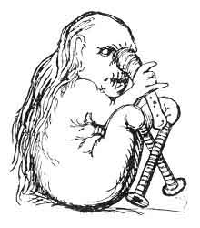
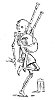

  
[Intangible Textual Heritage](../../../index.md)  [Legends &
Sagas](../../index)  [Celtic](../index)  [Index](index.md) 
[Previous](pt404)  [Next](pt406.md) 

------------------------------------------------------------------------

p. 24

### AUTHORITIES.

   
An ancient stand-up dog-fight, from a sculptured cross in Scotland, at
Dupplin.

The first question for enquiry is, who and what were the heroes of
Ossian?

According to Professor O'Curry's Lectures, [1](#fn_2.md) the following dates rest upon ancient
authority--

Finn's pedigree begins. *Finn* son of *Cumhall*, son

|           |
|-----------|
| B.C. 110. |

of *Trenmór*, son of *Snaelt*, son of *Eltan*, son of *Baiscni*, son of
*Nuada Necht*, who was monarch of Ireland B.C. 110.

Finn slain, in the reign of Cairbré Lifeachair.

|           |
|-----------|
| A.D. 288. |

Battle of Gabhra. Death of Oscar and Cairbré (p.

|       |
|-------|
| 284\. |

304.)

p. 25

|           |
|-----------|
| A.D. 432. |

Coming of St. Patrick to Ireland (p. 472), to whom Oisin, the son of
Finn, and Caelte his kinsman and con temporary, recited poems describing
the glories of the ancient race, and the localities of famous events.

In a matter of such antiquity it is of small importance that Oisin, who
had a grown up son in 284, must have been about 180 years old in 432,
and more than 200 before St. Patrick could have built the monasteries in
which the poor old blind Irish bard was so grieved, starved, and
tormented by jangling bells, droning psalms, and howling clerics; it is
proved that the names of the old Fenian heroes were known when very
ancient manuscripts were written, and that is enough. So, taking the
third century as a starting point, let us take a rapid voyage of
discovery down the stream of time, carrying with us the published Gaelic
Ossian, and noticing anything old that bears upon Gaelic traditions at
its proper place. If Scotchmen and Irishmen will not pull in the same
boat, let there be no bumping, or jostling, or fouling, but a fair race
for what may be left of the poems when the voyage ends; if any one is
bored by such races he need not follow the boats, he may skip over a
short cut to the winning-post, but if he does he must not give an
opinion about the line of country which he is too lazy to travel.

First, then, let it be granted that FINN lived in Ireland at the end of
the third century, an that the first book of Temora is founded upon an
event which took place in Ireland before the book of Leinster was
written, if not in 284; but it must be granted, on the Irish side, that
Hector Boyce made Finn a Scot and a

p. 26

giant in 1526, when the Scotch historian published his work. [1](#fn_3.md)

The passage is partly quoted in the Highland Society's Report on Ossian,
and p. 170, Hist. of Scotch Poetry, and part of it is as
follows:--"Conjiciunt quidam in haec tempora. Finanum filium Cœli (Fyn
MakCoul vulgari vocabulo) virum uti ferunt immani statura septenum enim
cubitorum hominem fuisse narrant."

So, in the sixteenth century, Fyn was the son of heaven, and the
historian then ranked him with King Arthur; and tales and other
compositions concerning Fyn with the Arthurian fables. It must also be
granted that numerous Celtic worthies bore Ossianic names,. besides the
Irish heroes. Engenius I., son of Fin-Cormach-us, was a king of Scotland
slain in battle with the Romans, A.D. 357. Ferg-us (Wrath-us) was the
name of a Scotch king who was lost in the Irish sea, B.C. 330, and many
historical personages have borne that name: besides the Irish bard
Fergus, the son of Finn MacCumhal of A.D. 280. Cumhal, again, is like
many Celtic names; it sounds like Coil-us, who was a king of the
Britons, and if he be the hero of the English ballad, his was a rough
age:--

"Old King Cole, unsophisticated soul,  
Neither read nor write could he,  
To read and to write he thought useless quite,  
For he kept a secretarie."

Congall-us was a Scotch king in 501 or thereabouts. There were many
Scotch kings called Donald, if we can

p. 27

believe Scotch history, and the men who wrote these names were generally
of the race which now says "gar*song*, *ung* ver du *vang*, et *ung*
morceau du *pang*." The sound of the French and Gaelic nasal o and u are
identical, and a man who would write gar*song* because he seemed to hear
that sound, would also write MacDonald, as it is now pronounced in
Gaelic, Ma*con*gil, and one sound of MacCumhal would be Macc*ung*il and
another Macooil. Now, if this erroneous *ng*, which expresses the Saxon
value of the French and Gaelic nasal o and u, and the word Mac be struck
out, there remains a nasal o-il or u-il, and so, instead of Cumhal,
Coil-us, Cole, Cowl, Cool, C*ong*all-us, *D*onald-us, and *D*ugald-us,
we come very nearly to Hoel, whose son would be ap Hoel, O'Hoel, or
Mac-Hoel, and thus Fionn may be made the son of the mythical Welsh
Howel, or of some great man who bore the same name before the flood. By
a like easy process, Fionn becomes a Macdougald, and as Campbell is not
an ancient Gaelic name, I may point out that Camul was the "Celtic
Mars," and that Camel-ot, Camel-odunum, and other such names, all savour
of Cumhal, though that word now means handmaid, or subjection, according
to dictionaries.

Fenian names also appear in the Milesian story (p. 447 of O'Curry's
Lectures.) Beginning with Japhet and Magog, the race is traced through
Scythia, Egypt, Scythia again, Greece, and Spain, whence a colony came
to Erinn in the year of the world 3500, at which time Ireland was
governed by the three sons of Cermna Milbheoil (honey-mouth), Ethur,
Cethur, and Fether; "mythologically known as *MacCuill*, MacCeacht, and
*MacGréiné*; "who were Tuatha dé Danann, and reigned at Tara. Scota, the
mother of the Milesian leaders,

p. 28

was shortly afterwards slain in a battle, and one of her sons was Eber
*Finn*. So Finn was a mythological Milesian long before the Finn of the
third century, and MacCuil Finn's patronymic was also that of the
mythological head of the race which the Milesians found in Ireland.

Finn is also one of the commonest names in Scandinavia, and so is Köl,
so we get Finnr Kölsen, the equivalent of Fin MacCowl. Oscar is also
common, and is interpreted to mean As-gair the spear of the gods, and
Oske is one of Odin's numerous names.

In the twelfth century Geoffrey of Monmouth names Coillas, and Coel, and
Conan, as British heroes, and according to the chronicle Conan was made
king of Armorica. Sir Gawain is probably the same personage as Gow or
Gol, the son of Morna, so they may be Welshmen or Bretons. Phinn,
MacPhunn, Fin-lay, and scores of other names common in England,
Scotland, and Ireland, also resemble the Ossianic names. But the Finns
or Lapps inhabit Finmark at this day, and have all along been magical
people in the north, so the Celtic heroes may be Lapps. In the story of
Gunnhillda (Njal Saga, vol. ii., 378), we learn how, in the tenth
century, a beautiful maiden was sent to Finnark to learn magic from the
Finns, and "some believed that MATTUL the FINNISH king himself was her
master in magic," but Gunnhillda's story is mixed up with that of the
whole of the west of Europe, in that she was a Viking's bride, and
mother of Scandinavian kings, so her master in magic may be MacCoul
himself in disguise.

Feinne may be Phœnician or Egyptian, if there be any truth in the old
legend about Pharaoh's daughter.

In like manner "Art" is the Gaelic now commonly

p. 29

used for the Christian name "Art-hur," or Art is not to be appropriated
to any one Irish king, though there may have been an early Cormac Mae
Art, for there was an early British Arthur, of whose deeds romance is
full. So Bran and Conan were early Welsh kings, though Brian and Conan
may have flourished in Ireland. Brenn-us sacked Rome about 930 B.C., if
Bran was Fionn's magic black hound, A.D. 280; and generally it must be
granted on all sides that the early history of Great Britain and Ireland
must be Celtic history, and that the best place to get at it is Ireland,
where the Celts were not much disturbed till a comparatively late
period. But Irish, Scotch, Welsh, Manx, and Cornish, and Clyde Celtic
history, and all the early romance of Europe, is so tangled and twisted
together, that it will be no easy matter to unravel the skein. Without
some knowledge of Gaelic it is hopeless to begin upon this dark history.
Let me give one example. There is a Lord Mayor in London, and in every
town in England. Monsieur le Maire is a French official in every village
in France; the mayors of the palace played their part in French history;
the Maormors were anciently Scotch great men; but very few know that
maor, pronounced nearly like the French word, is still the Highland
constable and ground officer, and civil officer, though Inverness has a
provost.

But I have now to do with the heroes of "Ossian's poems."

In Professor O'Curry's book, a vast amount of curious information is
given relative to Irish writings. It appears that many hundreds of these
are preserved in various libraries and collections at home and abroad.
They contain histories, genealogies, codes of law, historical tales, and
tales of all kinds; romances, legends,

p. 30

and poems of various sorts, and "numerous Ossianic poems relating to the
Fenian heroes, some of them of great antiquity." The earliest writing is
Latin, and attributed to the time of St. Patrick, about 480; others are
attributed to St. Colum Cillé and the sixth century, others to the
tenth, eleventh, twelfth, and following centuries, and these are
generally assumed to be Irish, not Scotch, because of their language and
the character in which they are written. Most of them probably were
written in Ireland, but such documents must be judged by their contents.
I received a letter this year from a Scotch highlander in Glasgow, part
of which was written in the old hand. A song composed by Duncan
Macintyre, the Breadalbane bard, was written in the old character in
1768. It was commonly, though not always, used before that time;
inscriptions on the cross at Inverary and other old stones in Scotland
are in old letters and in obsolete language. St. Colum Cillé founded
Iona; and if St Patrick's churchmen used old letters, the saint is
accused of having been born in Scotland. Those who only understand
modern Irish or Scotch Gaelic cannot, without study, read or understand
the old written language, which is and always has called itself Gaelic.
So Scotchmen and Irishmen would do well to make peace, and help each
other to use these old records, and call their language Gaelic, instead
of Irish or Earse, which words are only used in speaking English, and
produce discord.

Now these ancient Irish documents and those which are preserved in
Scotland, like Scotch and Irish traditions, are pervaded by the
variously spelt names of Fionn or Finn and his worthies. There is hardly
a grown highlander who is not familiar with their names-they are
household words at the firesides,

p. 31

of Irish peasants; and the characters and relationships of these
mythical warriors are almost invariably the same. They are the heroes of
Ossian.

Professor O'Curry, who probably knows more about Irish lore than any man
now living, and has spent great part of his life in reading and
transcribing old manuscripts, holds that the "Fenians," who answer to
the "Fingalians" of English readers, were historical Irish personages
who flourished in the third century, but he shews, p. 10, that Fer Féne
was written in the book of Ballymote in 1391, in a poem composed in
1021, and be translates it "Féne men, these were farmers." Still, Finn's
genealogy is traced to 110 B.C., and it rests upon ancient authority
that Diarmaid O'Duibhne ran away with Grainne, the bride of Finn, and
daughter of Cormac Mae Art, and that Finn's son Oisin was a warrior
poet.

Poems attributed to Finn Mac Cumhail, his sons Oisin and Fergus
Finnbheoil, and his kinsman Caelté, do exist in Gaelic MSS. seven
hundred years old. Five of these poems are attributed to Finn himself,
and exist in the book of Leinster, which is said to have been compiled
from older books in the latter part of the twelfth century; and in the
book of Leacan, compiled 1416. Two poems attributed to Oisin are in the
book of Leinster. One consists of seven quatrains, and records the
deaths of Oscar the son of Oisin, and Cairbré Lifeachair, monarch of
Eirinn, who fell by each other's hands at the battle of Gabhra, "fought
A.D. 284." The second is longer, and records early races on the Curragh
of Kildare, wherein Oisin, Caelté, and Finn were gentlemen riders, and
magical personages acted the part of modern sharpers, and tempted the
heroes into unhallowed dens near Killarney, where they spent a wild
night after the

p. 32

races. Another Gaelic poem of undoubted antiquity is attributed to
Fergus, and tells how Oisin his brother was enticed into a fairy cave,
and discovered himself to Finn by letting chips cut from his spear-shaft
float down a stream; as Diarmaid betrayed his retreat to Fionn in the
tradition (page 43, vol. iii.) Another is a love story, which Caelté is
supposed to have recited to St. Patrick.

Professor O'Curry nowhere says that the "poems of Ossian," as published
in 1760 and 1807, or anything like them from which they could have been
translated, exist in ancient Irish manuscript, and gives no support to
the argument of his countryman; but be also says, "Of MacPherson's
translations, in no single instance has a genuine Scottish original been
found, and that none *will* ever be found I am very certain." If he
means that the Gaelic of 1807 never can be found in an ancient
manuscript, he is certainly right, for the language must have obeyed the
common law of change incident to all languages; but he has pointed out
some of the incidents on which the first book of Temora is founded, in
one of the two ancient poems which were attributed to Oisin in the tenth
century; and it is beyond question that endless stories and poems about
Fionn and his people have been for centuries, and still are
traditionally preserved in Scotland, as well as in Ireland. According to
Irish authorities, then, Gaelic poems are preserved in ancient
manuscript, and some relate to the Ossianic heroes, but they were
Irishmen, who lived, and loved, and fought in the third century, and not
Scotchmen; but according to other Irish authorities, these men
flourished much later. Scotch and British Fenians are mentioned, and
Scotch Oscars appear in Irish poems, even Danish Oscars are named in
Irish books;

p. 33

and the feats attributed to the ancient heroes who bore these Ossianic
names, and whose chief was FINN, are often the exploits of giants and
demigods.

According to MacPherson and "Ossian's poems," FINGAL was king of Morven,
and lived about the same time; according to tradition, which scorns
dates (see No. LXXXII), FIONN was the son of a Scotch king who came from
Ireland, and of a Scandinavian princess, and drove the Scandinavians
from Scotland, having first passed through many adventures in Ireland.
Assuming that he lived in the third century, he may have been a leader
of Celts in their early fights with the Northmen, Danes, or
Anglo-Saxons, who followed the Romans; before any authentic account of
their raids was compiled, and before men thought of distinguishing
between Ireland and Scotland. But no tradition now current, and no
ancient manuscript of which I have heard, makes any mention of the
kingdom of Morven or its king Fin*ga*l. I believe that the kingdom is an
invention of the compounder of Ossian's poems, whoever he may have been.

The name Fionnaghal is, however, no modern invention; Barbour knew it as
"Fyngal" about the days of Bruce. It occurs in a Gaelic song printed by
Gillies, 1786, and composed by lain Lom, a bard who sang about the time
of Montrose, and died 1710 at a great age. It is in an elegy on
Glengarry composed in the seventeenth century, in which the poet
MacMathain or Mathieson, Seaforth's bard, calls the MacDonalds *Sliochd
righ Fionnaghail*, the race of King Fingal (Beauties of Gaelic Poetry,
Mackenzie); and the name also occurs in a traditional story now current
in Islay. Righ Fionnaghal according to this was a MacDonald, and "king
of the Isles," and lived in the island in Loch

p. 34

\[paragraph continues\] Fionn-lagan in Islay, where are the ruins of the
habitation of the lords of the Isles. A family of Mac-in-tyres (sons of
the carpenter) claim to be descended from an illegitimate son of this
King Fingal; and Flora Macintyre, one of my peasant contributors claims
to be one of them. The story goes, that the king and his son were at sea
in a boat, when the peg in the bottom came out and was lost, and the
water rushed in. The young man, who had never gained the notice of his
father, thrust his thumb into the hole and chopped it off with an axe.
"*Mo laochan air saor na h-òrdaig*!" "My fine lad, the thumb carpenter,"
said the king; and from this MacDonald, son of Fingal, came the family
of the Thumb Carpenters, who are still called Macintyres in Islay; or in
Gaelic, "*Mac an t-saoir na h-òrdaig*." MacDonald is often so pronounced
as to make the name resemble MacCumhal. This story is well known about
Arisaig.

As for the poet, to whom nearly all the old poetry in the Highlands is
now attributed, his date and origin are as uncertain as his father's. If
he was Fionn's son he could not have survived to converse with St.
Patrick, and he could not have lived with a fairy lady in the land of
youth; he is in Gaelic popular tradition and old Gaelic lore the
counterpart of Thomas the Rymour, who was a living man in 1280, and yet
went to fairy land, and has the credit of being a prophet, a magician,
and a poet--the author of Sir Tristrem. That ancient Scotch poem "Sir
Tristrem," and the oldest Scotch poems known, treat mainly of Celtic
worthies and their adventures, and include the incident of the good
knight who slays a dragon, and the false servant who claims the honour
and the princess, which is in the Gaelic "Sea-maiden;" and in a tale
told

p. 35

to me by an Irish fiddler; in German, Norse, and other popular tales.

There is a popular saying still current in Islay, which joins true
Thomas to a common Celtic British legend. He is supposed to be still
living, enchanted in Dumbuck (Dun-a-bhuic, the buck's hill), near
Dumbarton (Dunbreaton, Mount Breaton); and he appears occasionally in
search of horses of a peculiar kind and colour. He pays for them when
they are brought to the hill; and the vendor sees enchanted steeds and
armed men within the rock. It is said--

Nuair a thig Tomas an riom [1](#fn_4.md) 's a chuid
each,  
Bidh latha nan creach an Cluaidh.

When Thomas of power and his horses shall come,  
The day of plunderings will be in Clyde.

The date of Fionn and his family may be the third century; but unless
there were many who bore the same names, or the names were titles, the
exploits of a series of men, and the fabulous deeds of mythological
characters, must have gathered about the names of this single family. I
am still inclined to believe that these heroes of popular romance were
ancient Celtic gods.

Be that as it may, I will endeavour to shew that their names have been
current for a very long time, and that Ireland has not an exclusive
right to them.

\_\_\_\_\_\_\_\_\_

According to a Scottish legend given by Fordun, etc.,

|       |
|-------|
| 203\. |

the nation of the Scots embraced Christianity in the

p. 36

reign of King Donald, consequently sculptured stones, even with
Christian symbols, may be of very ancient, date in Scotland.

|       |
|-------|
| 360\. |

St. Ninian was born; he was son of a British prince, went to Rome,
founded Candida Casa, or "Whitehorn," and converted the southern Picts,
who are supposed to have been the people between the Firth of Forth and
the Grampians.

 

[  
Click to enlarge](img/03600.jpg.md)  
Figure dressed in the Belted Plaid, copied from an ancient sculptured
stone found at St. Andrews, supposed to represent a Pictish hunting
party. Date unknown, No Christian symbols.  

 

|       |
|-------|
| 432\. |

St. Patrick preached in Ireland.

|       |
|-------|
| 503\. |

Fergus, son of Ere, who is said to have received the blessing of St.
Patrick in his youth, led a colony of Dalriads from Ireland, and founded
the Scottish monarchy.--(Ecclesiastical History of Scotland, pp. 4, 11,
44, 49.)

Fergus was succeeded by Domangart, Comgal, and

p. 37

\[paragraph continues\] CONAL, by whom the Island of Iona was bestowed
upon St. Columba. The saint is supposed to have been born in Donegal,
A.D. 521.

St. Columba landed at Iona, and shortly afterwards

|       |
|-------|
| 563\. |

preached to the northern Picts. There are consequently good reasons why
the traditions of Argyle should still resemble Irish traditions, and
Conal and Patrick ought to be conspicuous names in West Highland tales,
and Picts ought to appear.

The only Gaelic traditional reference to a people with Pt name like that
of "the Picts " is an occasional, but very rare, mention of PIOCATCH, as
a kind of men. The word, pronounced *Pyuchk-aich*, is common all over
the west, but it means a cole-fish at a particular stage of its growth.
Other sizes of the same fish are called CUDAINN, which, as "cuddy," is
immortalized by Johnson as caught by Boswell. A larger size is
CEIT-EAN-ACH, derived from *Ce*, the world, *tein*, fire = *ceit-ean*
(part of April), the spring, directly after which came the festival of
Beal-tainn and its symbolical fires. So "Ceit-ean-ach" means a
"spring-fish," and something very like the fish meant is sculptured on a
Pictish stone in Scotland (see vol. iii., page 356, left hand, upper
corner), and these stones date from Pagan times, and probably have to do
with Pagan observances.

The same fish, when grown very large, is called "UGSA," pr. *oox-e*,
which is the Norse for a bull, and the whole tribe is called GLAS-IASG,
grey or green fish. As every clan has some fish, beast, bird, and plant
for a badge, perhaps the PICTS adopted this fish, or fish in general, as
their badge, and thus the modern name of the fish may be the ancient
name of a tribe. At all events, there are plenty of Lowland traditions
about Picts as a different race, but there are scarcely any in

p. 38

the Highlands. The Irish call them "cruithnich," for which word all
manner of meanings have been found, including "*cruinn-ich*,"
Round-ites. Some Irish writers hold that the Picts migrated from Ireland
to Scotland before the Scots.

There is also good reason for the continual reference to the island with
fire about it, and the Scandinavians, for the churchmen of Iona or men
of their class visited and settled in Iceland before the Norsemen.

|       |
|-------|
| 783\. |

First recorded hostile appearance of the Danes in England.

|       |
|-------|
| 871\. |

Ingolf, first Norse settler, set out for Iceland.

|            |
|------------|
| 880 to 900 |

Harold Fairhair, king of Norway, rooted out the Vikings in the west, and
drove a rush of settlers to Iceland. In the Norse accounts of these
events a story is told of a sea-rover who found his way to Iceland by
letting ravens fly from his ship. I have a long Gaelic story in which a
man finds his way over the sea in pursuit of a mysterious lady, by the
help of three ravens, two of which he kills and tortures because they
will not fly, but the third to save his life flies, and shows the way.
Ossianic names occur in this tale.

700 to 800: A manuscript, supposed (for reasons given in the Appendix to
the Report of the Highland Society on the poems of Ossian) to be of the
eighth century, is believed to be somewhere in Edinburgh. It contains a
version of "The Tain"--a poem relative to which the Ossianic Society of
Dublin have lately published a volume of very curious matter, and which
is also mentioned by Professor O'Curry. Whatever may be the real date of
this ancient MS. it throws the date of Osin, or Ossin, or Ossian, and
Finn, and of incidents in surviving traditions, both prose and poetry,
very far back;

p. 39

but, so far as I am informed, it does not contain any of the Gaelic
poems published in 1807. [1](#fn_5.md) So we may
pass on.

An ancient Gaelic MS. has been lately discovered in,

|              |
|--------------|
| 900 to 1000: |

England. I am not aware that it is yet decided whether the language is
most like Irish or Scotch Gaelic; but it is Gaelic, and contains, as it
is said, a charter of lands near Aberdeen, and it was probably meant to
be read by people who lived where it was written. I mention it as
evidence that Gaelic was written in the east of Scotland in the tenth
century.

The following sentence appears in the *Saturday Review* of December 8,
1860, as Gaelic taken from this MS.:--

FORCHUBUS CAICHDUINI IMBIA ARRATH INLEBRÁN COLLI ARATARDDA BENDACHT
FORANMAIN INTRUAGAIN RODSICRIBAL

The translation given is--

Be it on the conscience of every one in whom shall be the grace of the
booklet with splendour that he gave a blessing on the soul of the
misellus who wrote it.

In this form I can make nothing whatever of the Gaelic, and not much of
the English. There is not one word, except bendacht, which even looks
like modern Gaelic, but the following sentence conveys as little meaning
at first--

IAMY OURO BED IENTHUM BLESER VANTTO COMND.

p. 40

The Gaelic, otherwise divided, looks better; the reader may puzzle out
the other language for himself. Taking this to be phonetic spelling, it
is not unlike modern Gaelic with one Latinised word, and would seem to
be a formal gift of a wood on a hilltop, and a blessing on somebody
mentioned before.

<table data-cellspacing="0" data-border="0" data-cellpadding="9" width="50%">
<colgroup>
<col style="width: 25%" />
<col style="width: 25%" />
<col style="width: 25%" />
<col style="width: 25%" />
</colgroup>
<tbody>
<tr class="odd">
<td width="25%" data-valign="TOP">
Forcubus 
Forchubus 
To the Forchi
</td>
<td width="25%" data-valign="TOP">
caich 
gach 
to every
</td>
<td width="25%" data-valign="TOP">
duini 
duine 
man
</td>
<td width="25%" data-valign="TOP">
im bi a 
am bith e 
to whom it may be
</td>
</tr>
</tbody>
</table>

<table style="width:100%;" data-cellspacing="0" data-border="0" data-cellpadding="9" width="50%">
<colgroup>
<col style="width: 16%" />
<col style="width: 16%" />
<col style="width: 16%" />
<col style="width: 16%" />
<col style="width: 16%" />
<col style="width: 16%" />
</colgroup>
<tbody>
<tr class="odd">
<td width="17%" data-valign="TOP">
ar rath 
air rath 
said
</td>
<td width="17%" data-valign="TOP">
in 
an 
the
</td>
<td width="13%" data-valign="TOP">
le 
leth 
half
</td>
<td width="22%" data-valign="TOP">
brán 
braigh'n 
of the top of the
</td>
<td width="15%" data-valign="TOP">
colli 
collie 
wood
</td>
<td width="17%" data-valign="TOP">
ar 
air 
on
</td>
</tr>
</tbody>
</table>

<table style="width:100%;" data-cellspacing="0" data-border="0" data-cellpadding="9" width="50%">
<colgroup>
<col style="width: 16%" />
<col style="width: 16%" />
<col style="width: 16%" />
<col style="width: 16%" />
<col style="width: 16%" />
<col style="width: 16%" />
</colgroup>
<tbody>
<tr class="odd">
<td width="17%" data-valign="TOP">
at 
ait 
the place
</td>
<td width="17%" data-valign="TOP">
ard 
ard 
high
</td>
<td width="17%" data-valign="TOP">
da 
dhaibh 
to them
</td>
<td width="17%" data-valign="TOP">
bendacht 
beannachd 
a blessing
</td>
<td width="13%" data-valign="TOP">
for 
for 
on the
</td>
<td width="20%" data-valign="TOP">
anmain 
anamain 
the little soul
</td>
</tr>
</tbody>
</table>

<table data-cellspacing="0" data-border="0" data-cellpadding="9" width="50%">
<colgroup>
<col style="width: 25%" />
<col style="width: 25%" />
<col style="width: 25%" />
<col style="width: 25%" />
</colgroup>
<tbody>
<tr class="odd">
<td width="25%" data-valign="TOP">
in 
an 
of the
</td>
<td width="25%" data-valign="TOP">
truagain 
truaghain 
poor little fellow
</td>
<td width="25%" data-valign="TOP">
rod 
romh 
before
</td>
<td width="25%" data-valign="TOP">
sbribai 
sgriobhte 
written.
</td>
</tr>
</tbody>
</table>

 

"To the Forchi (? the Farquhars). To every man to whom it may be said.
The half of the wood on the high place to them. A blessing on the little
soul of the poor little fellow before written."

It is difficult to know where a word begins or ends in old writings, and
perhaps this arrangement of the letters may be as good as the other. I
know nothing further of this manuscript, and very little of old
manuscripts of any kind, so this is a mere guess at a puzzle.

|               |
|---------------|
| 1000 to 1100. |

Book of Leinster compiled, it contains numerous references to poems,
tales, the Feine, etc.

|        |
|--------|
| 1014\. |

Brian's battle with the Norsemen was fought in Ireland. A description of
this fight is given in the Njal Saga, and though it is interlarded with
supernatural portents, it is an account written not very long after the
event, and is probably very true in the main. Having lately visited the
scene of the Njal Saga in Iceland, I have become impressed with the
extraordinary truthfulness of every part of the story, which can now be
tested. If a spot is described, the people who

p. 41

live there now will point it out, and the narrative there appears
probable, for it accords with the locality. It is told that Gunnar stood
on a height, and thence shot a number of men with arrows, and the
nearest peasant mounted the only block of lava in the place that seemed
to suit the description, and posed as Gunnar. Close to the spot, he
pointed out a number of human bones, skulls, and teeth, which had been
laid bare by a strong wind which had lately driven the black sand away
from a small rising ground. Unless these were the bones of the men slain
there by Gunnar, eight hundred years ago, it is not easy to make out how
they came there, amongst the bare lava and sand near "the springs." They
bear every mark of great age, there is no burying ground near, and it
was no one's interest to play a trick upon travellers. Though I cannot
believe that Odin appeared at Brian's battle, or his corse-choosers
before it, or that ravens, and swords, and showers of blood, fell upon
and attacked the pagan Norseman, I can readily believe that such stories
were told, and believed, and written down in Iceland as true, and that
the smaller incidents of Brian's battle were truly recorded
nevertheless. It appears that king Brian's army had banners, and in a
traditional Gaelic ballad, at least as old as 1784, and now current, is
a description of the banners of the Feinne. The Celts had swords, and
spears, and shields, and mail, like the traditional Feinne. Kerthialfad
is mentioned as a leader of the Celtic army, and in the song of the
Muilearteach, page 136, vol. iii., occurs the name Cearbhal as a leader
in some great battle between Celts and Lochlanners, in which the Celts
won, and where they displayed banners, one of which was the banner of
Fionn, which is described in another

p. 42

poem. They used spears, and shields, and swords, and elsewhere it
appears that they wore mail. A magic raven was the standard on the Norse
side, and according to the Saga, ravens attacked Brodir's men; a raven
plays his part in the Lay of Osgar. One of the Saga heroes, on the
Celtic side, was Ospak; one of the traditional heroes was Osgar, and
they performed similar feats. "Ospak had gone through all the battle on
his wing, he had been sore wounded, and lost both his sons, before king
Sigtrygg fled before him." Osgar, according to the Gaelic poem, broke
his way through the battle to the king of Lochlann, whose name is not
given, and slew him, and an Orkney Earl was really slain, if the king
was not. Osgar, like Ospak, was sore wounded, if sickles or herons could
go through his waist after the battle. "Ospak was a heathen Viking," but
he would not fight against the good Celtic king Brian. Osgar was a
heathen Celt, and according to part of his traditional history, he went
to Lochlann as a boy, carried there by a scaly monster, who ate men, and
came in a ship; a Viking might be remembered as such a being. If the man
on the apple gray horse be meant for Odin by the Norse Saga writer, it
is quite fair that a Celtic bard should bring down his Olympus, and
Fionn at the head, and so this lay of the Muilearteach may mean Brian's
battle, and be a tolerably true ballad account of that fight. It may
also mean something much older, or more modern, but points of
resemblance between a saga and a ballad are worth remark. Miss Brooke,
in 1789, attributed the Lay of Magnus to the twelfth or thirteenth
century, and assumed that the Norse invader meant, was the Magnus who
worked so much ill in Ireland about the latter end of the eleventh
century. This tells for the

p. 43

antiquity of traditional Gaelic poetry, and for the groundwork of
"Fingal," but not for the Gaelic of 1807.

In a charter of lands in Morayshire, the words

|        |
|--------|
| 1220\. |

"Tubar na fein" occur. This is explained to mean "The well of the great
or kempis men," which proves that the name of the Feinne was even then
associated with the topography of the eastern Highlands.--(Celtic
Gleanings, MacLauchlan, 125.)

A MS. in the Advocates' Library contains, amongst

|        |
|--------|
| 1238\. |

other things, a version of the poem on which "Darthula" is founded. The
character is "Irish;" but it seems, from internal evidence, to have been
written in Cowal. Several traditional versions of a poem on the same
subject have been collected in Scotland and printed. The story is
claimed as Irish, and this probably was a popular Gaelic ballad long
ago. This throws the framework of one of the published poems very far
back, but does not affect the Gaelic of 1807, for "Darthula," as
published, is not there; but Deirdir sings a plaintive ditty in a
language which is not very different from modern Argyleshire Gaelic,
though differently spelt, in which she takes her leave of "that Eastern
land, Alba, with all its lakes," and names a whole series of places
which correspond to places in Argyleshire about Lochawe, Cowal, Glencoe,
etc. A specimen of the poem is at pages 298, 299, Appendix to H. S.
Report. So the groundwork of Darthula is common property, and genuine
and old, for Professor O'Curry finds mention of the tale of the children
of Usnech in early Irish manuscripts (1319), and believes it to be as
old as A.D. 1000; but the poem of Darthula must be carried further on.

About this time the halls of barons, and even the

|        |
|--------|
| 1250\. |

courts of princes, were frequented by wandering minstrels,

p. 44

and in the romances of the period they are constantly mentioned.

The Northmen were accompanied by their skalds in their warlike
expeditions, and the accounts which these men wrote were in verse and
prose. The verse is quite different in spirit and metre from Gaelic
verse; but "sgeulachd," pr. skale-ach (tales), are often partly verse
well.

In the history of the Norwegian expedition against Scotland, A. D.
1263, [1](#fn_6.md) is an account of the expedition
of Haco, represented as the most formidable that ever left the ports of
Norway. The prize disputed with Alexander, son of William, king of
Scotland, was the possession of the Hebrides.

In the manuscript, as described by the translator, are pictures, some of
which represent a man killing a boar, and another fighting with a
mermaid, both of which subjects form the groundwork of stories now told
in the Highlands. Most of the figures are in armour. Their helmets are
sometimes conical; so are the helmets sculptured on many of the
Hebridian tombstones. The whole course of the expedition is minutely
described. They sailed as far south as Loch Long, drew their boats over
the isthmus now called Tarbert or draw-boat, harried the islands in Loch
Lomond, and fought a great battle with the Scotch near the Kumrey
(Cumbraes), after which Haco sailed by Botar; (Bute, Gaelic Bòt);
(Hersey) Arran Ar fhinn, Fionn's land, according to some),
Sa-tir-is-mula (the Mull of Kintyre, maol-cheann-tire, bluff of Land's
end); Gudey (Gigha Giugha); Il (Islay, Ile), where he levied a
contribution

p. 45

of cattle, meal, and cheese; Myl (Mull, Mul-e); Rauney (Rona, Rona, seal
isle); Skidi (Skye, Eilan sgiathnach, the winged island), and thence by
Harf (Cape Wrath), to Orkney, where the king sickened and died.

In this early account by an eye witness of a Norwegian expedition,
mention is made of "Kiarnakr

 

[  
Click to enlarge](img/04500.jpg.md)  
From grave-stones at Kilberry and Skipnish, in Argyleshire. Two are life
size, and such stones are common.  

 

son makamals," a Scot who harried the Isle of Skye, and whose men "had
even taken small children, and raising them on the points of their
spears, shook them till they fell down to their hands," and in the story
abstracted, vol. iii., p. 1841, and got in Islay, Fionn MacChumhail goes
from Islay to Skye to fight the Scandinavians. There is no mention of
burnings and murders,

p. 46

but as such proceedings were then common amongst Vikings, according to
Norwegian accounts, probably both sides were equally cruel. The
translator suggests in a note, that as Makamal is elsewhere written
Niachamal, it may be a mistake for "Nial Camal," a lord of Lochaw. The
name was probably written from ear, and the name of the lords of Lochawe
is not pronounced Kamal now-a-days in Gaelic. It seems possible that the
name may be Ceathearnach (warrior), Mac (son of) Cumhail; but it might
be a corruption of several other Gaelic names, as now pronounced,
including the big Macaulay, of whose deeds there are so many traditions
current in the Long Islands. Be that as it may, petty rulers throughout
these islands were then styled kings, as they are in Gaelic stories.
Ships were generally small enough to be drawn overland, as described in
Barbour's Bruce, and in traditions; and there are many other traits
which appear in popular tales still repeated in the places mentioned.
This seems to give a vague reference to something like an Ossianic name.
I have several Gaelic stories which clearly describe a Scandinavian
descent upon the country about the Clyde, in which Fionn is made to play
a part. So this tells for the antiquity of these traditions; and shows
how old records may have been destroyed, for there were religious houses
on the islands in Loch Lomond.

|        |
|--------|
| 1314\. |

Bannockburn was fought. According to Barbour the west Highlanders were
there in force.

The ferd battale the nobill king  
Tuk till himself in governing,  
And had intill his company  
The men of Argile and of Kintyr  
And of Carrik all halely  
And of the Ilis quharof was Syr p. 47  
Angus of Ile and But all tha;  
He of the plane land had alsua  
Of armit men ane mekill rout  
His battale stalwart was and stout.

It is strange to trace an ante-celtic feeling in the bard who wrote this
passage, and it is equally strange to find so little about Bruce in
Highland tradition now.

Barbour, Archdeacon of Aberdeen, compiled his

|        |
|--------|
| 1375\. |

poem of "the Brus." The manuscript in the Advocates' Library contains
the words, "hym all." Hart's edition, printed 1616, has "Fingal."
Jamieson's 1820, has "hym all," and the edition of the Spalding Club,
published from a collation of "the Cambridge and Edinburgh MSS.,"
follows Hart.

"The Lord of Lorne," enraged at his men who durst not follow the "Brus,"
sets them an "ensampill,"

He said methink Marthokis sone,  
Richt as Glomakmorn was wone  
To haf fra Fingal his memyhe,  
Richt sa all his fra us has he.

The lowland poet here remarks that he might "mar manerlik" have "liknit"
him to Gaudifer de Larys, and narrates an exploit performed. by that
hero of romance, which he knew, and thought a better illustration of
Bruce's valour; so he probably gave the words of the Lord of Lorne as he
had heard them, honestly, though he did not see their force. The passage
refers to the strife which, according to tradition, was constantly going
on between Goll Macmorna and Fionn; and the Lord of Lorne (MacCowl)
spoke according to his lights, to men who understood what he meant.

p. 48

\[paragraph continues\] Irish history claims a real existence for Fionn
and Goll, and modern lowland stories have added supernatural incidents
to the real history of the Bruce and Wallace:

With respect to the various readings; "hym all" makes no sense, Fingal
does not accord with tradition, but *fynn all* would remove all
difficulties, and mayhap the scribe wrote *hym* for *fynn*, not knowing
what was meant. Spelling and writing were not fettered by rules in the
olden time, and the letter y might well express the existing vowel sound
of Fionn.

MacDougald of Dunolly (Maccowle as anciently written) now owns a brooch
which was won in fight with the Bruce in Lorne, near Morven, the
supposed kingdom of Fingal. It is clear that Barbour then expected
lowland readers to understand this allusion to two Ossianic
heroes.--(Highland Society's Report, p. 21. Hist. of Scotch Poetry, 275.
Barbour's Brus.)

|        |
|--------|
| 1391\. |

The Book of Ballymote, above referred to, was written, and contains
something relative to the heroes alluded to by Barbour. So they were
widely known about the time of Bannockburn, 1314, and the history of
Bruce shews that be at least courted the aid of the men of the west, who
"were stalwart and stout."

|        |
|--------|
| 1408\. |

A charter of lands in Islay was written in the usual form of Latin
charters, but in the Gaelic language and character, by Fergus Beaton,
generally called the Mull Doctor. This proves that the Gaelic character
and language were then used in legal documents in Scotland.--(Celtic
Gleanings, 76.) This manuscript disproves the Irish claim to the
exclusive use of the old character, and refutes the assertion that
Gaelic was not a written language. It might as well be argued that
English was unwritten because the Times does not use Chaucer's language
and black letter.

p. 49

The Book of Leacain, above referred to, was written.

|        |
|--------|
| 1416\. |

Sir Colin of Glenurchy, ancestor of the Breadalbane

|        |
|--------|
| 1432\. |

family, got a charter from his father, and set up for himself. About
this time the name MACCOWLE was applied to MacDougald in Lorne. It is
pronounced Macgooill now. This Colin is styled Black Colin of Rome. It
is said that he was a knight of Rhodes, and that be was three sundry
times at Rome. [1](#fn_7.md)

Here then is a foundation for some passages in the tale of Conall
Gulban, got in Cowal. Highland worthies went to the East and fought the
Paynim. Amongst the movables at Taymouth, and the jewels of the house,
mention is made "of ane stone of the quantitye of half a hen's eg set in
silver, being flatte at the ane end and round at the other end lyke a
peir, whilk Sir Coline Campbell, first laird of Glenurchy, woir when he
fought in battle at the Rhodes against the Turks, he being one of the
knychtis of Rhodes." This amulet appears to have been subsequently used
as a charm for more homely purposes, and one like its description is
still at Taymouth. [2](#fn_8.md) I have seen many
such amulets in the Highlands, and they are still used as charms,--so
here is foundation for the amulet in Conall Gulban.

Printing invented by Koster.

|        |
|--------|
| 1438\. |

Guttenburg.

|        |
|--------|
| 1442\. |

Guttenburg's bible completed.

|        |
|--------|
| 1460\. |

About this time Blind Harry composed "Wallace;"

|        |
|--------|
| 1450\. |

William Dunbar was born; and wandering minstrels fell into disrepute in
lowland Scotland and elsewhere.

p. 50

\[paragraph continues\] It seems that there were Celtic bards then
wandering about as well as the lowland minstrels, who were all classed
with sturdy beggars by an Act of 1457.

Holland, in a stanza (quoted page 181, Hist. of Scotch Poetry), abuses a
bard out of Ireland, and mimics his language. It is bad Gaelic, written
by ear by one who did not understand more than its general meaning.
"Banachadee" is clearly *Beannachadh Dhia*, God's blessing, which is a
common Highland salutation on entering a house; and equivalent to the
Irish salutation "God save all here." Other two lines mean--Said--*Black
Knee give us a drink--come, me drink. Sow of Mary's son, ach! great son!
me dry lake*. The last lines quoted are--

O'Deremyne, O'Donall, O'Dochardy droch,  
Thir are his Ireland kingis of the Irischerye;  
O'Krewlyn, O'Conocher, O'Gregre, Makgrane,  
The Schenachy, the Clarschach,  
The Benschene, the ballach, The Crekery, the Corach,  
  Scho kennis them ilk ane.

This is a list of names and certain words which mean "The reciter of old
tales," "The singing woman" (or the fairy woman); "The boy;" "The
spoiling;" "The battle;" and these I take to be a list of current songs
or poems which such hungry, thirsting, black-kneed, and therefore
barelegged, wandering minstrels recited, together with the genealogies;
of kings and nobles. So here is a glimpse of Celtic dress and poetry,
and it confirms the accounts given of bardic recitations.

William Dunbar, who flourished in the reign of James the Fourth, and was
a churchman who satirized

p. 51

the church in the "Interlude of the Droichis" (Evergreen, p. 259),
says--

My fair grandsyr hecht Fyn Makowll,  
That dang the diel and gart him yowll.

My fader meikle Gow Max Macmorn,  
Out of his moderis wame was shorne.

And hence it is evident that tales about the Feinne were then commonly
known to those for whom the poet composed, that is to say, the
lowlanders of Scotland.

In one of his satires, "The Daunce," Dunbar introduced the seven deadly
sins performing a mummery in the dress of the period, before Mahoun and
his infernal court, together with troops of those at whom the satires
were aimed--nuns, loose livers, and above all, shaven priests and celts.

The fiend of the Lowland bard concludes his entertainment thus:--

"Than cry'd Mahoun for a Heleand padyane,  
Sy ran a feynd to fetch Makfadyne,  
  Far northwart in a nuke:  
Be he the correnoch had done schout,  
Erische men so gadderit him about,  
  In hell grit rume they tuke;  
Thae tarmegantis with tag and tatter,  
Full loud in Ersche begouth to clatter,  
  And roup lyk revin and ruke,  
The devill sa devit was with thair yell,  
That in the deepest pit of hell,  
  He smorit them with smuke."

p. 52

From this curious composition a great deal is to be learned about the
manners and customs of these rough times, and we get another distant
glimpse of Highland ways long ago. There was a fierce war of words
between Highland and Lowland nationalities then, as there was between
Celt and Saxon in the days of MacPherson, Johnson, and Boswell, and as
there is in our own day when Bon Gaultier writes his famous Celtic
ballad--

"Fhairshon swore a feud  
Against the clan MacTavish."

\[paragraph continues\] It also appears that lowland bards, then as now,
did not know much about the Gaelic language, and made no distinction
between Irish and Erische; but they knew the customs of the race.
MakFadyane shouted a lament for the dead, so that was a "Highland
pageant," and all the Ersche gathered about him and began to "clatter,"
so the custom of crying the coronach, like that of keening in Ireland,
was a Highland custom in the fifteenth century. This custom is clearly
referred to in the traditional poem on the death of Osgur, and funeral
processions are still followed by the bagpipes, and martial music
accompanies a soldier to his last home. It also appears that these
"Ersche" were a fierce race of termagants, dressed in "tag and tatter,"
some fluttering outlandish costume, wholly different from the fine
lowland bonnet and flowing gown of " Pride," who leads the procession in
the infernal mummery which Dunbar imagined and described. From the
former quotation it appeared that they were bare-kneed "black-knees,"
and it seems that the poet hated the whole race and their language, and
satirized

p. 53

them, with other objects of his aversion, with all his might.

It may be new to most English readers to learn that MacMhurich,
Clanranald's bard, long afterwards composed a Gaelic satire on national
music. In this the "coronach of women" (no longer that of men, be it
observed), and "Pìob gleadhair," the pipe of clamour,

<table>
<colgroup>
<col style="width: 100%" />
</colgroup>
<tbody>
<tr class="odd">
<td>
 
Highland sculptors also made stone satires upon the pipes: Above the door of ''Dundarav,'' a ruined castle near Inverary, there used to be a figure playing a tune upon his nose, which suggested the above design of the Spirit of the Pipes. Lowland view.</td>
</tr>
</tbody>
</table>

are called the two ear sweethearts of the black fiend--a noise fit to
arouse the imps; and other epithets are used fully as bitter and coarse
as anything in Dunbar's "Daunce."

Dancing to pipe music is a Scotch custom at least as old as the days of
James the Fourth. It is a custom which still prevails in Italy, Spain,
Ireland, and Scotland.

Dunbar in his Testament of Kennedy throws some light upon the manners
and customs of Carrick, a Celtic district of Ayrshire. He makes a
brother churchman, with whom he held poetic jousts, desire that no
priests may sing over his grave.

p. 54

"Bot a bag-pyp to play a spring,  
  Et unum alewisp ante me;  
Insteid of torchis, for to bring  
  Quatuor lagenas cervisiæ,

 

[  
Click to enlarge](img/05400.jpg.md)  
August 1829. Dancing to pipe music. Highland dress with belted plaid.  

 

"Within the graif to set sic thing,  
  In modum crucis juxta me,  
To fle the feyndis than hardely sing  
  De terra plasmasti me."

So the poet knew the sound of the bag-pyp, and thought it an instrument
fit to fle the feyndis, as many

p. 55

lowlanders do still, but it was the music which a beer-drinking
churchman would delight to bear "playing a spring."

It seems that beer, *not whisky*, was old Scotch drink.

<table>
<colgroup>
<col style="width: 100%" />
</colgroup>
<tbody>
<tr class="odd">
<td><a href="img/05500.jpg"> 
Click to enlarge</a> 

From a set of woodcuts. Dress about the time of Henry VIII. It seems that about this time bagpipes were known in the south. In a curious ''Dance of Death,'' under which Latin texts are printed, is the figure sketched above, which is dancing with a jester who has the tonsure of a priest. Death here seems to wear a sort of kilt. In other cuts he is playing on a violoncello, and on something like a dulcimer, and then he is otherwise dressed. In the garden of Eden he is naked. 
</td>
</tr>
</tbody>
</table>

Caxton's press set up at Westminster.

|        |
|--------|
| 1471\. |

First book printed in England.

|        |
|--------|
| 1471\. |

About this time, the beginning of the sixteenth

|        |
|--------|
| 1501\. |

century, Gavin Douglas, bishop of Dunkeld, inscribed a poem to James the
Fourth, and wrote--

p. 56

"I saw Raf Coilyear with his thrawin brow,  
Craibit Johne the Reif and auld Cowkellpis sow,  
And how the wran came out of Ailysay,  
And Peirs Plewman that made his workmen few  
Greit Gowmacmorne and Fyn MaCoul, and how  
They suld be goddis in Ireland as they say.  
Their saw I Maitland upon auld Beird Grey,  
Robene Hude and Gilbert with the quhite hand,  
How Hay of Nauchtan flew in Madin land."

The verse is quoted in the Report on Ossian, and p. 170, Hist. of
Scottish Poetry. It is part of "the Palis of Honour," an allegorical
composition, in which the poet introduces every famous personage of
ancient or modern times, sacred or profane, of whom he knew anything;
all the classical poets--Brutus of Albyon, Friar Bacon, Chaucer, and a
mob of poets and their heroes. So here are two of the heroes of Ossian
in good company at this court of honour, but even then their history was
known to the author only by hearsay.

There is consequently a good deal to be found about Fionn in old times
in the Lowlands, but nothing, so far, of the poems which are referred
to. It so happens that some older than that period have been preserved.
While polished bards, Highland and Lowland, were exercising their wit on
such compositions as are found in old manuscripts, the "savage" Celtic
people were repeating their own old ballads, and these were simple and
free from the smallest tinge of coarseness. So far as I know anything of
old Gaelic poetry, there is nothing to be likened to the satires above
referred to.

|        |
|--------|
| 1527\. |

Bishop Percy, speaking of an Earl of Northumberland who died about this
time, observes that he lived at a time when many of the first nobility
could hardly read or write their names.

p. 57

Dean MacGregor's MS. was written at Lismore; in

|              |
|--------------|
| 1512 to 1529 |

Argyleshire. [1](#fn_9.md) It is not written in the
Gaelic character and it seems to have been spelt by ear for the benefit
of English or Scotch readers. Amongst other matters it, contains 11,000
lines of poetry, some attributed to Oisein and his comrades, some to
bards of the period, including Sir Duncan Campbell of Glenorchy, who
fell at Flodden, 1513, and Lady Isobel Campbell, daughter of the Earl of
Argyll, "8th MacCallen Mor:" she was sister to Lady MacLean. Part of
this manuscript has been deciphered and translated, and is in course of
publication, and the editors will describe it. It probably is a
collection written from dictation, and gives, according to the writer's
ability, a faithful representation of the current language and
traditional poems of the district of Lorne in the sixteenth century. I
have seen a few sheets of this publication, and these prove beyond
question that the groundwork of the first book of Temora had been made
the subject of a Gaelic poem which was written down more than three
centuries ago, but the poem of 1807 is not there. This manuscript, then,
disposes of a great deal of the Ossianic controversy, and clears the
ground. A great many of the incidents in Temora, even minute details,
are given in a poem attributed to Allan MacRoyre, in 1530, and some of
the same incidents are in the Irish poem attributed to Oisin in the
twelfth century; but Temora is attributed to Ossian who lived in the
third; some twelve hundred years before Dean MacGregor

p. 58

wrote; and it seems highly improbable that a long and well-known
traditional poem should have escaped the Dean's notice, while a short
one on the same subject was written down. Lorne is close to Morven, but
there is no mention of Fin*gal* or his kingdom. It is thus proved that
Fionn and his heroes are not simply creatures of MacPherson's brain, or
worthies who belong exclusively to Irish romance; and it seems probable
that some one has added a "gal " to Fionn, and given him a kingdom, in
the same way that the Gaelic name Temair has been expanded to Temora and
contracted to Tara since 1391.

It is proved that "Earse" was a written language three centuries ago,
and has altered but little since, and that Johnson and his followers
erred in many things. It is proved that old materials existed in
Scotland from which some one might have concocted at least one book of
Temora without stealing from Ireland. And the out-and-out supporters of
the antiquity of the Gaelic of 1807 are bound to produce something like
Temora as it now stands in some manuscript, equally old, though it has
been ingeniously suggested that the great traditional poems were then so
notorious and so well preserved that no one would take the trouble to
write them down or multiply copies. The Gaelic, then, of the poems of
Temora, as published, was probably put together by some Gaelic bard who
lived between 1530 and 1763, when the Gaelic of the 7th book of Temora
was printed, though Oisein lived and sung long before the twelfth
century. It remains to be seen whether the probable date of the
published poems of 1807 cannot be more accurately determined.

Dean MacGregor's MS. was partly written in

p. 59

\[paragraph continues\] Argyleshire, and some of the Gaelic poetry
contained in it is attributed to Duncan MacCallein an dygriddir (Duncan,
son of Colin the good knight), who fell at Flodden, and some to two
ancestresses of the family of Argyll.

The following is a translation of six lines, which Mr. MacLauchlan was
good enough to copy and spell for me from the Lismore MSS., and which
are there attributed to "Ysboll ne Vc. Kellan" (Isabel, daughter of
Colin's son):--

Woe worth! whose ailment's love,  
Why-so-èèr,  
I utter it.  
’Tis hard from a partner to part;  
Sad is the case  
in which I am.  
That love which is given unknown,  
Since it's my wonted  
Garden for lays (*light-ray in rhyming*)  
Unless I plant passion betimes,  
my flower will be  
blighted and thin.  
That man to whom love is given,  
and must not be told  
from on high (*out aloud*)  
For him was I put into pain.  
Heigh ho! for me ("*gymi*")  
’Tis a hundred woes.  
                woes.

The rhythm indicates the division, and so do the assonances.

Mairg dha 'n galar an GRADH  
G bith *fath* p. 60  
fa'n abrain E  
Deacair sgarachdain r' a PHÀIRT  
truagh an *cás*  
’s a bheileam FHEIN.

Several lines contain words whose sound, now-a-days, would admit of a
double or treble meaning, and some of these might be distorted by one
who was led to expect something wrong, but there is no coarseness in
this quaint little ditty; and if this be all her poetical sin, the poor
lady's character has been sadly maligned.

This class is amorous, moral and satirical, not Ossianic poetry; but if
the nobility of those days who spoke Gaelic, composed in Gaelic, and
wrote poems similar in spirit to those which were current at court,
there were Ossianic poems of a different stamp then current amongst the
people. If it can be shewn that nobles continued to use the language at
a later date, it becomes not only possible but probable that some
species of Gaelic poetry, different from popular ballads, but founded on
Celtic traditions, might have sprung up in Scotland before the times
when Shakspeare and Milton flourished in England, or even later, and yet
before MacPherson's time. If it can be shewn what were the manners and
customs of the district in which lords and ladies wrote Gaelic poetry
about these times, the kind that would be apt to please may be surmised.
From the genealogy of the Argylls, from which I have quoted in the text,
I copy the following passage relative to Lady MacLean, sister of Dean
MacGregor's poetess:--"She, according to common report, was exposed by
her husband, the laird of MacLean, upon a bare rock in the sea, called

p. 61.

\[paragraph continues\] Lersker, near the Island of Lismore, in view of
the castle of Duart, that she might perish by the return of the tide,
but people from on board a boat providentially passing that way, upon
hearing the cries and shouts of the lady in distress, took her on board,
and restored her to her friends, although, at the same time, these very
men who were employed to expose the lady to the mercy of the sea
returned to Duart Castle, where John Gorm, the first of the family of
Lochnell, a boy of three or four years of age, was with his aunt, the
Lady MacLean, whom they had left upon the naked rock. And as soon as
they had entered the castle of Duart they kindled a great fire on the
middle of the hall floor, and formed themselves into a circle around the
fire, and caused strip the boy John Gorm naked, and placed him between
them and the fire, when the boy, by reason of the heat, was forced to
run round the fire, while each of them, as he passed within the circle,
rubbed his naked skin with an hot roasted apple, which occasioned blue
spots on the boy's skin ever after, for which be was called John Gorm,
or blue John. His nurse, though she ran into the hall in a furious
manner, could not enter into the circle to preserve the child's life,
until by means of one M'Gilvra of Glencannell, who had more humanity
than the rest, and who, as they stood in a circle with their feet close,
opened his legs a little (for he durst do no more for fear of
suspicion), she rushed through the man's legs, and, entering the circle,
snatched up the boy, and carried him off straight to the shore, which is
hard by the walls of the castle, where, finding a boat at hand, they
made their escape, and Providence so ordered matters that John Gorm and
his nurse were out of danger before their enemy had full room to reflect
upon their flight,

p. 62

for which cause the laird of MacLean was killed at Edinburgh by John
Campbell, the first of the family of Calder, brother to Lady MacLean,
and uncle to John Gorm, the first of the family of Lochnell, who, as
soon as he saw the laird of MacLean, he thrust the sword, sheath and
all, through his body. These things gave rise to a song composed in
these days (take up MacLean and prick him in a blanket)."

The main incidents of this story were all told to me by an old woman in
September 1861. She speaks hardly any English, and is very old, and,
like many of her class, speaks oracular predictions now and then. It is
to be hoped that she knows the future as well as she remembers the past.

"Earl Archibald was slain at Flodden." So says the Argyll genealogy,
whence this story is taken, of the days when Dean MacGregor wrote, and
Henry VIII. reigned, and Lady Casselis composed amorous Gaelic poetry,
if she be the lady meant by the family history. There was a lady called
"*Magrate nan oran*" (or something which looks like it), "for her
inclination to rhyming," who was a younger daughter of "the, last Lord
Lorn of the name of Stewart," and married Colin Earl of Argyll,
Glenurchy's pupil, about 1460. But whoever the composer of these songs
may have been, the fact remains, that before the times of Shakspeare,
lords and ladies composed Gaelic poetry, and Dean MacGregor wrote some
down as theirs; and they were people of a class likely to be affected by
the court literature of their day and country, some of which was rude
enough.

Now "Ossian's poems" are distinguished by a peculiar vein of sentimental
grandeur and melancholy, and the popular manners and customs of the east
and west

p. 63

in these days do not accord with such a spirit. Short, stirring, wild
martial songs, like the current Ossianic poems, or political, or
controversial, or amorous ballads, might suit the taste of the grim
soldiers who roasted a boy, but a long epic would surely set them fast
asleep; so unless the gentry or clergy wrote "Ossian," we must abandon
the sixteenth century, and, as the builder of Taymouth said, "birz
yont." But it must not be forgotten that, amidst all the ribaldry of
ballads of that time, there is much beauty of feeling and sentiment in
the lowland Scotch poetry of the clergy; and Shakspeare wrote as he did,
although the amusement of roasting men had been pushed to the extreme
about his time in England.

Sir David Lindsay composed satires against the,

|        |
|--------|
| 1535\. |

clergy, some of which were acted before James the Fifth and his Queen,
and are exceedingly coarse. In one of these compositions, a pardoner is
introduced with reliques for sale, amongst which are the following:--

"Heir is ane relict lang and braid,  
Of Fyn MacCoull the richt chaft blaid,  
With teith and al togidder;  
Of Collins cow heir is ane horne  
For eating of Mak connals corne,  
Was slane into Balquihidder."

In one of his interludes he says--

"But dowt my deid yone man hes sworne,  
I trow yone be grit Gow Makmorne."

In another composition the poet says--

"Stewart of Lorne will carpe richt curiouslie."

p. 64

And hence it appears that he knew something of west country traditions,
and mayhap alluded to the Stewarts, of whose works some are preserved.
Fyn MacCoull and Gol MacMorne were clearly known to the poet and his
audience, if "Fingal" was not mentioned by this author. Colin and
MakConnal and their cow might be a reference to some well known story
about a feud; but a horn that was a "relic" must have been that of a
famous cow, and there are plenty of such animals in the old stories
mentioned by Professor O'Curry, in one of which ("The tain" above
mentioned) MacCumhal plays a part. But, however he got there, Fyn went
to court about 1535, and was presented by Sir David Lindsay in a dress
of motley for the second time. (Hist. of Scotch Poetry, 376, 425).

|        |
|--------|
| 1530\. |

A manuscript attributed to John Beaton, one of the family which
furnished the MacDonalds of the Isles, and even kings of Scotland, with
physicians for several centuries, is preserved with other MSS. at
Edinburgh. These are supposed to have belonged to the Beatons, and
contain medical metaphysical, and mathematical discussions, all in
Gaelic. If the dialect and character be Irish, it proves that early
Irish and Scotch learning were identical, for this was part of the
library of a Scotch family who flourished about this time. This also
gives a clue to the knowledge of Gaelic matters, which Scotch courtiers
who could not now speak Gaelic, evidently possessed.

|        |
|--------|
| 1549\. |

A provincial council of Scotch clergy were so scandalized by the flood
of ballads poured out against them, that they enjoined every ordinary to
search for them, and take steps for the punishment of the offenders who
sang them. (Hist. of Scotch Poetry, 391).

p. 65

The first book was printed in Ireland--the liturgy by

|        |
|--------|
| 1550\. |

Humphrey Powel.

In Lemoine's history of printing, it is stated that an

|        |
|--------|
| 1565\. |

Irish liturgy was printed in Dublin for the use of the Highlanders of
Scotland. "Reid" supposes this to be an error. I have not heard of a
copy, and the book meant probably is Carswell's Gaelic prayer-book,
printed

|        |
|--------|
| 1567\. |

at Edinburgh in Roman type, Of this, there is a copy at Inverary, which
I have seen. It is the first printed Gaelic book extant; and in the
preface it alludes to the habits of the Highlanders of Scotland, who
then composed stories about the "Fianaibh," etc. [1](#fn_10.md) It proves that the reformed clergy set
their faces against the old heroic traditions which Dean MacGregor had
striven to preserve thirty-seven years before, and which some of the
reformed clergy now condemn.

George Bannatyne collected Scotch poetry, and his 1568. manuscript is
the chief source whence a knowledge of old Scotch poetry has been
gleaned. MacGregor's far earlier Gaelic collection has been well known
for a century, but such has been the neglect of everything genuine and
Gaelic, that till now its contents have hardly been thought worth
attention.

From Bannatyne, Ramsay drew his materials for the Evergreen, published
1724; and he "altered, added to," and "retrenched" his originals "with
extreme licentiousness." (Hist. of Scotch Poetry, 416.)

It seems hard then to blame MacPherson as if he were the only man of his
time who mangled old poetry to make new, and never to look at old
authorities to see what was the truth. The fault has been as much on

p. 66

the Gaelic side as the other; but that fault is about to be amended.

|        |
|--------|
| 1571\. |

First book printed in the Irish character with a press and types got
from Queen Elizabeth. It is a catechism; and, so far, it appears that
Gaelic Scotland was a-head of Ireland in the literary race, for the
first known Gaelic book was printed in Edinburgh.

|               |
|---------------|
| 1579 to 1582. |

Sir Duncan Campbell of Glenurchay delighted in, and is supposed to have
twice transcribed a ponderous romance, which is at Taymouth--"the Buike
of King Alexander the Conqueroure," a translation of the great French
"Roman d'Alexandre," executed by Sir Gilbert Hay, c. 1460, and extending
to about 20,000 lines. This old knight died 1631, aged 86; he is styled
Black Duncan of the cap, and his history is given in the black book of
Taymouth, and in Sketches of Early Scotch History by Cosmo Innes. Here
then we have foreign romances creeping in amongst the aristocracy of the
West Highlands, in the very family whose ancestors had composed Gaelic
poetry.

|        |
|--------|
| 1594\. |

Mr. Donald Monro, high dean of the Isles, wrote a statistical account of
the Western Isles, which was printed in 1818. The first island mentioned
is "Manain," or Man in "Erishe," which was "ordynit by Fynan, King of
Scottis, to the priests and philosophers, called in Latin Druides, in
English Culdees, and Kildeis; that is, worshippers of God; in Erish,
Leid Draiche; quhilks were the first teachers of religion in Albion."

So here is another Fyn mixed up with Druids and Culdees, Paganism and
Christianity, and located in that stronghold of the Fairies, Man.

No. 161 is the "Pigmies' Ile," in which the Dean had found "in a small
kirk" the small round heads of small

p. 67

men. So here were the fairies themselves. The houses of a small race
still exist in the Islands.

Martin also mentions these small bones (page 19) as these of
"Lusbirdean," and I have many Lewes stories about pigmies.

Dean Monro gives very little about the manners and customs of the people
of the islands, but he tells that they used to catch seals with certain
"great doggis" in Loch Gruinart in Islay, which must have been a curious
scene.

About this time the Black Book of Taymouth was

|        |
|--------|
| 1598\. |

written in Latin and Scotch.

New Testament printed in Irish, and dedicated to

|        |
|--------|
| 1603\. |

James the First.

In this year a manuscript was finished by Ewan MacPhail, at
Dunstaffnage, in Lorne; it contains a prose tale "concerning a King of
Lochlin, and the Heroes of Fingal;" and a poem which seems, from the
lines quoted, to be part of No. LXXIX., which is still traditionally
preserved, and was written down by Dean MacGregor in 1530. I have seen
this Dunstaffnage MS. and can hardly read a word of the old writing.

Sir Duncan of Glenurchay died; and in that year

|        |
|--------|
| 1631\. |

Calvin's catechism was printed in Roman type in Gaelic at Edinburgh, so
the reformed clergy were making efforts to reform the Highlanders, and
they had already condemned the "lying stories about Fin ma Cowl," which
they probably supposed to be like the lowland ballads of the time; so
profane literature of the old school was held at a discount all over
Scotland; everything was changing, and the good was confounded with the
bad.

About this time, a correspondence took place which

|        |
|--------|
| 1633\. |

has been published by Mr. Cosmo Innes in his Sketches of Early Scotch
History (p. 319), 1861. The correspondents

p. 68

are--Sir Colin Campbell of Glenurchy, Juliane Campbell, his wife,
daughter of Hew Lord Loudon, the Marquis, and Earl of Argyle, who were
both subsequently beheaded, and Margaret Douglas, Argyle's wife. It is a
curious measure of the fee of the writer of the Argyle genealogy, that
he omitted all mention of this death on the scaffold, with which, as Mr.
Innes remarks, these "were subsequently honoured."

The spelling of the letters is obsolete; they give a curious picture of
the times, and they are well worth perusal, but the reason of the
correspondence is what concerns me. Argyle and his wife Margaret Douglas
are anxious that their son Lorne should have a thorough knowledge of
what they called "Erise," which Irish and Scotch Gael call Gaelic; and
they send the young chief of the Clan Campbell to his relative to
Balloch, now Taymouth, where his foster father, writing of his tutor,
considers it--"requisit he be ane discreite man that is ane scollar, and
that can speik both Inglis and Erise, quharof I think thair may be had
in Argyll."

Accordingly, Lorne and Maister Jhone Makleine set off with "Duncan
Archibald, and tuey horse with him, on to Mr. Johen, and on for my
cariage;" soon after the "thretie day of September" when "Archibald
Campbell of Lorne" wrote to his "louing foster-father" from "Inderaray,"
and Mr. Johen having misbehaved himself, some one else wss procured to
superintend his studies. His mother, Margaret Douglas, writes 14th
December 1637--"I heair my sone begines to wearye of the Irishe
langwadge. I entreat yow to cause holde hime to the speakeing of itt,
for since he has bestowed so long tyme and paines in the getting of itt,
I sould be sory he lost it now with leasines in not speaking of it."

p. 69

On the 14th Junii 1639, Margaret Douglas wrote to "Glenurchy" to Balloch
for her son, and he came by the house in Glenurchy to Inverary with a
sufficient company, if his mother's letter was attended to. It does not
appear from his accounts that he wore the Highland dress; his tutor did.

"Item, given to Mr. Johnne M‘Len, pedagogue to my Lord Lorne's sone, in
September 1633, ane hewit plaid, pryce xii. lib." Item, the 18th of
Junii, to be coat and brekis to him (my Lorde's sone), x. quarteris of
fyne skarlet, xviii. lib. the ell, xlv. lib. Item, ane pair of silk
stockings, "and there are 'French bever hats, orange ribband points, and
a Spanish pistolet' for the young lord."

Now, from all this gossip about historical personages of Western Argyle,
it would seem that Gaelic was still the language of the Highlands, the
language which one who was to command its people ought to know, but that
some of the nobility now had to learn it, and wore "brekis."

This then would seem to be a time, for collecting all that could be got
together, and modelling it into some connected shape, a period when
Gaelic was a studied language, and when noblemen who spoke it delighted
in the romance of Alexander, and all this took place in the immediate
vicinity of "the woody Morven" where "Fingal" was supposed to reign, and
in the district where discreet persons could be found acquainted with
Gaelic and English.

There is no trace of the Ossian of 1807 to be found amongst any known
writings of this time; but if the Bannatyne MSS. and some others had
been destroyed, most early Scotch poetry would have been lost. Tradition
has not preserved. the "Palice of

p. 70

\[paragraph continues\] Honour," or "The Daunce," though it has retained
far older ballads.

|        |
|--------|
| 1645\. |

A deed of fosterage was written in Gaelic between Sir Norman MacLeod and
John Mackenzie, which proves that Gaelic was then used in legal
documents in the west.

|        |
|--------|
| 1655\. |

A miscellaneous collection of poems on various subjects, "partly Scots,
and partly Irish, was written by Eamonn MacLachlan." These are said to
be very good.

|        |
|--------|
| 1659\. |

First fifty Psalms printed in Gaelic.

|        |
|--------|
| 1681\. |

Colville, in the Whigg's Supplication, published in London (Part II.,
page 24), gives a version of a story which has some resemblance to the
legend in No. LI., though it is not like Ossian's poetry:--

One man, quoth he, oft-times hath stood,  
And put to flight a multitude;  
Like Sampson, Wallace, and Sir Bewis,  
And Finmacowl, beside the Lewis,  
Who in a bucking time of year,  
Did rout, and chase a herd of deer,  
Till he behind, and they before,  
Did run a hundred miles and more,  
Which, questionless, prejudg'd his toes,  
For Red-shanks then did wear no shoes,  
For to this day they wear but calf ones,  
Or if older, leather half-ones.  
He chased them so furiouslie,  
That they were forced to take the sea,  
And swam from Cowel into Arran,  
In which soil, though it be but barren,  
As learned antiquaries say,  
Their offspring lives unto this day.

p. 71

I may add, that at this day men still point out Dun Finn, in Arran, and
explain "Ar-ainn" to mean Ar-fhinn, Fin's land; and that Cowal, which
sounds like MacCowl, is still brimful of Fenian traditions. On West Loch
Tarbet are places called "Leaba Dhiarmaid," the bed of Diarmaid; "*Dùn
'a choin duibh*," the fort of the Black Dog, which is a curious old fort
in a wood, and is said to be the place where Bran killed the black dog,
as is told in the well-known ballad. Near that is "*Tor an tuirc*," the
boar's heap, where, according to tradition the boar was killed by
Diarmaid; and all these places are below "*Sliabhghaoil*," to which
"Diarmaid," or, according to others, "an old hunter," addressed these
lines when he was dying. They are known to many about Tarbert:--

Sliabh mo chridhe 's an sliabh ghaoil,  
Innis nan crodh laoigh 's nan each.  
Esan cha tearn a nuas,  
Mise cha d' theid suas am feisd.

Mount of my heart and the mount of love,  
Isle of the calving cows and the horses.  
It will never descend,  
I will not mount up for ever.

\[paragraph continues\] Another place in the district is called "*Leum
na muice*," the swine's leap; and other similar names abound, which,
together with Colville's verses, shew that Fingalian legends have been
localized in the west for a long time. [1](#fn_11.md)

Kirk's edition of the Psalms has four lines of poetry

|        |
|--------|
| 1684\. |

p. 72

which are quoted, page 21 of the report of the Highland Society on
Ossian, and which may be thus closely translated:--

"Go leaflet boldly forth  
With God's pure songs arouse them yonder;  
Hail the generous land of Fionn,  
The rough bounds and isles of the stranger."

Inseabh-Gall, the Hebrides were so called from their Norse masters. This
then proves that Scotland was considered to be the land of Fionn eighty
years before MacPherson published anything.

|        |
|--------|
| 1690\. |

First Irish version of the Bible, printed for the use of the Highlanders
of Scotland; 3000 copies, Roman type.

|        |
|--------|
| 1691\. |

A manuscript written by a MacLean, at Ard Chonail, on Lochowe, in
Argyleshire, contains tales and poems, one on the imprisonment of
Archibald Earl of Argyll, at Edinburgh, about 1680.

This MS. is described is the Highland Society's report. So Gaelic
continued to be written during the seventeenth century by Scotchmen in
Scotland, they used it in legal documents, wrote tales about the ancient
heroes, and poetry of various kinds; but the poems of 1807 are not yet
found.

This was written (apparently) in the Scotch dialect, so it would appear
that there was a popular and a cultivated dialect, both of which were
supposed to pass current in Scotland.

1103\. Martin, a Lewes doctor, wrote an account of the Western Isles,
which gives a great deal of information about the ways of the people. At
page 217 he speaks of the traditions of Fin MacCoul's, a great giant,
whom he mentions as a well-known personage who had exercised

p. 73

his valour on the inhabitants of Ar-Fyn or Fin's stronghold, which is
the derivation given for Arran.

The standing stones are mentioned as confirmation of this story.

It so happens that the ground about many of these stones was lately
searched, and it seems that they really do mark burial places of the
stone period. Human bones, charcoal, and flint implements, were found
about the centres of circles, in whose circumference four large stones
or more are placed.

In one case the bones were much broken, and placed in a small grave
about two feet long, scooped out of the rock. The bones were of the
ordinary size, and did not appear to have been burned; so, unless the
body was cut to pieces, it is not easy to make out how it was buried
close to this grave, in a place called Dun Finn, Fin's fort. This seems
to place Fionn in the "stone period," when iron was rare, and elk
survived in Britain, according to antiquaries. Popular tales and songs
appear to do the same.

Clanranald's bard wrote in the "Irish" hand in the

|        |
|--------|
| 1720\. |

islands.

First Gaelic vocabulary printed. Macdonald's.

|        |
|--------|
| 1740\. |

First work published in the then Scottish dialect of Gaelic--Baxter's
Call to the Unconverted, translated by an Argyleshire minister. (Celtic
Gleanings, p. 138.) So far, then, the printing press had been employed
solely in the cause of religion, and anything in the nature of profane
Gaelic literature had been condemned in the first book printed in
Scotland.

Or thereabouts, a Mr. Farquharson made a Gaelic

|        |
|--------|
| 1740\. |

collection about Strathglas, which he subsequently compared with
MacPherson's English, which he pronounced to be a bad translation of
good poems which he had.

p. 74

|        |
|--------|
| 1751\. |

Alexander MacDonald's volume of songs, reprinted 1764 and 1802. These
were much read and eagerly sought at the time, which proves that the old
taste for native poetry was not extinct amongst the people.

1756\. Jerome Stone's translation of Fraoch, of which the original
Gaelic was recovered from his papers after his death, and is given in
the report of the Highland Society (Appendix, p. 99). It still survives
in fragments, in 1860, in Scotland, amongst the most unlearned classes.
Stone was an Englishman, and his translation is a paraphrase, but
faithful.

It was first published in the *Scots Magazine*, and is an indication of
the taste of the period. Attention had been called to Gaelic poetry and
the Gael by the battles of 1715 and 1745. The first who translated made
a paraphrase, and thought more of himself than of his original; and
almost every attempt since made to translate Gaelic into English, or
English into Gaelic, has been of this kind.

|        |
|--------|
| 1756\. |

Mr. Pope's collection was made. He was minister of

|        |
|--------|
| 1763\. |

Reay, and his manuscript contains a poem which can be traced in Temora;
"Erragon," called Dibird fli Lathmon; Cath. Gaur, with the death of
Oscar; Duan Dearmot, an elegy on the death of that warrior, which was
sung by an old Campbell, who, when he did so, always took off his bonnet
in respect for his ancestor. These, and many other pieces, were sting in
1763 by people who had then never heard of MacPherson; but I have
pieces, under the same names, which were still sung in 1860. It is not
said that any of these correspond exactly with MacPherson's published
translations, but Mr. Pope compared them with his originals, and
recognised those above mentioned in MacPherson's English. Were I now to
read the first book of Temora for

p. 75

the first time in English, I should in like manner recognise my
traditional version of the "death of Osgur," though it is not the Gaelic
of 1807, nor Gaelic from which the English of 1760 could have been
translated.

It seems, then, that during the eighteenth century, and before
MacPherson's time, attention had been drawn to the manners and customs,
poetry and amusements of the Highlanders, who, in 1715 and 1745, had
startled England and the Lowlands out of their propriety; and the first
bit of direct evidence which tells strictly for the authenticity of
MacPherson's translation dates from about a period when some collector
might be expected to cater for the public taste, as Stone did. I think
it highly probable that some one before MacPherson may have done that
which Dr. Smith tells us he did after him, namely, gather all he could
get, and tinker it according to his own notions of what an old Gaelic
poet ought to have written in the third century, but, with the exception
of the Farquharson manuscript, I have found no mention of any thing to
support MacPherson's publications, *so far*, either in manuscript or
print, though MacPherson's heroes pervade a whole series of early
documents and Gaelic literature of all ages, Scotch and Irish, and his
poems include bits which are clearly old.

My theory then is, that about the beginning of the eighteenth century,
or the end of the seventeenth, or earlier, Highland bards may have fused
floating popular traditions into more complete forms, engrafting their
own ideas on what they found; and that MacPherson found their works,
translated, and altered them; published the translation in 1760; made
the Gaelic ready for the press; published some of it in 1763, and made

p. 76

away with the evidence of what he had done when he found that his
conduct was blamed. I can see no other way out of the maze of testimony.

If the statement of Mr. MacGilvray, given at page 50 of the dissertation
prefixed to the large edition of Ossian, 1807, is not a deliberate
falsehood, there is an end of the argument which makes MacPherson the
author, though no early copy of the entire poems is known. It is said
that the very poems which were translated and published, "Fingal;
Temora," and many others, were collected, in Gaelic, in Scotland, from
the people, long before 1760, and these were subsequently compared with
MacPherson's published translations at Douay by the collector of the
Gaelic, Mr. Farquharson, who did not know MacPherson; and the
translations were found by Mr. Farquharson to be inferior to his Gaelic
originals, inaccurate, but, in the main, translations so far as they
went.

Mr. Farquharson's manuscript was afterwards torn, and leaves were used
by the Douay students to light their fires, and if any part of it now
exists, it is lost; but it was not written in the third century but in
the eighteenth, chiefly in Strathglas. At page 75 of the dissertation is
a statement which carries conviction with it, if such evidence has any
weight; and, assuming the evidence to be admissible, and placing it
beside what has been said above, there may have been some learned
unknown Gaelic poet or poets who had collected, and arranged, and
altered, the floating traditions of the country, between MacPherson and
Dean MacGregor.

It is at least certain that MacPherson was a Highlander, and that some
Gaelic bard wrote the Gaelic of 1763 and 1807, whatever his merits may
have been.

p. 77

MacPherson's first publication appeared, "The Fragments;"

|        |
|--------|
| 1760\. |

a second edition was subsequently published, and these are now rare
books.

A Mr. Ewen MacPherson, a schoolmaster, accompanied James MacPherson to
Skye and the Long Islands, and gives an account of their journey in his
affidavit (p. 95, H. S. Report). The schoolmaster wrote down a great
many poems attributed to Ossian from dictation, and his companion took
the manuscript away with him, as also a small manuscript belonging to
Clanranald, and an order for a larger manuscript which was in Edinburgh.
The schoolmaster declares his own conviction that the poems of Ossian
are genuine, and that he had heard them. commonly repeated everywhere;
but as there was no Gaelic Fingal. published when the affidavit was
made, this does not apply to the publication of 1807. He had read Fingal
in English, and thought, so well as he could remember, "the substance of
the original," that the translation was "well executed." Another
MacPherson, a residenter at Portree, deponed that his brother, a smith,
had given his namesake a Gaelic quarto manuscript, which contained poems
which the smith could then repeat, and which he had no doubt were the
works of Ossian. But this does not prove that these were the originals
of the translations; for as this witness could not write, it is not
probable that he could read English.

The evidence of Mr. Hugh. MacDonald, given in Gaelic, and confirmed by a
number of gentlemen of the Long Island, is also subject to this
objection. They all knew something of Ossian's poems, and believed them
to be genuine, of very great antiquity, distinct from and superior to
all other Gaelic compositions; but there was only some published Gaelic,
for the poems of Ossian

p. 78

which the English public knew, and the Celts seem to mean one thing,
while the Saxons meant another. These collections have disappeared.

|        |
|--------|
| 1762\. |

The quarto edition of Fingal and other translations published, with a
fine title page picture of Ossian, and a lady in flowing robes, who
might pass for any classical characters that ever conversed.

|        |
|--------|
| 1763\. |

Temora and other poems; this volume contains the Gaelic of the seventh
book of Temora, 423 lines. It is said that a manuscript copy in the
handwriting of MacPherson of Strath Mashie, with all manner of
corrections, still exists. I have not seen it.

This edition is commonly bound with that of 1762, and the selling price
for the large quarto is now 5s.

The following are specimens of the Gaelic, as printed by MacPherson in
1763, in Roman type. He says it is "stripped of its own proper
characters," that "a copy of the originals of the former collection lay
for many months in the bookseller's hands for the inspection of the
curious;" and that the "erroneous spelling of the bards is departed from
in many instances."

Published Gaelic and English, divided according to the rhythm:--

O Linna doir-choille na *Leigo*,  
*From the wood-skirted waters of Lego*,  
Air uair, eri ceo taobh-ghórm nan tón;  
*ascend, at times, gray-bosomed mists*;  
Nuair dhunas dorsa na h' oicha  
*when the gates of the west are closed*,  
Air iulluir-shuil greina nan speur.  
*on the suns's eagle-eye*.

Tomhail mo *Lara* nan-sruth  
*Wide over Lara's stream* p. 79  
Thaomas du'-nial as doricha cruaim:  
*is poured the vapour dark and deep*:  
Mar ghlas-scia, roi taoma nan nial,  
*the moon, like a dim shield*,  
Snamh seachad tu Gellach na h' oicha.  
*is swimming thro' its folds*.

Close translation of the Gaelic, so far as it is
[understood](errata.htm#1.md) by the translator.

From the pool of the dark woods of Leigo,  
The blue-sided wave-mist rises at times;  
When the doors of night are closed  
On th' eagle-eyed sun of the skies.

Thick about Lara of the streams,  
Black clouds of darkest frown are poured out;  
As a gray shield, through the pouring of the clouds  
Swimming past, is the moon of the night.

This is not like the style or the spirit ol popular songs and ballads.
It is not modern vernacular Gaelic; it is not the old written language,
so far as I know it, nor is it Irish; but it is not a translation of the
English given with it, for it has metre, and assonance, and a meaning of
its own. It bears a resemblance to "Mordubh;" and as it was published in
1763, it is a Gaelic composition at least 98 years old.

The following four lines have the metre and assonances of some current
ballads:--

An taobh oitaig gu palin nan SEOID  
Taornas *iad*  
Ceäch nan SPEUR  
Gorm-thalla do thannais nach BEO  
Gu ám eri' fón  
Marbh rán nan TEUD.

p. 80

In the side of a blast, to the heroes' tent,  
they pour out  
the mists of the skies;  
a blue hall for shades not alive,  
till the rising time of the sound  
of the strings' death-moan.

In this case the Gaelic, though it is not such Gaelic as men speak
now-a-days, expresses more, and seems to me better than its published
English equivalent, which is not a true rendering of it.

"Often blended with the gale,  
"to some warrior's grave,  
"they roll the mist, a gray dwelling to his ghost,  
"until the songs arise."

There is a second metre, which also has its equivalent in popular
ballads, and in "Fingal"--

Ta *torman* a machair nan CRAN  
Se *Conar* ri Erin at' AN

a *taoma'* ceo-*tan*ais gu DLU'  
Air *Faolan* aig Lubhair nan SRU.

The translation given is--

"A sound came from the desart  
"it was Conar, King of Innisfail.  
"He poured his mist  
"on the grave of Fillan, at the blue-winding Lubar."

The meaning, as I understand it, is--

"There's a moan from the outland of stems;  
It is Conar, Erin's king,  
pouring out ghostly-mist closely  
upon Faolan at Lubhair of the streams."

p. 81

And here again the Gaelic, with all its grammatical peculiarities, seems
to have the best of it, and it is no translation. And so it is
throughout the specimen.

The Gaelic and English do not, quite fit each other, and the Gaelic
seems to me to have been originally better than the English, though many
words are used in strange ways, and the whole is spelt without any fixed
rule. The Gaelic has most ideas, the English most words.

The orthography is, of course, the scribe's. It is such as comes to me
from men who have not studied Gaelic writing. It is like my own spelling
when I, who never learned to write Gaelic, try to take down a story
rapidly from dictation; it is like the spelling of Dean MacGregor's MS.
or the Manx system in a transition state; it is, in short, something
between phonetic writing and old Gaelic, and that of 1807. As some one
wrote in the Gaelic at the end of one of these ghostly passages--

    ’S doilleir so!  
"This is dim!"

As MacPherson says in his rendering of the line, which I strongly
suspect was a comment, which the translator mistook for a line of
poetry--

"It is night!"

But through this dimness and night it may be discerned that the writer
of the English was not the writer of the Gaelic. No forger could have
written "’S DOILLEIR" SO for "IT IS NIGHT."

Strathmashie did not write Gaelic of this kind when he wrote in his own
name; but, on the other hand, Chatterton afterwards spelt Rowly's poems
according

p. 82

to his notion of ancient English spelling, and so tried to make his
language appear old, and succeeded for a time; and so Strathmashie,
MacPherson, or some one else, may have done the same: but guessing is
vain.

|        |
|--------|
| 1768\. |

Chatterton, in the earliest of his epistles extant, imitated the English
of "Ossian."

"My friendship is as firm as the white rock when the black waves roar
around it, and the waters burst on its hoary top, when the driving wind
ploughs the sable sea, and the rising waves aspire to the clouds,
turning with the rattling hail." So much for heroics, etc.

It is supposed that "Fingal" suggested the idea of Rowley's poems "to
that wonderful imitator and original genius, the author of the Rowley
controversy, who poisoned himself at the age of eighteen.

|        |
|--------|
| 1771\. |

In this Year a clergyman published a book, which he dedicated to "Daniel
Campbell of Shawfield, Esq.," then proprietor of Islay. He called his
work "Fingal, an ancient Epic poem in six books, by Ossian the son of
Fingal, *translated* into English heroic rhyme by John Woodrow, M.A.,
one of the ministers of Islay." (Edinburgh, 1771).

This seems to be the work of a truthful, unsuspecting, prejudiced,
wrongheaded, worthy man, who had a talent for English poetry. He
believed implicitly in MacPherson' translation; he tells the exact truth
so far as he knew it; he never appears to have suspected that any one
could deceive him; he had a standard, and forthwith set to work to
improve it, by "translating" MacPherson's English prose into good
English verse of his own; while he was surrounded by people who were
constantly repeating Gaelic poems,

p. 83

which they attributed to Oisein; and which he neglected to translate, or
preserve. There is a perverse simplicity in thus openly and obstinately
going wrong in the wrong way; in sticking to supposed truth against all
evidence, that would have made the worthy minister die a martyr for the
false religion if he had been instructed in its tenets.

The book begins thus--

"To entertain any doubt of the antiquity or authenticity of the poems of
Ossian, as some pretend to do, can only flow from an affected
singularity of thinking, or from mere wantonness of prejudice."

The grounds for this opinion follow:--

"As to their authenticity, it was never so much as called in question in
Scotland; over all the Highlands and isles, it is universally
acknowledged. It is well known that the most illiterate old people
there, can still repeat great parts of many of the poems. Unhappily,
indeed, they are often found much interpolated and blended with the wild
chimeras and absurdities of the bards of degenerate days."

Of MacPherson's translation he says:--

"His translation is faithful, accurate, elegant, and masterly." . . .
"And it must be evident to many that be often falls short of his
original."

And having said so much, and some more on his own account, the minister
gives an abstract of Blair's criticism on the English Ossian, which,
just as it is, was not that of a man who knew Gaelic. Then at page xc
comes the evidence of the Islay minister himself, which is more
valuable.

"For my own part, I frankly confess that I am not possessed of any of
the originals; they are to be met with at greater length, and in greater
purity, in those parts of the Highlands and isles most remote from
Ireland, and furthest north. (*But when we get* 

p. 84

*something traditional from the north this is found to be an error,
unless Mordubh be a fair specimen*). "Yet in the southern parts of
Argyleshire, I remember from my infancy to have been in use to bear
fragments of them repeated by old illiterate people, and as soon as I
could judge of anything, to have been much struck and astonished by
particular passages. I now live in an island not half a day's sailing
distant from the north of Ireland, the very scene of action in the poem
of Fingal; yet I could find but few that could rehearse any considerable
portion of any of the poems, and that neither complete nor consistent
with itself. What I have thus heard, commonly began and set out well in
the pure and dignified style of Ossian, but soon fell off in mean
conceits, disgusting absurdities, and ended inconclusively. The
traditional stories, however, of these heroes are well known and
abundantly familiar to all ranks in these parts. I have only mentioned
this as an adminicle in support of Mr. MacPherson's position, that they
are Scots and not Irish poems." . . . "There is scarce a hill, a heath,
or vale where some large stones erected, or other monuments, are not to
be met with, which tradition always refers to the time of Fingal; and
the vulgar bestow names upon them, alluding to him or some one of his
heroes."

These are facts from which I would draw conclusions different from those
of Mr. Wodrow; but he tells us more; he remembered to have heard of a
class of historians inferior to bards, called "SCELLACHA, or narrators
of facts." (Tellers of tales is the real meaning, and the word is
clearly the same as the Norse SKALD) The BARD, as the minister says,
used to sing to the harp; and the SCELLACHA to fill up the pauses by
telling prose history. He says, p. xcvii:--

"I have met with some old people among the vulgar Highlanders, who, as a
winter evening's entertainment, have rehearsed fictions, or tales of a
very ancient cast; much in the same manner. The gallant or heroic parts
were in rhyme or measure, and sung to an air; the ludicrous incidents,
and such as were little interesting, were only told." . . . "Such as are
acquainted in the Highlands must know that ballad singers of this sort
are yet to be met with."

p. 85

And having told us what there really was, the minister leaves it with
contempt, and gives his reasons for *translating* the English Ossian
into English verse; and gives us "Fingal" in a measure which has no sort
of resemblance to that of any Gaelic composition which I know; still it
is a very readable poem.

In the arguments we got some traces of Gaelic. The old superstition of
corpse lights is given as derived from Ossian's ghosts. It seems that a
ghost came mounted on a meteor, and surrounded twice or thrice the place
destined for the person to die; and then went along the road through
which the funeral was to pass, shrieking at intervals, though with a
feeble voice, till it came to the place of burial and disappeared. The
superstition survives; the telling of tales and singing of ballads goes
on; but the poem is so far forgotten, that I suppose I am the only
member of the family of the man to whom it was dedicated, who knows the
book; even I never saw it till November 1861, though I have always heard
that an Islay minister had collected the poems of Ossian in Islay.

The minister gives two specimens of his collection, but translations
only, and they are not like the current traditional poems. I may as well
say here, once for all, that I have been brought up in the belief that
"The Poems of Ossian" were something familiarly known to the people of
the Highlands at some former period. and that I have been told the fact
by a great many trust-worthy witnesses. But I am now considering the
"poems of 1807," and I can only regret that I have not got Wodrow's
opportunity of forming an opinion.

Dr. Johnson arrived on the 14th of August at

|        |
|--------|
| 1773\. |

Boyd's Inn at the head of the Canongate, and shortly

p. 86

afterwards made his famous tour, of which he and Boswell both published
accounts. From these dates, it seems that Johnson might have seen part
of Ossian in the Strand, printed in Gaelic, if he had been so minded,
ten years before he went to the Highlands; and a lot of manuscripts at
the publishers' in London before that.

|                 |
|-----------------|
| 1774\. to 1783. |

A certain Duncan Kennedy collected traditional poetry in the West
Highlands, and named seventeen of his authorities. The collection is now
preserved in the Advocates' Library, in two bound volumes of manuscript.
One is marked as the only volume given to Dr. Smith, and contains,
besides a number of Gaelic poems, English arguments and versions of
stories, many of which are quite familiar to me as current traditions
still; some are given in vol. iii. The name Fingal is used in the
English, but in the Gaelic the name is Fion or Fionn.

The other volume is better written, and the arguments are in better
English. A great many of the poems are versions of ballads still
traditionally preserved. These are in the usual traditional metre, and
consist of smooth regular quatrains with assonances. Two words at the
end of the second and fourth lines are similar in sound and quantity,
and two somewhere in the middle of the second and fourth lines agree
with the terminations of the preceding lines; the second with the first,
and the fourth with the third. Thus, in the version of "Manus," on which
poem "Fingal" is supposed to be founded, Oisein says--

1\. A chlerich a chanas na *sailm*,

2\. Air leam *fein*  
  Gur baobh do CHIAL

p. 87

3\. Nach eisteadh tu tamul

sgeala

4\. Air an *ffhein*  
  Nach cual thu RIAMH.

\[paragraph continues\] The poet is speaking to a churchman, "Padrac,"
and his exordium might have been addressed to Bishop Carswell, and those
who have followed him in striving to extirpate Gaelic lore.

Thou clerk that utterest psalms,  
To me it seems  
Thy wits are bad,  
Wouldst thou not hearken to a story  
Of the Feine  
Thou hast never heard.

\[paragraph continues\] Some of these are in the form of dialogues
between Oisein and his father-in-law "Peter MacAlpain," and sometimes
Oisein represents the Fein as warriors of Eirinn. Some one appears to
have thought this anti-Scotch, and has improved upon the original by
importing from another poem; for example, the following line is struck
out in ink--

"Nur thional Fiann Eireann gu trai,"

\[paragraph continues\] When gathered the Fiann of Eirinn to the strand,
and a line is written in the margin, in a more modern hand, which
means--

"Our heads are bent in the strife."

\[paragraph continues\] "Padruig" has been struck out, and other words
suggested, which make the passages which follow apply to the Feine, and
not to the saint, of Kennedy's authority. The stanza is given at the
bottom of the 248th page of the H. S. Appendix, and is there made up
from passages taken from two other versions, in which Padruig

p. 88

was not mentioned. The original lines are not erased, so these are only
suggestions, but this gives a curious indication of the unfair spirit
which pervaded the Ossianic controversy.

The poems which I can trace as still current, differ from other
versions, and from the marginal notes it appears that some portions of
them were claimed by Kennedy as his own compositions. The bulk of the
poetry is plain narrative converted into quatrains of smooth musical
verse, which could easily be sung and remembered, and I believe that it
was written down from dictation, as Kennedy said. Some of the passages
claimed by the collector as his own are more sentimental, with more
similes, different in rhythm, and as I think, far inferior. Other parts
claimed by the scribe as his own, have been found in much older
manuscripts, and it is quite possible that a man who had learned so much
poetry by heart, might confound the old with the new, unintentionally. I
hold Kennedy's to be a valuable collection of the traditional poems of
1774 and 1783, and the Fianaibh were then considered to be Irish
warriors by the people about Loch Awe, where Kennedy made part of his
collection. About the same time a certain Fletcher learned a number of
Ossianic pieces, chiefly in Argyleshire, which he had written down from
his own dictation. He could hardly write at all, and could not read the
manuscript which he sold to the Highland Society; but, nevertheless, be
repeated to a justice of the peace, who knew Gaelic, one poem which is
in the manuscript, the death of the children of "Usno," which is the
foundation of, but is not "Darthula."

This bears strongly upon the controversy. Appendix B to the Report of
the Highland Society, extends from

p. 89

page 190 to page 260, and gives part of Fingal in English at the foot of
the pages, and a Gaelic composition, and an English translation by Dr.
Donald Smith, and these three coincide tolerably well. But the Gaelic is
not good poetry, for it is made up of a number of separate lines taken
from a great many different collections of traditional poetry, to which
references are given. Each line is genuine, and in Kennedy's collection,
and the rest formed part of a poem which bore some likeness to the story
of Fingal, or to parts of it. Some stanzas are left almost entire, but
the new composition is not a genuine work, and it is spoiled. The lines
detached from their fellows lose all the rhythm and assonance which gave
them a musical cadence, and stanzas so broken and mended, and displaced,
lose their original meaning. "Fingal" is like this.

The composition is no deception, but it is avowedly a mosaic constructed
from several old works of high merit spoiled for the purpose. The makers
took Fingal for a still older work, and pounded genuine old materials to
make work like their model. As Dr. Smith did, so probably did the
compounder of Fingal.

Ramsay had done something of the kind with Scotch ballads, and Percy had
done the same as Ramsay. Burns and others did the same; it was the
fashion of these times.

The Rev. Donald MacNicol, M.A., minister of Lismore

|        |
|--------|
| 1779\. |

in Argyleshire, published a reply to Johnson's tour. [1](#fn_12.md) As the minister lived close to Morven, his
evidence is worth consideration. Boswell's account of his journey was
published in 1785, about nine months after Johnson's death. This,
together with the Doctor's

p. 90

tour and the minister's reply, gives a view of three sides of the
question; and when the statements are picked out of the mass of
opinions, there is as little reason for Johnson's famous attack on
Scotch veracity as there is for MacNicol's quotation, "*old men* and
*travellers* LIE by authority."

It seems as if the combatants, blinded by national prejudice, spent
their energy in fighting shadows. The books are brimful of national
prejudice--English and Scotch, Lowland and Highland; but they contain
facts which can be authenticated, and statements which I believe,
because the rest are true.

It rests on Johnson's authority that there were plenty of Gaelic songs.
Boswell gives the chorus of one by ear, and it still survives. It also
rests on the Doctor's authority, that people made statements about
Gaelic matters, and that be did not believe them, which proves nothing;
and that he heard of Gaelic manuscripts which he believed to be Irish,
but which be could not have read if he had seen them.

The minister, on the other hand, who understood Gaelic, says, p. 350--

"Every man of inquiry; every person of the least taste for the poetry or
turn for the antiquities of his country, has heard often repeated some
part or other of the poems published by Mr. MacPherson. Hundreds still
alive have heard portions of them recited long before Mr. MacPherson was
born; so that he cannot possibly be deemed the author of compositions
which existed before he had any existence himself." "It is true that
there is no man now living, and perhaps there never has existed any one
person who either can or could repeat the whole of the poems of Ossian."
. . . "Mr. MacPherson's great merit has been in collecting the *disjecta
membra poetæ*; and his fitting the parts so well together as to form a
complete figure."

This statement is supported by the Irish claim to the

p. 91

poems; and if it be remembered what people meant by translations in
those days, it seems that the minister spoke the truth according to his
lights, and the doctor according to his. MacNicol mentions a great many
Gaelic MSS., and many of these are quoted above, and exist; and he also
mentions a number of other manuscripts which probably did exist then,
wherever they are now.

At page 360, MacNicol, in speaking of the forthcoming Gaelic Ossian,
says--"It would be impossible for any person, let his talents be ever so
great, to impose a translation for an original on any critic in the
Gaelic language."

So the minister, knowing that there were Ossianic poems current, and
recognising them in the English, believed in the forthcoming Gaelic; and
Johnson, who knew nothing but the English, held that MacPherson was the
father of Ossian; and neither of them, as it seems, had looked at the
Gaelic of the seventh book of Temora, which might have prevented them
from using such strong language. This seems to have been the prevailing
spirit of the Ossianic controversy. Men have argued as partisans without
first defining the points on which they would agree to differ; and like
partisans, they have belaboured each other unjustly. Boswell states that
a certain Mr. Macqueen told Johnson, as to "Fingal," "that he could
repeat some passages in the original; that he heard his grandfather had
a copy of it; but that be could not affirm that Ossian composed all that
poem as it is now published." Johnson had contended that "it is no
better than such an epic poem as he could make from the song of Robin
Hood" (p. 127, Boswell, Routledge, 1860). Boswell held that Mr.
Macqueen's statement amounted to what

p. 92

his hero Johnson had maintained; but Johnson called MacPherson "the
father of Ossian," and he would not have called himself the father of
Robin Hood if he had composed an epic about that half mythical hero; so
be was scarcely fair even if he was right.

|        |
|--------|
| 1780\. |

Mr. John Clark published translations of ancient Gaelic poems, one of
which was "Mordubh." Part of this was known to Mrs. Grant of Laggan, a
lady whose "Letters from the Mountains," have made her name famous. The
Gaelic appeared in Gillies, 1786. The English is like MacPherson's; the
Gaelic like that of 1807, and I am inclined to rank "Mordubh" with
"Ossian."

|        |
|--------|
| 1780\. |

Mr. Hill, an Englishman, got some copies of Gaelic poems from a
blacksmith at Dalmally, in Argyleshire. These include a dialogue between
Oishein and Padruig, given in the Appendix to the Highland Society's
Report, "Cath Mhanuis," which survives, and a version of which was
subsequently published in Irish by Miss Brooke. "How Diarmaid slew the
venomous boar," which survives. "How Bran was slain," which survives;
and the "Prayer of Ossian." These were published in the *Gentleman's
Magazine*, and afterwards in a small pamphlet. The "Prayer of Ossian,"
the dialogue referred to, resembles closely some of the poems in the
late publications of the Ossianic Society of Dublin. There are 36
verses, or 144 lines of religious arguments on one, side, praise of the
ancient heroes, and pagan defiance on the other. I have not a doubt that
these are perfectly genuine popular poems.

|        |
|--------|
| 1760\. |

About the same time Lord Webb Seymour and Professor Playfair also made a
tour of the Highlands, and heard a poem repeated in Skye, which was
translated,

p. 93

and which, from the description given of it, appears to be Moira Borb,
or Fainesolis, of which I have several versions, and which is an episode
in "Ossian," and these gentlemen heard, and heard tell of many other
poems which seen) to be the same as those still current, though now far
rarer. They met an old lady who had herself repeated one such poem to
Dr. Johnson.

By this time MacPherson had risen in the world.

|        |
|--------|
| 1785\. |

Mrs. Grant wrote to her friend (Letter xxvi. p. 131, Vol. ii):--

"The bard, as I was about to tell you, is as great a favourite of
fortune as of fame, and has got more by the old harp of Ossian than most
of his predecessors could draw out of the silver strings of Apollo. He
has bought three small estates in this country within two years, given a
ball to the ladies, and made other exhibitions of wealth and liberality.
He now keeps a hall at Bellville, his newly-purchased seat, where there
are as many shells as were in Selma, filled, I doubt not, with much
better liquor." . . .

John Gillies, a Perth bookseller, who did not understand

|      |
|------|
| 1786 |

Gaelic himself, published a volume of Gaelic collected in the Highlands,
which seems to deserve particular attention, and is referred to below.

The Gaelic of Smith's collection appeared; it was

|        |
|--------|
| 1787\. |

avowedly patched, and mended, and pruned. It contains many lines and
stanzas, which now survive in various shapes, and which were collected
by others long ago, but it is not popular now, and it is little, if at
all, known to the people. It seems to represent a different class of
poetry, though the subjects are the same as the themes of the ballads
which survive. Either these represent a class of poetry which had sprung
up amongst the educated, and which is forgotten now that aristocrats

p. 94

have abandoned the old tongue; or these are popular songs mercilessly
improved, till they have lost their character. I would rank them near
Mordubh, but they are nearer to the ballads than "Ossian."

So far, then, all the collectors found something which had some relation
to "Ossian's Poems," but no one except Farquharson had found the poems
themselves; and every one who translated, had written paraphrases of
what he found. Stone, and MacPherson, and Smith, all took liberties
alike.

In this year Edmund Baron de Harold, gentleman of the bedchamber to the
Elector Palatine, published an Irish Ossian, of which he says--"These
poems, though founded on tradition, are entirely of my composition."
Still, they were called poems "discovered" by the Baron, and purported
to be taken from Irish originals. The book was dedicated to Grattan.
Whatever can be said against MacPherson's Ossian applies to this, and it
wants the merit of originality.

|        |
|--------|
| 1789\. |

Miss Brooke published an Irish collection with a very free
"translation," but with the originals. It contains (1) Conlaoch, (2)
Magnus the Great, (3) the Chase, (4) Moira Borb, (5) War Ode of Osgar,
the son of Oisin, in front of the battle of Gabhra, (6) Ode to Gaul, the
son of Morni, and some modern pieces; and this publication establishes
the close resemblance which then existed, and now exists between Irish
and Scotch Gaelic poetry; but as Gillies had published a "Lay of
Magnus," and one of "Conlaoch," two versions of "Moira Borb," a "Death
of Oscar," and an "Ode to Goll," and many more of the same kind,
collected in Scotland, three years before Miss Brooke's publication,
which I believe to have been the first of its kind in Ireland--this does
not support the modern Irish claim

p. 95

to everything, Gaelic and old, though it is a genuine work.

In this year MacPherson died Mrs. Grant of

|        |
|--------|
| 1796\. |

Laggan describes his end in a letter dated February 20, and tells that
one of his latest acts was to "frank a letter." So the Highland
schoolmaster had risen high.

A collection was made by MacDonald of

|        |
|--------|
| 1803\. |

Staffa. This contains pieces which I do not know. There are some prose
tales, including one about "The Great Fool." There are also a number of
other paper manuscripts in the Advocates' Library, which contain
fragments of collections made in the Highlands about this time.

A collection of the works of the Highland bards,

|        |
|--------|
| 1804\. |

collected in the Highlands and Isles by Alexander and Donald Stewart,
contains 592 pages, about 11,000 lines of poetry; the greater part
consists of songs whose authors are known. Some of these I have heard
sung, some I can sing myself, and many may still be picked up in the
Highlands, wherever the church has not stilled profane music. Amongst
these are a number of compositions which differ from them as an oak does
from a daisy. Such is the Battle Ode of the Clan Domhnull, composed by
Lachlan Mor MacMhurrich on the Battle of Harlaw. It is a string of
alliterative adverbs so arranged as to imitate the rhythm of a pibroch,
and exhaust all the epithets available under all the letters of the
alphabet in turn. There are eight other compositions which are old and
"Ossianic."

Poems of Ossian were also collected by J. MacDonald in. the western
parishes of Strathnaver, Ross, and Inverness-shire. These are of the
usual traditional class.

p. 96

There are many versions of well known ballads, but no epic poetry.

Now, all these were written while there was but little published Gaelic
for "Ossian;" if there had been any epics then current, they would
surely have been found; if there had been any inclination to make false
translations there was ample opportunity.

|        |
|--------|
| 1805\. |

Report of the Highland Society on the authenticity of the Poems of
Ossian.

------------------------------------------------------------------------

### Footnotes

[24:1](pt405.htm#fr_2.md) Lectures on the MS.
Materials of Ancient Irish History, by Professor O'Curry, 8vo, Dublin,
1861.

[26:1](pt405.htm#fr_3.md) Scotorum Historia, f.
cxxxiii. Paris, 1527.

[35:1](pt405.htm#fr_4) Riomball (circle of power.md)
is used for the circle within which the "inn's" stand at the game of
rounders. The Irish Osin has much in common with Thomas the Rymour,
according to old legends.

[39:1](pt405.htm#fr_5.md) Report of the Highland
Society, p. 293. This MS. is now missing from the Advocates' Library,
where the collection of the Highland Society was deposited.

[44:1](pt405.htm#fr_6.md) Translated 1780 from the
Icelandic by the Rev. James Johnson, chaplain to the embassy at
Copenhagen.

[49:1](pt405.htm#fr_7.md) Sketches of Early Scotch
History, p. 343. Black Book of Taymouth.

[49:2](pt405.htm#fr_8.md) Sketches of Early Scotch
History, p. 344.

[57:1](pt405.htm#fr_9.md) Proceedings of the Society
of Antiquaries of Scotland, 1856, p. 35; 1831, p. 317, Papers by Donald
Gregory, Esq., and the Rev. Thomas MacLauchlan. Report of the Highland
Society on the poems of Ossian, etc., *passim*, 1805.

[65:1](pt405.htm#fr_10.md) See page
[17](pt404.htm#page_17.md).

[71:1](pt405.htm#fr_11.md) Hist of Scotch Poetry,
p. 276.

[89:1](pt405.htm#fr_12.md) London, printed for T.
Cadell in the Strand, 1779.

------------------------------------------------------------------------

[Next: Ossian. Published Evidence](pt406.md)
