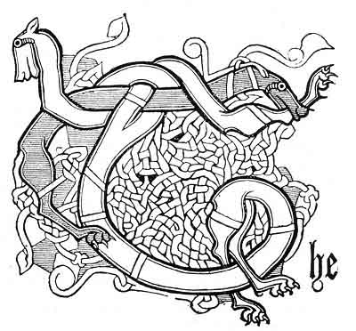

  
[Intangible Textual Heritage](../../../index)  [Legends &
Sagas](../../index)  [Celtic](../index)  [Index](index) 
[Previous](pt421)  [Next](pt423) 

------------------------------------------------------------------------

# CONCLUSION.

And now, in conclusion, let me recommend the study of Gaelic to Scotch
antiquaries. Their worthy president lately expressed a wish to be able
to knock up the dead, by the help of a table, to answer some vexed

p. 371

questions:--he could get nothing even from them without knowing the
language of his departed countrymen.

In the preceding pages, strange Gaelic witnesses dressed in vellum and
parchment and tattered brown paper, and some few in gay attire of green
and gold--queer characters, who live far up the stream of time--have
appeared to answer questions, and have told a great deal about the
Ossianic controversy. A good number of Lowlanders have been summoned
from the past, and have deponed, sometimes in very bad language, that
they knew of the Feinne, and thought them bad company, but Celtic gods.

A good number of Welsh and Breton witnesses have been called, and have
confirmed what the rest bad asserted. A few Icelanders, Norwegians,
Germans, and Frenchmen, a [Carthaginian](errata.htm#18), and some
Egyptians, Arabs, Persians, Indians, and Aryans, have said a few words.
A good many Highland hills, and a few Edinburgh porters, have said their
say; and the best sort of clairvoyance, as it seems to me, for my
lowland countrymen to aim at, is to clear their eyes from lowland
prejudice, and take a look at Gaelic, when they want to find out
something which happened before that language was driven into corners. A
large proportion of the names about Edinburgh are Gaelic; but no one
there will look so near home as the first Highland porter for an
explanation of their meaning. Men would rather go to Wales or Brittany
than look at home for anything British," [and](errata.htm#19) even Sir
Walter Scott, who wrote amongst a Gaelic population, made the strangest
of mistakes when he used Gaelic words.

As I have done my best to make peace between Celt and Celt, and Celt and
Saxon, I wished to end with a peaceful Gaelic quotation; but having
searched right

p. 372

through divers song books, I have utterly failed to discover one that
will suit. Bards are a pugnacious race. I can only say with Motherwell
and the Gaelic proverb--

"Gree, bairnies, gree."

"’S e deireadh gach cogaidh sith."  
The end of each strife is peace.

Even the strife and confusion of tails, which some ancient Gaelic artist
imagined and depicted centuries ago; even the "Ossianic controversy,"
and its confusion of tongues and arguments; "Mythology;" "West Highland
Tales;" even this lengthy postscript and its tail-piece--all have a
beginning, a middle, and

   
The

END.

 

------------------------------------------------------------------------

### Footnotes

[370:1](pt421.htm#fr_40) Transactions of the
Society of Antiquaries of Scotland, vol. iii., p. 249.

------------------------------------------------------------------------

[Next: Ossianic Ballads--References to Books, etc.](pt423)
