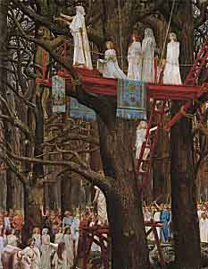

  
[Intangible Textual Heritage](../../../index.md)  [Legends and
Sagas](../../index)  [Celtic](../index.md) 

------------------------------------------------------------------------

<table width="75%">
<colgroup>
<col style="width: 50%" />
<col style="width: 50%" />
</colgroup>
<tbody>
<tr class="odd">
<td width="50%" data-valign="TOP"> 
</td>
<td width="50%" data-valign="TOP"><h1 id="the-religion-of-the-ancient-celts" data-align="CENTER">The Religion of the Ancient Celts</h1>
<h2 id="by-j.-a.-macculloch" data-align="CENTER">By J. A. MacCulloch</h2>
<h4 id="section" data-align="CENTER">[1911]</h4></td>
</tr>
</tbody>
</table>

------------------------------------------------------------------------

[Contents](#contents)    [Start Reading](rac00.md)

------------------------------------------------------------------------

|                                                                                                                           |
|---------------------------------------------------------------------------------------------------------------------------|
|  |

This book, which appears for the first time on the Internet at
Intangible Textual Heritage, is one of the best scholarly treatments of
the ancient Celtic religion. Written early in the 20th Century,
*Religion of the Ancient Celts* includes extensive treatment of that
perennially fascinating subject, the Druids.

There is very little documentary evidence to go on. In particular, we
have no actual sacred texts of the ancient Celts, as their texts were
transmitted orally only to initiates, and disappeared forever when the
last Druid died. Christianity became the dominant religion in the Celtic
area before the oral traditions could become written down, unlike the
Vedas in India. Ancient Celtic religious beliefs must therefore be
inferred from second-hand classical accounts, hints from Celtic
mythology, legend and folklore, as well as archaeological and
comparative anthropological evidence. MacCulloch marshals this body of
evidence, extensively footnoted, so that an authoritative and clear view
of ancient Celtic religion emerges.

MacCullough details the Celtic belief in reincarnation and a spectral
otherworld; documents the enormous pantheon of now-obscure gods and
goddesses, including many local deities; and describes totemistic and
animistic beliefs. In addition, MacCulloch does not flinch (nor
sensationalize) when describing the darker side of Celtic practices,
including the famous 'Burning Man' human sacrifices, cannibalism and
exogamous incest.

With so much spurious, flawed and poorly cited information floating
around on the Internet about Celtic beliefs, it is important to review
what is actually known about this subject. Hopefully putting this book
online will provide some balance.

--John Bruno Hare  
February 7th, 2004

------------------------------------------------------------------------

 [Title Page](rac00.md)  
[Preface](rac01.md)  
[Contents](rac02.md)  
[List Of Abbreviations](rac03.md)  
[Chapter I. Introductory](rac04.md)  
[Chapter II. The Celtic People](rac05.md)  
[Chapter III. The Gods of Gaul and the Continental Celts](rac06.md)  
[Chapter IV. The Irish Mythological Cycle](rac07.md)  
[Chapter V. The Tuatha Dé Danann](rac08.md)  
[Chapter VI. The Gods of the Brythons](rac09.md)  
[Chapter VII. The Cúchulainn Cycle](rac10.md)  
[Chapter VIII. The Fionn Saga](rac11.md)  
[Chapter IX. Gods and Men](rac12.md)  
[Chapter X. The Cult of the Dead](rac13.md)  
[Chapter XI. Primitive Nature Worship](rac14.md)  
[Chapter XII. River and Well Worship](rac15.md)  
[Chapter XIII. Tree and Plant Worship](rac16.md)  
[Chapter XIV. Animal Worship](rac17.md)  
[Chapter XV. Cosmogony](rac18.md)  
[Chapter XVI. Sacrifice, Prayer, and Divination](rac19.md)  
[Chapter XVII. Tabu.](rac20.md)  
[Chapter XVIII. Festivals.](rac21.md)  
[Chapter XIX. Accessories of Cult](rac22.md)  
[Chapter XX. The Druids](rac23.md)  
[Chapter XXI. Magic.](rac24.md)  
[Chapter XXII. The State of the Dead](rac25.md)  
[Chapter XXIII. Rebirth and Transmigration](rac26.md)  
[Chapter XXIV. Elysium](rac27.md)  
