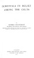

  
[Intangible Textual Heritage](../../../index)  [Legends and
Sagas](../../index)  [Celtic](../index)  [Index](index)  [Next](sbc01) 

------------------------------------------------------------------------

*Survivals in Belief Among the Celts*, by George Henderson, \[1911\], at
Intangible Textual Heritage

------------------------------------------------------------------------

p. i p. ii

SURVIVALS IN BELIEF AMONG

THE CELTS

p. iii

PUBLISHED BY

JAMES MACLEHOSE AND SONS, GLASGOW,

Publishers to the University.

MACMILLAN AND CO., LTD., LONDON.

|              |                                |
|--------------|--------------------------------|
| *New York,*  | *The Macmillan Co.*            |
| *Toronto,*   | *The Macmillan Co. of Canada.* |
| *London,*    | *Simpkin, Hamilton and Co.*    |
| *Cambridge,* | *Bowes and Bowes.*             |
| *Edinburgh,* | *Douglas and Foulis.*          |
| *Sydney,*    | *Angus and Robertson.*         |

\_\_\_\_\_  
MCMXI.

p. iv

# SURVIVALS IN BELIEF AMONG THE CELTS

###### BY

## GEORGE HENDERSON

###### B.LITT.(OXON.), PH.D.(VIENNA)

###### LECTURER IN CELTIC LANGUAGES AND LITERATURE, UNIVERSITY OF GLASGOW

###### AUTHOR OF "THE NORSE INFLUENCE ON CELTIC SCOTLAND"

#### GLASGOW

#### JAMES MACLEHOSE AND SONS

#### PUBLISHERS TO THE UNIVERSITY

#### \[1911\]

[  
Click to enlarge](img/spine.jpg)  
Front Cover and Spine  

[  
Click to enlarge](img/title.jpg)  
Title Page  

Scanned at Intangible Textual Heritage, January, 2007. Proofed and
formatted by John Bruno Hare. This text is in the public domain in the
United States because it was published prior to January 1st, 1923. These
files may be used for any non-commercial purpose provided this notice of
attribution is included in all copies.

------------------------------------------------------------------------

[Next: Preface](sbc01)
