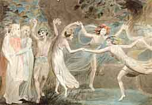

  
[Intangible Textual Heritage](../../../index.md)  [Legends &
Sagas](../../index)  [Celtic](../index.md) 

------------------------------------------------------------------------

<table width="75%">
<colgroup>
<col style="width: 50%" />
<col style="width: 50%" />
</colgroup>
<tbody>
<tr class="odd">
<td width="50%" data-valign="TOP"> 
</td>
<td width="50%" data-valign="TOP"><h1 id="the-secret-commonwealth" data-align="CENTER">The Secret Commonwealth</h1>
<h4 id="of-elves-fauns-and-fairies" data-align="CENTER">of Elves, Fauns and Fairies</h4>
<h2 id="by-robert-kirk-and-andrew-lang" data-align="CENTER">by Robert Kirk and Andrew Lang</h2>
<h4 id="section" data-align="CENTER">[1893]</h4></td>
</tr>
</tbody>
</table>

------------------------------------------------------------------------

[Contents](#contents)    [Start Reading](sce00.md)

------------------------------------------------------------------------

This is one of the most sought after and enigmatic texts about Celtic
fairies. Written by a Scottish clergyman, Robert Kirk, in 1691, and not
committed to print until the early 19th century, *The Secret
Commonwealth* is an unusually sympathetic account of the denizens of
fairyland, and a complex of still mysterious extrasensory phenomena
including poltergeists, clairvoyance and doppelgangers (here called
'co-walkers').

This version was issued in 1893 in a very limited edition by the
renowned folklorist Andrew Lang, and it includes a 'comment' and some
endnotes by Lang which are actually about as long as the Kirk material.
This book is very rare. I was extremely fortunate to acquire a copy of
the first (and to my knowledge, only) edition of this work when it came
up for sale at a local used bookstore. This copy is signed on the
flyleaf by Uma Jeffers, wife of the poet Robinson Jeffers, and bears
their bookmark, "The Hawk Tower, Tor House, Carmel-by-the-Sea".

The only version of Kirk recently in print was converted to modern
spelling, and it is unlikely that Lang's edition will be readily
available to scholars and other interested individuals, unless it is
reprinted. Therefore I have taken great pains to retain the spelling and
formatting of Lang's redaction of Kirk's text. I have departed from site
standards in this section and not merged cross-page hyphenated words. By
far the stickiest issue was Kirk's spelling, particularly the 'long' s,
which in Lang's book was indistinguishable from normal f. I have used
the ƒ character (&\#131;) throughout where I could infer the presence of
an 's'. In some rare cases I could not decide whether an 'f' or an 's'
was implied; these are noted in green italic type. (Annotations in Kirk
with square brackets are Lang's).

--John Bruno Hare, February 27th, 2004.

------------------------------------------------------------------------

[Title Page](sce00.md)  
[Dedication](sce01.md)  

### Introduction

[1. The History of the Book and Author](sce02.md)  
[II. The Secret Commonwealth](sce03.md)  
[The Subterranean Inhabitants](sce04.md)  
[IV. Fairyland and Hades](sce05.md)  
[V. Fairies and Psychical Research](sce06.md)  
[VI. Second Sight and Telepathy.](sce07.md)  
[Colophon](sce08.md)  

### The Secret Commonwealth

[Preamble](sce09.md)  
[Title Page](sce10.md)  
[Chapter 1. Of the Subterranean Inhabitants](sce11.md)  
[Chapter 2](sce12.md)  
[Chapter 3](sce13.md)  
[Chapter 4](sce14.md)  
[Chapter 5](sce15.md)  
[Chapter 6](sce16.md)  
[Chapter 7](sce17.md)  
[Chapter 8](sce18.md)  
[Chapter 9](sce19.md)  
[Chapter 10](sce20.md)  
[Chapter 11](sce21.md)  
[Chapter 12](sce22.md)  
[Chapter 13](sce23.md)  
[Chapter 14](sce24.md)  
[Chapter 15](sce25.md)  
[A Succint Accompt Of My Lord Tarbott's Relations](sce26.md)  
[Conclusions](sce27.md)  

 

[Note](sce28.md)  
[Notes](sce29.md)  
[Postscript](sce30.md)  
[Advertisements](sce31.md)  
