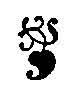
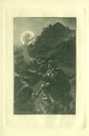
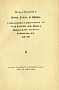
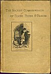
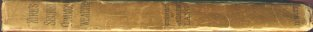
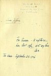

  
[Intangible Textual Heritage](../../../index.md)  [Legends &
Sagas](../../index)  [Celtic](../index)  [Index](index)  [Next](sce01.md) 

------------------------------------------------------------------------

p. i

Bibliotèque de Carabas

p. ii

Volume VIII

*Five hundred and fifty copies of this Edition have been printed, five
hundred of which are for sale.*

\[*All rights reserved*\]

p. iii

##### The Secret Commonwealth of

# Elves, Fauns & Fairies

##### A Study in Folk-Lore & Psychical Research. The

##### Text by Robert Kirk, M.A., Minister of

##### Aberfoyle, A.D. 1691. The Comment

##### by Andrew Lang, M.A.

##### A.D. 1893

 

#### LONDON. M.D.CCCXCIII. PUBLISHED BY DAVID NUTT, IN THE STRAND

###### Scanned at Intangible Textual Heritage, February, 2004. John Bruno Hare, redactor. This text is in the public domain. These files may be used for any non-commercial purpose, provided this notice of attribution is left intact.

[  
Click to enlarge](img/front.jpg.md)  
Frontispiece  

[  
Click to enlarge](img/title.jpg.md)  
Title Page  

[  
Click to enlarge](img/fcover.jpg.md)  
Front Cover  

[  
Click to enlarge](img/spine.jpg.md)  
Spine  

[  
Click to enlarge](img/flyleaf.jpg.md)  
Inner front cover with inscriptions  

------------------------------------------------------------------------

[Next: Dedication](sce01.md)
