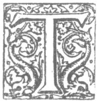

  
[Intangible Textual Heritage](../../../index.md)  [Legends &
Sagas](../../index)  [Celtic](../index)  [Index](index.md) 
[Previous](sce10)  [Next](sce12.md) 

------------------------------------------------------------------------

p. 5

## CHAPTER I.

### OF THE SUBTERRANEAN INHABITANTS.

|                    |
|--------------------|
|  |

HESE *Siths*, or FAIRIES, they call *Sleagh Maith*, or the Good People,
it would ƒeem, to prevent the Dint of their ill Attempts, (for the Iriƒh
uƒe to bleƒs all they fear Harme of;) and are ƒaid to be of a midle
Nature betuixt Man and Angel, as were Dæmons thought to be of old; of
intelligent fluidious (?) Spirits, and light changable Bodies, (lyke
thoƒe called Aƒtral,) ƒomewhat of the Nature of a condenƒed Cloud, and
beƒt ƒeen in Twilight. Thes Bodies be ƒo plyable thorough the Subtilty
of the Spirits that agitate them, that they can make them appear or
diƒappear att Pleaƒure. Some have Bodies or Vehicles ƒo ƒpungious, thin,
and delecat (?), that they are ƒed by only ƒucking into ƒome fine
ƒpirituous Liquors, that peirce lyke

pure

p. 6

pure Air and Oyl: others ƒeid more groƒs on the Foyƒon or ƒubƒtance of
Corns and Liquors, or Corne it ƒelfe that grows on the Surface of the
Earth, which theƒe Fairies ƒteall away, partly inviƒible, partly preying
on the Grain, as do Crowes and Mice; wherefore in this ƒame Age, they
are ƒome times heard to bake Bread, ƒtrike Hammers, and do ƒuch lyke
Services within the little Hillocks they moƒt haunt: ƒome whereof of
old, before the Goƒpell diƒpelled Paganiƒm, and in ƒome barbarous Places
as yet, enter Houƒes after all are at reƒt, and ƒet the Kitchens in
order, cleanƒing all the Veƒƒels. Such Drags goe under the name of
Brownies. When we have plenty, they have Scarcity at their Homes; and on
the contrarie (for they are empowred to catch as much Prey everywhere as
they pleaƒe,) there Robberies notwithƒtanding oft tymes occaƒƒion great
Rickes of Corne not to bleed ƒo weill, (as they call it,) or prove ƒo
copious by verie farr as wes expected by the Owner.

THERE Bodies of congealled Air are ƒome tymes caried aloft, other whiles
grovell in different Schapes, and enter into any Cranie or Clift

of

p. 7

of the Earth where Air enters, to their ordinary Dwellings; the Earth
being full of Cavities and Cells, and there being no Place nor Creature
but is ƒuppoƒed to have other Animals (greater or leƒƒer) living in or
upon it as Inhabitants; and no ƒuch thing as a pure Wilderneƒs in the
whole Univerƒe.

------------------------------------------------------------------------

[Next: Chapter 2](sce12.md)
