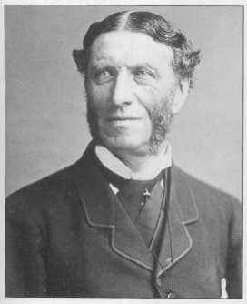

  
[Intangible Textual Heritage](../../../index)  [Sagas and
Legends](../../index)  [Celtic](../index) 

------------------------------------------------------------------------

<table width="75%">
<colgroup>
<col style="width: 50%" />
<col style="width: 50%" />
</colgroup>
<tbody>
<tr class="odd">
<td width="50%" data-valign="TOP"> 
</td>
<td width="50%" data-valign="TOP"><h1 id="on-the-study-of-celtic-literature" data-align="CENTER">On the Study of Celtic Literature</h1>
<h2 id="by-matthew-arnold" data-align="CENTER">By Matthew Arnold</h2>
<h4 id="section" data-align="CENTER">[1867]</h4></td>
</tr>
</tbody>
</table>

------------------------------------------------------------------------

[Title Page](scl00)  
[Introduction](scl01)  
[Preface](scl02)  
[Part I](scl03)  
[Part II](scl04)  
[Part III](scl05)  
[Part IV](scl06)  
[Part V](scl07)  
[Part VI](scl08)  
