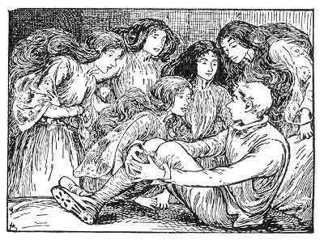

  
[Intangible Textual Heritage](../../../index)  [Legends and
Sagas](../../index)  [Celtic](../index) 

------------------------------------------------------------------------

[Buy this Book at
Amazon.com](https://www.amazon.com/exec/obidos/ASIN/B0026FCJ10/internetsacredte)

------------------------------------------------------------------------

<table width="75%">
<colgroup>
<col style="width: 50%" />
<col style="width: 50%" />
</colgroup>
<tbody>
<tr class="odd">
<td width="50%" data-valign="TOP"> 
"Put your question," said the green maidens (p. 266)</td>
<td width="50%" data-valign="CENTER"><h1 id="scottish-fairy-and-folk-tales" data-align="CENTER">Scottish Fairy and Folk Tales</h1>
<h2 id="by-sir-george-douglas" data-align="CENTER">by Sir George Douglas</h2>
<h4 id="section" data-align="CENTER">[1901]</h4></td>
</tr>
</tbody>
</table>

------------------------------------------------------------------------

[Contents](#contents)    [Start Reading](sfft00)    [Page
Index](pageidx)    [Text \[Zipped\]](sfft.txt.gz)

------------------------------------------------------------------------

|                                                                                                                           |
|---------------------------------------------------------------------------------------------------------------------------|
|  |

This is a collection of Scottish folklore which will appeal to all ages.
There are animal tales, stories of the fairies of Scotland including
Brownies, Bogles, Kelpies, Mermaids and others, and tales of Witches and
of Giants. While many of the themes are similar to other European
folk-tales, this collection emphasizes specifically Scottish aspects of
the stories.

------------------------------------------------------------------------

 [Title Page](sfft00)  
[Contents](sfft01)  
[Introduction](sfft02)  
[The Three Green Men of Glen Nevis.](sfft03)  

### Nursery Stories

[The Story of the White Pet](sfft04)  
[The Milk-White Doo.](sfft05)  
[The Croodin Doo](sfft06)  
[The Cattie Sits in the Kiln-Ring Spinning](sfft07)  
[Marriage of Robin Redbreast and the Wren](sfft08)  
[The Tempted Lady](sfft09)  
[The Fause Knight and the Wee Boy](sfft10)  
[The Strange Visitor](sfft11)  
[Rashin-coatie](sfft12)  

### Stories of Animals

[The Fox Outwitted](sfft13)  
[The Fox Troubled With Fleas](sfft14)  
[The Fox and the Bag-Pipes](sfft15)  
[The Fox's Stratagem](sfft16)  
[The Fox and the Wrens](sfft17)  
[The Fox and the Cock](sfft18)  
[How the Wolf Lost His Tail](sfft19)  
[Frog and Crow](sfft20)  
[The Grouse Cock and His Wife](sfft21)  
[The Eagle and the Wren](sfft22)  
[The Wren's Presumption](sfft23)  
[The Two Foxes](sfft24)  
[The Bee and the Mouse](sfft25)  
[The Two Mice](sfft26)  
[Alexander Jones](sfft27)  

### Fairy Tales

[The Fairies of Scotland](sfft28)  
[The Fairy and the Miller's Wife](sfft29)  
[Sir Godfrey Macculloch](sfft30)  
[The Laird O' Co'](sfft31)  
[Habitrot](sfft32)  
[The Tulman](sfft33)  
[The Isle Of Pabaidh](sfft34)  
[Sanntraigh](sfft35)  
[Water Fairies](sfft36)  
[Fairy Transportation](sfft37)  
[The Poor Man of Peatlaw](sfft38)  
[The Fairy Boy of Leith](sfft39)  
[Mind the Crooked Finger](sfft40)  
[The Two Young Ploughmen](sfft41)  
[The Smith and the Fairies](sfft42)  
[The Lothian Farmer's Wife](sfft43)  
[Redemption From Fairy Land](sfft44)  
[The Fairy and the Bible-Reader](sfft45)  
[Thom and Willie](sfft46)  
[The Gloaming Bucht](sfft47)  
[The Fairy's Song](sfft48)  
[The Faithful Purse-Bearer](sfft49)  

### The Brownie, The Bogle, The Kelpy, Mermen, Demons

[The Scottish Brownie](sfft50)  
[The Brownie Of Bodsbeck](sfft51)  
[The Brownie And The Thievish Maids](sfft52)  
[The Bogle](sfft53)  
[The Doomed Rider](sfft54)  
[Graham Of Morphie](sfft55)  
[The Fisherman and the Merman](sfft56)  
[The Mermaid Wife](sfft57)  
[The Seal-Catcher's Adventure](sfft58)  
[The Mermaid Of Knockdolion](sfft59)  
[The Young Laird Of Lorntie](sfft60)  
[Nuckelavee](sfft61)  
[The Two Shepherds](sfft62)  
[Fatlips](sfft63)  
[The Silly Mutton](sfft64)  

### Witchcraft

[Macgillichallum of Razay](sfft65)  
[The Witch Of Laggan](sfft66)  
[The Blacksmith's Wife of Yarrowfoot](sfft67)  
[The Miller of Holdean](sfft68)  
[Ronaldson of Bowden](sfft69)  
[The Farmer's Wife Of Deloraine](sfft70)  
[Laird Harry Gilles](sfft71)  
[The Missing Web](sfft72)  
[The Witches Of Delnabo](sfft73)  
[The Brazen Brogues](sfft74)  

### Comic Tales

[The Wee Bunnock](sfft75)  
[The Tale of The Shifty Lad, The Widow's Son](sfft76)  
[Lothian Tom](sfft77)  
[The Ploughman's Glory; Or, Tom's Song.](sfft78)  
[The Witty Exploits of Mr. George Buchanan, the King's Fool](sfft79)  

### Literary Tales

[The Haunted Ships](sfft80)  
[Elphin Irving](sfft81)  
[Cousin Mattie](sfft82)  
[Rat Hall](sfft83)  
