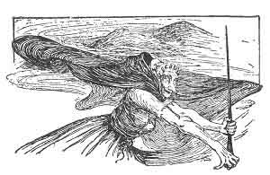
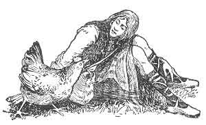
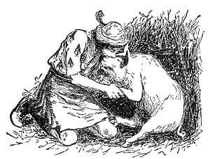
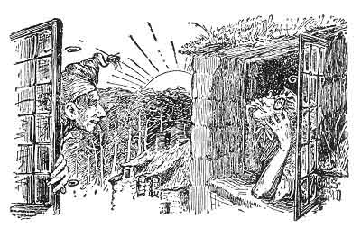
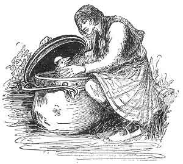
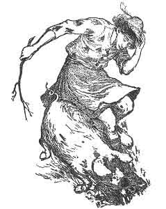
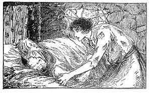
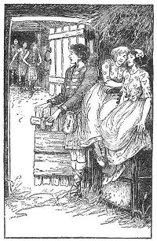
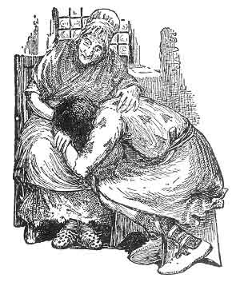

  
[Intangible Textual Heritage](../../../index)  [Legends and
Sagas](../../index)  [Celtic](../index)  [Index](index) 
[Previous](sfft02)  [Next](sfft04) 

------------------------------------------------------------------------

[Buy this Book at
Amazon.com](https://www.amazon.com/exec/obidos/ASIN/B0026FCJ10/internetsacredte)

------------------------------------------------------------------------

  
*Scottish Fairy and Folk Tales*, by George Douglas, \[1901\], at
Intangible Textual Heritage

------------------------------------------------------------------------

p. 34

 

   
Donald, Dougald and Duncan starting out to seek their fortune.--Page
[35](#page_35),  
*Scottish Fairy Tales*.

 

p. 35

 

# THE THREE GREEN MEN OF GLEN NEVIS.

### PART I.

"WELL, it is not the least use talking about it; there is not more than
one loaf of bread in the house or one bawbee in the stocking," said the
widow of Rannoch to her three sons, Donald, Dougald, and Duncan. "So go,
each of you, and seek a fortune; and if a fortune you get, don't forget
your old mother, for she's tried to do her best by you for many a long
day."

And Donald, Dougald, and Duncan all agreed that she spoke the truth, and
that the best thing they could do for her now was to go at once,
returning as soon as good fortune would let them.

So the widow of Rannoch divided the loaf into

p. 36

four portions and gave a bit to each, putting it in their wallets, and
keeping one bit for herself. Then she gave them her blessing, and off
they started.

Now, they set their faces towards the west, where lay the great ocean.
Perchance they would get a passage there in a ship to the south, where
the bright gold lay for the gathering, and that would be much better
than making for the east, where every one was as poor as themselves,
they knew already, only too well.

Over the moor they trudged, and Donald sang a song to cheer Dougald and
Duncan; and, when he was tired, Dougald told a story to while away the
time for Donald and Duncan. When his story came to an end, Duncan was
just going to show them some other kind of diversion, when he stopped,
seized both of his brothers by the arms, and, pushing them before him
into a peat-hole, bade them for their life's sake bide among the high
hags at its side, and not utter a syllable, or make the slightest sound.
"For," said he, "I see the witch of Ben e Bhreac coming in the distance
towards us."

And, sure enough, there she was, coursing over the moor in a direct line
with them, waving her magic staff. As she strode over the pools, the
water splashed upwards in brown foam before her; as she clambered over
the peat-hags, the divots and turves flew away on every side; as she
swept along the dry path, the dust in clouds whirled behind her like an
attendant spirit.

So she passed by them, without a thought of human creatures being so
near to her; for, you may be sure,

p. 37

they lay very close and still, and did not move till the last trace of
her vanished behind the slopes of the Black Mountains.

"Now is our chance," said Duncan, the youngest, to his two brothers.
"The old bird has gone on a journey; let us harry her nest."

"Oh! but that would be stealing!" said Donald.

"Stealing?" said Duncan; "stealing the stolen. How do you know we won't
find some of our own goods there? At any rate, if they are not ours,
they are not hers, whoever it is they belong to." So, as Duncan was the
clever one of the family, and never was contradicted, although the
youngest, there was no more to be said about the matter, and off they
started for Ben e Bhreac.

It did not take them long to arrive at the summit where the witch's home
was, and where her well can be seen to this day, for they were anxious
to get through the business as soon as possible before the, good lady
should return, and they were brave lads and had stout hearts for a stiff
brae, and fear gave them an extra toe to each foot, as the saying is.

Up at the bothie they found all quiet, and they judged the witch had
gone for a long journey, for the door was fast locked, and no smoke was
to be seen coming out of the chimney.

Yet, in a very short time they made an entrance, by taking off the
divots from the roof, and getting in that way; but they were
disappointed at seeing very little of value inside. Certainly the witch,
if she had any valuables, did not keep them in that house,

p. 38

"Now, we must have a good look round outside," said Duncan; "but before
we do so, just let me prepare for the accident of her sudden return. I
know a trick that will checkmate the hag even if she does. Only you do
as I say, and all will be well."

As usual the other two agreed, for they never ventured to contradict
Duncan, as I told you before, but believed in his genius implicitly.

"Donald, you go up and keep a good lookout, up the stack to the
north-east, and give an alarm if you see anybody coming. Dougald, you
turn your face towards the south-west and do the same." So they went
out, and did as they were told.

Now, the hag's bothie was built over a well, and the way to it--was
through the floor of the bothie by means of a trap-door set on iron
hinges; seeing which, Duncan loosened the hinges with his dirk, till he
felt sure a little added weight would send trap and all into the water
below. Then he put the hag's chair on the top of the trap, tying a stout
cord to the leg of it, and one end of this he flung over the iron girdle
standing in the corner. Next, pulling the table up towards the chair, he
furnished the board with a large aschet and a couple of knives, just as
if a feast had been laid by her imps against the return of their
mistress. Then he collected a dozen large stones, and set them up by the
wall, to be handy if occasion required.

Well, scarcely had he finished all these arrangements, when a cry from
Dougald gave the alarm that the hag was returning full speed from the
direction

p. 39

of the Black Mountains; and, looking in that direction, the three
brothers saw her, sure enough, coursing over the waste in a direct line
with her home, waving her magic staff. As she strode past the pools, the
water splashed upwards in brown foam before her; as she clambered over
the peat-hags, the divots and turves flew away on every side; as she
swept along the dry paths, the dust in clouds whirled behind her like an
attendant spirit.

"Quick!" said Duncan. "Get in through the bole in the roof; sit down
both of you on the big aschet on the board; garnish your heads with
kale, shut your eyes, and don't move or say a word, and all will be
well."

So Donald and Dougald did as he told them. They crept in through the
hole in the roof, and got up on the table, and, sitting down on the big
aschet, they decorated their heads with kale and shut their eyes. And
Duncan hid behind the large girdle in the corner, holding the cord light
in his hand.

Thus they waited in silence for what was going to happen.

They had not to wait long, for the witch was soon at the door, which
sprang open at the touch of her staff, and disclosed the horrid hag
entering with upturned and snorting nose, for she had smelt food a long
way off, and could not make out whence came the scent.

"Ha, ha!" she muttered in delight. "By my troth, my imps have provided a
fair feast for me in my absence. 'Tis capital!" and she flung her magic

p. 40

crutch into the corner, took up the knife and fork, and sat down on the
chair at the end of the table, ready to enjoy her gruesome supper.

But the supper was not for her this time. Just as she was in the act of
sitting down, Duncan pulled the cord with a mighty tug, and the chair
flew away from under the witch, so that she came down with a mighty
crash on the trap-door, which, giving way, suddenly precipitated her
backwards into the bubbling water below!

"Now for it!" said Duncan; and the brothers, leaping down from the
table, seized the large stones that Duncan had placed in readiness along
the wall, and flung them down with all their force on to the top of the
old hag below. When these were all done, they turned the table over the
hole, and heaped on it everything they could lay their hands on. Nothing
that they could lift and move came amiss. Then they sat themselves
exhausted on the top of the pile to rest and wipe their faces, for it
had been a desperate hard job.

"No, you don't," said Duncan, leaping down as he saw the magic staff
creeping and crawling like a snake towards the door. But the crutch was
too sharp for him, and wriggled under the door, and, gliding off, was
soon lost among the heather and fern that surrounded the summit of Ben e
Bhreac.

Now, there had been no sound or disturbance from the well for some time,
so they concluded that the old hag was safely settled once and for all
this time, and Duncan gave it as his opinion that they might now

p. 41

go and have a leisurely look round about the place to see if there was
anything worth carrying off.

So Donald searched about the summit to the north, Dougald to the south,
and Duncan to the east. There was no use at all in going towards the
west, for a precipice went straight down on that side, and it would have
been waste of time to have done so.

To the north, where Donald went, was what one might call the garden, if
such a collection of weeds might be given that name. There Donald went
up and down, up and down, yet nothing of the slightest value to himself
or any one else did he see, and he felt disgusted at taking all this
trouble for nothing.

Well, he was just going to give up the search in despair, when he espied
a very handsome flower growing beside a rock at the further end, and
thought he would go and have a look at it before telling his brothers of
his unprofitable search. And the plant was a really pretty one. It had a
splendid yellow flower like a great gowan growing on the top of a stout
stalk which sprang from a bunch of large green leaves below. He
certainly never had seen the like before, and he stood there admiring it
very much.

"I wonder what sort of plant this can be?" said Donald.

"Oh, I'm a Thunder-plant," said the flower.

"A what?" said Donald.

"A Thunder-plant," said the flower again.

"Indeed; and what sort of kind can that be?" said Donald.

p. 42

"Just smell me, and you will soon see," said the flower.

Well, Donald was curious to know what sort of plant a Thunder-flower
could be, so he leaned down and gave a truly good sniff in the very
centre of the petals.

   
HE LEANED DOWN.

BANG! There was a startling report, and the echoes of it rolled and
rolled round the mountains, and Donald fell flat on his back with
astonishment and alarm.

"Well, we live and learn something new every day, certainly," said
Donald as he got up rubbing his legs and elbows. "I'm not sure but that
you would be a

p. 43

good companion in a pinch, if you could always do that when you were
asked."

"I don't object to going with you as a companion," said the flower. "Dig
me up carefully, and put me in your wallet. I may be of some use to you
on the way."

So Donald dug the Thunder-plant up carefully with his knife and put it
in his wallet. "At any rate I shall not go home empty. A plant is better
than nothing," quoth he; "though of what use a Thunder-plant may be to
me I assuredly do not know at present."

"Time will show that," said the Thunder-plant.

"Ay will it," said Donald.

In the meantime Dougald, the second brother, had gone to seek for
treasure on the south side of the bothy. Here at first he sought most
carefully, but could discover nothing of even the smallest value, and,
like Donald, getting tired of seeking, he was almost giving up the hunt
in despair, when he heard, or thought he heard, a strange, weird
chuckle, like laughter, proceed from behind a heap of rank grass in the
shade of the wall. Examining more closely, he discovered the cause of
the noise in a queer-looking gray hen, seated amongst the rubbish. She
had a bright red comb and a yellow beak, and from her eyes came such a
strange look, unusual in an ordinary fowl, as she fixed them upon the
stranger, that Dougald at once understood the bird was something
decidedly out of the common.

"Dear me," said Dougald, "what sort of fowl are you?"

p. 44

"A Thunder-fowl," said the bird.

"What?" said Dougald.

"I believe I answered loud enough," remarked the bird; "*A
Thunder-fowl*."

"Oh, I beg your pardon!" said Dougald; "you did so, but my good mother
has kept poultry for many a long year at home, and I have never seen the
sort before, and that astonished me."

"Put the coop over my head, and leave me in the dark for a short space.
Then take it off suddenly, and you will soon find out all about it,"
said she.

Well, Dougald did not like to refuse so civil-spoken a request,
especially as it was owing to his curiosity the bird suggested the
proceeding.

So he put the coop over her head, and counted maybe twenty, and then
lifted the coop off again.

To say that he was astonished at the terrific crow the fowl emitted is
not an adequate expression: he was startled out of his wits. No thunder
could produce so mighty a report, or echoes more loud among the
mountains, than the sound which came up under his nose when once more
the light shone upon the red hackles of the Thunder-fowl, and Dougald
fell flat on his back with astonishment and alarm.

"What do you think of that?" said the fowl.

"You don't belie your name," said Dougald, getting up and rubbing his
legs and elbows. "Don't do that again without giving me warning. Still,
you would not be a bad companion at a pinch, if you could trumpet like
that whenever you were asked."

p. 45

"Well, take me with you as a comrade," said the fowl. "It's cold enough
and lonely enough living up here, anyway."

"I can carry you in my wallet, if you don't mind," said Dougald.

"Capital," said the fowl; "only, don't cover my head, or you may be
startled when you least expect it."

   
"WHAT DO YOU THINK OF THAT?" SAID THE FOWL.

So Dougald put the Thunder-fowl in his wallet, and her head looked out
through a hole in the top, and, quite pleased with his discovery, he
went to seek his brothers.

Now, as for Duncan, the youngest brother, he went as was arranged to the
east side of the mountain, to see what he could find in the way of a
treasure, and, like the others, it was not long before he got dead tired
of searching. There was nothing to be seen but an enclosure of stones in
which were a few

p. 46

unpleasant nettles growing, and a pile of sticks set up on end in the
corner for fuel. He kicked up some of the nettles, to see if anything
was hidden among them, and stamped on the ground in all directions, to
hear if it sounded hollow underneath, but nothing did he gain by either
performance, and, getting cross, for he did not care to be defeated in
anything he undertook, as a last resource before giving it up as a bad
job, he poked a long stake into the heap of sticks and rattled it up and
down in a very vicious manner.

Certes, but he was astonished, when from under the fagots arose a pink,
fresh-coloured pig, with beady eyes and a snout as black as ebony.

"You must find it a bit cold living upon this hilltop with so miserable
a shelter as these sticks," said Duncan.

"I'm not a common-bred pig," said the brute.

"Would it be rude to ask what breed you are?" said Duncan.

"Not at all," replied the pig. "I'm a Thunder-pig, at your service."

"What sort of breed is that?" said Duncan.

"If you want to know, just kiss me once between the eyes; it will save a
lot of explanation."

Now, Duncan was not accustomed to kiss swine between the eyes, or
anywhere else, for the matter of that, but he thought he had better not
decline, as it was his fault that the pig had been disturbed, and one
never knows what may be got by being civil to anything, man or beast,
and the pig looked clean as pigs go.

p. 47

So he kissed the pig between the eyes.

The next moment Duncan felt himself flat on the ground, for such a grunt
came from the porker that he fell over backwards from alarm and
astonishment at the terrific explosion. And the mountain-tops so long
resounded with the report, that you would think the echoes were never
going to cease talking about it to one another.

   
HE KISSED THE PIG.

"It's lucky you don't produce lightning as well," said Duncan, getting
up with a wry face and bruised elbows. "I would rather have you for a
friend than a foe any day."

"I am quite willing to be the first," said the pig.

"For myself, I don't mind if I go with you as a companion; I am rather
sick of the life up here."

p. 48

"I, too, shall be glad of your company, and that's a bargain," said
Duncan; "and now, let me introduce you to my brothers whom I see coming
towards us."

So the three brothers met and told their discoveries, and introduced
each to the other his new companion; then having nothing more to do at
the summit, they descended to the glen below.

Even to this day there is more thunder round Ben e Bhreac than any of
the mountains in the neighbourhood, and when storms are at their loudest
round its crags, "Hark," say the good wives of Rannoch; "'Tis the witch
of Ben e Bhreac working with her thunder servants." And the mountain is
avoided to this day.

So, towards the west these three brothers, with their new friends,
travelled all that afternoon; and just as they arrived at the head of
Glen Nevis, the sun set. So they rested for the night under the shadow
of Bennein Beg, since not for all the world would they have ventured to
pass through that glen after nightfall fox fear of the three green men
who inhabited it, and who were reported savage and fierce to all
travellers.

### PART II.

IT was very early the next morning that the three brothers arose, for
Dougald had put the Thunder-fowl under his plaid when they went to
sleep, quite forgetting what would happen if he took it off suddenly

p. 49

in the morning sunshine. This very thing really occurred quite
unexpectedly at sunrise, for the wind blowing up the valley flung a
corner of the plaid aside, and a beam of light glancing on the red comb
of the bird made that creature crow as only it of feathered creatures
could crow.

The mountains rattled with the report, and the three brothers awoke with
a jump. The folk dwelling in the neighbourhood put their heads out of
their

   
THE FOLK PUT THEIR HEADS OUT OF THEIR WINDOWS.

bothy windows, and said to one another, "Ha! thunder in a clear sky;
strange!" and a good many things, both man and beast, awoke that morning
earlier than their usual.

But our heroes knew better by this time what it was; and so they arose,
and slung their wallets over their backs, and, with the Thunder-pig
trotting beside Duncan, they proceeded on their way.

p. 50

But not far had they travelled before the bothy of the first green man
met their view rising beside the pathway. A queer building it
looked-circular, flat-topped, and without windows; for Trolls and such
like can bear but little light. Nothing, in fact, broke the plain
appearance of the building but a small, low door, formed of three slabs
of stone, one at each side, and one for the lintel, and that not even
high enough for the evil creature to creep through without stooping.

"Now," said Duncan to Donald, "you go and try your luck with the first
green man, while Dougald and I wait here. When you give us a call, or
require assistance, we shall be at hand."

Donald did not dispute the matter with Duncan, for, though the youngest,
he was the cleverest. But I told you that before.

So, taking up his wallet, which contained the Thunder-plant, he went to
the bothy of the green man and gave a good rap at the door.

"There is nobody at home," said the Troll within; "go away."

"But it is just that nobody I want to see," said Donald, and he gave the
door a kick and crept in.

There he saw an ugly Troll, squatting by a turf fire, and that Troll had
green eyes and a green plaid mantle cast over his shoulders, and green
hair twisted in plaits hung down behind.

"That's a very vulgar trick to play in another man's house," said the
Troll; "what is your business?"

 

  [  
Click to enlarge](img/05000.jpg)  
"I am come about a situation," said Donald; "perhaps you may want a
servant,"--Page [51](#page_51).  
*Scottish Fairy Tales*.

 

p. 51

Oh! I am come about a situation: perhaps you may want a servant," said
Donald.

"No, no, go away," said the Troll; "I have enough to do to find room for
myself."

"But just listen," said Donald; "I am a first-rate gardener, and could
put your kale-patch in order in a jiffy. It is desperate untidy, and I
am sure it wants tidying badly."

"Oh! very well, then, go and dig your fill in the garden," said the
Troll, with more urbanity than Donald expected; "go along and dig, go
along and delve." The fact was, the Troll was much upset in his mind
that morning, and he felt too sick to go on arguing, having heard
thunder (which, you know, is fatal to Trolls), and he wanted to get rid
of the intruder at any price. He also considered that, as soon as Donald
was the other side of the door, he would be able to bolt it within, and
if Donald got in again after that, well then, the Troll would be much
surprised indeed.

As soon as Donald got outside the door, he looked round carefully and
quickly, and, when he was sure the Troll was not looking, he swiftly
planted the Thunder-plant in the centre of the kale-patch between the
bothy and the road.

In an instant the Thunder-plant raised its stalk and spread its leaves
around, while the blossom at the top unfurled itself like a gigantic
gowan.

"Oh, do come out, do come out, dear master, and see the lovely flower
that has grown in your kale-patch?" said Donald.

p. 52

"Not if I know it," thought the Troll, and he sat silent. But Donald
continuing to call out the same thing, the Troll thought he might just
as well have a look and see what really was going on. So he peeped
through a crack in the side of the door.

And astonished he was at the size and beauty of the plant. He could not
make out for the life of him how the plant got there; he had not seen it
before. Then he thought this must be inquired into, for Trolls, of all
creatures, are the most curious, and, knowing nothing, want to
understand everything.

So the Troll forgot all about the thunderstorm, and opened the door,
putting his ugly head through the aperture.

"What's the use of that plant?" said the Troll.

"Oh! it has the most lovely smell you ever smelt in the world for one
thing," said Donald. "Come out and smell it."

"Smell it yourself," said the Troll.

"I have already done so," said Donald, "and was--oh, so astonished!"
Which was anything but a story on his part, you, will readily admit.

"Bring the plant here," said the Troll; "for I won't come out for you or
any plant."

"Oh, then," said Donald, "I shall carry it down the glen somewhere else,
if you don't think it worth coming out even to smell it."

Now to think anything of his was being carried off made the Troll very
angry; also he was seized with a desire to smell the plant, so he
persuaded himself there was no danger in going out just this little

p. 53

way. Throwing open the door, he crawled out, waddled up to the
Thunder-plant, and took a good long sniff with his ugly snout.

*Bang*! and you know what happened then.

But the Troll, thinking that the thunder was bursting under his very
nose, as in truth it was, fled helter-skelter back to his bothy so
swiftly, that, forgetting to bob his head on entering the low doorway,
he dashed his brains out on the lintel and fell dead on the threshold,
and that was the end of him.

Then Donald cried out to his brothers, and they came running up, and
these three together ransacked the bothy, finding, as they expected,
gems and jewels, silver and gold, hidden in the four corners, besides a
lump of fiery-coloured crystal above price, stowed away below the
hearthstone.

"Now, Donald, do you stay here," said Duncan. "Keep what you have fairly
earned, while I and Dougald go a bit further on and try our luck with
the other two green men of the glen."

So Donald stopped behind and waved a farewell to his two brothers as
they went down the valley under the shade of Ben Nevis.

And it was not long before they saw a round tower like the first, built
in the middle of the glen close to the roadside.

"That's the bothy of the second green man," said Duncan. "Go you,
Dougald, and try your luck. I will wait for you here with the
Thunder-pig till I hear you call out."

p. 54

So off Dougald went with the Thunder-fowl looking out of his wallet.

"Is any one within?" said Dougald, rapping with his stick at the little,
low door.

"No," said a harsh voice, which he knew was the Troll's; "go about your
business."

"A word with you first," said Dougald.

"That word will be your last, then," said the Troll, "if you don't move
on."

"Flatly, I won't move on," said Dougald; "I must and will speak to you!"

"In the name of all that's ugly, tell your business, then!" said the
Troll, opening the door and showing his hideous green face to Dougald.

"Well," said Dougald, "I am a master cook, and cook broth out of
nothing; and I am on the lookout for a situation."

Now the Troll considered for a moment. He had not had a good meal for a
day or two, owing to the thundery weather, especially to the violent
reports heard both yesterday and that very morning, and being unable to
go out and procure food, and feeling really very hungry, the thought of
broth made his chops water. "Besides," said he, "what need have I to be
afraid of this intruder? If he fails in his cooking me the broth, it
won't take long to destroy him and stew him into broth instead."

So he said aloud, "Broth, indeed! Well, cook it and serve it; but if you
fail, and it proves not savoury to my taste, cook or no cook, off goes
your head in a trice," and he scraped and scrubbed a long dirk

p. 55

on the threshold to sharpen it and to give point to his words.

"Oh! you'll find it savoury enough to last for a long time," said
Dougald. "Give me that kale-pot with the cover on it that I see lying
behind the door."

So the Troll gave him the kale-pot with the cover

   
PUT THE FOWL INTO IT INSTEAD.

on, and Dougald carried it outside, as if to fill it with water at the
burn. But when he was below the bank, out of sight of the Troll, he
deftly put the Thunder-fowl into it instead, and shut down the lid.

Then he brought the pot back again to the bothy, and placed it on the
ground before the Troll.

"Now take yon spoon up," said Dougald; "wait

p. 56

till I count twenty, then lift up the lid and see what sort of broth I
can cook. Take my word for it, my friend, you will never want to taste
any other after that."

"Oon, da, tre, cahir," counted Dougald, and scarcely had he got to the
word "fichead" when the impatient Troll flung aside the lid, and,
plunging the iron spoon into the pot, stirred up the Thunder-fowl that
was sitting quietly at the bottom.

And the light from the chimney above smote suddenly on the red comb of
the Thunder-fowl, and she gave such a crow that the walls of the bothy
shook as if it were stricken with a thunderbolt.

Then up leaped the Troll, and fled shrieking with dismay towards the
door, for he thought the fire had come through the roof; but so full of
terror was he, that he quite forgot to bob his head, and so, dashing out
his brains on the lintel, he lay dead and still on the threshold, and
that was the end of him.

Then Dougald called out to his brother Duncan, who was keeping watch as
he had promised, a short way up the road, and Duncan and the Thunder-pig
came up to his call as quick as they could.

Indeed, it was not long before they had unearthed the Troll's
treasure--gems and jewels, silver and gold, hidden in the four corners
of the bothy, and a large slab of golden topaz, worth a king's ransom,
stowed away under the hearthstone.

"Now," said Duncan, "you stop here and look after your possessions,
while I go to the end of the glen with the Thunder-pig. Wait for me here
till I

p. 57

return--I hope with treasure,--then we will pick up Donald and go home
together."

So Dougald remained in possession of the second

   
DUNCAN AND THE THUNDER-PIG CAME AS QUICKLY AS THEY COULD.

green man's bothy, and Duncan and the Thunder-pig went on alone down the
glen towards the sea.

Just as he had expected, on emerging from the glen, he saw, on the
right-hand side of the road, a

p. 58

bothy exactly like the last, enclosed within a dyke of loose stones.
There was no sign of life about it, and it looked so particularly
forbidding, that Duncan determined to have a good look round, and
inspect the place from every side, before he knocked at the door.

Getting over the dyke he crept quietly round the back of the bothy, and
there, on a level with his head, he saw a window, just big enough to
crawl in or out of, filled with wattles twisted up and across like bars.

"This will be of some use, I feel sure," said Duncan; and he then asked
the Thunder-pig to be so good as to lie down under the window and to
wait till he called.

Oh! the Thunder-pig was quite agreeable to do so.

Having settled that, Duncan went to the little door in front, and
knocked and knocked, but no sign or answer came from within. But he felt
sure the green man must be at home, for Trolls never steal abroad in the
daytime, but love the dark gloaming and night alone.

"This Troll must be either deaf or very uncivil," said Duncan; and so
saying, he took a short run and gave the door such a fierce kick that he
sent it crashing inwards, bolts and fastenings flying into the middle of
the chamber.

"How dare you intrude in my bothy, you good-for-nothing scamp, you?"
said the Troll; for, of course, as soon as he saw there was no further
use of concealment, the ill-omened creature emerged from behind a heap
of turf in the corner.

p. 59

"How dare you kick my furniture about in that way? Where are your
manners? I tell you, if your parents ever taught you any, they taught
you them upside down."

"Oh!" said Duncan, putting on an air of complete composure, "I heard you
were a bit lonely, and so I came in to call on you in a friendly sort of
way in passing."

"Who told you I was lonely? I'm not lonely, d'ye hear?" screamed the
Troll: "I'm not lonely! and I don't care if she never comes back again!"

"Oho!" thought Duncan. "She never comes back again? There's a she in it.
I'm on the scent of something." So he said as a shot: "Oh! then she has
not come back yet. That's very curious?"

"Hush! hush!" said the Troll, putting out both his hands as if to hide
some horrible vision. "I see you know all about it. No, she has not come
back; but I am desperately afraid she will. Look what she did this
morning," said he, pointing to the broken furniture and crockery that
strewed the floor.

For you must know the Troll had that day had a fierce and fearful
quarrel with his spouse, which ended in his turning her out into the
road, and she had marched off fuming, and threatening to return in a
very short time with her brother, a more powerful Troll, and so be
avenged.

"That accounts for the hubbub I heard a short while ago up the glen,"
said Duncan. "I have no doubt at all she is coming back very shortly."

p. 60

"Oh! now, don't you say that; it is too horrible! What shall I do? what
do you advise me to do?" said the Troll; for by this time he was
thoroughly frightened. "You don't know what a nasty, spiteful,
revengeful thing my wife is."

"Well," said Duncan, laughing to himself at how the simple Troll let out
his secret. "I'll tell you what to do in the first place. I would put
the house a bit in order and remove all signs of the quarrel. You do
this room up, and I will make that little chamber yonder tidy, for I am
a good hand as a house servant, and then, don't you see, when your wife
comes back to pay you out for this morning's work, you can easily say
she must have dreamt it all."

"Capital!" said the Troll, much relieved; "you shall have a nice reward
if I succeed in this." But the evil thing only wanted an opportunity to
give him a smack on the head as soon as he had the chance, you may rely
on it.

So Duncan went to the recess in the wall where the little window was,
and where he saw the Troll-wife's bed lying in an untidy heap on the
ground, and while the old Troll was busily engaged in redding up the
large chamber, he whistled softly to the Thunder-pig outside. It came to
the window, and lifting it in through the wattles, he made it lie down
in the bedclothes.

Then he fixed the Troll's nightcap on the Thunder-pig's head, tying it
under the chin, and having pulled a plaid up as far as its neck, he
tucked it in all round, so that nothing was seen but a pink face under a

p. 61

nightcap. He then bade the Thunder-pig lie still, and not move till he
got the word.

"Oh my!" cried Duncan, coming into the middle chamber; "here's a fine
thing happened! There's something strange asleep in the bed; it must
surely be your wife come back unknown to you."

"Good life!" said the Troll, sitting down with a plump on the hard
floor; "you don't say so!"

   
HE TUCKED IT IN.

"But I do say so," said Duncan.

"Whatever am I to do?" said the Troll. "Come, you won't mind putting on
my clothes and pretending to be me for a bit while I hide. Yes, do; I'll
make it worth your while, and she will be that terrible when she wakes;
oh, I think I shall have a fit!"

"Nonsense!" said Duncan. "I'll tell you a much better plan; it's the
very chance for you. Just you creep in quietly and wake her with a good
sound kiss

p. 62

between her eyes. Take my word for it, you won't hear any more on the
subject."

"Think so?" said the Troll. "I'm not so sure; she's so revengeful."

"Think so?" said Duncan. "I say so; I'll stake my life on it if it don't
succeed, or if you have another row with your wife after you have done
so, I'll tell you what, I promise to marry her myself." And Duncan
laughed to himself to think what a real, honest truth he was speaking.

"Done with you!" said the Troll, as he crept carefully on tiptoe to the
recess over there. Sure enough, he saw something pink, with closed eyes,
snoring in his wife's bed. So without more ado or further investigation,
for now he was alarmed to think his wife might wake up before he gave
her the peace-making caress, he bent over the sleeping figure and gave
it a good sound kiss between the eyes.

"Wake up, my lass, wake up!" said the Troll in a cheery voice.

Wake up? indeed, it was wake up! Had the thunder got into his wife's
inside? Bang, bang, bang! It took but two steps for the Troll to cross
the floor of his bothy in his rush for the door, where, forgetting just
like the other two to bob his head, so great was his anxiety to leave
the place, he dashed his brains out against the lintel and fell dead,
crumpled up in an ugly mass on the threshold, and that was, the end of
him.

Well, it did not take Duncan long to find out where the treasure lay,
for he knew well enough now

p. 63

where to look for it. In the four corners of the bothy were hidden gems
and jewels, silver and gold, while, stowed away under the hearthstone,
he found three bags of pearls, shining so clear and clean, they must
have come from the mussel-beds of Leven, so pure were they.

So he filled his wallet and his pockets with the treasure, and,
whistling to the Thunder-pig, he marched up the glen to where his
brother Dougald was waiting for him at the bothy of the second green
man, and, finding him, they passed on together to the bothy of the first
green man, where the eldest, Donald, expected them.

Then with mutual congratulations, and in cheerful companionship, they
all went up the glen homewards to Rannoch, and on the way Duncan could
not help boasting of how cleverly he had managed the whole proceedings
in this way and that way. And the two elder brothers did not contradict
him, because, though Duncan was the youngest, he was so much the
cleverest, and so--oh, but I beg your pardon! I have told you all that
before.

Oh but they were glad when they saw once more the fair loch of Rannoch
shining in the evening run, and looked again upon the clachan, and the
bothies of their old friends at home, and beard the robins singing in
the fir-trees. There, too, they saw their old mother bringing in the
washing she had hung out to dry on the rowan-bushes, for it had been a
fine summer day after the thunderstorm, and the west wind blew softly.

p. 64

She was surprised, you may be sure, to see them so soon returning with
such queer companions and such full pouches. And they all three kissed
her, and she kissed them, bidding them each a hearty welcome home.

So they told their tale, and showed her all their treasures, and they
blessed themselves that they never need leave dear Rannoch and home
again.

 

Well, what? you won't be satisfied till you hear what happened to the
Thunder-creatures? Oh, ah! yes, I forget to tell you that.

The very--next morning, when Duncan and his brothers went to the byre
behind the bothy where they had lodged their companions for the night,
what was their surprise to see a handsome young man, clad in tartan,
standing by the door, and two fair maidens seated by him on the
cheese-press.

"Your servant, sir," said the young man. "May I introduce myself as
MacSwiney of Glen Muick, and these are my two sisters, Flora and Foula,
both of whom you remember, I am sure, as the Thunder-plant and
Thunder-fowl. I, I need hardly add, am the Thunder-pig, at your service.
We were enchanted by the witch of Ben e Bhreac, from which thraldom you
have released us, for which receive our thanks."

Having said this, the young man bowed again, and his sisters got up and
curtsied their acknowledgments.

And Donald went up to Flora, and Dougald went

 

  [  
Click to enlarge](img/06400.jpg)  
The next morning Duncan and his brothers found a handsome young man
standing by the door and two fair maidens seated by him.--Page
[64](#page_64).  
*Scottish Fairy Tales*.

 

p. 65

up to Foula, and begged them to remain and be their wives, and both
Flora and Foula said, "Thank you kindly; we will."

But Duncan, hearing all this, turned round on his heel and went back
into the bothy, and sitting down

   
HID HIS FACE IN HER APRON.

by his mother, hid his face in her apron, and refused to say a word to
anybody.

Then both Donald and Dougald laughed to themselves, because for the
first time Duncan had made a mistake, and they had got sweet wives, and
Duncan

p. 66

had got none, for all his cleverness. But he looked so very unhappy
about it, that MacSwiney came up to him and said, "Cheer up; I have a
sister at home as beautiful as Flora or Foula. I will send for her, and
she will make you a good wife, and you will be as happy as the others."

So it came to pass; and they were all married on the same day, MacSwiney
giving his sisters away; and the wedding feast was a splendid one, for
had not they the Trolls' treasure to buy provisions with?

One thing I do hope,--that the brides and their brother forgot their old
tricks of thunder-making, nor played any such games on the wedding
guests. I am certain it would have disturbed much the whole proceedings.
I know for one, I should have felt, like the Trolls, most uncomfortable.

------------------------------------------------------------------------

[Next: The Story of the White Pet](sfft04)
