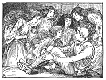

  
[Intangible Textual Heritage](../../../index.md)  [Legends and
Sagas](../../index)  [Celtic](../index)  [Index](index.md) 
[Previous](sfft62)  [Next](sfft64.md) 

------------------------------------------------------------------------

[Buy this Book at
Amazon.com](https://www.amazon.com/exec/obidos/ASIN/B0026FCJ10/internetsacredte.md)

------------------------------------------------------------------------

  
*Scottish Fairy and Folk Tales*, by George Douglas, \[1901\], at
Intangible Textual Heritage

------------------------------------------------------------------------

p. 203

### FATLIPS. [1](#fn_97.md)

ABOUT fifty years ago, an unfortunate female wanderer took up her
residence in a dark vault, among the ruins of Dryburgh Abbey, which
during the day, she never quitted. When night fell, she issued from this
miserable habitation, and went to the house of Mr. Haliburton, of
Newmains, or to that of Mr. Erskine, of Shielfield, two gentlemen of the
neighbourhood. From their charity she obtained such necessaries as she
could be prevailed upon to accept. At twelve, each night, she lighted
her candle, and returned to her vault; assuring her friendly neighbours
that, during her absence, her habitation was arranged by a spirit, to
whom she gave the uncouth name of *Fatlips*, describing him as a little
man, wearing heavy iron shoes, with which he trampled the clay floor of
the vault, to dispel the damps. This circumstance caused her to be
regarded, by the well-informed, with compassion, as deranged in her
understanding; and by the vulgar, with some degree of terror. The cause
of her adopting this extraordinary mode of life she would never explain.
It was, however, believed to have been occasioned by a vow that, during
the absence of a man to whom she was attached, she would never look upon
the sun. Her lover never returned. He fell during the civil war of
1745-46, and she never more would behold the light of day.

p. 204

The vault, or rather dungeon, in which this unfortunate woman lived and
died, passes still by the name of the supernatural being with which its
gloom was tenanted by her disturbed imagination, and few of the
neighbouring peasants dare enter it by night.

------------------------------------------------------------------------

### Footnotes

[203:1](sfft63.htm#fr_97.md) Sir Walter Scott,
*Minstrelsy of the Scottish Border*.

------------------------------------------------------------------------

[Next: The Silly Mutton](sfft64.md)
