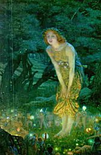

  
[Intangible Textual Heritage](../../../index)  [Sagas and
Legends](../../index)  [Celtic](../index) 

------------------------------------------------------------------------

<table width="75%">
<colgroup>
<col style="width: 50%" />
<col style="width: 50%" />
</colgroup>
<tbody>
<tr class="odd">
<td width="50%" data-valign="TOP"> 
</td>
<td width="50%" data-valign="TOP"><h1 id="the-science-of-fairy-tales" data-align="CENTER">The Science of Fairy Tales</h1>
<h3 id="an-enquiry-into-fairy-mythology" data-align="CENTER">An Enquiry Into Fairy Mythology</h3>
<h2 id="by-edwin-sidney-hartland" data-align="CENTER">by Edwin Sidney Hartland</h2>
<h4 id="section" data-align="CENTER">[1891]</h4></td>
</tr>
</tbody>
</table>

------------------------------------------------------------------------

[Title Page](sft00)  
[Authors Preface](sft01)  
[Chapter I: The Art of Story-Telling](sft02)  
[Chapter II: Savage Ideas](sft03)  
[Chapter III: Fairy Births and Human Midwives](sft04)  
[Chapter IV: Fairy Births and Human Midwives (continued)](sft05)  
[Chapter V: Changelings](sft06)  
[Chapter VI: Robberies from Fairyland](sft07)  
[Chapter VII: The Supernatural Lapse of Time in Fairyland](sft08)  
[Chapter VIII: The Supernatural Lapse of Time in Fairyland
contd](sft09)  
[Chapter IX: The Supernatural Lapse of Time in Fairyland
contd.](sft10)  
[Chapter X: Swan Maidens](sft11)  
[Chapter XI: Swan Maidens contd.](sft12)  
[Chapter XII: Conclusion](sft13)  
[Appendix](sft14)  
