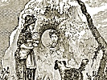

  
[Intangible Textual Heritage](../../../index.md)  [Legends and
Sagas](../../index)  [Celtic](../index)  [Index](index.md) 
[Previous](swc101)  [Next](swc103.md) 

------------------------------------------------------------------------

  
*Traditions and Hearthside Stories of West Cornwall, Vol. 1*, by William
Bottrell, \[1870\], at Intangible Textual Heritage

------------------------------------------------------------------------

p. iv p. v

### PREFACE

Before the commencement of the present century, the district of West
Penwith, to which the legends in this volume for the most part belong,
was, from its almost insular position, one of the most secluded and
unknown parts of England. The estuary of Hayle (by which it is bounded
on the east) and the Mount's-bay approaching to within three miles of
each other, sever it in some measure from the rest of the county, with
which, some three score years ago, from the badness of roads and
scarcity of wheel-conveyances, it had but little communication, either
commercially or otherwise. Then persons, living west of Penzance, were
regarded as great travellers if they had "crossed over Hayle," which, at
that time, was a dangerous undertaking, on account of its shifting
quicksands; and people living further east were looked on as foreigners
by the west-country folks. Indeed, few persons, except those born before
Buonaparte filled the country with dread of an invasion, can form an
adequate idea of the singular seclusion in which the inhabitants of West
Penwith existed.

And even this small district comprises two very dissimilar regions, the
inhabitants of which are also distinguished by peculiar traits of
character. Bordering on the northern shore, barren moor-lands and
rock-strewn hills, topped with granite cairns, mark a tract rich in tin
and copper, but, except in some few places, unproductive on the surface,
and almost worthless for the purposes of agriculture. These wild moors
and hills were, for the most part, inhabited by a class of old-fashioned
tinners, happily not yet extinct, who, as is usual with the industrious
miners of Cornwall, varied their ordinary underground labour by
breaking-up and clearing of stone small patches of the heathy moorland
or furze-covered hills. [\*](#fn_0.md) Many hundreds
of acres have thus been brought under cultivation by men of this stamp,
who,

p. vi

notwithstanding their want of education (few indeed learned to read
even), were often found to be very intelligent, and to possess a good
store of mother-wit, sharpened by their hazardous under-ground
occupations, and by a communication and exchange of ideas, facilitated
by their working in company.

This primitive race of the hills knew next to nothing of any occurrences
beyond their immediate neighbourhood, and being, like all the Celtic
race, of a loquacious turn and sociable disposition, their chief
resource for passing the eventide, and other times of rest, was the
relation of traditional stories or, as they say "drolling away the time"
in public-house or chimney-corner; many old legends have thus been
handed down and kept alive. No doubt the adventures in these wild tales
are often embellished by the droll-teller's fanciful invention. From the
dwellers in the lonely hamlets of the northern parishes have been
obtained all the giant-stories and many weird legends belonging to this
wild district; which, for the most part, are very unlike the more
cheerful drolls told by folks living on the warm rich land of the
southern coast. An old tinner of Lelant (one of the comfortable class
who worked best part of his time "to bal and farmed a few acres out of
core") has often related to me the long giant-story with which the
volume begins. It generally took him three of four winter's evenings to
get through with the droll, because he would enter into very minute
details, and indulge himself in glowing descriptions of the tin and
other treasures found in the giant's castle; taking care, at the same
time, to give the spoken parts literally as he had heard them from his
ancestors.

About a century and half, or two centuries, ago, a comparatively refined
and opulent class dwelt on the lands of West Penwith, on which the
earliest vegetables are now raised for the London markets. The ancestors
of many families of note (now removed to other parts) then resided in
various old mansions, west of Penzance, the remains of which are now in
a ruinous condition and occupied as farmhouses. Many legends associated
with these forsaken seats have been told me by aged relatives of my own,
and

p. vii

other old people of the West County. My thanks are due to several
others, however, who take an interest in our ancient traditions, for the
more recent communication of old stories, some of which will be found in
the present volume.

In most cases the stories are given as related by the droll-tellers,
except where our local dialect might be unintelligible to the general
reader, or when (as is frequently the case) they indulge in a plainness
of speech which the fastidious might regard as indelicate. On this
account it became necessary to curtail and alter some stories in order
to make them presentable.

It may be well to observe that, in a great number of our legends, the
Devil is a prominent personage; yet the mythical demon or "bucca-boo" of
our drolls has but few of the malicious traits of his Satanic Majesty,
and the Old One is generally described as being outwitted in the end.
When the same old tale occurs in different forms, care has been taken to
preserve the most interesting version.

A word as to the arrangement. It was first intended to commence with the
most ancient legends and to place the giant-stories, fairy tales, &c.,
in separate sections: but, this being found inconvenient, the plan
adopted is to give the stories as they relate to various localities,
proceeding from Hayle westward. Particular stories, however, and other
subjects deemed of special interest, may be easily found by a reference
to the Index.

In a very few years these interesting traditions would have been lost,
unless they had been preserved in some such form as the present volume
is intended to supply; since modern customs, and the diffusion of the
local news of the day, are superseding, in even the most remote
districts, the semi-professional droll-tellers who were formerly
welcomed at all firesides, fairs, and feasts for their recitals of the
old ballads and stories in which they abounded, and of which their
audience rarely tired.

p. viii

As some of the stories, related since the prospectus was issued belong
to Places beyond West Penwith, it was thought proper to alter the title
to that of "Traditions and Hearthside Stories of West Cornwall."

I beg to tender my most sincere thanks to subscribers for having
countenanced and encouraged my efforts; and should the public receive
this collection with favour, a second series, containing other legends
of the West, will be published.

WILLIAM BOTTRELL

St. Clare Street,  
January 1st, 1870.

------------------------------------------------------------------------

### Footnotes

[v:\*](swc102.htm#fr_0.md) The work of Mr. Thomas,
Mine Surveyor, informs us that from 2,000 to 3,000 tons of stone was
frequently cleared from a single acre.

------------------------------------------------------------------------

[Next: The Giants of Towednack](swc103.md)

