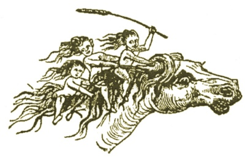

  
[Intangible Textual Heritage](../../../index)  [Legends and
Sagas](../../index)  [Celtic](../index) 

------------------------------------------------------------------------

<table width="75%">
<colgroup>
<col style="width: 50%" />
<col style="width: 50%" />
</colgroup>
<tbody>
<tr class="odd">
<td width="50%" data-valign="TOP"></td>
<td width="50%" data-valign="CENTER"><h1 id="traditions-and-hearthside-stories-of-west-cornwall-vol.-2" data-align="CENTER">Traditions and Hearthside Stories of West Cornwall 
Vol. 2</h1>
<h2 id="by-william-bottrell" data-align="CENTER">by William Bottrell</h2>
<h4 id="section" data-align="CENTER">[1873]</h4></td>
</tr>
</tbody>
</table>

------------------------------------------------------------------------

[Contents](#contents)    [Start Reading](swc200)    [Page
Index](pageidx)    [Text \[Zipped\]](swc2.txt.gz)

------------------------------------------------------------------------

This is the second of three volumes of William Bottrells' collection of
Cornish folklore, legend and local tales. This volume includes several
episodic stories, particularly the generational saga of the I'ans. While
many of the folk-tales have thematic correlations in other story-telling
traditions, all of these stories are localized by Bottrell in the
Cornish landscape. This land is a tricky one, abounding with giants,
ancient castles, and strange standing stones. The Devil is a real
presence in these stories, always ready to take a comic turn if
necessary.--J.B. Hare, Jan. 24 2010.

------------------------------------------------------------------------

 [Title Page](swc200)  
[Contents](swc201)  

### Duffy and the Devil (An Old Christmas Play)

[Part First](swc202)  
[Part Second](swc203)  

 

[Celtic Monuments Of Boleigh And Rosemodrass](swc204)  
[Boleigh or Boleit](swc205)  
[Menheres](swc206)  
[Holed Stones, &c](swc207)  
[The Last Cardew, of Boskenna, and the Story of Nelly Wearne](swc208)  
[Story of Nelly Wearne](swc209)  
[The Witch of Burian Church-Town](swc210)  
[The Story of Madam Noy](swc211)  
[A Modern Sancreed Witch](swc212)  
[A Queen's Visit to Baranhual](swc213)  
[The Small People's Cow](swc214)  
[Tom of Chyannor, the Tin-Streamer](swc215)  
[The Fairy Dwelling on Selena Moor](swc216)  

### The I’an's House of Treen

[Introduction](swc217)  
[The I’ans Quit Treen](swc218)  
[Unexpected Visitors](swc219)  
[The Proud Pendars](swc220)  
[The I’an's Ghosts](swc221)  

### Castle Treen and its Legends

[The Key of the Castle](swc222)  
[Giants of Castle Treen](swc223)  
[Dan Dynas](swc224)  
[The Small People (Fairies)](swc225)  
[St. Levan Witches](swc226)  

 

[Traditions of Pacurno](swc227)  

### Legends of St. Levan

[St. Levan and His Sister](swc228)  
[Johanna's Garden](swc229)  
[The St. Levan Stone](swc230)  
[Parchapel Well](swc231)  

 

[A Legend of Pargwarra](swc232)  
[An’ Pee Tregeer's Trip to Market on Hallan Eve](swc233)  
[Pendeen of Old](swc234)  
[An Overseer and a Parish Clerk of St. Just about sixty years
ago](swc235)  
[The Fairy Master, or Bob o’ the Carn](swc236)  

### A Tinner's Fireside Stories

[The Knockers of Ballowal](swc237)  
[Tom and the Knackers](swc238)  
[Old Songs and Nicknames](swc239)  

### An Excursion to Chapel Uny Well

[Introduction](swc240)  
[The Changeling of Brea Vean](swc241)  

 

[Betty Stogs's Baby](swc242)  
[How a Morvah Man Bought Clothes for his Wife](swc243)  
[How A Zennor Man Choked Himself, but had his Will in his
Pocket](swc244)  

### The Smugglers of Penrose

[Part the First](swc245)  
[Part the Second](swc246)  

 

[Tregagle](swc247)  

### West Country Superstitions

[Devil's Money](swc248)  
[The Slighted Damsel of Gwinear](swc249)  
[The Wreck of Admiral Sir Cloudesley Shovel](swc250)  
[A Night's Ride to Scilly](swc251)  
[Ancient Bridal Customs](swc252)  
[Madron Well](swc253)  
[The Crick-Stone, or Men-an-tol](swc254)  
[Charms](swc255)  
[The Fairy Tribes](swc256)  
[Mermaids and the Hooper](swc257)  
[The Wrecker and the Death Ship](swc258)  
[The Sun Never Shines on Those Who Have Sworn Away A Life](swc259)  

 

[A Legend of Pengersec](swc260)  

### Notes, Illustrative Anecdotes

[Miracle Plays, Christmas Plays, &c.](swc261)  
[The Levelis, of Trewoof](swc262)  
[Duffy and the Devil](swc263)  
[Pendre and Baranhual](swc264)  
[The Danes Landing on the Cornish Coast for Plunder](swc265)  
[St. Levan's Path](swc266)  
[A Ghostly Ship's-Bell](swc267)  
[Brea and Pendeen, in St. Just](swc268)  
[The Burning of Vellan-Dreath](swc269)  
[The Men-an-tol, Constantine Tolmen](swc270)  
[Divination by Rushes and Ivy-Leaves](swc271)  
[Recent Ill-Wishing](swc272)  
[Midsummer Bonfire](swc273)  
[The Mermaid of Zennor](swc274)  

 

[Glossary of Local Words](swc275)  
[Index](swc276)  
[Subscribers' Names](swc277)  
[Errata](swc278)  
