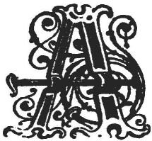

  
[Intangible Textual Heritage](../../../index)  [Legends and
Sagas](../../index)  [Celtic](../index)  [Index](index) 
[Previous](swc203)  [Next](swc205) 

------------------------------------------------------------------------

  
*Traditions and Hearthside Stories of West Cornwall, Vol. 2*, by William
Bottrell, \[1873\], at Intangible Textual Heritage

------------------------------------------------------------------------

p. 27

### Celtic Monuments of Boleigh and Rosemodrass.

           Dear land of old romance,  
           Legend and mystic dance;  
Lost towns and temples, and that buried shore  
  Where thy great hero fought his last sad fight,  
Cromlechs and quoits and cairns and hills of war,  
  Circles of mystery and mounds of might.  
                                          W. K. D.

|                    |
|--------------------|
|  |

ABOUT a furlong south-west of Trove, but on a tenement of Boleigh, is
the Fuggo. It consists of a cave about six feet high, five feet wide and
near forty long, faced on each side with rough stones, across which long
stone posts are laid. On its north-west side a narrow passage leads into
another cave of similar construction and unknown extent; as it has long
been blocked up by a portion of the roof having fallen in. One may be
pretty sure, however, that much of the stories about its great length
are fabulous. They say that it extends from its entrance, at the foot of
Boleigh hill, to the old mansion at Trove; in proof of this the old one
has often been heard piping under a parlour of the house. It is supposed
he meets the witches down there, who have entered by the Fuggo to dance
to his music. Hares are often seen to enter the Fuggo which are never
known to come out the same way; they are said to be witches going to
meet their master, who provides them with some other shape to return in.

There are also traditions of this cavern having served as a place of
refuge to some of the Levelis in troublesome times; and of its having
frequently been used by our fair-traders, as it afforded them a secure
hold for storing their goods, and to have a carouse therein.

Old traditions about the far-reaching and unknown extent of the Fuggo,
may not, however, be altogether void of foundation. At the annual
excursion of the Royal Institution of Cornwall, in 1871, Mr. H. M.
Whitley, of Truro, remarked that the bank, just opposite the branch
cavern, sounded hollow, from which he is persuaded that there is a
chamber underneath to be yet explored.

There are the remains of a triple entrenchment near, and this
subterranean passage might have been connected with it.

p. 28

Old folks of the neighbourhood say that there was another Fuggo in Trove
Hill, on the opposite side of the Glen, but the entrance has long since
been closed, and no one knows exactly where it opened.

The track of moor and croft between Trove and Boleigh has indeed never
been thoroughly examined by our antiquaries; yet as the vestiges of
ancient British habitations are generally found in the vicinity of
prehistoric monuments, the Daunce-mayn, Menheres, and holed-stones on
the hill, would seem to indicate that this sheltered glen might be a
likely place in which to find the remains of old crellas or circular
huts, similar to those of Bodennar, Busullow, and Chysauster. And
farther up, near the brook, amidst brambles and furze may yet be
discovered traces of ancient Celtic dwellings, with ashes still on the
hearth and quern and muller beside it.

------------------------------------------------------------------------

A short time ago an old inhabitant of Boleigh informed us that many
persons in that neighbourhood are afraid to enter the Fuggo, even by
day, as they believe that bad spirits still frequent this place. Women
of villages near often threaten their crying babies that they will carry
them down to the Fuggo, and leave them there for the Bucca-boo if they
don't stop their squalling. there are traditions that almost all these
caves were haunted by beings of a fearful nature, whose path it was
dangerous to cross.

The fuggo at Bodinnar, called the Giant's Holt, was a few years ago much
dreaded, as it was thought to be the abode of ugly spriggans that kept
watch and guard over treasures which still remain buried in that ancient
hiding-place.

There is a somewhat graceful creation of fancy associated with the Vow,
or fuggo, at Pendeen, which is said to extend from the mansion to
Pendeen Cove, and some say it has branches in other directions, which
spread faraway from the principal cavern.

At dawn on Christmas Day the "Spirit of the Vow" has frequently been
seen just within the entrance, near the Cove, in the form of a beautiful
lady, dressed in white, with a red rose in her mouth. There were persons
living, a few years since, who had seen this fair but not the less
fearful vision; for disaster was sure to visit those who intruded en the
spirit's morning airings.

Many of the "sawns" in the western cleaves have also similar legends
connected with them, only the dwellers in sea-side caverns, are either
of the mermaid race, or what we call Hoopers. The latter are beneficent
spirits who warn fishermen from going to sea when there is an
approaching tempest.

The Hoopers shroud themselves in a thick fog which stretches across
coves frequented by them. There are well remembered

p. 29

stories of Sennen Cove Hooper that used to rest in a cloud of mist, on
Cowloe, and thence emit its doleful notes as a danger signal.

------------------------------------------------------------------------

------------------------------------------------------------------------

[Next: Boleigh or Boleit](swc205)

