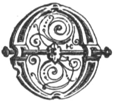

  
[Intangible Textual Heritage](../../../index.md)  [Legends and
Sagas](../../index)  [Celtic](../index)  [Index](index.md) 
[Previous](swc221)  [Next](swc223.md) 

------------------------------------------------------------------------

  
*Traditions and Hearthside Stories of West Cornwall, Vol. 2*, by William
Bottrell, \[1873\], at Intangible Textual Heritage

------------------------------------------------------------------------

p. 130

### Castle Treen and its Legends.

"I cannot tell how the truth may be,  
 I say the tale as 'twas said to me."  
                                  Scott.

|                    |
|--------------------|
|  |

OLD traditions that the heads of Castle Treen, or rather Trereen on
which the Logan Rock carn and adjacent crags stand, was raised out of
the sea by enchantment. This portion of the stronghold, enclosed by the
inner line of defence, running directly across the isthmus, is generally
spoken of as The Castle, and that between it and the outer or landward
embankments is usually called Treen Dynas.

------------------------------------------------------------------------

### The Key of the Castle.

It is not known what powerful magician raised this giant's hold, though
it was believed that its security depended on a magic stone called "the
key of the Castle," respecting which Merlin had something to say, as
well as about many other remarkable stones in the neighbourhood. Castle
Treen, however, must have stood where it is long before Arthur and his
magician visited West Cornwall.

The key was an egg-shaped stone, between two and three feet long, which
was contained in the cavity of a rock with a hole facing the sea,
through which it might be turned round; and the opening appeared large
enough for it to be passed through. Many attempted to get it out, but
they always found it to hitch somewhere; and lucky (according to old
folks’ faith) that it did, because the sage Merlin prophecied that when
the key of the Castle was taken out of the hole, Men Amber (the holy
rock) would be overthrown, the Castle sink beneath the ocean, and other
calamities occur.

The key was situated near the bottom of a deep chasm called The Gap,
which is passed on approaching the Logan Rock by the usual path. It
required a sure-footed climber, of strong nerve, to reach it, and this
could only be done from land, at low water, or nearly so.

p. 131

Surging waves occasionally changed the position of this magic stone, and
from the direction of its smaller end, as it lay in a trough of water,
prognostics were drawn with regard to the seasons, &c.

Few persons had sufficient hardihood to descend the precipitous cliff
and risk being caught in The Gap by a flowing tide; and the key of the
Castle remained a mysterious and venerated object till Goldsmith's
mischievous tars, or the dockyard men who were employed in erecting
machinery to replace Men Amber (as the stone they overthrew was formerly
called) heard of it and the traditions connected therewith. Then, one
day, some of these wretches, on farther mischief bent, entered The Gap
in a boat, and, being provided with crow bars, they broke away the edges
of the rock that enclosed the key, ripped it out, and tumbled it down
among the sea-washed pebbles! Some calamity has surely befallen these
wretches ere this, or Bad Luck is a mere name, and powerless as an
avenging deity.

Part of Merlin's prophecy was fulfilled, however, yet not in the order
predicted.

The venerated nodule was what is called, among miners, at "bull's eye,"
or "pig's egg," of large size. It appeared to be a closer-grained and
harder stone than what surrounded it.

------------------------------------------------------------------------

------------------------------------------------------------------------

[Next: Giants of Castle Treen](swc223.md)

