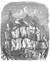

  
[Intangible Textual Heritage](../../../index)  [Legends and
Sagas](../../index)  [Celtic](../index)  [Index](index) 
[Previous](swc225)  [Next](swc227) 

------------------------------------------------------------------------

  
*Traditions and Hearthside Stories of West Cornwall, Vol. 2*, by William
Bottrell, \[1873\], at Intangible Textual Heritage

------------------------------------------------------------------------

### St. Levan Witches.

In days of yore ugly old hags that sold themselves to Satan merely to
have their "spite out" on their neighbours, or to ride on a broomstick
and play pranks but little known except among themselves, made the
Castle crags their resort. When all the neighbouring witches were
assembled they scampered up to the platform on the top of Castle Peak,
mounted their ragworts or brooms, and took flight over to Wales to milk
Taffy's cows and steal his leeks. Those who lived in Roskestal, and
other places over that way, took their departure from Pedn-pen-with. On
their return each one alighted, with all her plunder, in some convenient
place near her dwelling. ’Tis said that, in old times, the people of
this neighbourhood were much addicted to sorcery, and, from their skill
in the black art, they acquired and still retain the name of St. Levan
Witches.

  [  
Click to enlarge](img/13900.jpg)

------------------------------------------------------------------------

[Next: Traditions of Pacurno](swc227)

