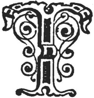

  
[Intangible Textual Heritage](../../../index.md)  [Legends and
Sagas](../../index)  [Celtic](../index)  [Index](index.md) 
[Previous](swc239)  [Next](swc241.md) 

------------------------------------------------------------------------

  
*Traditions and Hearthside Stories of West Cornwall, Vol. 2*, by William
Bottrell, \[1873\], at Intangible Textual Heritage

------------------------------------------------------------------------

p. 199

### An Excursion to Chapel Uny Well, With A Legend of the Changeling of Brea Vean.

These, when a child haps to be got,  
That after proves an idiot,  
  When folks perceive it thriveth not,  
The fault therein to smother,  
Some silly, doating, brainless calf,  
That understands things by the half,  
Says that the fairy left this aulf,  
  And took away the other.  
                                Drayton.

|                    |
|--------------------|
|  |

THOUGH the numerous visitors who resort to Penzance in autumn are rarely
satiated with our fine cliff scenery, they might, with pleasure, vary
their excursions by a ramble inland, where various objects of interest
are found on moorlands and hills, but seldom visited.

A pleasant day, for example, might be passed by first going to Sancreed;
where, in the quiet, neat, little, embowerd Church some curiously carved
portions of an ancient rood-screen are worthy of notice. In the
churchyard there is one of the finest crosses in the county; it is about
eight feet high and ornamented with various emblematic devices, among
others, the filly of the Blessed Virgin. The old Inn, with its quaint
sign "The Bird in Hand," suggestive of ready payment, was worthy of a
glance, a few years ago, when some nondescript fowl of the air, trying
to escape from a hand that grasped its legs, was pourtrayed on the
sign-board in flaming colours by a local artist, and, underneath the
captive bird, were the lines,—

"A bird in hand is better fare  
 Than two that in the bushes are."

From the south-eastern side of "Sancras Bickan" (Beacon) a delightful
view of Mount's Bay is obtained, and on Caer Brane—commonly called Brane
Rings—the next hill towards the west, may be seen the remains of an old
and extensive hill-castle.

p. 200

Hence, one might descend to the famous Chapel Uny Well, situated between
Chapel Carn Brea and Bartine hills; the one crowned with its ruined
chapel and the other with a castle. At Chapel Uny will be found a
copious spring of as clear water as was ever seen. The only remains that
can be identified, as having belonged to its ancient chapel, are a few
dressed stones near the well. These, from their shape, would seem to
have formed part of an arched door or window.

Near by there is also a large circular Fogou, or artificial cavern,
walled on both sides and partly covered with long slabs of moor-stone.
The Holy Well is, however, the most celebrated object in this vicinity;
a few years ago, it was resorted to on the first three Wednesdays in May
by scores of persons who had great faith in the virtue of its waters,
which were considered very efficacious for curing most diseases
incidental to childhood, and many ricketty babes are still bathed there
at the stated times when the spring is believed to possess the most
healing powers.

Belonging to this well and its neighbourhood there is a somewhat curious
story, which we will relate just as it has often been told us by old
people of the West Country.

------------------------------------------------------------------------

------------------------------------------------------------------------

[Next: The Changeling of Brea Vean](swc241.md)

