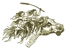
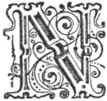
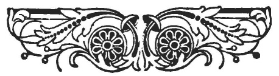

  
[Intangible Textual Heritage](../../../index)  [Legends and
Sagas](../../index)  [Celtic](../index)  [Index](index) 
[Previous](swc243)  [Next](swc245) 

------------------------------------------------------------------------

  
*Traditions and Hearthside Stories of West Cornwall, Vol. 2*, by William
Bottrell, \[1873\], at Intangible Textual Heritage

------------------------------------------------------------------------

### How A Zennor Man Choked Himself, but had his Will in his Pocket.

------------------------------------------------------------------------

|                    |
|--------------------|
|  |

NOT long ago a high-country farmer, after having finished his marketing,
in Penzance, treated himself to a supper at a cook-shop in Caunse-head.
Being in great hunger, or haste, he thought it waste of time to cut his
meat into smaller pieces than he could possibly swallow; besides, solid
junks would stand by his ribs and do the more good.

He made but two morsels of a quarter of a pound of beef; and in bolting
the last it stuck in his throat. In an instant he went blue in the face
and fell on the floor. The landlord ran for a surgeon, and by good luck
found one at home, the other side of the street. "Stand clear a bit, and
open the man's trap," said the doctor. With much trouble the Zennor
man's jaws were forced open, and the doctor feeling a portion of the
meat pulled out a piece about six inches long.

The patient was soon restored and ready for another such meal.

Then a lawyer's clerk, who had just entered, remarked;—"Why, old boy,
you ought to make your will and keep it by ye before sit down to eat
beef again." "Why bless ’e so I have.

p. 211

\[paragraph continues\] I always keep my
will in my pocket, and you shall see am of you mind to. I made ’n
myself—no lawyers for me. Here a es." Saying this he drew from his
pocket a sheet of paper, and gave it to the doctor, telling him he might
keep it, if he had a mind to see how to make a will. He intended to make
another the next Sunday, because he had more, things to bequeath now
than when he made the testament, of which the following is a faithful
copy:—

"I'll make my will while I am well. I will bestow my riches. I'll give
to Ellek, [\*](#fn_3) my eldest son, my best
Coat, Jacket, and my Breeches. As for my watch et es in pawn else
Elexander should have that. Neckey shall have the courage Horse, and Jan
the little Sprat. Mary shall have the milking Cow, and Lystria shall
have the Heifer. Fillis shall have the flock of Sheep, and wat can I do
better? Old Polly shall have the Puss [†](#fn_4)
of goold, and that will most maintain her. Sally shall have the old
brass Pan, the Bucket, and the Strainer.

"Signed, sealed, and delivered, in the presence of

"Cousin Matthew Hollow,  
"Uncle Philip Eddy, and  
"John Quick, the Schoolmaster."

According to our intended arrangement the three
foregoing stories should have preceded those of St. Just.

 

------------------------------------------------------------------------

### Footnotes

[211:\*](swc244.htm#fr_3) Alexander.

[211:†](swc244.htm#fr_4) Purse.

------------------------------------------------------------------------

[Next: Part the First](swc245)

