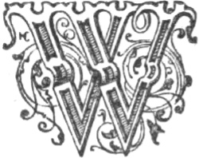
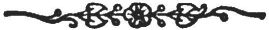

  
[Intangible Textual Heritage](../../../index.md)  [Legends and
Sagas](../../index)  [Celtic](../index)  [Index](index.md) 
[Previous](swc256)  [Next](swc258.md) 

------------------------------------------------------------------------

  
*Traditions and Hearthside Stories of West Cornwall, Vol. 2*, by William
Bottrell, \[1873\], at Intangible Textual Heritage

------------------------------------------------------------------------

p. 247

### Mermaids and the Hooper.

|                    |
|--------------------|
|  |

WITHIN easy memory many parts of the western coast were said to be
frequented by mermaids, particularly Sennen Cove. This place was also
resorted to by a remarkable spirit called the Hooper—from the hooting or
pooping sounds which it was accustomed to make.

In old time, according to tradition, a compact cloud of mist often came
in from over sea—when the weather was by no means foggy—and rested on
the rocks called Cowloe, thence it spread itself, like a curtain of
cloud, quite across Sennen Cove. By night a dull light was mostly seen
amidst the vapour, with sparks ascending as if a fire burned within it;
at the same time hooping sounds, were heard proceeding therefrom. People
believed the misty cloud shrouded a spirit, which came to forewarn them
of approaching storms, and that those who attempted to put to sea found
an invisible force—seemingly in the mist—to resist them.

A reckless fisherman and his son, however,—disregarding the
token—launched their boat and beat through the fog with a threshal
(flail); they passed the cloud of mist which followed them, and neither
the men, nor the Hooper, were evermore seen in Sennen Cove.

This is the only place in the west where any tradition of such a
guardian spirit is preserved.

 

------------------------------------------------------------------------

[Next: The Wrecker and the Death Ship](swc258.md)

