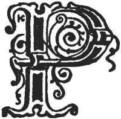

  
[Intangible Textual Heritage](../../../index.md)  [Legends and
Sagas](../../index)  [Celtic](../index)  [Index](index.md) 
[Previous](swc257)  [Next](swc259.md) 

------------------------------------------------------------------------

  
*Traditions and Hearthside Stories of West Cornwall, Vol. 2*, by William
Bottrell, \[1873\], at Intangible Textual Heritage

------------------------------------------------------------------------

### The Wrecker and the Death Ship.

Full well ’tis known adown the dale;  
Tho’ passing strange indeed the tale,  
And doubtful may appear.  
                              Shenstone.

|                    |
|--------------------|
|  |

PERSONS of a notoriously wicked character were said to have been
frequently taken off bodily by Old Nick when they died. The following is
one of many stories to that effect.

More than a hundred years ago a dark strange man appeared in St. Just;
no one knew whence he came, but it was supposed, however, that he was
put ashore from a pirate ship, by way of marooning him; as the crews of
such are wont to do by any wretch that is too bad even to consort, with
high sea robbers.

p. 248

He didn't appear to want for money as he soon rented a small, lone,
tenement, near the shore, and married a widow of the neighbourhood.

People wondered, for a long while, how so many vessels got wrecked under
the cliff that bordered the stranger's farm.

At length it was discovered that, on dark winter nights—when honest
folks were a-bed—he made it his practice to fasten a lantern to the neck
of a horse, which he had hobbled, by tying down its head to a fore-leg;
then he drove the horse along near the cliff, and the lantern, from its
motion, would be taken for a vessel's stern-light.

Consequently those on board ships sailing by, expecting to find plenty
of sea room, would come right in and be wrecked on the rocks. Any of
their crews that escaped a watery grave the wretch would knock on the
head with his axe, or cut off their hand when they tried to grasp the
rocks.

He lived long and became rich by his sin. At length, however, the time
came for the fiend to claim his own. When he was dying his awful shrieks
were heard far away, as he cried, "Do save me from the devil, and the
sailors, there, looking to tear me to pieces." Several parsons and other
pious folks were sent for,—all those of the neighbourhood readily came,
for the dying sinner was rich.

Though it was in harvest time and high day, the old wrecker's chamber
became, at times, as dark as night. The parsons saw the devil in the
room, when others could not; by their reading they drove him to take
many shapes, but for all that he would not be put out; at last, when he
took the form of a fly, and buzzed about the dying wretch, they saw it
was in vain for them to try any longer.

During the time the exorcists were engaged, the chamber seemed—by the
sound—to be filled with the sea splashing around the bed; waves were
heard as if surging and breaking against the house, though it was a good
bit inland.

Whilst this was taking place at the dying wrecker's bedside, two men,
who were about harvest work in one of his fields near the cliff, heard a
hollow voice, as if coming from the sea, which said, "The hour is come
but the man is not come."

Looking in the direction whence the words came, they saw no person; but
far out to sea, they beheld a black, heavy, square-rigged ship, with all
sail set, coming fast in, against wind and tide, and not a hand to be
seen aboard her.

She came so close under cliff that only her topmast could be seen; when
black clouds—that seemed to rise out of the deep—gathered around her and
extended thence straight to the dying man's dwelling.

p. 249

The harvest-men, terrified at the sight of this ship-of-doom so near
them, ran up to the town-place, just as the old sinner died, when his
dwelling shook as if about to fall. Everybody, in great fright, rushed
out and saw the black clouds roll off towards the death-ship, which, at
once, sailed away amidst a blaze of lightning—far over sea, and
disappeared.

The weather immediately cleared, and nothing unusual occurred until a
few men assembled to put the wrecker's ghastly remains quickly off the
face of the earth; then, as the coffin was borne towards the churchyard,
a large black pig came—no one knew from whence—and followed the bearers,
who all declared the coffin was too light to contain any body. The sky,
too, became suddenly overcast, and a tempest raged to that degree, they
could scarcely keep on their legs to reach the churchyard stile, where
such sheets of blinding lightning flashed around them, that they dropped
the coffin and rushed into the church.

The storm having abated, they ventured out, and found nothing of the
coffin but its handles and a few nails, for it had been set on fire, and
all else consumed, by the lightning.

------------------------------------------------------------------------

It does not appear what business the black pig had in the funeral
procession; such is the way, however, in which the story is always told.

------------------------------------------------------------------------

[Next: The Sun Never Shines on Those Who Have Sworn Away A Life](swc259.md)

