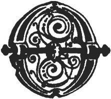
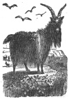

  
[Intangible Textual Heritage](../../../index)  [Legends and
Sagas](../../index)  [Celtic](../index)  [Index](index) 
[Previous](swc258)  [Next](swc260) 

------------------------------------------------------------------------

  
*Traditions and Hearthside Stories of West Cornwall, Vol. 2*, by William
Bottrell, \[1873\], at Intangible Textual Heritage

------------------------------------------------------------------------

### The Sun Never Shines on Those Who Have "Sworn Away A Life."

|                    |
|--------------------|
|  |

ONE frequently hears, in remote country places, the reproachful sayings
of, "The sun wont shine on thee," or, "the sun don't shine on thee."
This is regarded as a very bitter taunt, even by those who do not
understand its allusion or the old belief from which it proceeds.

The following story, told me by an aged mine captain, of Lelant, will
serve to explain it.

A few years ago a smuggler of Breage gave false evidence, which caused
one of another crew to he hanged, on the charge of having fired a fatal
shot at an officer belonging to a revenue cutter.

p. 250

This perjurer, who swore away an innocent man's life, received —for
informing—such a sum of blood money as made him comparatively rich, yet
he remained at sea for several years, until he came to live at Hayle.
Few persons there knew him; but everybody remarked that he looked
deathly pale and shivered with cold, however warm the weather might be.
lie lived alone and rarely left his house to go beyond his garden, and
his neighbours said that when he stood out in "sunshiney" weather he
cast no shadow. They surmised that he had been forsworn; for he could
never see the sun, and the sky always appeared dark to him; yet he saw
everything else the same as other people.

After his decease it became known how he had caused an innocent man's
death.

------------------------------------------------------------------------

Notices of other popular superstitions may be found
by a reference to the Index.

  [  
Click to enlarge](img/25000.jpg)

------------------------------------------------------------------------

[Next: A Legend of Pengersec](swc260)

