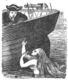

  
[Intangible Textual Heritage](../../../index)  [Legends and
Sagas](../../index)  [Celtic](../index)  [Index](index) 
[Previous](swc273)  [Next](swc275) 

------------------------------------------------------------------------

  
*Traditions and Hearthside Stories of West Cornwall, Vol. 2*, by William
Bottrell, \[1873\], at Intangible Textual Heritage

------------------------------------------------------------------------

### The Mermaid of Zennor.

Zennor folks tell the following story, which, according to them,
accounts for a singular carving on a bench-end in their Church.

Hundreds of years ago a very beautiful and richly attired lady attended
service in Zennor Church occasionally—now and then she went to Morvah
also;—her visits were by no means regular,—often long intervals would
elapse between them.

Yet whenever she came the people were enchanted with her good looks and
sweet singing. Although Zennor folks were remarkable for their fine
psalmody, she excelled them all; and they wondered how, after the scores
of years that they had seen

p. 289

her, she continued to look so young and fair. No one knew whence she
came nor whither she went; yet many watched her as far as they could see
from Tregarthen Hill.

She took some notice of a fine young man, called Mathey Trewella, who
was the best singer in the parish. He once followed her, but he never
returned; after that she was never more seen in Zennor Church, and it
might not have been known to this day who or what she was but for the
merest accident.

One Sunday morning a vessel cast anchor about a mile from Pendower Cove;
soon after a mermaid came close alongside and hailed the ship. Rising
out of the water as far as her waist, with her yellow hair floating
around her, she told the captain that she was returning from church, and
requested him to trip his anchor just for a minute, as the fluke of it
rested on the door of her dwelling, and she was anxious to get in to her
children.

Others say that while she was out on the ocean a-fishing of a Sunday
morning, the anchor was dropped on the trap-door which gave access to
her submarine abode. Finding, on her return, how she was hindered from
opening her door, she begged the captain to have the anchor raised that
she might enter her dwelling to dress her children and be ready in time
for church.

However it may be, her polite request had a magical effect upon the
sailors, for they immediately "worked with a will," hove anchor and set
sail, not wishing to remain a moment longer than they could help near
her habitation. Sea-faring men, who understood most about mermaids,
regarded their appearance as a token that bad luck was near at hand. It
was believed they could take such shapes as suited their purpose, and
that they had often allured men to live with them.

When Zennor folks learnt that a mermaid dwelt near Pen-dower, and what
she had told the captain, they concluded—it was, this sea-lady who had
visited their church, and enticed Trewella to her abode. To commemorate
these somewhat unusual events they had the figure she bore—when in her
ocean-home—carved in holy-oak, which may still be seen.

  [  
Click to enlarge](img/28900.jpg)

------------------------------------------------------------------------

[Next: Glossary of Local Words](swc275)

