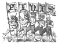

  
[Intangible Textual Heritage](../../../index.md)  [Legends and
Sagas](../../index)  [Celtic](../index)  [Index](index.md) 
[Previous](swc275)  [Next](swc277.md) 

------------------------------------------------------------------------

  
*Traditions and Hearthside Stories of West Cornwall, Vol. 2*, by William
Bottrell, \[1873\], at Intangible Textual Heritage

------------------------------------------------------------------------

p. 293

### INDEX

PAGE

Ancient Bridal Customs  [237](swc252.htm#page_237.md)

— Coins found at Castle Maen [127](swc221.htm#page_127.md)

— Mariners' Stories [149](swc231.htm#page_149.md)

A night's ride to Scilly [233](swc250.htm#page_233.md)

Ballowal, the knockers of (fairy tale) [185](swc236.htm#page_185.md)

Baranhuel, a Queen's visit to [67](swc213.htm#page_67.md)

— fairies’ cow [73](swc214.htm#page_73.md)

— shell room [72](swc213.htm#page_72), [274](swc263.htm#page_274.md)

Beatrice I’an, or Ivan [104](swc217.htm#page_104.md)

— her death [118](swc219.htm#page_118.md)

Betty Stoggs's baby (fairy tale) [205](swc241.htm#page_205.md)

Bevan, the Rev. James [197](swc239.htm#page_197.md)

Bewitching a dairy [65](swc211.htm#page_65.md)

Bob 'o the Carn (fairy tale) [173](swc236.htm#page_173.md)

Boleit, ancient monuments of [29](swc204.htm#page_29.md)

Books popular in the West Country a century ago
[197](swc239.htm#page_197.md)

Boscawen un circle [34](swc207.htm#page_34.md)

Boskenna [36](swc208.htm#page_36.md)

Boslow, the Piskey of [158](swc233.htm#page_158.md)

Brea, or Bray [42](swc209.htm#page_42), [200](swc240.htm#page_200.md),
[278](swc267.htm#page_278.md)

Brea-Vean, the Changeling of (fairy tale) [200](swc240.htm#page_200.md)

Breage, St., visits her brother, St. Levan [145](swc227.htm#page_145.md)

Bridal customs, ancient, still in vogue [237](swc252.htm#page_237.md)

Buccaneering, [45](swc209.htm#page_45.md)

Bucka, offerings to [187](swc238.htm#page_187.md),
[246](swc256.htm#page_246.md)

Buryan fair [39](swc209.htm#page_39.md)

— Sanctuary, men of [269](swc261.htm#page_269.md)

— wise-woman or fortune teller of [47](swc209.htm#page_47.md)

Calling of the sleeves [216](swc245.htm#page_216.md)

Cardews of Boskenna, the last of [38](swc208.htm#page_38.md)

Castle Treen, traditions of, [130](swc222.htm#page_130.md),
[138](swc224.htm#page_138.md)

— Maen, or Men [127](swc221.htm#page_127.md)

Changeling of Brea-Vean [200](swc240.htm#page_200.md)

— how to get rid of one [202](swc241.htm#page_202.md)

Chapel Uny Well [199](swc240.htm#page_199.md)

Charms [243](swc254.htm#page_243.md)

Chyannor, Tom of, the tin-streamer [72](swc213.htm#page_72.md)

Chynance [116](swc219.htm#page_116.md)

Clarice de Boleit, inscription on her tomb [29](swc204.htm#page_29.md)

Conjurors, pellars, or wise-men [20](swc203.htm#page_20.md),
[76](swc214.htm#page_76) [276](swc265.htm#page_276.md)

Crick-stone, the, or Men-an-tol [242](swc253.htm#page_242.md)

Cursing Psalm, the [229](swc248.htm#page_229.md),
[231](swc249.htm#page_231.md)

Danes, traditions of their incursions [127](swc221.htm#page_127.md),
[141](swc227.htm#page_141), [274](swc263.htm#page_274.md)

Daunce-Mayn [33](swc207.htm#page_33.md)

Death-ship, the [248](swc258.htm#page_248.md)

Demon, a, spinning [5](swc202.htm#page_5.md)

Den-an-Dynas, the giant and his wife [137](swc223.htm#page_137.md)

Devil's money [227](swc248.htm#page_227.md)

Divination [131](swc222.htm#page_131), [217](swc245.htm#page_217.md),
[245](swc255.htm#page_245), [283](swc270.htm#page_283.md)

Doctresses of the West Country [49](swc209.htm#page_49.md)

Duffy and a Devil, an old guise-dance [1](swc202.htm#page_1.md)

Enchanter, the, of Pengersec. [263](swc260.htm#page_263.md)

— of Maen and a thief [265](swc260.htm#page_265.md),
[267](swc260.htm#page_267.md)

Escols, a strong man of [31](swc206.htm#page_31.md)

— weavers of [196](swc239.htm#page_196.md)

Faction fight in Buryan Churchtown [215](swc245.htm#page_215.md)

Fairy dwelling on Selena Moor [94](swc216.htm#page_94.md)

— fair [161](swc233.htm#page_161.md)

— master, the [173](swc236.htm#page_173.md)

— tales [73](swc214.htm#page_73), [94](swc216.htm#page_94.md),
[102](swc216.htm#page_102), [154](swc233.htm#page_154.md),
[168](swc234.htm#page_168), [173](swc236.htm#page_173.md),
[185](swc236.htm#page_185), [200](swc240.htm#page_200.md)

Fairies, how they may be drive away [75](swc214.htm#page_75.md)

— old folks’ notions respecting [101](swc216.htm#page_101.md),
[245](swc255.htm#page_245.md)

Flowers, planting on graves, an old West Country custom
[114](swc219.htm#page_114.md)

Fortune-tellers [49](swc209.htm#page_49), [276](swc265.htm#page_276.md)

Garrack-zans [77](swc215.htm#page_77), [160](swc233.htm#page_160.md)

Ghost stories [122](swc221.htm#page_122), [162](swc233.htm#page_162.md),
[217](swc245.htm#page_217), [230](swc249.htm#page_230.md)

— laying [124](swc221.htm#page_124.md)

Ghostly ship's-bell, a [277](swc265.htm#page_277.md)

Giants of Castle Treen [131](swc222.htm#page_131.md),
[137](swc223.htm#page_137.md)

Goblins of the Mines [187](swc238.htm#page_187.md)

Guise-dances, how performed [2](swc202.htm#page_2.md)

Gulthise (harvest feast) [95](swc216.htm#page_95.md)

Gwinear, the slighted damsel of [229](swc248.htm#page_229.md)

p. 294

Haunted houses [122](swc221.htm#page_122), [212](swc245.htm#page_212.md)

Hella-point, mermaids of [151](swc232.htm#page_151.md)

Hell-hounds [66](swc212.htm#page_66.md)

Heimskringla, the, of Snorri Surlusson, account in of Northmen marauding
Cornwall, &c. [274](swc263.htm#page_274.md)

Hilla-ridden [236](swc251.htm#page_236.md)

Holed stones [31](swc206.htm#page_31), [242](swc253.htm#page_242.md),
[280](swc269.htm#page_280.md)

Hooper of Cowloe, the [247](swc257.htm#page_247.md)

Hostess, the, of Market-jew [82](swc215.htm#page_82.md)

Hurling [24](swc203.htm#page_24.md)

Husbandry, old [195](swc239.htm#page_195.md)

I’ans, their house in Treen [103](swc217.htm#page_103.md)

— ghosts of [122](swc221.htm#page_122.md)

— a Breton descendant of [125](swc221.htm#page_125.md)

Ill-wishing [63](swc211.htm#page_63), [65](swc211.htm#page_65.md),
[285](swc272.htm#page_285), [286](swc272.htm#page_286.md)

Ivy-leaves and rushes, divination by [217](swc245.htm#page_217.md),
[283](swc270.htm#page_283.md)

Johanna, the foolish, her garden [146](swc228.htm#page_146.md)

— rebukes St. Levan for fishing on a Sunday [148](swc230.htm#page_148.md)

Just, St., feast of [154](swc233.htm#page_154.md),
[170](swc235.htm#page_170.md)

Kaerkeis bowjey [127](swc221.htm#page_127.md)

Key, the, of Castle Treen [130](swc222.htm#page_130.md)

Knackers of Ballowal (fairy tale) [185](swc236.htm#page_185.md)

Levan, St., legends of [145](swc227.htm#page_145.md)

— stone; [147](swc229.htm#page_147.md)

— his path [146](swc228.htm#page_146), [272](swc262.htm#page_272.md)

— witches [139](swc225.htm#page_139.md)

Long-stones, or Menheeres of Boleit [30](swc205.htm#page_30.md)

— places named from numerous [31](swc206.htm#page_31.md)

Lovell, Madam, her troubles [21](swc203.htm#page_21.md)

— or Levelis, family of [271](swc261.htm#page_271.md)

Loyal hearts of Buryan [69](swc213.htm#page_69.md)

Madron well and chapel [239](swc252.htm#page_239.md)

Marriage usages, ancient [237](swc252.htm#page_237.md),
[239](swc252.htm#page_239.md)

Mayor of Market-jew, a [83](swc215.htm#page_83.md)

Merchants of Treen, the [81](swc215.htm#page_81.md)

Merlin's prophesies [130](swc222.htm#page_130.md),
[147](swc229.htm#page_147.md)

Mermaid of Zennor, the [288](swc273.htm#page_288.md)

Midsummer bonfires [287](swc272.htm#page_287.md)

Miners’ stories [187](swc238.htm#page_187), [191](swc238.htm#page_191.md)

Miracle-plays, performed at Sancreed [269](swc261.htm#page_269.md)

Morvah man, a, shopping [207](swc243.htm#page_207.md)

Nelly Wearne, the story of [38](swc208.htm#page_38.md)

Nicknames [198](swc239.htm#page_198.md)

Night's ride, a, to Scilly [233](swc250.htm#page_233.md)

Noy, Mr. William, in a fairy dwelling [97](swc216.htm#page_97.md)

Noy, Madam, and the witch [63](swc211.htm#page_63.md)

— family of [274](swc263.htm#page_274.md)

Olaf, the first Christian king of Norway, his conversion at Scilly
[275](swc265.htm#page_275.md)

Parchapel well [148](swc230.htm#page_148.md)

Parcurnow, traditions of [140](swc227.htm#page_140.md)

Pargwartha, legend of [149](swc231.htm#page_149.md)

Parish clerks sixty years ago [169](swc234.htm#page_169.md)

Pellars, or wise-men [76](swc214.htm#page_76.md),
[191](swc238.htm#page_191.md)

— Penance, doing in Buryan Church [55](swc209.htm#page_55.md)

Penberth, a cottage dwelling at [111](swc218.htm#page_111.md)

Pendar, Madam, receiving a Queen [68](swc213.htm#page_68.md)

— family of [72](swc213.htm#page_72), [95](swc216.htm#page_95.md),
[119](swc220.htm#page_119), [223](swc246.htm#page_223.md)

Pendeen of old [166](swc233.htm#page_166), [279](swc268.htm#page_279.md)

Pengersec, legends of [251](swc260.htm#page_251.md)

— the magician [264](swc260.htm#page_264.md)

Penrose, the smugglers of [212](swc245.htm#page_212.md)

— family [223](swc246.htm#page_223.md)

Phantom lover, a, takes off his affianced [152](swc232.htm#page_152.md)

Piskey, how he left Boslow [168](swc234.htm#page_168.md)

— led [160](swc233.htm#page_160.md)

— threshing [159](swc233.htm#page_159.md)

Plan-an-guarre, St. Just [268](swc261.htm#page_268.md)

Polkinghorne, Parson, an exorcist [125](swc221.htm#page_125.md)

Queen's, a, visit to Baranhuel [67](swc213.htm#page_67.md)

Robbers, the, and merchants of Treen [87](swc215.htm#page_87.md)

Roskestal, Garrack-zans in [148](swc230.htm#page_148.md),
[151](swc232.htm#page_151.md)

[Rosemodrass](errata.htm#27), monuments of [27](swc204.htm#page_27.md)

Sanctuary men of Buryan [260](swc260.htm#page_260.md)

"Sancras," miracle-play at [269](swc261.htm#page_269.md)

Scilly, a night's ride to [233](swc250.htm#page_233.md)

visited by King Olaf [275](swc265.htm#page_275.md)

Selena Moor, a fairy dwelling on [94](swc216.htm#page_94.md)

Shovel, Admiral Sir [Cloudesley](errata.htm#28.md), his wreck at Scilly
[231](swc249.htm#page_231.md)

— his grave [233](swc250.htm#page_233.md)

Slighted damsel, the, of Gwinear [229](swc248.htm#page_229.md)

Small-people, see fairies.

Smugglers [57](swc209.htm#page_57), [106](swc217.htm#page_106.md)

— the, of Penrose [212](swc245.htm#page_212.md)

Spinning [5](swc202.htm#page_5), [25](swc203.htm#page_25.md),
[105](swc217.htm#page_105.md)

Sweethearts’ Cove, the [149](swc231.htm#page_149.md)

Sun, the, never shines on a person that has sworn way a life
[249](swc258.htm#page_249.md)

Tarraway, the spinning demon [16](swc203.htm#page_16.md)

Tinners’ stories [185](swc236.htm#page_185.md)

p. 295

Tolmen of Constantine, the [280](swc269.htm#page_280.md)

Tom Trenoweth's bewitched sow [61](swc210.htm#page_61.md)

of Chyannor, the tin-streamer [77](swc215.htm#page_77.md)

— gets three pieces of wisdom in lieu of wages [80](swc215.htm#page_80.md)

his welcome home [89](swc215.htm#page_89.md)

Tredrill, the Changeling [201](swc241.htm#page_201.md)

Treen, a market town, in old times [78](swc215.htm#page_78.md)

— the I’an's house of [103](swc217.htm#page_103.md)

Dynas [127](swc221.htm#page_127.md)

Tregagle bound to Gwenvor [224](swc247.htm#page_224.md)

— the roaring of [226](swc247.htm#page_226.md)

Uncle Will Ben's fiddle and sayings [170](swc235.htm#page_170.md)

Vellan Dreath, the burning of [279](swc268.htm#page_279.md)

Vow, the, of Pendeen [28](swc204.htm#page_28.md),
[167](swc234.htm#page_167.md)

— spirit of the [167](swc234.htm#page_167.md)

Weddings, old fashioned customs at [237](swc252.htm#page_237.md),
[239](swc252.htm#page_239.md)

Wells, holy [128](swc221.htm#page_128), [148](swc230.htm#page_148.md),
[239](swc252.htm#page_239), [201](swc241.htm#page_201.md)

Wetherel, Capt., his grave and ghostly ship's-bell
[277](swc265.htm#page_277.md)

White hare, an injured woman's spirit takes the form of a
[253](swc260.htm#page_253.md)

Wise-woman, the, of Buryan Church-town [47](swc209.htm#page_47.md)

Witches [12](swc203.htm#page_12), [59](swc210.htm#page_59.md),
[63](swc211.htm#page_63), [65](swc211.htm#page_65.md),
[75](swc214.htm#page_75), [139](swc225.htm#page_139.md),
[255](swc260.htm#page_255), [265](swc260.htm#page_265.md)

Zennor man's will, a [210](swc243.htm#page_210.md)

— mermaid of [288](swc273.htm#page_288.md)

  [  
Click to enlarge](img/29500.jpg.md)

------------------------------------------------------------------------

[Next: Subscribers' Names](swc277.md)

