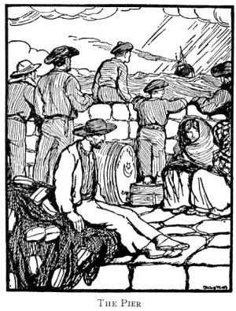

  
[Intangible Textual Heritage](../../../index)  [Sagas and
Legends](../../index)  [Celtic](../index) 

------------------------------------------------------------------------

<table width="75%">
<colgroup>
<col style="width: 50%" />
<col style="width: 50%" />
</colgroup>
<tbody>
<tr class="odd">
<td width="50%" data-valign="TOP"></td>
<td width="50%" data-valign="TOP"><h1 id="the-aran-islands" data-align="CENTER">The Aran Islands</h1>
<h2 id="by-j.-m.-synge" data-align="CENTER">by J. M. Synge</h2>
<h4 id="section" data-align="CENTER">[1907]</h4></td>
</tr>
</tbody>
</table>

------------------------------------------------------------------------

[Title Page](tai00)  
[Introduction](tai01)  
[Author's Foreword](tai02)  
[Part I](tai03)  
[Part II](tai04)  
[Part III](tai05)  
[Part IV](tai06)  
