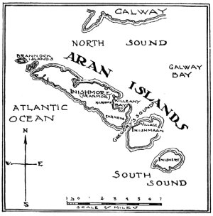

  
[Intangible Textual Heritage](../../../index)  [Sagas and
Legends](../../index)  [Celtic](../index)  [Index](index) 
[Previous](tai01)  [Next](tai03) 

------------------------------------------------------------------------

Author's Forword

 

> The geography of the Aran Islands is very simple, yet it may need a
> word to itself. There are three islands: Aranmor, the north island,
> about nine miles long; Inishmaan, the middle island, about three miles
> and a half across, and nearly round in form; and the south island,
> Inishere--in Irish, east island,--like the middle island but slightly
> smaller. They lie about thirty miles from Galway, up the centre of the
> bay, but they are not far from the cliffs of County Clare, on the
> south, or the corner of Connemara on the north.

> Kilronan, the principal village on Aranmor, has been so much changed
> by the fishing industry, developed there by the Congested Districts
> Board, that it has now very little to distinguish it from any fishing
> village on the west coast of Ireland. The other islands are more
> primitive, but even on them many changes are being made, that it was
> not worth while to deal with in the text.

> In the pages that follow I have given a direct account of my life on
> the islands, and of what I met with among them, inventing nothing, and
> changing nothing that is essential. As far as possible, however, I
> have disguised the identity of the people I speak of, by making
> changes in their names, and in the letters I quote, and by altering
> some local and family relationships. I have had nothing to say about
> them that was not wholly in their favour, but I have made this
> disguise to keep them from ever feeling that a too direct use had been
> made of their kindness, and friendship, for which I am more grateful
> than it is easy to say.

>  

------------------------------------------------------------------------

[Next: Part I](tai03)
