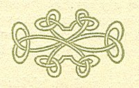

  
[Intangible Textual Heritage](../../../index.md)  [Legends and
Sagas](../../index)  [Celtic](../index.md) 

------------------------------------------------------------------------

<table width="75%">
<colgroup>
<col style="width: 50%" />
<col style="width: 50%" />
</colgroup>
<tbody>
<tr class="odd">
<td width="50%" data-valign="TOP"> 
</td>
<td width="50%" data-valign="TOP"><h1 id="the-druid-path" data-align="CENTER">The Druid Path</h1>
<h2 id="by-marah-ellis-ryan" data-align="CENTER">by Marah Ellis Ryan</h2>
<h4 id="section" data-align="CENTER">[1917]</h4></td>
</tr>
</tbody>
</table>

------------------------------------------------------------------------

This is a collection of short stories set in ancient and modern Ireland,
by a now-forgotten popular author of the early twentieth century, Marah
Ellis Ryan. Ryan was a novelist, actress and activist for Native
American rights. This was her only book about Ireland, as far as I can
tell. She tapped a huge body of tales, lore and song which was being
rediscovered at the time by the 'Celtic Twilight' movement. Her social
consciousness is in evidence here, particularly in the latter part of
the book which is set in modern (i.e. 1917) Ireland.

Ryan's books are now out of print, although easy to obtain used. Her
sentimental prose, which appealed to contemporary audiences, is now out
of style in our cynical age. However, I'm sure that some will find much
to enjoy in this book.

PRODUCTION NOTES: This unusual book was printed entirely in green ink,
and the decorative borders, initials, and endpieces, which were inspired
by the Book of Kells, seem to leap off the page, in spite of the fact
that they are actually monochrome. For this reason I've preserved the
original color of the graphics and the ambient paper texture.

John Bruno Hare, 1/24/2005

------------------------------------------------------------------------

[Title Page](tdp00.md)  
[Contents](tdp01.md)  
[The Druid Path](tdp02.md)  
[The Enchanting of Doirenn](tdp03.md)  
[Liadan and Kurithir](tdp04.md)  
[Dervail Nan Ciar](tdp05.md)  
[Randuff of Cumanac](tdp06.md)  
[The Dark Rose](tdp07.md)  
[Acknowledgment](tdp08.md)  
