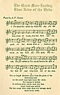
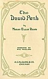
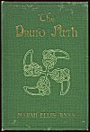
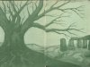
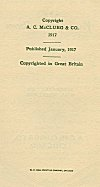

  
[Intangible Textual Heritage](../../../index.md)  [Legends and
Sagas](../../index)  [Celtic](../index)  [Index](index)  [Next](tdp01.md) 

------------------------------------------------------------------------

p. i

 

p. ii p. iii

p. iv

[  
Click to enlarge](img/front.jpg.md)  
  

p. v

# The Druid Path

## by Marah Ellis Ryan

 

##### Decorated by Will Vreeland

 

#### A. C. McCLURG & Co.

#### Chicago

#### \[1917\]

###### NOTICE OF ATTRIBUTION Scanned at Intangible Textual Heritage, January 2005. John Bruno Hare, redactor. This text is in the public domain in the US because it was published prior to 1922. It is in the public domain in the EU and UK since 2004 because the author died in 1934. These files may be used for any non-commercial purpose, provided this notice of attribution is left intact in all copies.

[  
Click to enlarge](img/title.jpg.md)  
Title Page  

[  
Click to enlarge](img/cover.jpg.md)  
Cover  

[  
Click to enlarge](img/endp.jpg.md)  
End Papers  

p. vi

Copyright

A. C. McCLURG & Co.

1917

\_\_\_\_\_

Published January, 1917

\_\_\_\_\_

Copyrighted in Great Britain

W.P. HALL PRINTING COMPANY, CHICAGO

[  
Click to enlarge](img/verso.jpg.md)  
Verso  

------------------------------------------------------------------------

[Next: Contents](tdp01.md)
