  
[Intangible Textual Heritage](../../../index)  [Legends and
Sagas](../../index)  [Celtic](../index)  [Index](index) 
[Previous](tdp02)  [Next](tdp04) 

------------------------------------------------------------------------

p. 35

 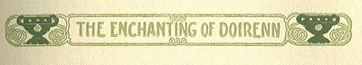

p. 36

[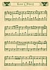  
Click to enlarge](img/03600.jpg)  
  

p. 37

 

# THE ENCHANTING OF DOIRENN

|                      |
|----------------------|
| 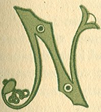 |

OT lucky is it for a man when his own clan gives him low looks, and
Ruadan of Ardsolais saw how the wind blew in the rath of Fethna in Meath
when his kinsmen brought there a counting of cattle, and they grudged
that payment of cattle and grudged twice over the twelve white cows, for
the white cows were the darlings of the herd, and his kinsmen were
coveting them for their own fields. And to Fethna, who was lord of the
judgments in that place, they spoke.

"What is this debt to Cairell?" asked Donn, of his clan. "Far from
Deasmond s the dun of Cairell; far to drive cattle, and waste of time
coming."

Fethna would have been a cloak for Ruadan had he dared, but justice must
have light of the sun.

"It is no debt, and I could wish you made me no asking," he said. "It is
a fine, and it had to be paid when Cairell brought witness and made
oath."

"Why not give to them the tale?" asked Ruadan, and laughed. "If Cairell
and his wife Luaine care so little to have songs of us going round the
fire, what is it to me? Luaine of the white hands can be queen of cattle
for all I am caring. That is the comfortable kind of wife to have for
old age, and she is a fair, sweet body."

"It would serve you better," said Donn, of his clan,

p. 38

\[paragraph continues\] "to take a wife of your own, that your kinsmen
could bring their women folk to your dun, as is fitting. Neither monk's
robe nor wife will you take or will you keep."

"I am not yet brave enough in spirit to pledge my name for every man's
child a woman may take fancy to bring; it takes a brave man for that.
Until I find the right woman it is cheaper to pay trespass in cattle."

"You talk heresy; for marriage is called sanctified."

"So the priests are telling, but it takes more than their words to prove
it so. Make not your quarrel here, because there is no wife in my dun,
when all these coveted cattle are paid by me because there was a wife in
my camp in the forest--ill-luck on that night!"

His kinsmen stared darkly, feeling they were laughed at, but Fethna
spoke.

"It is the truth: the woman followed him, he makes no denial."

"What good of it?" laughed Ruadan. "I left his dun and asked no company.
Every jester in Erinn would have a song of me if I took flight from the
same woman twice. And where would there be profit in it to anyone?"

"There would be profit in that you would not lose the love of Niall, the
king," said Fethna sorrowful, and Donn changed looks with the others.

"True enough," agreed Ruadan, "but if Niall was pleased to give me love
himself, why should he be in anger for the reason that his uncle's
cousin's daughter should have followed after to do the same? How was I
to know? Does a man waste time to ask about grandsires when a lovely
woman would creep under his cloak? Out on you for a lot of cold-blooded
fish! Niall Caille will show temper

p. 39

for a year perhaps, and I'll be keeping my distance till he has need of
a spear."

"Is the favor of a king so small a matter that you pick it up and put it
aside as you will?" asked Donn jealously. "Strange tales have come to us
of other heads with crowns and other friendships of yours."

Ruadan looked at his hand on which a foreign ring shone--a ring of deep
gold and a red jewel in it.

"Rest you easy on that. There will be no cattle to pay there! I was on
the business of the king; and the jewel was given my to the king's
messenger."

"Ask of Niall another gille next time," said Fethna, "for the last one
had tales to tell of Queen Ota and that ring of yours! Turgesius of the
Danes needs two eyes for her alone. Since kings and queens do not come
to me to set fines for loves, I can laugh at that, and leave it to
Niall. But the bards do be making songs of that and even the maids are
singing them in their chamber."

Back of the arras there was a movement and a scuttling of feet; maids
were there listening because the drive of cattle had made talk.

Bevind, daughter of Fethna, was there, and held by the hand Doirenn, of
the deep voice, to listen.

"Do you hive wonder that I give him my looks when queens have given him
love?" she asked, but the girl Doirenn looked her gloom and her scorn.

"How is it that you give looks to him whom they call 'God's Dastard'
when your eyes have looked on goodness in Geroid who has no blemish?"
she asked. "This man has much blemish, and is not in shame because of
it."

"You are as hard on him as the monks, for it was the monks that put that
name on him. It is heavy to carry, Doirenn. To put an ill name to a boy
and hope he walks the white path is much to hope for, Doirenn."

p. 40

Doirenn looked at her, frowning.

"I have not seen his face, yet I am thinking ill of him," she said.
"Geroid would have no light word of women and cattle such as this man
speaks. Give him no looks, Bevind, and no words. It is said that monks
learn holy ghostly things, and, if turned dastard to God, they can use
power for enchantments. If a queen, even a pagan queen, looked love on
him, and a king's cousin followed him, what can it mean but
enchantings?"

Bevind gasped and rolled her eyes.

"I did hear old Aillve tell a tale or enchantment by love, and the man
was old as the world, yet looked young, and he snared maids and took
them to his rath where they were changed to white cats. His forest was
[full](errata.htm#0) of beautiful white cats, waiting for a brave and
pure youth to ride their way and make prayers there; and that would free
them, and nothing else would free them."

"Geroid could be that one," said Doirenn. "All his verses on the tablets
are against enchantments in these days. Here is one--

*Against incantations of false prophets,  
Against craft of idolatry, against spells  
Of women, and smiths, and druids, I bind  
Myself to the strong strength*.

\[paragraph continues\] The prayer of a saint is that prayer, Bevind,
and with it he could ride safe to free all enchanted souls."

"But would he?" asked Bevind. "He is my kinsman more than yours, and the
safe side of a good wall was ever the choice of Geroid when the play was
getting rough. My brothers are wild to fight out the Danes when the time
comes, but Geroid casts no spear for that practice."

p. 41

Doirenn sulked and frowned.

"your brothers have not souls of religion," she said, "they have jealous
hearts because of the high words of Geroid."

"They have jealous hearts because of your own beauteous eyes, and
because not one of them would shut himself away with the monks, and feed
a maid like yourself on letters and on the prayers of the old-time
saints, and that is what Geroid is doing to you."

"The tongue of you is bitter from some poison herb you have chewed on,"
declared Doirenn, "you have no good word for the godly, but many good
words for that swaggering lover of queens and other men's wives. The
more shame to you!"

Bevind laughed again. "Alanna," she said, "he has no love, else he would
have kept Luaine who followed his road. He would be fighting for her and
not paying cattle for her--no--Ruadan of Ardsolais has not yet found
Love, he has only found many fond women. Achone! That I was promised in
troth before I was seeing him, for his kinsmen are saying it is a wife
he should have, far away there, back of beyond where his dun is in the
mountains."

 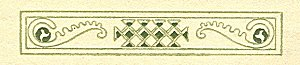

|                     |
|---------------------|
| 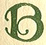 |

OUT Doirenn cared not where he lived, nor when he wived. She carried the
last tablet of Geroid out through the arbor where she could read over
again and again the written words of the lad who was dear and was far.
She unbraided the red gold of her hair, and let it fall about her as a
shimmering curtain. She had days in that sixteenth

p. 42

year of hers when the veil of a nun would have seemed to her a sweet
thing to wear in sanctuary, but the cutting of that golden shower was a
thing to shrink from; and the thought of Geroid was another reason!

 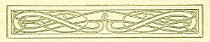

|                     |
|---------------------|
| 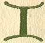 |

T was there in the arbor Ruadan saw her, while his kinsmen fed and
Fethna did a host's duty. At first he could see little but the glory of
her hair and the bare feet under the striped skirt of white and brown.
He was above her on the wall, and stood waiting some movement that her
face might be uncovered.

Fethna found him thus, for she had not moved and he had watched her
long.

"Who is that?" he asked, "or do I dream of magical gold in the shape of
a maid?"

"It is Doirenn, daughter of no man now, for Marvan that was her father,
and all his household, were swept into death by the men of Lochlann, and
the gold of her hair is all the dower the child brings."

"What does she there?"

"She is devoted these days because a queer twist of a lad is devoted,
and hours she reads the prayers he is sending on tablets. It is a game
of young years and is on the love path. She grows tall and nearing time
to wed."

"And she reads the writings?"

"She does, and who wants a cleric in a wife? Marvan taught her as a
scribe ere he went the way--cows and slaves would be a better portion."

"I do not say that," said Ruadan. "Ten years I worked

p. 43

on letters alone in Cluain-mac-noise and books I made were gifts to
kings. There is a joy in that. If in this life I found no house, I may
go back to the pen and color pot after I have covered my circle."

Then the voice of Bevind called from somewhere, and Doirenn stood up and
shook back her golden mane. "She has dower in plenty," said Ruadan.

He listened to her voice and remembered its deep music, and he rode west
with his kinsmen, who planted his fields and counted his herds.

 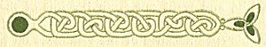

|                     |
|---------------------|
| 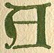 |

MONTH went by, and again he stood at the gate of Fethna.

"Does that maid know me, Ruadan, from Donn or the others of my clan?" he
asked, and Fethna looked at him and laughed loud.

"The last time it was a cattle-fine for a wife you paid, and now you are
coming to ask of a maid and no name to her!"

"There is only one in the world," said Ruadan. "She is Doirenn na
Marvan, and I would have speech with her."

"Sorrow the day," lamented Fethna, "it is not now you would be seeing
that one; grief of the world is on her, for Geroid who was her lover has
gone into the 'Solitary'--far west has he gone down the Sionan to the
ancient cell of Saint Senan on the shores of Lough Dearg. She thinks the
sorrow of the world is hers."

"I would lift that load and carry it," said Ruadan. "You mean to take
her to wed?" and Fethna's face had

p. 44

a frown on it. It was not easy to shift the sails for every wind with
Ruadan.

"It would mean war with me, or a race beyond me to the man who would
offer her less," he said.

But for all the urging of Bevind, Doirenn would not come where he was.
She said he was the contrary in all ways to the pious youth who had her
heart. If she loved Geroid, there could be only hate in her thoughts for
one so near to the evil one as "God's Dastard" was said and was sung.

"She has not seen me," said Ruadan when her refusal came. "Let her see
me and hear me, and let my own ears hear her words."

It was not a pleasant day of joy for Fethna and the family of Fethna.
His own sons were asking the same thing, and the girl had only one
thought, and that was not of marriage.

But after much argument Doirenn put aside Bevind and walked alone into
the great hall where Ruadan--God's Dastard and the darling of fond
women--waited.

White she was, and afraid, but the fear only made darker the blue eyes
of her. Her hair was braided in long strands over each shoulder. Bevind
had dressed her in white and the broidered shoes of skin were white. She
was more lovely than a queen of the Danaan in the ancient legends.

But she stood, a pale, proud, frightened child in her loveliness, and
she looked past Ruadan and not at him.

I came by the courtesy of Fethna," she said. "I do not come by my wish."

Ruadan looked at her and saw the fluttering of the white throat and the
tight clenching of her hand. She looked like a bird trapped.

"And I come despite my wish to go elsewhere," he

p. 45

said grimly. "Child, I saw you once in the arbor and I shall not be
forgetting the seeing of you. I meant not to see you again, but a dream
came to me in the forest and it brought me to you, for you were in it."

She looked at him then and looked away proudly.

"Your dream was false," she said. "It should have been of Luaine who
claimed your cattle, or Ota the queen, whose love gift you wear."

"By the Elements," he began darkly, but she put out her hand.

"I have no desire for speech with unholy men," she said. "Priest and
monk say you are that, and they have a name for it! They tell me you
speak marriage for me, but I have a choice: If Geroid goes into
sanctuary I also will go; I am going. The veiled women of
Cluain-mac-noise will take me without dower. Your dream in the forest
has no meaning to a veiled maid."

"It will have in another time," he said in patience, for her voice had
the sound of tears, and it made a strange ache in his heart. "I dreamed
that you were in sorrow and that I was to offer you shelter. I did not
know your sorrow but I turned and rode back to learn. From Fethna I
learned."

"It is not your sorrow," said Doirenn.

"It may be, and we may live to know it," Ruadan made answer, and strove
to gentle his voice to her sadness, "for I dreamed I saw you in a very
different place--away to the west and in hills I know and by a shore you
never have seen."

"The west!" she whispered. "Geroid is there now, a stone cell in the
mountains of the west!"

"I did not see the cell. I saw you there at a shore I know, and Bronach
the Lamentable was there--the wraith washing the shrouds of mortals. I
woke in the night with

p. 46

that dream, and turned in the night to take the road here. To the people
of my house Bronach does not come for naught. You were in that dream, it
means a bond with our house, and I am here to keep that bond, and offer
what I may."

Doirenn, by the arras, called Bevind and her father.

"You told me of enchantments men make on maids when of evil mind," she
said. "The power Ruadan learned as a monk he would turn to much usage
today. Was it by tales of dreams you witched the ring from a queen's
hand? And witched the Lady Luaine to the forest?"

And then she laughed and went out and left them there. But when Bevind
found her in her chamber she was weeping bitterly and would not tell
them of the dream or the enchantment.

And within seven days Fethna was glad of heart to take her to
Cluain-mac-noise for the year of preparing a soul for the veil. Between
her weeping for Geroid, and the raging of his own sons there was no
peace for a quiet man in his own house.

Thus it was that the golden tresses of Doirenn were covered by the white
novice veil and she began life anew in the great school by the Sionan,
famed for its learning from Gaul even to Egypt.

 

|                     |
|---------------------|
|  |

UT the year of her preparation had not ended when Ruadan again rode to
the dun of Fethna. He was hollow of eye, and his spent horses were glad
of rest and fodder.

"Is there aught of Doirenn na Marvan known to you?"

p. 47

he asked, and the sons of Fethna, who had taken wives and forgotten the
golden maid who had flouted them, looked at Ruadan and laughed.

"How is a man to know of a veiled maid?" one asked. "The walls are high
and the fair ones are well guarded."

"I was on the south shores and I heard her voice; it was her voice,
there is none other like that. It was her voice calling--a troubled
voice."

"How could you hear a voice from the center of Erinn to the south
shore?" they said, but Fethna looked in the fierce face of Ruadan and
bade them be silent.

"Your father Ferdiad had 'the sight,'" he said, "but my thought has been
that it did not come to you because the priests were down on you. They
can take away power if they think of it! What is it you would do because
of that calling?"

"I would answer it," said Ruadan. "No gate of a nun's dwelling would
open for me, but you have women about you. Take one and make a gift, and
let me ride beside you. The call was coming to me and the gift I will
provide. I will pledge them a book more fine than the one of my youth
made for the abbot's gift to Clonard. My hand has not lost its craft--I
vow this thing!"

There was much talk of which wife would go, and the dress to wear, and
to carry, for Bevind had wed and gone north to Orielle. Also the best
horses were to bring in, and food to prepare. Hours were wasted ere they
started on the way.

They would have been as well not starting, for soon they met people in
fright and with awesome news.

While Turgesius harried the south shore and strengthened the Danish
holdings there, Queen Ota, the pagan priestess of terrible things, had
on to the heart of Erinn by the Sionan. She and her brother, Amlaf, had
a fleet on

p. 48

\[paragraph continues\] Lough Rea and Lough Boderg. A fort of theirs was
over at Rinnduin and the lands were ravaged by them. A battle at
Cluain-mac-noise had won the churches and monasteries for the queen.
Monks and nuns were killed, and there was much burning of all houses of
farmers or herders. Not a handful of thatch was left on a house for
miles, and runners had been killed with spear and with arrow.

It was too late for help. The warriors of Queen Ota were on the walls
and in the towers of Cluain-mac-noise. They held the Sionan to north and
south. It was not for nothing that the great night-sun with the tail of
fire swept like a besom over the skies of Erinn that year. The young had
fear on them, and the old went in secret ways to the high places of
ancient druidcraft and made answering fires that help might come their
way if the way of the saints failed them. Though bishop thundered from
the altar, and monk prayed in the cell, yet fires did blaze where the
temples of ancient faiths remained, but no prayer and no spell swept
away Ota and her mate--or swept away that fiery trailing thing among the
stars!

There were those who called it the war warning of the Dane, and the
worst of all the evils it announced was the sacking of Cluain-mac-noise,
because great wealth of jeweled books and costly gifts was centered in
that place.

 

|                        |
|------------------------|
| 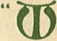 |

HAT of Doirenn who was fosterling of Fethna?" asked Ruadan of the
fleeing host.

"No one is knowing that. Ota likes not women about her except for labor
to save her men. The young and strong may be taken overseas as
slaves--no one can know

p. 49

that. West to the sea along the Sionan Ota has her swift oarmen as
couriers to bring quick warnings, and a fort is there at Luimneach for
all supplies, cattle and horses are held for her, and the people of the
land only live by her mercy to harvest their own crops for her warriors.
It is a sad time under the dreadful star for the people of Erinn."

 

|                     |
|---------------------|
|  |

UADAN looked about the little huddled group, pale with horror of what
had been, and in further dread of what might be: with one army of the
foreigner on the south shore, and one in the very heart of the land, and
the fearful star of danger sweeping the heavens! He took Fethna aside,
and when they were alone he spoke as follows:

"Go you back. This is not the game of an old man. Bid your sons keep
silence as to the call I heard; I had too much of hill and valley to
cover and have come too late. I will take my gille and go a day's ride
farther. I may learn somewhat."

"It is better not to go, and not to know," said Fethna. "When I was
younger than you they stole the maid I was to wed; their ships sailed
out to sea and no word was ever coming back. What is there to do for one
man against an army? What is there for you to do at Cluain-mac-noise? We
can gather men and fight them out, but it will take time. While we are
getting our clans and arms together they will have ravaged the land and
sailed away?'

"That is true," said Ruadan. "Send your couriers to

p. 50

every point while I go on and see as I may. I will be back for a spear
when the time comes, rest you easy on that."

 

|                     |
|---------------------|
| 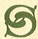 |

O, with his servant, he went on in deep thought and silence, striving to
find ways to answer that call of Doirenn, who held him in bitter
disdain.

When half-mad wanderers were met, fleeing from the Danish scourge, and
smoking ruins were seen afar, Ruadan halted in a grove of little oaks
and washed in the stream and took more sightly apparel from the bag
carried on the horse of the servant. A purple cloak from overseas he put
on, and from the lining of a girdle he took a golden ring with a great
red jewel of beauty, and set it on his hand.

"From here you take the back road," he said to his servant, "and if you
would favor me, and the house in which your family had protection of
spears, this is the time for the favor."

"Tell it and it is done," said the man.

"There may be half-Dane spies among these fleeing people. When they ask
of me tell them I have made quarrel with my clan, and that the monks
call me 'God's Dastard' for putting off the robe and letting my hair
grow as God meant it to."

"It is a hard thing you are asking," said the servant, "for it is myself
has had many a fight, to deny your unfaith."

"I know that without words else I would not be trusting you. Say what
you can to let them think I have cast

p. 51

off my own people to follow Queen Ota and her fortunes. There will be no
need to say it to them, they will say it for you if they are given the
hint. They will call me 'pagan' because I follow a pagan queen. And you
can be sad and of downcast countenance, and say a prayer against evil
for me. Never fear it will get to Ota herself before you get to your
home."

"And where will I be waiting for you, Ruadan?"

"In paradise, man, and good luck to you on the way! Go you back to
Ardsolais. Tend the herds and wait what comes. It is not with chance our
life is."

 

|                     |
|---------------------|
| 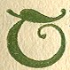 |

HEN he mounted his horse and when his servant looked downcast at the
parting, Ruadan tried to cheer him, and sang words of the hymn of Saint
Colum for a journey.

*It is alone I am on the mountain,  
O King Sun of the lucky road!  
There is nothing to fear on that road*!

*If I had three score hundreds of armies  
To defend the body  
When the day of my death comes  
There is no strong place to hold out against it*.

*Whatever God has settled for a mortal  
He will not leave the world until he meets it.  
Although a high head goes looking for more  
He will not get the size of a grain of it*!

*He that is spent may find death in a church  
Or on an island of a lake he may find it;  
He that has luck to his way  
His life will be safe in the front of a battle*! p.
52

*It is alone I am in a wilderness,  
O King Sun of the lucky road!  
There is nothing to fear on that road*!

 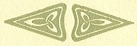

|                     |
|---------------------|
|  |

UEEN OTA, wife of Ragnor who was called Thor's servant,
Thorgille--"Turgesius" by the christian land--was a thing of strange
beauty in her first sailings with the fleets. Flaxen straight hair of a
child was hers--silken straight. Her face had a slim whiteness, and her
eyes of amber were the eyes of a white cat. Men had fought and slain
each other for love of her red mouth and her round breasts. Her raids
were more fierce than the raids of Turgesius or Amlaf, her brother, for
no chief but knew that valor might win for him more than his share of
the spoil if his deeds were worthy her smile.

But many sailings had been hers and much profit from Erinn, and none had
been greater in one place than the spoils of Cluain-mac-noise, in the
year of the Great Star, for princes of Gaul and Alba sent their sons to
Cluain-mac-noise and had sent rich gifts with the sons, until the wealth
at the great place of learning on the Sionan had become the wealth of
kings.

All that wealth of gold and silver vessels and jeweled censor chains,
and crosses of golden wonder, were heaped on the floor of the strongest
of the stone towers. With them were heaped the dreaded magic altar-books
of Erinn, in jeweled cases. Neither church bell nor church cross was
feared by the pagans of the north seas as the mystic writings of the
books were feared--it was dark magic to them, and to be burned or
drowned or buried on every raid.

p. 53

And Ota, wearied after the battle and sick of the smell of old
blood--though the red of it fresh flowing from her opponents was sweet
to her as red berries ripening for her in a garden--went within the
dwelling from which Ronan, the abbot, had been dragged by her men. On a
couch of furs over which broidered silk of altars had been spread, she
rested herself and spoke wearily.

"Let none enter here until my rest is come to me," she said, and the
wife of Amlaf, whose name was Gurtha, looked at her in wonder that she
would confess to need of rest, for the hatred of growing age was with
Ota always.

"But Barolf, chief of your spear men, has been twice here for speech,"
said Gurtha.

"I am wearied of Barolf. When he comes tell him I take it ill that he
troubles me today."

But a man stood in the doorway, broad of shoulder, his yellow hair
reaching down to his gold-banded arms. "O Queen, how has Barolf wearied
you?"

She looked at him and the amber eyes narrowed to golden slits under the
silken flax of her hair. He was a favorite of a year gone, who was
daring much! He waited with folded arms--and Gurtha was watching!

"Yours was the word to the men to burn the bodies where winds brought
stench to me, which is weariness enough," she said. "I am badly served
when Ragnor is south and Amlaf in the north."

"Was it ill service when my men mowed down for you the clerics and guard
of this place, and brought the wealth of it to your feet?" he asked. "No
man of the blood of the queen has done her more service than that."

The queen looked at Gurtha who frowned darkly. Well she knew that Amlaf,
her man, should be first of the chiefs, yet because of his own nature,
was not. His sister, the queen, was the greater warrior.

p. 54

"Another time we will speak of the men of my blood," said Ota, "but this
day of weariness it is enough to say that fires of the dead must not be
built in these days of summer. Illness is on me from that burning. Your
men are strong to dig the earth. Let them dig."

"It will be done," said Barolf, "for the hounds are now full." He looked
toward Gurtha, and his look spoke hope that she be sent away, but Ota
the queen chose not to see the look.

"That is well," she said.

"And the division of the spoils, O Queen?"

"The time for that will be when Amlaf is with us for the counting."

"And that other in the tower," he began, but she made him secret sign
for silence, and he spoke no more.

"When Amlaf is with us I will give you a feast and we will speak of all
the things," she said with less coldness, and at that there was nothing
to do but go.

"He is not of quiet mind," said Gurtha darkly, and Ota laughed.

"This victory makes him look long for the death of Rag-nor, and his
crown perhaps," she said. "He forgets I have a brother to rule beside me
in need."

"Yet he was high in your favor with the coming of May," said Gurtha.

"What of that? Springtime and summer bring different hunger. I am tired
of huge white bodies and blue eyes, I would rest myself with other
color."

"You had that other color on the south shore a year ago, and Ragnor had
a knife ready," warned Gurtha.

"You lie. The man never was with me alone. But there was none like him!
Wine-brown were his eyes, and his curls were shadows of night to nestle
in."

"He has no kingdom, and no army to fight for a queen

p. 55

if he chose one," said Gurtha. "He is only a noble of Deasmond who was
once a monk in this place."

"In this place? That would be strange if it be true, but he looked not a
monk to me."

"No. He was rebellious and cast off the robe, for some anger. They call
him a name of their own--it means outlaw to their gods."

"And I let him go, not knowing that!" said Ota. "I would I had the year
back he should not go!" Gurtha went out and left her regretful over a
year of coveted love with one man, after the many years of love with the
men she had grown tired of.

 

|                     |
|---------------------|
|  |

DAY went by and the spoils were not divided. She carried the key of the
treasure tower at her girdle, and walked among the ruins her fierce
sea-wolves had made, and thought of wine-brown eyes and the searching
smile of a man who had as a youth lived there by the Sionan in
sanctuary.

Kings and warriors had given her wealth of love and wealth of tribute
but the love of an anchorite was a new thought. It charmed her as the
song of a bird of spring after the nuts are ripe and the ferns past
their greening. In a cell of stone she saw one white robe untouched by
ruin, and bade it be sent to the palace of the abbot, now her place of
rule.

She laughed with it beside her on the couch of rich robes and silken
broideries, and closed her eyes to fancy wine-brown eyes beside her.

Then the impossible chanced to her, and gave her strange

p. 56

belief in her own powers in which her devotees believed, and in the
power of the strange trailing star, called "the star of the Danes" in
Erinn.

 

|                     |
|---------------------|
| 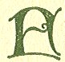 |

OR a runner from the south hills came to her with strange word, and she
put secrecy on him, and told Barolf and told Gurtha that a strong ally
of the nobles of the Irish was coming to swear fealty, and help in the
conquest. One would bring two, and in time all Erinn would be ruled from
the center by the children of Thor.

Barolf secretly mocked, but the other men did not mock, for they had
fought the Irish and would rather have them as comrades than as enemies.

"Strain not your eyes looking," Barolf laughed, and went up the river to
the fort there of Rinnduin.

For all that, they did climb on the walls, and did look toward the hills
of Meath, and when afar they saw one horseman who rode steadily and
without fear, their wonder was great, for he was tall and handsome and
dark Irish, and no other Irish in that day was seeking alone any fort of
the Danes.

"Tell the stranger Ota sees no man of Erinn who comes without gauge,"
said the queen, but she laughed and the robe she put on her was a robe
of richness as if to greet a king of great armies.

"O Queen, the man brings a gauge, and his word is that it was a key of
all gates when you wore it."

"That is true," said Ota, and looked at the ring he sent. "Give it to
his hand in courtesy and lead him to me. It is still a key to all gates
for Earl Ruadan."

p. 56

Ruadan walked between lines of men with lifted spears until he reached
her portal. Two of the elder chiefs entered with him, and Gurtha was
there watching.

"I come without bard to chant your praises or my wishes," said Ruadan.
"I come without men-at-arms or wealth or cattle. I bear no shield for
battle, though I will take one at your hands. My own clan put shadow on
my name because I cast off the robe of a monk. The priests add their
word to my blame, and I will take service with you, Queen Ota of the
ships, or I will go over to Gaul and fight there if you have no spear or
no shield as a gift."

Ota looked on her head men, and saw that the words pleased them.

"We will talk of that gift," she said, and her smile was level and
steady while the head men were there, and Gurtha was there.

 

|                     |
|---------------------|
|  |

UT when they were gone, it was not a gift of shield or spear she would
give Ruadan for the enchantings of his wine-brown eyes. Ota had been
Queen of Love always, and gave royally.

"I brought you--I brought you here!" she whispered. "For a year I have
wished it--and at last you have come to me! You shall be chief instead
of Barolf who grows jealous. A knife from you to him in the dark and you
shall head his fleet."

"Give me the knife," said Ruadan.

She laughed and kissed him.

"So keen are you? O wine-brown eyes! O dark man of

p. 58

the red mouth! Shields and spears are in that corner, and tomorrow we
will make choice. Tomorrow you shall see the spoils of our raid and
choose a jewel gift from me."

"But the man who stands in my way to you?"

"He is gone north in a boat at dawn and no one stands in your way to me.
When he comes again, and Amlaf, my brother, comes, we divide the spoil,
but this night is ours and tomorrow night may be ours. See? I hold a
monk's robe here in memory of you, and dreamed of dark eyes and kisses,
and through the wilderness you brought them!"

Gurtha lied for the queen to the men, but the men laughed, and knew.
They were told that Ota promised a wine feast of welcome to the Irish
earl, and that gladdened them, for they would get their share, and the
wine of the cloisters was good.

 

|                     |
|---------------------|
|  |

HERE was starlight and it pleased Ota to walk with Ruadan in the night.
And the cell where he had once slept was where she would go. It was
whole and in no ways inured. She kissed him there, and asked of his
dreams there, and of the Lady Luaine and the song made of him a year
agone--all things heard of him had been remembered by her.

But he laughed and wound her long cloak of silk about her lest the
river-damp do her hurt, and would not tell her the things she asked.

"What difference does her beauty make when I left all others to follow
you?" he asked. "There is only one queen."

p. 59

The men on the walls saw them and made jests, for the trailing star left
no darkness anywhere. None watched too closely; for their outposts were
many and there was no enemy near for an uprising.

"Tomorrow we look at the spoils in that tower there," she said. "I would
that Barolf be the one to tear the jeweled covers from the mystic book
of Christ's men before the books are burned. There is evil magic in
them, and I want no black enchantment from them. We will have Barolf
live long enough for that work of danger. But go he must. He has wish
for the place of Amlaf, my brother, and it is making troubles."

 

|                     |
|---------------------|
|  |

UADAN looked up at the tower where a white face moved at the narrow slit
in the stone wall--the face did not reach the height of a man. "You have
a guard there besides the key at your girdle?" he asked, and she pressed
his arm quickly.

"Speak not of that before Gurtha," she whispered. "It is a young thing
with a golden mane I am hiding for Amlaf. There is no other place to
keep her from the men, and from Gurtha's knife. Amlaf sulked because of
a girl he lost in his last raid--I need his help to get Barolf out of my
path, and the girl is a fair bribe. I dare not send her to him. When he
comes he can hide her in a boat and take her to the north if she pleases
him. If she please him not, she can go with the others."

"And that is--where?"

"I never ask about women unless I need them. There was a convent across
the raised road, but I see no women

p. 60

there now, and hear none." Then she held his arm with both her hands,
and looked up at him in the dusk and laughed shortly. "The other men may
follow their will in a raiding, and take their women as they choose, but
*you* must take no maid to wife!"

 

|                     |
|---------------------|
|  |

HE sun was high in the morning when Ota the queen took her serving-man,
who was her slave, and her new guest, of the Irish, to the tower of the
spoils. The serving-man carried a dish of food and told Gurtha it was
for a hound with a litter of wolf pups, but he did not pass the tower
with the food.

The outer door was unbarred, and the inner door unlocked with the
queen's key; a ladder was there, and the queen was helped up by Ruadan,
his arm circling her for safety. The slave sent up the dish of food in a
basket by a rope of grape vine.

"There are ladders above and floors above; but the upper door is chained
now because of the red bird caged here for Amlaf," said the queen.

By the narrow slit of the embrasure a girl stood as far from the opened
door as she could get. She was flattened against the stones of the wall
in terror, and clasped to her was a flat golden-brown book, and the gold
of its cover was set with amber disks, and pearls of the sea.

Ruadan of Ardsolais knew that book, for his own hand had wrought it and
it was the writings of Mark the Saint, and the chapter in it was that of
the sermon of the sea, and the great faith when the storm of the sea
obeyed the Voice.

The Abbot Ronan had asked it as a gift for Clonard,

p. 61

but Clonard had been sacked, and he saw again his lost handiwork.

In a corner were many other books--great piles of vellum in their rich
casings. And on and around them were chains of gold, and necklets of
gems, woven armlets, and silver sandals, silver trappings of chariots
and war horses were stacked with the rest, and women's jewels in girdle
or torque, or ring, beyond belief. The sun struck on the heap through an
embrasure and set it all aglitter against the gray stone of the wall.

"It speaks a brave hosting," said Ruadan, and lifted the jeweled shrine
in which a tiny bell of holiness tinkled. He never looked at the girl.

"I will take all the bells for the decking of our steeds when I ride the
forests with you," said Ota the queen.

"Nay, it will not be bells we will care to carry," said Ruadan, and she
laughed, well content, and emptied a leathern bag of altar jewels on the
stone floor. A golden bell and a jeweled chalice were there, and a
wondrous monstrance of gold all aglitter with ruby and amber and pale
pearls. A censor of jeweled chains was there, and armlets and neck-lets
thrust in among the vessels of holy use. Ota lifted from them a gorgeous
necklet set with smoldering rubies.

"This has been gift of some king of the far world," she said, "and it
goes well with the ring you had from me a year ago. I have brought you
to choose a gift; choose the richest you can carry."

"My thought is that I could carry you if your long cloak would not
tangle my feet on the ladder."

She laughed at that, and clasped the necklet on him and loosened the
lacing of his garment that it might be hidden next his skin. Then she
glanced at Doirenn, rigid and white against the wall.

"Look at her face," she said laughing. "If she has

p. 62

looks of such scorn at Amlaf he will not risk the knife of Gurtha for
her!"

"So good a sister should make a good wife," said Ruadan; "few women
would pick so much of beauty in a slave--unless for sale."

"Yes, I am good to my men," agreed Ota. "They are strange children. They
can be starved, and wounded, and beaten, but if they get their toys at
the end of the raid their songs are only victory. Yet--" and she looked
at Doirenn in thought and then turned to Ruadan, "think not because I
would give such gift to a brother, or a husband, that I would allow one
to a lover! So choose your gift from the spoils of kings, O Ruadan!"

 

|                     |
|---------------------|
| 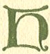 |

E laughed with her and fastened a great gold brooch in her sweeping
cloak. "My choice is only a jewel for your wearing," he said. "Are you
ready to go down?"

"I do not know," said Ota the queen. "Why is that girl staring hate at
us? Ruadan, I like it not. She holds that book of the altar magic and it
may be she works a spell! Ruadan, could it be?" And she clung to him and
stared at the hate in the eyes of Doirenn. "Why do you look frozen? You
have life left you, and food and shelter. You were not counted among the
women for whom lots were drawn. What rage is then yours?"

"The grief is mine that in all that heap of jeweled sacrilege there is
no thing of flint or of iron with edge for a maid of Erinn," said
Doirenn, and from the safe shelter of the arms of Ruadan, Ota gained
courage again.

p. 63

"A knife might be there," she ventured. "You have no task all these days
but to search among this wealth of beauties until Amlaf comes and finds
your beauty."

"There is no knife else only my body would be here for your mockings
this day," said Doirenn.

"Your caged bird of beauty croaks like a battle crow," said Ruadan and
laughed. "There are friendlier places than this place. Come, O Queen!"

"But that book she clasps? It is a thing for fear and why should she
covet that when these jewels are in her reach? Art sure it could be no.
spell she works against us?"

"No, it could not be. What does a stripling maid like that know of
books? I risk your gift in wager that she knows not the readings. Give
me the book."

Doirenn did not give it to him, but she shrank against the wall as he
approached and let go of it. He turned the leaves and looked at her in
scorn.

"There--" he said, and thrust it again into her hand. He took her other
hand roughly and placed her finger on certain lines of the open page.
"There, O young nun of the books, read me that!"

But she only looked at him in horror.

"God's worst dastard--you!" she said.

"What does she mean?" asked Ota. "I need not save her for Amlaf. I can
send her to the men if she does you ill. Was that a curse?"

"No curse: it is only a name the monks called me when I learned I was
not fit for endless pen work, and endless prayers. Come! The wild thing
will not eat while she has us to stare at."

With tenderness he helped the queen down the wooden ladder and drew into
place the stone slab of the floor.

Doirenn gazed after him, wide-eyed, hopeless. He did not turn one look
toward her.

p. 64

Her hand was still on the page where he had thrust it so roughly, and
her eyes rested there, and then she sank down among the jeweled trophies
and stared incredulous.

For there in beauty equal to the jewels about her were the words--"*Why
are ye so fearful? How is it that ye have no faith*?"

 

|                     |
|---------------------|
|  |

HE wine feast of Queen Ota was a victory feast for all. Gurtha was
angered that it was given before Amlaf returned; neither had Barolf
come. Early she went to her sleep, and said in going that if word should
reach the ears of Ragnor that it was a wedding feast, she wanted not to
be dragged forward for question!

But Ragnor was far to the south, the wine of the monastery was old and
was good, and Ota left the filling of her cup to Ruadan of Ardsolais of
the far mountains.

She whispered that his eyes worked magic without the brimming cup of
gold he offered her, but he kissed the cup, and she emptied it, and
talked her dreams of empire--and other dreams.

When the feast was ended he broke jewels from the necklet to give her
women as bribe, and himself bore the queen to her silken couch, and
rested beside her until all was silence, and the last reveller of the
night sunk in sleep.

When the deep hour of the night had come, he took the key from the
girdle of the queen--the cloak of hers, and the veil she wore in the
sun, a dagger and a shield and spear he took from the place of arms, and
the shoes of the queen he took.

p. 65

He listened to her breathing, and drew the dagger from its sheath. He
knew the right thing to do, for one dagger thrust was small payment for
the nuns of Cluain-mac-noise--but he thought of Doirenn and halted.

With the queen living there could be only a jealous rage and a brief
search for him and for the maid. But with the queen dead by his hand,
there would be Thorgille and Amlaf and Barolf on the trail, and all her
devoted men with hate for him and vengeance on the maid. Erinn might not
be big enough to hide her in. Even from his own kinsmen he might get
only curses and hounds on his track when they learned he had stolen away
a maid of the cloisters. Another man might be given good thoughts for
such stealing, but not Ruadan who had paid eric to Cairell, and had worn
love gift of Ota.

To no dun of a friend could he take her, else that house would be
stormed and the place left waste. There was nothing for it but the caves
of the hills until the fleet of Ota was gone from the waters of the
Sionan.

He thought of old forgotten sanctuaries of the early monks, if he could
win south to the Skelligs and lay hidden, or reach to Arran, or hide in
the grottoes of the loughs in Iar Connaught, carved ages ago by De
Danaan magic!

These thoughts were with him as he gathered swiftly the needed things,
and took last reluctant look at Ota the queen to whom he should deal
death. Grief was on him that it must not be done by his hand if he would
save the scornful holy thing in the tower.

So secure were all the guards of the outer walls, and the far points of
vantage, that those of palace and cloister slept heavily and without
care after the wine feast. It was not as an armed camp they rested, but
a safe household.

He kept to the shadow of the walls from point to point and reached the
tower safely. No guard was there, and

p. 66

he unbolted the door below it in silence, and bolted it back of him in
the darkness.

The queen's key served at top of the ladder and he felt that the girl
was again crouched against the far wall.

"Haste," he whispered, "here are shoes and cloak. Take a leathern bag in
which the spoils were carried and thrust the garments in that. We have
muck and mire to wade through ere a boat is ours."

"Give me a knife that I may die here," she made answer. "You are a
greater thing of fear than the northmen."

"Geroid is waiting a call of safety; I am his voice," he whispered.

"Geroid!" and her voice was a flutter of hope. "I will trust his trust
of you, if. . . . you give me a knife!" "It is here to your hand."

The dagger of the queen was passed to her in the darkness, ere she would
take cloak, or shoes, or move a step toward the door.

"Haste!" he whispered as he heard her empty the bag with a little click
of metal on stone, "haste, for the night is brief."

She crept to the ladder but halted as his hand touched hers.

"Put no touch on me," she muttered. "If die I do, it will not be in
handclasp with the queen's lover."

At foot of the ladder he knelt and felt over the flagstone paving in the
dark, and she heard heavy breathing as he worked fiercely among the
rubbish and tossed aside sacks of grain stored there for siege. Then he
found the stone for which he was searching and threw all his strength
into his task.

Doirenn felt a rush of damp air where she stood. It had the smell of the
river in it.

p. 67

"The way is hard and narrow," he whispered. "Also it is wet under foot.
Give me the bag."

"No," she said, "sacred things are in it: the holy book and jeweled
chalice, not to be touched by God's outlaw. I am strong, I can follow."

At first it was dry, then the dampness came, then the water, and she was
wading near to the knees but wading toward the open. A tangle of vines
and brush was to push through and she saw the glimmer of the Great Star
on the still river.

"Steady," he said, and moved up a space where the small boats were
moored. A guard slept in one and Ruadan stood, girdle deep, beside it.

There was enough light to see the bare throat of the man, and strike
true that no slightest cry go out on the night. He twitched once or
twice and lay still forever.

Ruadan unfastened the boat and guided it back to where Doirenn stood,
fearful and alert.

"Get in," he whispered, and she did so, not noting the Dane until she
stumbled and felt warm blood on her hand.

"What is it?" she asked, but Ruadan climbed dripping into the boat and
took up the oars, but did not answer.

He dared not row, lest the dip of the oars be heard. They drifted in the
darkness, making no more sound than an otter swimming in the night.

Doirenn stared at the still thing by her feet, and thence to the still
man of horror, who was perhaps her safety, and wrapping herself in the
cloak, she drew close the sacred helps in which all her trust was.

A late and fading moon came up over the forest as Ruadan used the oars
for speed--they had passed the last fire of a river guard in safety.

The weird light showed the staring open eyes of the dead man at her
feet.

p. 68

"Dead and unshriven!" she gasped in horror, "and you with the soul stain
of blood on you!"

"It is the first of the men for whom Bronach was washing grave clothes
in the dream I rode to tell you of a year ago," said Ruadan. "I saw his
face yesterday, and knew he was the man. When we come to the high reeds
of a meadow brook we will hide him there until the crows find him. There
will be others."

Until the edge of the day they bore the weight of the body ere a rushy
place was reached where a boat could enter leaving no broken reeds near
the sweep of the river. Far in, where a bog would hold the body, Ruadan
stripped him of cloak and ax, and left him to the black earth.

"You make not a prayer," said Doirenn in horror, "though well you were
taught the ways of prayer."

"It is yours to pray," said Ruadan. "My knife did murder for you on him
because you would not heed the warning I brought you from the mountains
of the south a summer gone."

"It was enchantments you spoke, and not warning. The enchantments of men
of evil are things to fear."

"Truth is truth--whether holy or unhallowed," he said darkly.

"Who is Bronach?" she asked after a long silence, while he sought other
channel where the reeds would leave no trace as he swept again into the
Sionan.

"She is the washer of the ford. She washes in the land of souls the
garments of men doomed to die. For my house to see her means death by us
or for us. In a dream you stood beside her in my land."

"The priests forbid," she began, but he stopped her with a gesture.

"Talk me no priestcraft! Bronach is older than foreign priesthood in
Erinn."

p. 69

"If I held not a holy book close in my hands for soul help, I am
thinking the sky would fall on us with all its stars for that saying, or
the water of the Sionan run backward from the sea!"

"It will do that in spite of your book," he made answer, but she gave
him no belief. She did not think the truth was with Ruadan at all.

She watched him in dread and in disdain while he bent to the oars in the
dawn. The boat skimmed. the air like a bird under his tremendous
strokes.

"This is the time of the sun they will be searching," he said. "One
night is all we have in the lead of them, but many oarsmen has Ota the
queen. Their course will be swift after they start the search."

No guards of the river or lake were stationed in the middle land between
Cluain-mac-noise and Killaloe, for forest and meadow and island were
stripped of Irish herdsmen and Irish homes along the Sionan. He toiled
lustily, with the current in his favor, while the day was young and the
way clear, knowing that cover must be found ere midday, and all other
water journeys must be in the night.

When a fair place of shelter came in their path he turned the boat to
the mouth of a meadow brook and crept carefully over the black waters
drained from bogs beyond.

It was none too soon, for his breath was scarce even again from the
labor until a man was seen by them leaning on a spear, moving swiftly
west above the meadow reeds; his head was turned ever from side to side,
searching.

The boat and the oarsmen could not be seen because of the height of the
swamp growths and the distance. But their swiftness was a wonder to
view: it would be a good horse to be beating it.

p. 70

But they swept out of sight, and Ruadan knew the lough toward the sea
was now a place of danger.

"They have no trail, and that is a good help," he said. "Now while the
sun shines there is only the woods for us, and it may be berries or
roots for food."

Far he went inland where the boat was lifted over shallows into a little
still lough under shadow of the wood.

"'Twill serve," he said. "Nothing but the wild cattle may be coming, and
it is a hiding place."

He left her to get out as she might and wade with wet feet in the sedgy
marge. Her looks at him were ill and fearful, and she clutched to her
the bag in which the sacred helps were borne.

"I have no liking for this place," she said, "and it will not be resting
under birchtrees we will find Geroid."

Ruadan made no answer. The labor had been to the limit of strength. He
drank of the cool water and cast himself on the turf. She frowned at the
discourtesy.

"Where is Geroid, O Queen's Lover?" she asked. "It is to him I am
going."

He looked long at her, darkly frowning. He had killed a man for her, and
was risking life for her, yet she had no thought for a creature of
earth, but thought only of that anchorite who had turned to prayer and a
bed of stone, and would not look in her deep, seeking eyes.

"By the Elements! It is to your Geroid you shall go," he swore roughly.
"My thought is that he is in his glory without you, but that is nothing.
Though we circle Erinn to find the way to him, it is to Geroid you will
go! Sorrow on the night you called for help and I was the fool to
answer."

She let fall the leathern bag and sank down beside it--her eyes wide in
wonder.

"How are you knowing that--and you an evil man in

p. 71

an evil world? I did send the call. On my knees I made the prayer that
holy Saint Kieran might help the call go out to some soul beyond the
walls--and you--you--"

"I heard it in my sleep and knew your voice though I had only heard it
when weighted heavy with hate. Also I followed it."

She brooded over that long, and drew the book to her.

"You followed Ota the queen," she said at last, "and you fled in the
night with her jewels on you lest her kinsmen return and spear you to
the ground."

"You shall go to your Geroid," he muttered, and got up and walked away.

So wearied was she that she fell into sleep there in that warm hour when
the wind and the bees and birds all swept drowsily through the low green
branches. So thick were they that a dusk was on the turf, though beyond
their shadow the yellow light of sun was a glory.

It was beyond he had gone, and in her sleep she thought he had gone over
some edge of the world where she could not find him. She woke with a
moan of fear.

She lay there thrilled by a sort of terror that she had wanted him--it
was a thing she could not understand, and puzzling things angered her.
That thought of evil enchantments of his would not go away.

Then, while she framed a prayer against magic and druid spells, a sweet
smell came to her, so close she thought it was part of a dream.

But it was a better thing, for fresh sweet blackberries were heaped
beside her, and a little apart Ruadan sat with his back to her, eating.

She had not known how hungry she was until she tasted the melting
sweetness of them, and then she determined that, on the rest of the way,
she would pick her own berries--there was anger on her that she had not
done it.

p. 72

As she moved away to look for more, he spoke.

"You are not to go from this shadow," he said. "Cattle are beyond, and a
hut of a herder; we have far to go, and meat will be good to have. I am
going in a circle till I come to them, that no track will seem to come
from here, for this must be the hiding place of you."

"And if foreign men are there? If they take you--if I am lost alone in
this place where you bring me?"

"It is not in this place you will be lost. In the dream I saw you to the
west, and that place is yet to find."

No more than that he said, and no look did he give to see if it was well
or ill she liked it.

She crept back to the birchtree shadow, and watched him go, and she held
the book with its precious work and precious words close to her bosom,
and was making prayers on it--the prayers of Phadraig the Saint against
enchantments.

With the eyes of her closed she went over the prayers and over them
again, and the sun was in the very center of the sky. Two wood doves
came close and spoke their loves sweetly in a rowan bush near, and
listening to them was like listening to the silver string of the magic
harp of the god of music, for the silver string has the wood music of
sleep in it.

The sun was low to the edge of the forest trees and was red as a signal
fire of danger when she woke, The doves were flown away, and the world
was very still about her.

He had not come back, and she felt fear at the wide aloneness of the
deep forest and the reedy marge of the wide lough; alone she could not
make her way even to the flowing Sionan or Dearg below.

She looked the way he had gone, and listened for faintest sound of his
step until every droning bee set her heart

p. 73

to thump. When she could bear it no longer, she looked at her knife's
edge, tied the leathern bag of the sacred things to her girdle, and
looking with care to all things by which the return way might be found,
she ran with swift feet to the last point from which he had vanished in
the green.

No living thing was in sight, and she went on more slowly. There was a
hill to climb, and from that height she had hope to see the cattle
toward which he had gone. On the high point of the hill there was a
circle of stones, and two with strange spiral carvings. These magic
places of the old gods had curious legends in Meath, and she drew close
to her the holy things of the altar as she stood in the shadow of the
great stone to look westward over the plain,

The herds were there, but they were only far moving specks, no more size
to them than birds. But among them, or near them, she could see no man.

But the hut of stone and timber at the edge of a wood she did see, and
sat long in the shadow of the huge stone watching for a sign of any
living thing--and no sign was there.

Then she crept through fern and gorse at the edge of the land where the
cattle fed, and dragged herself along the brink of a dark wooded glen,
and the hut was at the wall of that glen, and the look from there was a
wide look for the herding.

A sound came to her, and her thought was that her heartbeat was loud in
her ears from the fear of the still, strange place. And she crept more
close and knew it was not her own heart, for it was a man breathing, and
the breath was a rattle in the throat.

Through a chink in the hut she could see the man, and him a stranger and
a great dog dead near him. The man

p. 74

was stained with blood and was looking with no good looks at something
her eyes could not see.

He was reaching for a long knife with blood on it--far from him it had
fallen--and there was a stagger to every movement he made, for great
weakness was on him.

Yet he watched one way whilst he crept to the knife and fell as if
dying, yet roused himself to creep again a little ways.

The blood of Doirenn went cold from that look of hate on him, and then
blazed keen and hot to learn why the knife. was coveted even in the face
of death.

With the dagger of Ota the queen unsheathed in her hand, she crept to
the low door, and the low sun of the west pierced to the dark corner
where Ruadan lay. She could see no movement of him, yet she knew he was
not dead, for if it had been so, the foreign man would not reach thus
for the knife, or creep, dying himself, on a wounded foe.

She had no plan of attack, yet as he grasped the knife and lifted it
over the body of Ruadan, she leaped through the door, and her dagger
struck deep and true in the neck of the stranger.

He gurgled, choked, and lay still.

She crept back to the wall and sat there, wild-eyed and fearful. She had
not meant to do the thing before her: to strike the knife from him had
been her thought. But the right hand of her had done its own task
despite any thought of hers.

The lowering sun slanted over his dead face, filling her with horror at
the moving shadows of it. Her teeth chattered with chill at the dead man
and dog, and at the other man whose breath she saw lifting ever so
little the lacings of his garment.

It was that piteous little breath, no deeper than of a

p. 75

child in arms, by which she was urged at the last to draw near. She felt
frozen, and the leathern bag with the sacred helps lay without the
portal, but without that help, and in forgetfulness of prayer, she crept
forward.

He lay in a pool of blood, black and stiff. His shoulder bore a deep
gash, and the red tide yet came faintly at each breath. A long slant of
a blade had creased his brow and his face shone gray white where the
dark smear had not touched it. It all seemed to have chanced a long time
before.

That thought coming to her, she went over where the dog lay and touched
it; stiff it was and cold. . . . While she had slept in drowsy rest
under the birchtree Ruadan had fought out a battle of fierceness with
the huge foreign man and the dog stretched there as big as a calf. The
two men had all but killed each other. Each had thought his enemy gone
out of life ere he gave way to weakness or swoon, and the foreign man
had wakened first.

Terror went from her suddenly when the mystery of it went. There was
left only a wounded man for her care, and she knelt beside him and
loosened the lacings of his garment as she had seen the white fingers of
the queen unlace it in the tower.

 

|                     |
|---------------------|
|  |

HE sun set, and the other suns rose ere he wakened to knowledge.
Troubled phantoms of blood and death were with him in his weakness, and
a strange presence he did not know.

It was in a rosy dawn he wakened to know the walls, and how he had first
found them, but the strange presence

p. 76

was like mist of the seafoam--ever about to take form in his mind, and
ever fading again.

And out of that fog of dreams and phantoms of carnage a vision of
Paradise came to him.

It was perhaps the slant of the sun through the mists of the morning by
which the magical thing was wrought, but where the sun-kissed green had
been seen through the portal, there was at once a glory of gold beyond
any glory of saint told him in the teachings. He looked at her and
thought of Brighde, the ever young, when bondmaid to her druid master,
bearing cups and bowls of common things made holy by touch of her hands,

For she stood there with the sun making a halo of her red-gold hair, and
in her two hands was held a golden chalice of richest handicraft, set
with the thirteen flashing stones of beauty.

The chalice was brimming with foam of new milk, and when she saw his
eyes, wide open, she stood silent, waiting, but the look in her eyes was
the look of Brighde, ever the giver, the serving-maid to whom the angels
sang.

"You are a dream, and not truth," he muttered. "You are Brighde the
goddess; you are the fiery arrow of radiance in hearts of men; you are
Love, and you are Knowledge. When the priests could not stamp you out,
they made a saint of your name to hold the worship of you. You are the
vision always beyond a soul--you are only a dream, and I could wish you
truth."

"The warm milk is true as if in a wooden bowl instead of a golden
chalice," she said. "Two days it has been your food, and has served you
fairly."

He drank it as a gift of God, and stared at her.

"And it is a vision come true," he said. "Two days? And I not alone
here. There were others--a dog and a man I killed."

p. 77

"They were dragged and rolled over the cliff of the glen. There was no
other way," she said.

"And this?" he asked, pointing to the mass of soothing poultice on his
shoulder.

"It is anemone, a flower of healing. I but gathered it and bruised the
leaves. The work of that was nothing. The only task of fear was to hold
you from wandering. Too restless were you for the boat and the road of
the Sionan."

"And you did it? I dreamed of your hands touching me; I thought it a
dream of Brighde who was goddess and then saint."

He went asleep again almost as he spoke, for the weakness was yet on
him.

 

|                     |
|---------------------|
|  |

HEN he wakened his thoughts were more steady, and he asked if the golden
chalice had been a thing of dreaming.

"I took it from sacrilege in the tower," she confessed. "It was the cup
of sacrament, and not to be left to pagans if my life could give it
guard."

He looked at her long, with thoughts of that day in the tower, and asked
where her dagger was.

"It is no longer with me--I have taken instead the one of the herder."

"The other had sharp slimness and value of gold and jeweled hilt."

"This, with the horn of a deer for handle, is a cleaner thing."

He thought she meant cleaner than a knife touched by the hand of Ota,
and his well hand went up to his neck

p. 78

where the necklet rested--the gold of it had saved him a death stroke of
the herder.

"This necklet has served its task," he said. "It can take its place with
the other spoils saved by you."

"It has no place among them," answered Doirenn coldly. "I saved only
holy things from sacrilege."

And he saw by that he had said the wrong thing, for she was no longer
the Brighde of tender service--she was a gold-crowned judge who looked
down from a far height.

He held in his memory the wordy condemnation of the priests, and of
Ronan the abbot, but it was easier to endure their revilings than her
frozen look when she remembered the love gift and caressings of Ota the
queen.

"It is to your Geroid you shall go," he said, and looked at her darkly,
and went out from the hut of the herder, though the blue of the sky and
green of the turf were as one before his eyes because of the weakness on
him.

It was better to be in the woods alone with his tranced vision of
Brighde, than to face the cold scorn of the maid who had seen the white
hands of Ota on his throat.

But despite the look, or the word of scorn for him, Doirenn was not at
ease if he was long out of her sight. Never had she outgrown the fear of
what she had felt at sight of the great dead dog and the dying foreign
man crawling for the knife.

There was trouble on her for the thing she had done, and no holy man
anywhere to take her confession and lighten her mind. Prayer she could
make, and did--but for the sending of an unshriven soul to God there was
no comfort, and her thoughts had no sunshine.

Sometimes there was terror on her because she could no longer judge
Ruadan for the stark body at her feet in that first awesome night. From
the rath of Fethna to the garden of the nuns at Cluain-mac-noise had
been all the world

p. 79

known to her. Even in the raid of the Danes on her father's house, when
the black smoke of burnings had left her without roof of her own, or
kindred of her own, she had been borne to safety before the battle.

Of the foreign men who were pagans she thought no more than of wolves in
a pack leaving death on their path, but for Ruadan, called evil, yet
with knowledge of godly things, she could find no gentle excuse--until
her own hand had the secret stain of blood on it!

By that was she made kindred in evil to him, and the shining beauty of
her was under shadow from the thought.

 

|                     |
|---------------------|
|  |

S strength came back and the wound healed, he had curious looks at her,
ever with the book of amber and pearl of sea on the cover. But when he
spoke of it she frowned her reproof.

"It is holy, and it is a safe charm to lead me out of the wilderness."

"Yet is it made by the hand of a man," he said.

"How should you be knowing that?" she asked. "It is knowledge not for
sinful men. My own thought is that Saint Kieran sent an angel to do the
words of this, it may he that a man made the cover."

"It may be," he said. "May the charm of it lead you safely, for another
night we leave this place. I am able. Even Dermot and Grania never hid
so long on the way to happiness as we here."

"There is a difference," she said, and she blazed a rose red at thought
of Grania's love.

"There is," he agreed. "Dermot had to his aid friends

p. 80

and gods. The pagan gods are driven out by christian bells and there is
only the wilderness for us with that white cat on the trail. I must find
hiding for you and leave you there and gather men of the west to serve
as guard."

"I will not be left again," she said. "To be left behind in darkling
wood, or dreary cave, gives me more fear than to be on the way."

She drove in a young cow and braided a rope of vines to hold her for the
killing that food might be theirs on the way, for their journey along
the shores of Lough Dearg must be in the nights, and all movement in
light of the sun was danger.

With his one well hand and her two they managed the killing, but she
turned away her head because the knife brought her thought of the dead
foreign man under the cliff.

Ruadan went through the russet fern and the berry vines seeking the
silky inner bark of a dead tree for the spark of flint and steel, and
when he found it he wandered on to the circle of stones to sharpen spear
and knife on the ancient altar. When he made his way back he saw a
strange thing, for the glen below the cliff was plain before him, and he
stood very still as if fearing the ancient gods had heard his speech of
their fading away. There was a glitter of gold and a jewel among the
ferns below him, and it was not a place for the seeking of such wealth.

He crept forward, and saw the dog and the man who lay face downward as
he had been rolled from the cliff. And it was in the neck of the man the
jeweled dagger had been thrust deep. The sun shone on it through a rift
in the boughs above, and set it all aglitter.

It was the knife of Doirenn, and so deep had it struck that it took a
strong hand to draw it out. Away from there he cleansed it in the earth,
and washed it all in a shadowed rill, and brooded over it in a maze of
wonder.

p. 81

A woman of frankness like Ota the queen he could know the thoughts of.
She said the thing she wanted and took it. If battle had to be waged to
gain it, that battle she fought like a man and took her victory prize,
or put her own foot on the neck of an enemy.

But this thing of radiant scorn and icy piety who thrust her knife deep
and went to prayer was a different breed. He would not have thought her
hand strong enough for that stroke. The edge was turned where it grazed
a bone.

So he carried her secret--and with it the mystery of her.

 

|                     |
|---------------------|
|  |

S they could, they went from the hut of hiding and went seaward in the
nights through the great lough, and hid in forest or swamp meadows or
inlands at dawn, until the churning, quick current was reached, and
there the boat was hidden, and cooked meat stored with the altar jewels
in the leathern bag, and they went afoot through dusk of the deep wood,
or crept, hidden, through lush grasses of wide meadows.

At times, afar off, they saw men with cattle on the hillsides, and a
boat of courier speeding down the rapids. Once a warrior's boat passed
beneath a cliff where they lay hidden, and glittering shields were
bright in the sun.

"Look well," said Ruadan, "for it is Amlaf, the prince, who is on your
trail. A strong man is Amlaf, with king and queen for his kinsfolk. It
may be he could make you queen of Erinn by a lucky turn, for
Turgesius--which is Latin for Thorgille--has great tribute, is not
young, and it is said by all that the threat in the night sky is the
'star

p. 82

of the enemy'; as it grows strong--will grow the strength of the Dane.
If gods fight against it, where is the refuge of Erinn?"

She looked as bidden, and the man in the boat was slender and tawny,
with long tresses of pale silk waving in the soft air. Jeweled he was in
great beauty, and his armor was of white bronze. The blue-green of his
eyes was like the glint of his spear-heads, and the cloth of his garment
was broidered with wires of pale gold.

"He is as beautiful as your lover, the queen," said Doirenn in scorn,
"but not so strong. He will hold no strong star in the sky."

Ruadan looked at her in gloom at the mocking, and after a little he
laughed.

"That naming of her leaves no scar on me," he said. "But 'queen's lover'
suits me ill."

"Is it so?" asked Doirenn staring after the warboat with its deft
oarsman. "Then again are you kin to Dermot who was not the lover but the
many times loved."

He took the mocking blackly enough.

"Sorrow is mine that, like Dermot, I have no bread unbroken to leave on
the road for them that trail us," he said. "And you to your Geroid!"

But she knew not the meaning of the words of broken bread, and he saw
that, and the flame of his anger went out.

"It is ill enough to pass time in rages when our time on this earth may
be ending," he said. "That man below is a strong prince with a strong
army at the shore. Horses and cattle are theirs and one spearsman in
every Irish house of Thomond. No one king of Erinn commands tribute
today like to the tribute of Turgesius and of Ota. Their swarms are here
like bees on honey, and no roof is ours for safety. The caves of Iar
Connaught are safe if we

p. 83

can reach them, with your monk to aid. You may have your fill of life in
a cloistered cell ere the day I can guard you to safety."

"And if--if Geroid is not to be found? And if all roads are closed?"

"Geroid will be found if he is left alive. These hills were once hunting
ground for me, and the cells of Senan's men were known as my own
mountains."

"And, if he is not left alive?"

"Of that we will not speak. If Amlaf, or if Ota, trap us in their wide
net, you will die first, so make your prayers."

She looked at him long, and the shadow on his face caused her wonder,
for she had heard all evil of him but never that he was of faint heart.

"Is it so far to your own domains?" she asked, and never before had she
asked of home or kindred or life of his.

"It is not far as the ravens fly, but my clan have their rages against
me. After that judgment of cattle, not one would take spear for a maid I
would hide on Ardsolais."

"It is said you have good will of Niall the king. How can the friend of
a king be without help?"

"The Lady Luaine is of the clan of his mother, and the grace of a king
can grow cold."

"Like enough," said Doirenn, "she told them of your enchantments."

"Like enough," agreed Ruadan, and there was laughter in his eyes. "A
woman must ever have ready some excuse of magic. Is it enchantment you
are thinking?"

"What else to think when you are dark and not handsome? Wives of men put
jewels on you and follow where you go. How is that but by enchantings?"

"How indeed?" asked Ruadan. "And since you are

p. 84

knowing that, it is a strange brave heart that is in you to drink from
the same cup with me."

"The cup is holy and is to go with Geroid into sanctuary, and the book
with me is holy. That is my strength."

"Since it is so I would ask concerning this godly Geroid to whose
sanctity you would trust them. Since my life is too evil for your
christian grace, what is the saintly enchantment of him, that a
well-favored maid would cover herself with a veil because he chose to go
walking out of her life?"

"Enchantments are evil, and he was never evil," said Doirenn. "He made
beauteous verses and told me his love in them sweetly. He gave me kind
kiss at parting, and only to God would he give himself rather than to
me. No payer of cattle was he, and--no love of a pagan queen!"

"It may be so," said Ruadan. "And when was this high loving of his and
of yours?"

"There is no hurt to him in making speech of that," she answered, "and
it may bear its lesson to you. He had seven and ten years to his age,
and three less to mine."

Ruadan stared, and then strove to seem grave, yet were his eyes full of
laughter and she saw it.

"Yet he could love and he did!" she made protest angrily. "Tablets were
sent to me often and his verses on them told me that."

"Ay, his verses!" said Ruadan. "From the dull days of schooling he would
have some fair thing to hear his calf-loves, and you were the most
gracious! Child, at that age I was writing verse to Venus and Brighde,
and sad at heart for the ghost of fair Dierdre who loved so well! All
the world is turned to love at that age--it is the schooling of hearts."

"I alone was his Venus and his Brighde and his

p. 85

\[paragraph continues\] Dierdre," she said and drew back in proud anger
at his jesting. "How could you, queen's lover and God's Dastard, read
that lesson of loving, or know holiness of such writings?"

Her anger was like a lash, and almost it whipped him into turning the
pages of her holy book and show the writing of his own name there
cunningly twined with the interlaced scrolls of the last page. But he
knew it was not easy to believe that his other days had been filled by
that beauty of line and color. It would be to her but another proof of
enchantment if he should show it her, as he might.

And he put aside the thought for another reason: it would take from her
the only thing to which she trusted as a link with her saints.

"Time is a good story-teller," he said, and his smile was grim enough.
"On a day to come you may know the weight of your words. Come, the
hunter who seeks you is gone beyond sight, and we can cover much ground
ere the dark comes down."

She obeyed him in silence--half shamed because of her anger and his
quietness.

 

|                     |
|---------------------|
|  |

HE still bore the precious book, making prayer on it through all the
terrible ways they trod, but he bore the leathern bag in which the food
and cup and jewels were safe. It was strange to her, but after she had
found him wounded and given him drink from the cup, she no longer
thought so deeply of his evil repute, and since the herder went over the

p. 86

cliff with her dagger she felt less bitter for the other sins on his
soul. But when she found herself thinking kindly of him as a human she
grew angry with herself and went to her prayers.

 

|                     |
|---------------------|
|  |

LL of a day did Ruadan of Ardsolais and Doirenn na Marvan lay in hiding
of the hills where the path to the high cell of Saint Senan could be
seen through the branches. Far beyond was the smoke of the northmen's
fires, and footmen and men on horseback were seen to cross open spaces.
One rider, on a steed of shining black, had much of glittering gear and
waving flaxen hair--it was Amlaf.

"He has had runners in these hills. See, they keep up their stride until
report is made, when they fall anywhere for rest. It is well we hid long
in the herder's hut. Time was given them to make wide their search; it
is over for this place, and that is well for us."

Yet, he watched long for slightest sign ere he crept through the tall
fern and alder and young oak on the hill-side. On the ancient path in
the stone to the cell above he dared not venture until the turn of the
hill was reached, and no human thing in sight.

Like creeping wild things of the wilderness, they thus made their way
beneath the leafy coat of green until the steep path was reached, and it
in the gray stone cliff narrow and winding and curving the hill above
the lough.

Then Ruadan looked at her with the look of parting. "It is here I must
hide you until I go up to that place,"

p. 87

he said. "You see the steepness and the danger. This is the place to
wait where the leaves are thick."

Doirenn made appeal to go, but he would not hear. Then she kissed the
cup from which they had drunk, and fastened close the leathern bag into
which she had placed all sacred things but the book.

"Take these holy things as warrant to a holy man," she said, "lest evil
come to you for intrusion on his pious thoughts."

"And it is not evil you are wishing me then?" he asked, and looked on
her steadily, but her eyes turned elsewhere, and rose color flushed in
her pale face.

"I would not that you die in your sins," she made answer, and his smile
had weary bitterness as she spoke.

"A hundred deaths of dread has a man died for you those summer days," he
said. "Yet that man breathes human breath. The sacred things I will bear
as you bid, lest I could not carry them, and you also, on the second
journey--if I find your saint waiting you!"

"And if your footing should not prove sure, and if death should wait you
on the rocks below?"

He stood still above her, looking down where she knelt with the book
against her breast.

"Here is my answer to you," he said, and tossed her his dagger. "That is
the better part of Ruadan. Give the blade deep to drink if the eyes of
Amlaf, or of Ota the queen, look on you again."

"And you?" she whispered, "it leaves you without a blade for danger."

"Not so, O Doirenn," he said; "I have a dearer thing."

And he showed her the jeweled hilt of her blade of death.

She went white and covered her face, and he moved carefully along the
narrow ledge with his burden and

p. 88

shield and spear, up and up until he noted birds fly out from nests in
the crannies far below. Then a sharp turn came in the rock, and the cell
sanctified by holy men for two centuries was the end of the narrow way.

 

E man knelt there by the stone trough which served as bed, and no other
thing was there but a cauldron on dead ashes, and cup and bowl of wood.
Some moss was heaped in a corner, and birds' eggs were in the bowl.

"God's blessing on the home," said Ruadan in courtesy, but the kneeling
man whirled in terror.

"Why have you come again? And why do you now speak in clear Latin and
not before?" he asked, and his voice was high and shrill like that of an
angry woman--much more like a woman even than was the deep voice of
Doirenn.

"I am come because that is my task," said Ruadan. "If you are Geroid of
Cluain-mac-noise, I have gift and message for you, and I am Ruadan of
Ardsolais."

The monk cried out in horror, and waved him away.

"Man of blood and traffic in evil!" he said. "Begone from this place of
prayer. Twice come the Danes here in search, with tales of your murders,
and your stealing of maids. If they find you here it will be evil to me.
Get you gone!"

"A man of blood I have been, and may be," said Ruadan, looking in the
pale, narrow face and the eyes of terror. "But I am also a keeper of
sacred things, and it is your task as a man to help me in the guarding
of them."

p. 89

"You! You were the outcast--God's Dastard--the youth of holy training
who threw off the robe for temptings of the world," said the monk, and
he moved the width of the cell away and spread out his thin hands as a
wall, lest Ruadan move a step nearer. "Go back to the world and bring
not your evil here where holiness has lived--here, where in prayer I
wait the crown of sanctity and the wings of angels in Paradise!"

"I will go back when I have done my task. I bring here gold vessels of
the altar that you may know my intent, and below a more precious thing
waits for sanctuary--it is the maid they told you I stole away--it is
Doirenn, daughter of Marvan. It is a body and soul to be saved by you,
and by me."

But Geroid fell groveling beside the stone couch, waving his hands in
wild protest.

"Take your evils from this place," he cried out. "Have I fought the
demons of woman-temptings for naught? Seven times seven days in the
spring of the year did I pray in water of ice to my armpits. Nine times
nine prayers have I likewise made to that end, for youth is still on me!
Is it from the King of Hell you are come to bring temptings of women who
breed the evils of carnal loves?"

 

|                     |
|---------------------|
|  |

UADAN stared at him as at a wild dog he would throttle, and then let
fall the sack, looking at the wasted form and the wild eyes. He tried to
see where her human youth of the verses was hidden behind the grievous
mask, and could not.

p. 90

"I need teaching to tell me that love is of Hell," he said. "In a swoon
of half death in a forest I had a vision of love with a difference. It
was a radiant love, bearing healing for human ills--yes--and it shrank
not from soiled hands, or blood-stained hands, in the service--that was
my vision. You, monk that you are, have had more than vision: As
children, Doirenn and you have gone with clasped hands and no wall
between you. She has heart-love for the remembering of that time and she
has come the hard way for your help above all men. You look not so much
to me, but the priests tell us you are made in God's image. No god of a
man can be a coward, and we may have enemies to overcome ere we get her
to safety, but I am here to help, and that is my message."

"Go you hence with your sacrilege. Holiness does no battle," said Geroid
wildly. "Go . you hence to your bloody wars for women and cattle and the
things of the world. Leave me in peace with my God, and the saving of my
soul."

Ruadan listened and laughed.

"To save your own soul? By the Elements! I have belief in no man, and in
no god of a man who hides in safe sanctuary when white innocence flees
from the ravisher. To sanctuary here has come Doirenn who deems you
holy. If you cast her out, she has only Ruadan as safety. And all Erinn
can tell you Ruadan boasts no holiness."

"Get you gone! Your ways are bloody and fearful and your ways are evil."

"Not less evil than the weight of my hand on you if you hearken not,"
said Ruadan darkly. "Two holy gifts have I borne to you through much
danger, for the cell of a monk would seem best hiding place. One is
this," and he emptied

p. 91

on the floor of the cell the gold and gem-set things of the altar, "the
other is a human soul in a fair body, which, O praying monk, is the
holier thing for your shelter. This is the time for the choice of a
man."

The monk lifted the jeweled chalice and gloated over the golden
monstrance with each ray of the sun set in crimson and rose and yellow
gem.

"The man who wrought this work had help of the angels of God," he
whispered, and made the sacred sign as he lifted each treasure.

"What of the handiwork of angels in the creation of the stray maid of
warm life, and music of voice and eyes of pureness?" asked Ruadan. "Look
at this hand of mine. It has been a craftman's hand in the work you
adore there; it has been a bloody hand in the work you hide from here,
the work of the world! It is a strong hand and not yet a conquered hand.
Yet it shakes, as my soul shakes at thought of that fair creation when
God spoke Doirenn into this world, of ours. Make your choice of the
holier thing, O monk she deems holy! This is the time for your choice as
a man--and by your choice and hers, Ruadan abides."

"Get you gone from holy ground with your sacrilege of creation and
Hell's vision of carnal loves!" screamed Geroid, and held the monstrance
of red gold between his own body and Ruadan. "The things of holy altars
I will hold at God's will, but name no name of woman in the ears of
God's chosen--they drive out the music of angels' wings!"

Then a cry came to them--the cry of a woman, and close, and Geroid fell
on his knees in terror, and gathered close the glittering jewels, and
Ruadan unslung the short spear from his back.

"It is the time for the choice of a man," he said, and

p. 92

sped as a cat along the narrow path to the turn where he had last looked
down on her.

But a man on a black stallion waited there instead, and the face was the
face of Amlaf, brother of Ota the queen!

 

|                     |
|---------------------|
|  |

E looked up and laughed, and the thing he laughed at was Doirenn, who
stood on the narrow ledge waiting Ruadan, and in her hand was his
dagger.

"You were so keen for his choosing that your heart could not wait that I
save your feet this hardship?" said Ruadan, darkly mocking.

And the monk in the cave, and the prince on the black stallion, were as
far from them both as was fear, when she looked in his eyes.

"I followed, O Ruadan, lest he do you harm for your life as a man of
sin. And I listened, O Ruadan, that your dagger might in truth drink
deep if you made me his portion--and you going elsewhere," and his
dagger was held with the book, in love, against her breast.

"To my heart!" he said, and circled her with his arm, and she was borne
along the path by him while his eyes searched below for glitter of
spears or followers of the prince,

Amlaf fitted an arrow to his bow and waited the turn where Ruadan would
be fair target without hurt to the coveted maid of beauty.

But the hand of Ruadan, thrilled by the love of her, was strong and
steady. His spear had been sharpened at the altar place of the old gods,
and the cast of it took Amlaf in the throat as he looked up laughing.
After that he

p. 93

laughed no more on earth but went to his own Norse gods of the summer
sailors.

Ruadan stripped him of his warrior garb, and weighted the body with
stone, and cast it in the waters of Lough Dearg, while Doirenn stood on
the shore holding the quivering steed, alert at the presence of Death.

Ruadan looked about him, and looked at the girl, whose face was a
drooping flower, and whose hair was a golden veil.

"Look up, O Doirenn," said Ruadan, "for this is the end of the dream!
This is the shore on which I saw you with Bronach--washer of raiment for
the dead, Beyond this all is dark to me on the road."

"Not so," she said. "We have walked together through the nights of the
evil star, but now the light is ours."

He caught her to him, and kissed and mocked her.

This is all your prayers and your glittering book served you against
enchantings," he said.

"They served me well," she made answer staunchly. "In the sickness of
the wound I prayed for your life. Here, where you left me, I prayed that
Geroid might take into sanctuary the altar jewels but leave me free for
always to walk with you."

 

|                     |
|---------------------|
|  |

MONG the Manes, that wood by Lough Dearg gained weird tales of Irish
enchantings, and the reason was that Amlaf the prince had ridden along
the marge for his pleasure one summer day, and never came again into the
sight of mortals.

Belief it was in these enchantings and in the powers

p. 94

of the mystic books of Christ's men that went far to lead the invaders,
also by this time weary of their raiding, back to their own shores.

 

|                     |
|---------------------|
|  |

AR north in Connaught a youth in dress of the northmen was seen with
Ruadan riding a black steed with royal chains of silver in his
furnishings. The cropped hair of the youth was the color of the sun, and
Latin was his only speech. He was named Angus and called a prince of the
foreigners, but heart-companion to Ruadan. Not while Ota and Turgesius
held sway in Deasmond did Ruadan go south out of Connaught, or let the
youth see the lands of the south.

And when he went again into his own domain of Ardsolais a woman of
mystery rode beside him, and for her radiance of beauty she was thought
a fairy mistress such as men of olden time had met at some edge of the
mortal world.

He called her Brighde the Beautiful, and all the people were calling her
that, and she was his wife, and the cattle of Ruadan stayed on his own
hills after she came.

 

|                     |
|---------------------|
|  |

ECAUSE of the vanishing of Amlaf the prince no Danes climbed again to
the cell of the solitary monk, and after the weakening of the Danes the
stories of enchantment there went abroad far and wide, and it was a
place to shun both day and night, and no one was remembering

p. 95

the young monk who, in that year of the fearful star of Turgesius, had
climbed that hard way for holiness.

 

|                     |
|---------------------|
|  |

UT in after years, a strange harmless babbler appeared one day among a
herd of cattle in Thomond, shouting to them of heavenly crowns and wings
of angels.

He had no clear speech to men, and was called the "Nameless" for the
reason that no clan knew him, and he knew no mortal and no home.

His dress was of skins, and his hair and beard were his only mantle to
the middle. Neither in Gaelic nor in Latin could his life be learned,
but no door was closed on him nor food denied him, for gods and saints
were known to come under secret and lowly guise to the abodes of men.

And on a fair day, after seven years, Doire, the childling of Ruadan,
divided a cake with the Nameless on the green, and then led him, as a
child with a new playmate, through all the garden and to the grianan
where the wife of Ruadan sat with her maids and discoursed of the day
when the master of Ardsolais would come again from the wars.

All said, "God save you, and Mhoirre bless you," to the visitor from the
wilderness, and food was given and the child watched in wonder that a
mortal could feed as the hounds fed.

"The name of me is Doire, son of Ruadan, who is lord of the mountain,"
said the boy. "You have eaten my cake and come in my gate; tell to me
now whose son are you?"

p. 96

But the Nameless stared vacant and seeking, and made mutterings, and all
they could hear from him was "Ruadan? Ruadan--Ruadan?"

Then the wife of Ruadan, who was called Brighde the Beautiful, called to
her son Doire, and whispered in his ear a secret saying, and the lad ran
back and spoke.

"May it be that you were once the son of Kineath? And that your name was
once Geroid?"

At which saying the Nameless stood up in fear as if for flight, and
cried out, "Kineath--and Geroid--and Ruadan! Ruadan and she who was
weighed in the balance with the jeweled chalice? Call you your druids,
or your priests of wisdom, that I uncover the place of that hiding! Go
you in haste ere the mist again covers the knowing!"

In haste they did go--all the maids aflutter, and the wife of Ruadan sat
in the shadow ordering all things, speaking no word aloud.

And Fergus, her cleric, came in haste from the oratory, and made prayer,
and hearkened, and the Nameless spoke in good Latin, and said:

"Take with you this childling who lifted the mist from me. Go you to the
cave in the mountain over the Lough of Dearg; to the cell of Senan the
Saint find you the way; and in the stone trough of the bed there find
you the jeweled chalice, and the golden treasures. They were the bribe
of Hell to bring temptings of the world. Let them be weighed; let them
be put in the scales against my name and my soul in the Day of days!"

"Against whose name will I write it for that day?" asked Fergus, "and
against whose soul?"

But at the question the Nameless turned away and shook his head. The
mist had again fallen, and he wandered again to the fields babbling of
crowns and wings.

p. 92

"He is but a strange innocent," said Fergus, "and has no likeness to
owners of golden service and jeweled treasures. It would be as search
for the many-colored palaces of the magical Danaans under the hills
about us."

But the wife of Ruadan had a different thought.

"What the search may uncover rests with God and Mhoirre," she said. "But
a sign has been sent to the son of Ruadan, and to him the honor will be
if precious things or holy things are in that cell of a hermit. Take
horses and take men, and take Doire, our son, to that place of the cliff
on the shore of Dearg, and take well-cured skins and ink for the record
and witness. Every jewel write you down as count is made, and every
other thing of treasure. If it be that they are holy things of Senan the
Saint, their blessings may descend upon another altar."

Thus it was done, and great glory went to the son of Ruadan, who
uncovered the jeweled chalice, and wondrous other golden altar service
buried under moss, and shells of eggs, and bones of animals.

 

|                     |
|---------------------|
| 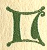 |

EGENDS grew up about that finding, for after they were blest by the
cleric that no evil thing might leave smirch on their beauty, they were
placed with prayer in the oratory, and on the altar beside them was
found in the morning a jeweled book of holiness, thick set with amber
and pearl. No book had been found in the stone cell, and Fergus, the
priest, had never before seen or heard of it. Many viewed it, and all
thought it had, without doubt, belonged to Senan the Saint, and after
two hundred years of death he had come back to gather

p. 98

together the things once precious to him on earth as a proof to pious
souls.

This was the thought of Fergus, who had a pride in the holy honors sent
to the roof where he was sheltered.

 

|                     |
|---------------------|
|  |

ND when Ruadan came back victorious from battle with the Danes, it was
Fergus who discoursed to him of a great church as their shrine. He made
clear that the wife and son of Ruadan had strange gifts and powers of
knowledge. If they were christian gifts it was well for their souls, but
if the power was of pagan strength, then fastings and prayers should
lift the last doubt. He reminded Ruadan that his own peace with the
church was not yet accomplished, and that there were strange tales of
how the mother of his son had ridden out of the wilderness on a black
stallion and no clan and no country had been named for her claiming. The
trappings of her steed were those of a king, and she wore coat of mail
like a young warrior of the sea gods, riding out of the waves. No word
to her confessor told of her life before that day, and there were times
when the soul of Fergus was troubled over these mysteries, and was
craving more altars to the saints at Ardsolais.

"That is well enough," said Ruadan. "She shall have a temple of her own
fashion for the housing of her sacred things--women and priests have
hunger for such. Guard you the souls by prayers in the temple, Fergus,
and my spearman will guard the temple if our shields are lucky. That is
the task of the man."

And with his wife, the Beautiful, in her bower, he

p. 99

laughed, and stroked her white shoulder, and mocked as was his wont.

"Thus I pay for temples to guard your soul from enchantments," he said,
"for Fergus the priest finds you in a grievous way."

 

HE mounted the black steed and rode beside Ruadan with Doire, their son,
and sought a fair level on a green height where huge stone slabs stood
upright with other slabs resting on them like high altars. It was the
place of ancient fires and for that was called the Hill of Lights.

"Here, by this circle, are the hearts of the people," she said, "for at
new moon they are coming, and at the rise of sun they are coming in
certain summer days. Why build the new altar in another place?"

She paced with her child the great space where the new temple would be
built for sinners, and the eyes of Ruadan looked their love on her, and
on the son she had borne him.

 

|                     |
|---------------------|
|  |

ND in the edge of the wild field where the forest came down from the
mountains, the cattle lifted their heads as a man, hairy and clad in
skins, strode among them with proud authority shouting to them of crowns
and wings.

"Whose is the voice?" asked Ruadan.

p. 100

And his "heart-companion" of the wilderness touched his shoulder and
spoke low and awed.

"That is the voice of the man who saw no holiness in battle to protect
the helpless--it is the voice of the man who saw in love only the mating
of beasts--and his reward is his."

 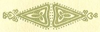

 

------------------------------------------------------------------------

[Next: Liadan and Kurithir](tdp04)
