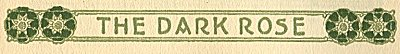
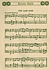
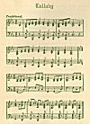

  
[Intangible Textual Heritage](../../../index)  [Legends and
Sagas](../../index)  [Celtic](../index)  [Index](index) 
[Previous](tdp06)  [Next](tdp08) 

------------------------------------------------------------------------

p. 267

 

p. 268

[  
Click to enlarge](img/26800.jpg)  
  

p. 269

 

|                      |
|----------------------|
|  |

*ND gun-peal, and slogan cry  
     Wake many a glen serene,  
Ere you shall fade, ere you shall die,  
     My Dark Rosaleen!  
     My Own Rosaleen!  
The Judgment Hour must first be nigh,  
Ere you can fade, ere you can die,  
     My Dark Rosaleen*!

The lad Hugh scarce knew he was breathing the words, singing through his
mind. Old Shamas Ronayne had been telling over the tale of Red Hugh
O'Donnell, dead in Spain three hundred years ago, yet alive and youthful
over all the land where his song of the dark rose was sung.

*My Dark Rosaleen*!  
*My Own Rosaleen*!

"And he also had the name of Hugh on him. It's myself is wishful I could
see a man like that in our own day--Shamas swears they don't make them
any more."

He followed the sheep up through gorse and fern in the Kerry hills, and
cut himself a rude flute of alder, and strove to catch the notes of the
song on it, and tried again

p. 270

softly whistling with a blade of grass held over his lips, and gave both
up for the murmured words:

*O my Dark Rosaleen!  
     Do not sigh, do not weep;  
The ships are on the ocean green;  
     They march along the deep*!

The drifting glory of the clouds, silver and luminous and softly gray,
made wondrous forms and pictures against the blue of the sky, and the
deeper, darker blue of the far sea. He drowsed there over the mystery of
*Rosaleen*--had she been a maid beloved and estranged? Or, was she,
indeed, a dear secret name for the shadowed land for which O'Donnell had
fought and from which he was self-exiled?

The *suantre* of the sleepy winds lulled the lad into slumber before he
decided the centuries-old mystery, but it remained with him in a misty
dream, and in the dream he saw that the dark rose--the hidden rose--was
a Leanan Sidhe, a fair mistress of the Secret People whose magic palaces
were hidden under ancient raths of green, and where legendary heroes
waited the mystic music of the awakening on Erinn's day of destiny.

There was, in this confused dreaming, more than a little of the tellings
or the singings of old Shamas by the peat fire in the long twilights. A
glen on the Kerry coast, where the sea-rovers of thirty centuries agone
left records on the white strands, is a wonder-place for dreams. Queen
Banva of the rath on Slieve Mish gave her name to the island in that
place and was consort of King of the Forest in far-dim days when the
forests were mighty and the great brown deer ran in countless herds and
were gentled and gave milk only to the music of the voices of
maidens--and the soothing and crooning and gentling harmonies of that
music remain today, and is called the "music of

p. 271

\[paragraph continues\] Fairie," and men wonder at the sweetness of it,
and the living spirit of it.

The giant deer are gone, and the forests of wonder are gone--and the
speech of that day was long forbidden--only the spirit of the music has
lived in the hearts of the children of Banva.

 

|                     |
|---------------------|
|  |

O the lad, Hugh, whose head was ever filled with one old legend, or
another old song, merged crowned Banva the Fair, and a nameless fairy
sweetheart, and the dark mystic rose-maid, immortalized by Mangan, into
his dream there on the hillside in Kerry, and had grief that each was
sad, for their tears were falling and his words of comfort were useless,
and the music of the song came to his help, and he awoke himself with
the whisper:

*O my Dark Rosaleen!  
     Do not sigh--do not weep!*

But it was not tears at all that were falling on his face and his hands:
it was a swift, showery rain falling between two great blue and sunny
plains of the sky--just one drifting cloud of rain from Slieve Mish, and
it above him!

The sheep were over the hill and beyond, and guilt was on him as he ran
after, pelted by the rain.

Through the gray mist of it he could see the patch of white they made on
a sunny knoll toward which the shadow of the rain-cloud was moving.

But a nearer sound came to his ears through the swift drive of the
shower--the bleat of a lamb, astray from a heartless parent. He stood in
his tracks hearkening to it,

p. 272

for it sounded from the druid rath above, and it was a queer place for
the straying of a lamb up there among the bare stones when there was
good grass, and that green, all below it.

But he ran across the old hill road and up the other side of it to where
one hawthorn shone white in bloom at the summit.

It was a stiff run in the pelting rain, but the sounds were nearer each
step. He crossed one circle of the long crumbled earth wall, then
another, and plunged in between the standing stones and, breathless,
dropped down on the stone paving with the rescued lamb in his arms.

He was guided to it more by sound than sight, for the shower was now a
tempestuous gray wall of falling water, and with his treasure-trove he
moved back under the shelter of roof formed by three enormous slabs.
Once it might have been an underground temple, but the earth about it
had washed away, and it was like nothing but a shadowy tunnel of great
stone--and other great stone slabs fallen about.

He wiped the water from his eyes, peering out the way he had come, and
then settled the lamb beside him and leaned back to wait the sunshine or
the lessening of the downpour.

But he straightened quickly at what he saw in the shadow of the other
wall, and the heart in him gave a great leap, for he had met one of his
dreams, or a queen of a legend come alive again!

For a girl sat there in a greenish-gray dress, and touches of scarlet in
the lining of the cloak over her shoulders. It was the cloak made the
picture so complete in the ancientness of the suggestion--he could not
know it was an idealized copy of a Connemara hooded cloak.

The two young things sat gazing at each other as if

p. 273

entranced. The face of Hugh was white, yet not with fear. There was awe
on him, but there was also joy, for, much as he had dreamed of the
queens of beauty in old legends, not one dream held as much of charm as
the uncrowned maid whose garb was so near the color of green
lichen-covered stone that he feared she would fade back into the shadows
of it.

Then she smiled in an adorable way.

"I saw you sleeping in the bracken as we passed up the old road," she
said. "You looked like a picture of Shelley I have."

Hugh had not ever heard of that name, but there surely were many names
in the old legends not known to Shamas, who was his one great historian.

"That is an Irish name, I think, but it is not mine," said the lad
politely. "I am Hugh of the glen below, and I am thinking it is yourself
would be Banva or Maeve but for the dark hair of you--and the dark
brightness of the eyes of you."

"Maeve--Maeve?" she repeated and regarded him with twinkling humor. "Is
it Queen Mab you mean--of the fairies?"

"It is--but she was a fair-haired woman, and nothing like you at all. I
could not make guess at the name on you, yet it has the right to be a
bright name, and beauty in it."

"You would not guess it ever, for it is no queen in a book," the girl
said with a little ripple of laughter. "It is common as the bracken, and
more common than the hawthorn in bloom there by the stone pillar, for it
is Rose."

"Rose! the dark rose? Dark Rosaleen?" And the voice of Hugh was a
whisper of awe. "I think now you are Maeve indeed, witching me with that
name!"

"You are silly from tending sheep too much," said the

p. 274

mocking beauty. "Why should a fairy witch you? And why should it be with
my name? The dark rose! Am I then so dark? You are not polite as I
thought you at first--and I wish the storm were over."

Hugh caught his breath in a real terror at thought of her anger.

"Ah, it is tricking me you are," he said, "for how would you not be
knowing that the dark rose is the dearest flower growing to every one of
the real Irish? Since Hugh O'Donnell was making that song away there in
Spain, and since Mangan turned the verse of it to 'Rosaleen,' that rose
is the sacred thing in many a breast. Shamas Ronayne was telling that to
all of us boys, and he is wiser than most. I went asleep thinking of
you, and singing the song, and--glory be to the name!--was it that was
bringing you here to this far-away rath?"

"Thinking of me--and singing the song? Hugh of the glen, how could you
think of a stranger you never saw or heard of? And what was the song? I
said you looked like Shelley, the poet, and maybe it's a song you made
yourself."

The color flooded his face at that, and she clapped her hands gleefully.

"It is--it is--it is!" she chanted, and smiled at his blushes.

"It is not then!" he denied awkwardly. "I have tried to find words for
songs, and I did sing them to the sheep--as you maybe know," he added
cautiously, "but how could a shepherd know all the man-thoughts of
'Rosaleen'? No, young, dark rose-lady, it was only one man made
that--and the heart of him dying in him with the sickness for home. He
had only thirty years of life, had Hugh O'Donnell, and Shamas was
telling us that the poets of Ireland die in youth for the reason that
the People of the Hidden

p. 275

\[paragraph continues\] Raths want verses and music under the green
hills, and they call the young away while their dreams are on them."

"You are a very queer boy," she said, "and I won't believe there was a
song of any rose until I hear it."

He looked at her doubtfully.

"You may be having the Gaelic?" he ventured, but she shook her
dark-ringleted head. In his heart he thought she was but trying him, and
probably knew all the tongues of all the lands of the earth.

"Then I'll be giving you the Englishing Mangan made of it; but the words
will not sing themselves to the Irish air O'Donnell made; but that is
right enough, too, when you think of it. Second-best music is good
enough for the English who smashed the Irish harps, and this is a verse
of it. There are many verses to 'The Dark Rose.'"

And with the lamb snuggling under his arm and the slanting rain making a
gray veil of all the outer world, Hugh threw back his head, unconscious
of lack of training as a meadow lark, and sang--

*I could scale the blue air,  
     I could plow the high hills;  
Oh! I could kneel all night in prayer  
     To heal your many ills!  
And one beamy smile from you  
     Would float like light between  
My toils and me, my own, my true.  
     My Dark Rosaleen!  
     My Own Rosaleen!  
Would give me life and soul anew,  
A second life, a soul anew,  
     My Dark Rosaleen*!

The girl leaned forward, watching him, as startled at the boyish song as
he had been at sight of her.

"That is a song I never heard," she said, "and it is a lovely one; but
what does he mean by 'a second life'?"

p. 276

"I never heard anyone asking that," said the lad, wrinkling his brows.
"I will be the one to ask Shamas of it, for I heard him say there was no
line of that song without a meaning to it."

"Who is Shamas?"

"Sometimes he is a tinker, and he has made more than one circle of
Ireland in his time. He was the one to be teaching us 'The Dark Rose,'
and telling us of the poets of the ancient old days when a poet was
highest man in a kingdom, and no gifts too great for him--I'm thinking
that was even before Padrig was coming over with the bells. I'm wishing
you had the Gaelic. Shamas has poems by the hundred, from the songs of
Dierdre, and Liadan (whose home was right here in Kerry itself)--down to
the March of Brian, and the Coulin, which he is singing at me often
enough--and him laughing! But it is in Gaelic all the words of them are,
and no English words fit the music at all. I'm thinking you should have
the Gaelic, Dark Rose."

"I wonder if I should? My nurse knew Gaelic, but they laughed at her
songs until she grew silent, and then they told me she died. I was
little then."

She sat thinking a moment, humming softly in a gentle croon and moving
her head to keep time to the melody while the eyes of Hugh grew bright.

"You do know it, you do!" he said joyously, but she shook her head.

"No--the words will not come, though once I did know that sleepy-time
song of Kathleen, but all I can remember is--

*Sho heen sho lo, O lulla lo*!"

"But you have the memory of the ancient music, and it is old beyond
count! Also there are English words put

p. 277

to that one, and I hearing a girl back from America singing it--and this
is the English of it:

*I've found my laughing babe a nest  
     On Slumber Tree.  
I'll rock you there to rosy rest,  
     Asthore Machree!  
Oh lulla lo, sing all the leaves  
     On Slumber Tree!  
Till ev’rything that hurts or grieves  
     Afar must flee*."

The girl sat looking at him, and the tears were bright in her eyes.

"That is it--that is the song of poor old Kathleen. To think I would
hear it in this cave on a Kerry hill;"

"And why not? This is not a cave, but a druid's temple where they tell
that the new fire was given out to the people at Samhain, and the druids
had the making of that fire on an altar here and the giving of it. But
children and mothers and their *suantre* songs were before that time
surely, and many a one could have been crooned in this place, for great
gatherings were here. Even the old people are liking to hear the music
of the slumbersongs. They say it brings back the voices of
mothers--here."

He touched his breast, and had a smile, gentle and deprecating lest she
should think it childish indeed that old folks should care for
lullabies, but she was gazing at him curiously.

"You strange boy!" she said, and laid her slim hand on her own breast.
"I never knew anyone like you; you made me hurt--here--when you said
that! You make me want to cry--yet there is not a word in the song for
crying! I think I have a hundred cousins, but none of them knows the
things you know; yet, one time we were Irish, too."

p. 278

He smiled at her mysteriously.

"To be sure you are, else how could you be the Dark Rose and come to
this fairy rath of the hawthorn tree? It is 'fairie' they are naming in
these days the great mystic people of old in Ireland, and great and good
they were and are, in spite of saints, bells, and banning. (May they
hear me say it!) Shamas says Irish blood must ever waken to send back
its answer to Irish music--and that is what it was doing when you said
it hurt you: it is my thought that it was only calling you awake."

"You strange shepherd and wonderful boy," she said, and her voice was so
full of sweetness and kinship that be leaned forward and looked,
slightly smiling, yet very earnest, into her eyes,

"Tell me--Dark Rose--have you been wandering away and only now found
your way back? Or have you gone far out on some tide of forgetting, or
of slumber, maybe--and the lullaby and the heart-song of the Dark Rose
is calling you awake?"

"Are you a wizard in shape of a boy that you know even my thoughts?" she
asked. "For I was thinking that song of Kathleen must have been sleeping
in my mind a long time--a very long time, and all of the words gone. Yet
the music did wait to be called awake, and it was you called."

"I think it was Maeve and Banva calling, and both of them queens calling
to you! But you are awake again--and you are surely the Dark Rose living
again!"

"I wish my cousins could hear you call me that," she said, and laughed;
"they would think it a new sort of compliment. When they want to praise,
they say a girl is fair and not dark, and they never heard the song."

"It may be that the sleep is on them, too, and it may be

p. 279

you will call them awake. I am thinking there will be many to answer a
call when you cry it."

A rainbow shimmered through the mist, and a curious radiance heralded
the breaking of sunrays between the clouds. The storm ended quickly as
it began, and Hugh rose to his feet with the lamb content on his arm.
The raindrops still shone on his gold-brown curls, and the time had been
short in the strange shelter, yet he did not feel as if it had been: all
the generations since O'Donnell made the song seemed to have been
bridged over by the dark, bright beauty of that strange girl in the gray
shadow.

She also arose, but did not emerge; her eyes were on him, slender and at
ease in his homely garb of homespun, weather-stained and worn. The sun
touched his hair into a shimmer of radiance and the white of the lamb
was made whiter by the arrows of the sun now far down the west. She
could not but note a certain patrician cast to his features, and the
slender shapeliness of the hand holding the lamb, and she saw him as a
picture in whatever light he moved, first Shelley, and now--

"Shepherd Hugh of the glen, you would have given me a fine fright,
rushing in here after me, had you been anyone else than yourself," she
said, "yet I know not a thing of you for all our talk. I am sure you are
a poet, and if there were Irish princes left in Ireland, I would know
you were one of them, but after all I only know your name is Hugh, and
that you have a friend, Shamas, a tinker."

"And I am only knowing that you are the Dark Rose, and that the fairies
brought you here on eve of Beltain that I might see you once and be
content: my great thanks and my love to them--may they hear me say it!"

"Content?" she murmured--"not even asking who I might be?"

"Not even asking," he said, smiling back to her. "I

p. 280

care not a rush the name others may be putting on you. Queen of fairies,
or maid of the cinders, they may be calling you, but the Dark Rose are
you to me!"

"There may be a day when I come again to Kerry," she said. "Would I find
you if I asked for Hugh of a glen?"

"I am foster brother to Michal Donn, and his shieling is back of beyond
on the other side there. I am of the Siod."

"Siod?" and she stared at him; "Sidhe, I read that in tales of
fairies--it is their name! I do not need to be Irish to know that. I
thought you were not mortal!"

"And I knew you could not be," he retorted in her own mood. "If you are
again on this hill of Kerry, I will be telling you the tale of that Siod
clan. There was a woman who came out of the mists long ago, as you have,
and left thought and mind on a mortal clan. It is told around the peat
fires at fall of night, but they speak of other things when I join their
circle."

"Was she also a flower?"

"No--she was born of the sea, and the name put on her was Moruadh
(sea-maid), and it became, in time, Maurya. A prince of the Children of
the Sea took her for wife and was banned for it by the druids--and that
was even before Padrig was brought captive slave from Gaul."

"A prince of the Children of the Sea?"

"Munster clans of the west are called that, for their fathers came over
the sea from some lost land--yes, that is what has been told of them
always."

"I am coming back some day, Hugh of the Fairies," she said.

A long signal call came to them. His eyes met hers in question. She
nodded her head.

"They are far away yet," she said, and she seemed reluctant enough at
the sound. "So you are of the sons of Irish princes, yet you herd sheep
on the Kerry hills?"

p. 281

"So do others whose genealogies reach to the generations when the Son of
Mary was born; true that is, though many would be doubting it. Some
souls are born for pal-aces and walls and roofs--others for the surge of
the sea and stout decks--and others to feel ever the springing grass
under foot. I am of that last, and Shamas was telling my father never to
house me, or break my reed pipe until I had reached height and made my
own choice; and I have yet some growing to do."

"And what will you be then: herder of sheep?"

"I think I will just be playing the pipe to the sheep and singing old
songs until you are coming again."

"To the fairies' rath?"

"I think it will be in the fairies' rath."

She broke a spray of the hawthorn bloom, and stood looking at him.

"It has been very wonderful," she mused. "I will not believe any of it
when I wake tomorrow, but I will take a bit of the hawthorn for proof.
If--if I come back to these hills I will send you a message of hawthorn,
and you will come again and tell me of Ireland's music and her
poets--perhaps you will then have poems of your own."

"I am the one would be thankful if that could be," he said.

Voices were heard on the wind, and the bark of a dog. The sun was
touching the very edge of the far sea.

"Do not move from that pillar, and you will be out of their sight," she
said. "I will give them a fright to think I was alone in this waste
place. I will tell them a fairy prince was my host: they will never
believe me, but I know it is true."

She broke the spray of hawthorn in two parts.

"Why did the tinker laugh at you when he sang the song of the
coulin--and what is that? Is it another mystery?"

p. 282

"It is not. It is the ancient Irish way for men to wear the hair, long
and tied back. Under the old English laws men were punished for keeping
that old custom or using Irish speech. It is me he is laughing at, and
telling me I'll be sent to the Castle yet in punishment for my long
hair."

"It makes you look like old pictures," she said, "and surely a boy can
do that much as he pleases in these days. This is your hawthorn to prove
I was here and had shelter with you. What is the name of this place?"

"It is Templard--the high temple--and should be sung in a song because
the Dark Rose has stood under the hawthorn shade in this place," he
said, and she laughed silently at that.

"How they would joy to hear me called dark anything," she said.

The voices were nearer, and one man's voice calling, "Rose! Rosa!
Rosalie!"

"It is one of the hundred cousins," she laughed. "You will see, Hugh of
the Siod, that they call my name in many ways, but only you have called
me Rose the Dark. Fare you well, shepherd boy, until you make music to
call me back to Kerry."

"I will be making that music," he said.

She let fall the spray of hawthorn lightly on the white lamb in his arms
just as a dark hound halted on the summit of the earth wall; she ran to
meet him, poised there like a green bird with scarlet wings as her cloak
blew back in the wind.

There were shouts, a clamor of voices, and then the oil voice.

"Rose! You here safe, and the peasants searching the bogs for you!"

"Whist!" she called down to them mockingly, "this is no place for your
shouting and your hounds. I have been

p. 283

spending an hour with the fairies in their rath of Templard, and the
rest of you are not to put foot in it. Not at all after the sun is
down," and she pointed to the ball of celestial fire sinking beyond
oceans--"the mystic hour is past."

Then she darted down, laughing, and only the hawthorn spray was left to
show she had not been a vision, laughing, mocking, weeping, adorable in
young beauty.

Once Hugh caught sight of her again. A carriage with black horses waited
on the old road used by the peat-cutters of the bog beyond. Toward it
she walked with a tall man and the hound between them. A half-dozen men
and boys followed through the whips and rocky pasture--they did not look
back, and he knew fear was on them for all her mocking; and no maid or
man of the glen would choose the ruins of Templard for a resting place
at setting of sun on any day.

She halted once on a velvet-green knoll and for a few heartbeats she
stood--a flash of crimson against the deep purple of the sky. She did
not look back, but with upflung hand made a gesture of hail and
farewell, and Hugh smiled at that, and waved in return though he knew
she would not see.

 

|                     |
|---------------------|
|  |

T was late twilight when he brought down the sheep to the fold, and
Molly Donn, his foster sister, put before him a brown loaf baked in the
hearth oven, the pitcher of new milk, and boiled potatoes, while a
white-haired little old man puffed at his pipe and looked him over.

p. 284

"You ranged the ewes over far when you took them to the rath of
Templard," he remarked, and Molly rested the needles in her knitting to
stare at him.

"Shamas man, have you indeed 'the sight' that you look over all the
pasture range--and you not beyond the boolie this day?" she asked, and
the old man with the grave mouth, and merry blue eyes, puffed his pipe
and chuckled.

"Have thought with you, Molly girl," he suggested. "What need of the
second sight, when he sports a twig of hawthorn flower from the fairy
rath on that hill? That hawthorn is ever the first to be blooming."

"You have sharper eyes than the youth about you, Father Shamas," said
Hugh, and laughed at the fear in the eyes of Molly. "I was in truth on
that hill, and fell asleep and dreaming in the bracken until the rain
fell--that was when the sheep strayed a bit, but all are safe home
again."

Molly made the sign to ward off evil, and looked her horror at him.

"Asleep in the bracken of Templard and this on the eve of Beltain!" she
whispered. "Saint Bride to your saving! Fear would be on me over the
dreams of Templard."

"Save your fears, Molly asthore. The dream was a beautiful dream, and I
am the richer."

Old Shamas regarded the glowing eyes of the lad. "The dreams of the
young are seed for the harvest of old age," he said. "It is good to
dream in beauty, else the old days will be gray days."

"It's only guessing at that you are, Shamas," retorted Hugh, "for there
is no age on you--nor will ever be."

The old man and the lad looked in each other's eyes with the smiling
content of comradeship, but Molly, turning the

p. 285

heel of the hose, did not see the look, and was slow in imagination for
a Kerry coast woman.

"It's glib you are growing with the tongue, Hugh, lad," she admonished
him. "I was never daring to cross my elders, nor was Michal at your age.
When your father is coming back, or sending for you for the schooling,
he will be putting blame on us for the bold words of you--and God and
Mary know it is no fault of mine!"

"True for you," laughed Hugh, "it is not--Shamas is the one to blame."

Michal came in at that, shaking the water from his coat-amore, for the
rain was again falling.

"Lucky it is it held off so long," he said, "for the hunt was up for a
bit of a girl straying on the mountain, and lost from the old castle."

"What is witching you?" demanded Molly. "You know well the castle of
Argial is a forsaken place."

"It has been, but the new heir, Hector Laud, must be giving it an
overlooking, and brought along friends for gay doings."

"Fine it would be to have a new and young lord of Argial again--that has
never been known in our time," mused Molly.

"This one is new but not young; Denis and Tim Doherty saw him. He is a
pale, masterful kind of man, and proud at that. They say it will be a
great wonder if he gets the girl he is wanting as mistress of Argial,
for she has lightning in her blood, and the devil's share of courage.
Well, Time tells the story! That girl it was started the hunt, and Tim
was after getting two shillings for taking his gray pony and going the
bog boreen in the search. No, he was not the one to find her. She was
found, and he earned the two shillings in ease and comfort."

p. 286

"Who was the lost one?" asked Shamas, for Hugh made no question.

"It was the daughter of a Maurice, and she English, and knowing not a
path of all Kerry."

"Maurice is not a name of England," mused Shamas, "not at all of
England."

"Well--God knows! That is their saying, and she has only her beauty for
wealth and her uncle keen on the match when the time comes. She's only a
bit of a slip yet, and time in plenty ahead! Denis was fair enchanted by
a glimpse of her behind the black horses of Argial, and them galloping
to put fear on a soul! His saying was that the cuckoo would sing in
falling snow for that daughter of Maurice, whoever she may be."

Molly on the creepie by the hearthstone clicked her knitting needles,
and glanced her impatience at Michal, busy with his supper.

"That would be the man of it," she said in disdain of masculine
weaknesses. "Every man-jack of them agog over a bright eye, and never a
knowledgeable word from you of where the child was lost, and who had the
finding of her."

"Ah, blather of you, Molly! That's the woman of it---wanting to know the
ins and outs of all things going. Give me another mug of milk, girl! No
one was finding the stray at all. She walked out from Templard when she
got ready, and no fear on her and not a hair of her head wet! She had
mocking and laughter for Laud of Argial and told of a King of the
Fairies who made music for her in the ruins, but Argial had blackness of
thunder in his looks and drove like the devil down from the mountain."

"Glory be to God!" breathed Molly, crossing herself. "A slip of a girl
like that to venture in Templard this day!

p. 287

\[paragraph continues\] Hugh, lad, when the sheep were straying over
there beyond did you get sight of her?"

But Hugh was sprawled on the hearth with a bit of paper and pencil. He
was tousling his curls for straying thoughts, and making scribbles there
by the glow of the peat fire. Molly repeated her question before he gave
heed to it.

"I saw no daughter of a Maurice there, and no bride of Argial," he said
stolidly. "What I saw on Templard was a different thing. Did I not tell
you I fell asleep in the bracken and had a dream? Whist, Molly dear, and
let be, for I heard music there and am making a song of it."

"Oh, Shamas man," begged Molly. "Say something for me to put the fear of
God on that lad! You know well it is ill luck to sleep on a fairies'
rath, and ill luck to make songs to their harping, and worst luck of all
for a maid or man to follow fairy king, or fairy mistress, to a rath on
a Midsummer Eve, or on this eve of Beltain. Tell it to him, Shamas,
for--Bride and Mary to our helping!--it is only to you he will hearken."

 

|                     |
|---------------------|
|  |

ND in the old Kerry castle of Argial, a dark old man, in an invalid's
chair, frowned at the girl called by Hugh the Dark Rose, and all the
laughter and joy were gone from her face.

"I will not have you mock your host and my friend!" he said, and his
clenched hand fell on the tea-table and set the china and silver
a-tinkle. "I will not have it from you! Gerald and you have bread and
comfort under his

p. 288

roof--and that is more than I can give you; and bread alone is more than
I may have at the last--with stocks going smash, and no hope of
retrieving losses, I will not have this rebellion and mockery of yours!"

The girl looked from his angry eyes to the brandy and soda on the
tea-table.

"I meant to ask you about that, about the little inheritance of Jerry's
and mine--if--it is gone--?"

"Of course it's gone--gone long ago--with my own! I tell you there is
only one way of school and comfort for both of you."

"But, uncle," the girl went over and stood back of his chair as if
speech were less hard if his eyes were not on her; "Jerry and I have
endless numbers of cousins somewhere here in Ireland--"

"All poorer than church mice; and the ones with means have all gone to
America or the continent. Sensible enough they are, too!"

"Yet there might be some left who would let us make a home with
them--even a home on a farm would not be bad. We are not quite paupers;
surely, we have a little left, and I would work--do anything--"

His laugh with a deal of scorn in it, halted her.

"Do anything! Then do the only sensible thing there is to do. Settle
your mind to be civil and be mistress of Argial when the time comes.
Hector is enough of a connection of the family to accept favors from.
Gerald will be provided for; he will get his bit to secure a commission,
and he would think you a fool to talk of work--and perhaps a clerk's
grind for him! Why, it is a dower for a princess Hector Laud is offering
for you--and you talk of a group of unknown Irish cousins,
poverty-stricken as yourself! It is too absurd for words. Don't let me
hear any more of it."

p. 289

There was silence for so long a time that the man in the chair grew
restless and turned half around; his voice was more conciliating.

"Be a good girl now! You must know you are the only hope left. Hector
adores you, and your mockery is serious to him. You are too young to
know what is best. Why start a fool's hunt for Irish cousins you never
saw when an English cousin offers you the key to his treasure chests?"

"I care little enough for the treasure chests--though I do love the
Kerry hills," she said at last.

"Well, that's something! You can have all of them you want when married,
but not a foot shall you go alone on them again while we are in the
castle. And that will only be until tomorrow. You will go back to school
until common sense has ended your flighty rebellion. It is a choice
between starvation and the income of a girl-queen. Poverty is an enemy
to fight against--it will conquer you in the end!"

"It may overpower me when I think of Jerry and his future," she said
quietly, "but to be overpowered does not mean to be conquered."

 

|                     |
|---------------------|
|  |

N an early April a woman rode down the boreen of the glen from Templard,
and her eyes rested often on the simple growths--from cress of the brook
to the buds on the prickly thorn. She reached out and touched the green
ivy in the dusky wood, and pinned a bit of it on her coat of darker
green.

Molly Donn, catching glimpse of her through the open

p. 290

door, flew hurriedly to combing her hair with one hand, and pushing
Shamas toward the door with the other.

"Go on now--it is herself! Have manners and give her greeting whilst I
make myself tidy. God save her! No word of anyone has overpraised her!"

Shamas, a little older, a little whiter, did as bidden, and looked his
wonder when the rider spoke.

"You are Shamas? Are you not?" she asked, and her dark eyes had
searching kindness.

"It is Shamas, indeed, I am called, my lady," he made answer, "though
there is many another of the same name on the Kerry coast, and I've no
monopoly."

"There can be only one here at the foot of Templard," she said, "one
with--

The ever young blue eyes,  
Beneath the thatch of snow."

"Ah then, you've been seeing the lad's bits of verse, and songs of the
Kerry hills," he said; and the old face was illumined. "Sure enough he
did not forget his old friends--not even a pet cow or a sheep! Why, I
find myself giving looks to the bog-berries and the bracken under foot
as never before--and all because he bore them in his mind and put them
in his songs across the sea beyond."

"Yes--I've been seeing the songs--and hearing them. My brother is home
from the front and tells me they are sung in the trenches by the
soldiers. He is not well enough to ride, so I have come alone. I thought
you would perhaps tell me a little about the boy who wrote the 'Legends
of Desmond.'"

Molly appeared at that moment, eager and voluble with offered
hospitality.

"Who could tell you if not Shamas Ronayne?" she

p. 291

asked. "Didn't he teach the lad them old tales and songs of old
battles?--Indeed, he did then, and it's proud we are of Hugh, and joyful
that his heart has remembrance for the glen folk. It's proud, too, we
are that the lady of Castle Argial has his name among the many who would
crave remembrance of her--and will you please to come within, for a rest
on the way?"

The lady of Argial dismounted, and looked with interest at the low room,
stone-floored, and the walls brown with peat smoke. The simple
furnishings were clean, but the bareness of it all seemed to appall the
visitor.

"And this was the cradle!" she said at last, and looked at Shamas, as to
one who would understand. "Tell me of him."

"It is not much to tell," said the old man. "He was ailing as a young
lad, and was left behind when his father sailed for the western world.
The grass under his feet here was the right cure for him. Ere the day
came when his father struck the rich luck of mines and such wealth as is
to be had for the looking over there, the lad Hugh had a mind full of
tales of old Munster---and more than the tales, for he had the feel of
the land and could sing it--yes, he could do that! When tutors and the
learning of books were coming his way, he made that learning serve for
telling the old tales in a new manner and saving the old songs in print,
so cheaply that even the husband of a one-donkey farm could afford the
price of it. Many wise men were making record of old Irish for the
scholars and the learned--that is what he is saying, but the thing he
was wishful for ever was to make it easy for the lad of the
cow-path--and the digger of peat--and the herring fishers along the
shore. Yes, that was the wish of him."

"He has his wish," she said. "Hugh Siod is a name well loved by many."

p. 292

"Aye, and hated as well," murmured Shamas. "You're not the first to ride
this path asking of him; the sergeant of constabulary has gathered in
more than one copy, and others are hid as the history of Keating was hid
for generations among the Irish. My own is under the hearth."

"Whist man," muttered Molly, who was setting the black kettle on the hob
for making of tea, "why bury a crock of coin only to lift the cover off
for the passer-by?"

But Shamas smiled at the visitor, and lifted the stone-flagging where a
flat package reposed in the excavation beneath.

"Let be, Molly," he said tolerantly, "the lady of Argial has blood in
her of the nobles who had banishment--'to hell or Connaught' put upon
them by the invader. The daughter of Maurice could not be an informer
against her own."

"She could not," said the lady of Argial. "My grandfather was killed for
Ireland--and my father went into exile to escape the same enemies. I am
only learning these things now, for it was long kept hidden from us."

"Aye! That is often the way of it," agreed Shamas. "The young in free
lands could not have understanding of it, and what use to put shadow on
them? Look at this now"--and he opened the package and turned the leaves
of the little volume to a tale, The *Wife of Desmond*. "There now is a
lament, second to none ever written: not Dierdre for her lover--not
Nuala in her exile, ever had the heart wail for hearts' losses equaled
by the Irish bride of Desmond at the slaughter of her infant sons and
their father, who had dared Saxon laws to marry in honor an Irish maid!"

"That was a true tale, and a terrible," agreed Molly, who was at the
open door watching the path, "but fear goes with it, and what profit in
the printed words of such,

p. 293

when troubles might come to all of us for the very sight of it here?"

"It teaches the young from songs what they never would glimpse from the
books of historians," said their visitor. "I had taunts given me in
schools that my people were of jails, and exiles. I carried the shadow
of that in silence all my youth. This book told me they were not
criminals--they were patriots--and my pride in them now is beyond word.
Think of that!--I--who scarcely dared speak the name of them all my
life!"

"And you a grand lady, too!" breathed Molly in amaze. "And it is noble I
am sure your forbears were, and not to be spoke of by the likes of me
who has no reading of books to my knowledge. But indeed now there have
been no bad killings this while back, and it is a good herring year, and
the new litter of pigs gives us promise of comfort for the winter, to
say nothing of the nest-egg Hugh himself has been sending me! No, my
lady, it is myself is glad enough to hear speech of these things, for
Shamas here, and Michal, who is gone to the harbor, give me no light on
it at all; but when a good year is with us why put in time with reading
of the old-time slaughterings?"

"To justify our fathers who sacrificed themselves for freedom. It is a
wonderful word--freedom! The pity is that few value it until after it
has been lost."

There was weariness in the sweet, deep voice, and a moment of shadow in
the dark eyes, and the old man nodded his head slowly.

"It came your way early," he said, "but it has been bringing
understanding with it."

"No," she said lowly, "this little book brought the understanding. I owe
much to it; I drifted in discontent from port to port until it found me!
I bought a hundred copies for my brother who is afire with hope these
days.

p. 294

\[paragraph continues\] Surely, our Irish regiments, fighting abroad,
must win us justice at last here at home!"

"A blessing on the day!" said Shamas. "It is a proud time for us, Lady
Argial, that your heart is with the cottagers here in Kerry. There's
many an Irish estate give over to cattle and keepers and mayhaps some
gentleman for the fall hunting, and no spirit of life in it at all, and
it kills the land, that does. It kills the spirit of a land--or--drives
it too far afield to find the way back again!"

"Wouldn't himself be proud to see you here now, drinking tea from his
own cup, and with the book of his writing to your hand?" said Molly,
beaming hospitality and settling herself on the doorstep with her own
cup of tea after presenting her visitor with a gilded guest cup. "Now
wouldn't it be a proud day the day he would see you so?"

"I did see him once; it seems very long ago. He was a slender young lad
with a wonderful smile and odd sayings. He sang a song on the
mountain--a song of Ireland--it had charm and mysteries in it. That was
years ago."

"And the song was *Kathleen na Hulihan*?" ventured Shamas. "He ever was
singing or whistling one of them, and there have been many."

"No," said Lady Argial, with the book open at *A Legend of the Dark
Rose*--"no--it was a different song. But my brother has a new song of
Kathleen and he says the boys are singing it in camp. He found it in an
American paper, but the poet's name I could not learn. I think the
writer of this book would love it, though it is the sad song of an old
man."

"I am wondering if you would let us have it?" asked Shamas. "Not so many
new songs come up the glen

p. 295

it would be a favor of grace, if it would not be asking too much?"

"How could you ask too much? You who taught a bird its song here in the
Kerry hills," she said, and the flush of pleasure mounted to the white
thatch of his hair.

She finished the tea and sat looking over the far green. "I do not sing,
but I can repeat three of the verses:

*O Kathleen na Hulihan,  
  It's old I am and gray,  
The autumn leaves they drift around  
  The ending of my day.  
The red leaves--the dead leaves--•  
  They drift about my may,  
Kathleen na Hulihan, today*!

*O Kathleen na Hulihan,  
  I wandered far from you.  
I took a woman to my wife  
  And kind she was and true,  
But your gray eyes looked out on me  
  Within her eyes of blue;  
And, Kathleen na Hulihan,  
  My soul went after you*!

*O Kathleen na Hulihan,  
  Your face is like a star!  
Your face has led me to your fed,  
  Through wastes and waters far!  
Your face has made a day for me  
  Where only twilights are!  
O Kathleen na Hulihan, my star*!"

There was silence for a little when she ended and Shamas looked at her
with a glint of tears in his eyes.

"My star!" he said, nodding gently, "a star indeed--and a poet of
another land knowing it and singing it! This is a day to live for--a day
of great comfort, and you bringing

p. 296

it to me! Now, Molly, woman, you'll have no more moments of fear for
Hugh, and the tales he has retold, when that telling has brought the
lady of Argial here to a shepherd's cot, and her bringing a new Kathleen
to us--a star indeed--a star indeed!"

"It is myself is proud as any of Hugh," said the cautious Molly. "But
the boys are wild over him, and many a poet of Ireland has died in exile
for less than he has dared say--and you know that well, Shamas, and this
is a time of fear at the best, and you are knowing that, too!"

Lady Argial was reading the kindly, yet careful, inscription in the book
from under the hearth.

"And this is his own writing to you--others will envy you his love
written there. Tell me if there is anything in which he needs help."

"Nothing we can know--not wealth surely, for the father has left him
enough and to spare. Every penny the book brings goes to a fund for
Ireland--and more besides!"

"I did not know that--there was no one to tell me," she said, rising.
"It was a fancy I had that he was maybe poor and alone. But perhaps he
is not alone either?"

"He is alone except for Dark Rosaleen, or Kathleen na Hulihan," said
Shamas, "and I think he will be having no other sweetheart."

Their visitor stood in the doorway and looked back into the dusky room
of the one window, and then to the almost frail little old man whose
spirit was not at all frail.

She clasped hands with him, and with Molly Donn, and mounted the black
horse from the stone wall at the stile.

"I do not mean that Argial shall be merely a hunting lodge ever again,"
she said. "Come to me as a friend if ever there is favor or justice you
have to ask."

p. 297

On the hill above she halted to look back and wave her hand.

"Like a queen on a throne she looks there!" said Molly all a-flutter,
"and like a queen, too, she sat, simple as the likes of us--on a seat
here under our own eaves! Shamas, dear, did you ever hope to see the
day?"

But Shamas did not answer. His eyes were on the dark horse and its rider
outlined against the shining glory of gold-and-primrose clouds behind
which the sun was passing in partial eclipse.

She looked like a statue there, for horse and rider were flat, dark
outlines against the sky--themselves in passing shadow and the radiance
beyond.

But it was not the picture by which the old man was held--it was a
sudden forward movement of hers as if peering down the sea road at
something not discernible by the two watchers of the cottage. The horse
moved and half turned, restless and eager to be gone, but she halted him
there--waiting.

Then the cart of Michal came over the brow of the hill, and a tall man
beside Michal lifted his cap in recognition, and the woman, leaning
forward, waved her hand.

"Glory be!" muttered Molly. "And who would be the stranger there with
Michal?"

But old Shamas knew!

"It's himself," he said, and his voice trembled. "I can go the Way in
content now that my eyes are on him again--it's himself come back to
us!"

The stranger leaped from the cart and strode over the upland green where
the woman waited. His cap was in his hand, and the shock of bronze-gold
curls were gone; one lock over his forehead was the only reminder of the
golden crown she had remembered.

p. 298

"O Fairy Prince of a holiday!" she said, and smiled in quick
appraisement.

"O Dark Rose of a dream!" he answered, and bowed before her. "This is a
more wonderful coming back than I could have hoped--it has taken ten
years to earn it!"

He apparently did not note her half-extended hand, but stood as a
courtier might before a queen, yet with a sort of gay comradeship in his
smile, and the caress in his voice. The horse reached forward with
pointed ears of inquiry, and then snuggled its nose against his
shoulder. He lifted his hand and stroked the black satiny skin.

"It is a fine welcome to Kerry he is giving me," he said, with laughing
touch of brogue. "Ah! It's great just to be breathing the air again!"

"A welcome to Kerry is what we all give you, Hugh Siod," she said. "You
forgot to pipe to the herds here until I came again, but you kept well
your boy-promise to make songs for Ireland!"

"For the Dark Rose," he corrected her, and smiled. "I think I promised
to make them on the fairies' rath, but we human things drift in strange
currents sometimes, and my songs were made in another place."

"They go to my heart," she said, "and not mine alone. My brother
idolizes you; I must tell you of Jerry and his comrades. Your songs have
been an inspiration."

He stood while she told him of the wounded brother, and the hopes for
Ireland founded on the Irish troops, drilled to fight, if need be, their
ancient enemy for equal rights, yet putting aside, temporarily, their
own great cause, and marching to battle beside that enemy when
devastation threatened a larger world.

The glint of laughter went out of his eyes as they talked there--and
they talked long.

She grew pale and still as he told her of things beyond

p. 299

the seas, of foreign alliance by which all Ireland could be made a
battlefield, of the political groups who stayed at home to undo the work
of the Irish regiments in which her pride was so great.

"For that I have come--and come in secret," he confessed. "Because of
what I have written in my passion for Irish freedom, strange things have
been told to me. All my heart is with them--but this is not the time! I
have crossed the ocean to tell them that, and to bring word from men
more important than I. I go to Cork and them to Dublin to do what I
may."

"And then?"

"I have been helping recruit in Canada, but others can carry on that
work now. If I escape alive from my Irish friends when I tell them the
truths I bring--well--if there is room for me in an Irish regiment, that
is where I will be. There is yet work to do."

Her hand crept up to her throat as she listened to him.

"Once you made me weep when you crooned a lullaby," she said, "and now,
for all my gladness and pride in your work, you are giving me a great
fear! You make me understand things that were dark. I fear--l fear my
brother may know of that group you came to reason with, I fear it
greatly! And--you maybe know the position and inclinations of Lord
Argial--"

"I know," he said quietly, "yours will not be the only family divided in
Ireland--there will be tragedies as dark as any I have sung, and the day
is past when they can be hidden as of old."

"You know the censor has suppressed your *Legends of Desmond*?"

"I ought to," and his smile twinkled out again. "But sailors sing the
songs of them aboard ship, and teach them to sweethearts ashore, and I
heard a shepherd whistling

p. 300

one of them as we crossed over the plain below--so--one way and another
they will bear their message, if it is worth the bearing!"

"It is--it is!" she said earnestly. "You have wakened many of us to
greater pride in our heritage. I am only one of them. Did you know--have
you ever chanced on the trace of a link between your family and our own?
My brother found it in some old record of genealogy of Munster. I--he
takes great pride in it. I--am able to claim myself as your
kinswoman--though far removed."

"Not so far!" he corrected. "You may remember that I recognized you as
kindred even when awed by you, and O'Donnell's Dark Rose was called by
him 'The Flower of Munster.'"

She looked at him as he spoke lightly of the things of which he had
written as a religion.

"I have found many of my Irish cousins in the ten years," she said, "but
not one of them is like you. I rode up to Templard today, but all is
different; there is no hawthorn blooming and no white lamb, and no
shepherd of songs!"

"I never went there again," he said very quietly. "It is a place to
dream about. When I have done something of use to Ireland--of real
use--I will go up again to the old temple. It has always been sanctuary
to me. I would wish that the hawthorn might be in bloom when I go
again--and that I might see you there!"

She had the same wish, and he knew it without words. The childish
promise of tryst when his songs called her back to Kerry was not
forgotten by either of them. Ten years of life in the world had dragged
their long days between a lad and a maid whose hands had not even
touched, yet nothing in that life had been more real than their dreams
of each other.

p. 301

"I must go," she said. "It is wonderful that you returned here
today--the day I came just to look at the place where you had once
lived! I wonder if I will ever see you again, Hugh Siod."

"I think you will," he said; "wherever they send me I will find my way
back some time. You wear the green--dear color of hope, which is all
that is left to Ireland! Hope then with me that the hawthorn may be in
bloom when I do come--hawthorn time is the glad time, and the winter
left behind."

"I will--I will!" she said.

They looked at each other steadily and turned away. He halted once to
watch her riding swiftly up toward the far summit, and then he followed
Michal to the cottage.

"Would you look at that now?" demanded Molly watching afar, "not even a
handshake did she give him--and she all fine words here in praise of his
writings! Sure, the quality folk, is a puzzle any way you take them, and
it would hurt her none at all to be human to him as she was to us!"

 

|                     |
|---------------------|
|  |

HE stars were out when the lady of Argial rode along the great oak
avenue from the forest, and had joy in the night odors of swelling buds,
and the promise of earth that winter was indeed gone.

A leaping light against the windows told that a cheery fire had been
made, more for the brightness of it than the need of warmth. And she
thought of the long talk there she would have with Jerry over the
strange hour at Siod's old Kerry home.

p. 302

But when she reached the hall, angry voices came to her ears, and she
faced a strange scene from the library door.

Jerry, on his crutch, stood, a picture of helpless fury, and watched
Hector Laud of Argial tear leaf by leaf a book apart, and toss them on
the blaze.

"I will have no smuggled seditious books under my roof," he declared,
"and no plotting traitors!"

"You are the sort of man to make traitors!" said Jerry hotly. "You are
the sort of man against whom people rise in ever-widening circles until
it is called Revolution! Can you put lock and key on thoughts by burning
a thinker's books? I will not stop another night under your damned roof
if I have to hobble on crutches over the mountain!"

"Jerry!" She was beside him, with her arms about him--and staring hard
at Laud, who calmly continued his task instead of flinging the volume at
once to the flames.

"Rose, Rose! It is the songs of Siod! My songs! It is brutal," muttered
Jerry, and before either realized what she was doing she darted forward
and tore the remnants of the volume from the grasp of her husband.

"They are Ireland itself, the very spirit of Ireland! And no fire ever
made by you--or made by your blood--can burn that spirit out, Hector
Laud!" she said.

The men were no more astonished than herself at her act. Laud stared at
her, sneering, incredulous.

"Irish bombast!" he remarked. "So my wife is also a reader of this
forbidden drivel of old legends! It is as well I came unexpectedly to
note what was holding you so long in the wilds of Kerry. Is my castle
one of the several used in these days for traitorous sedition?"

"Our blood breeds no traitors," she replied evenly, "neither do we
permit insult. Jerry is right. You can

p. 303

have your roof for your own usage. A thatched cottage will give us more
of self-respect."

"Don't be absurd!" suggested Laud. "You know perfectly well I won't
allow you to go, and will not have a scandal. That thing in your hand is
smuggled literature of a pernicious sort. If I choose I could put your
brother under arrest for having it here. Burning it is the simple way
out."

"Legally, I suppose he is right, Rose," said Jerry at last. "I don't
want to make trouble for you. Let it be burned rather than that."

 

|                     |
|---------------------|
|  |

HE boy had sunk in his chair--rather pale and shaky from his brief fury.
She put her arm about him with a wonderful smile in her eyes. "There are
different ways of burning," she said. "Sacrifices are offered in that
way."

She knelt on the hearth and held out the book in both hands, looking
across at Jerry.

"This is my sacrifice for my soldier brother," she said, "that he may,
without blemish, fight ever in the right, for Ireland!"

She laid the leaves on the blaze and knelt watching until there was left
only a glowing curl of ash. Hector Laud regarded her somberly. Never
before had she so openly defied him. He was in sullen rage, knowing that
he had gone too far, and his rage extended to the book, and the writer
of it.

And he knew himself justified in his rage when she rose from her knees
and smiled on Jerry.

p. 304

"It is gone, soldier boy!" she said. "The pages are gone out of sight,
but the real book is here," and she touched her breast. "I know it all
by heart, as does more than one of the Irish, and I will teach it all
over to you again!"

 

|                     |
|---------------------|
|  |

FORTNIGHT later the hell of revolution broke loose in Dublin, and a
reign of terror ruled. Wild fear dominated the official group, and
strange jail-yard killings sent a shudder around the world. Hector Laud
was sharer of that obloquy, and his wife, to whom no one would tell the
truth, divined the unspoken. She shut herself in a room apart, and
refused to look on his face.

Jerry was brought to her there, shot and speechless, and gave work for
her hands. The wound temporarily affected his speech and he had lain
apparently dead for over an hour in the barricaded street where the
bullets sang their death-song over him. Then some stranger had gone into
that inferno after him and got him to safety. Civilians were forbidden
within that street, and the stranger had been taken before the military
authorities to answer for his humanity. No one could learn what had
become of him; no one but the sister of the boy was especially
interested, and it was difficult for any friend to seek answers to her
questions, knowing that her husband was the one man whose information
concerning suspects, arrests, and executions was absolutely accurate. He
could tell her if anyone could--but no one could even hint that to her!
Every friend of hers was shrouded in gloom because of the bond

p. 305

between them--they called him "Butcher Laud" when out of her hearing.

The second day Jerry could articulate, but his nerves were a jangle, and
his eyes pleaded with her.

"Kerry, Kerry!" he whispered over and over. The physician listened and
assented.

"Get him out of this if you can. Everyone he sees here is filled with
the devil's own horrors we've been going through. By all means get him
to the hills where there is peace."

Jerry whispered for "Siod," once or twice, but no one knew where to find
Siod.

 

|                     |
|---------------------|
|  |

T was the last week in April, gloriously bright, and the warm sun
calling out patches of bloom in every southern nook. The green grass was
springing, and the coils of fern uncurling in wood and sedgy marge.

She rode west to Kerry in a curious trance-like state with the wounded
boy and a nurse. There were moments when she felt the after-effects of
some shock she had lived through, though the actual shock, or the nature
of it, had been forgotten!

She wakened herself sobbing of some unknown sorrow, and the eyes of
Jerry followed her in mute question. He could whisper disjointed words,
but was forbidden attempt at conversation. Rest and nursing were his
only need. The wound coming so soon after his former convalescence had
been too heavy a strain for quick recuperation--yet he would recover
and, as the physician said, live to fight again.

p. 306

The very birds of the air appeared to be bearers of disaster to the
hills, for there was no welcome there for the family of Argial; herdsmen
and farmers who once met her with the smile of welcome on every road now
turned aside in the hidden boreens, or crouched back of hedges as she
walked abroad.

Shamas Ronayne alone came to her, a frail old white figure in gray, and
driving the white donkey of Michal Donn.

"None other would be coming for question to a Laud of Argial, and I am
the one coming," he said. "What may happen to me is as nothing at all,
for my time is near, and none to sorrow."

"I will sorrow," said the lady of Argial. "The very land itself sorrows
for every man like you who passes. You are of the living records of the
unwritten things--the sacred things."

"It is of the lad," he said. "He was to come back once, or send word
back to us once, when he had given his message in Dublin and joined a
regiment. No word has come, and it is nearing a month. He was not of the
revolution, for his message to them was a different one entirely. Kerry
and Cork he reached in time, but Dublin he could not have. His name is
not heard of, though many are asking."

"Yes, my own brother is asking--and my own heart is asking."

He looked at her with a new, wondrous look of comprehension, and tears
shone in the unfaded blue of his strangely youthful eyes. He touched her
green sleeve, as he might have touched the sacrament.

"Ah! 'Rose of Kerry!' I should have known, I should have known!" he
said. Her eyes, darkest gray, shaded darker by black lashes, met his
gaze steadily and in pride.

p. 307

\[paragraph continues\] His own eyes closed, and he murmured a prayer at
what he saw there.

"It has been always, I think," she said. "I was as a child walking in
sleep--and he called me awake!"

"Aye! And your voice would now be calling him to answer if any voice
could," said Shamas. "I have been walking the glen paths in the night
with a great fear on me, and no shape to that fear. 'Before the hawthorn
is in bloom,' was what he said at his going away, but the buds have
opened surely on Templard, and no word coming! The man they wedded you
to is the man who knows all things of them in prison, and them who were
killed there. I--we all had thought that you would surely be knowing."

"Shamas," she whispered, and then again in growing horror--"Shamas!"

"Aye," he answered. "There are fearful hearts waiting the words, but
none would be asking an Argial, barring myself--and it is you I am
asking."

"And I am no Argial!" she said. "I am only a woman of Ireland, this day.
If a crime has been done against him, Argial must answer!"

 

|                     |
|---------------------|
|  |

HE sent message by wire so imperative that some reply must come back.
After that there was nothing to do but the waiting, and Shamas she would
not let go. They talked long, and their speech was all of him, and she
told him of their childlike game of the fairy queen and

p. 308

the Irish prince who found her in the shadows of the druid temple on
Templard.

"I mind well the day," said Shamas, "for on the hearthstone that night
he wrote the poem-tale of the Dark Rose of Red Hugh O'Donnell, and it
blooming again in Kerry for fragrance to all Ireland--alive and blooming
after three centuries of heavy feet trampling it in the mire! He worked
all the night at it, and his eyes alight and no weariness on him! Molly
was in a fair fright over it, for he said he was writing a dream he had
in a fairy rath--and it the eve of Beltain! As this is."

"This?" she said, and stared at him.

"Aye, what else? In the cities the people are forgetting them old days
of the fields and the new bloom, but here we are not forgetting, for it
ends the black winter for us and gives us hope of harvests to come."

"And I forgot!" Her voice was incredulous. "Shamas, my mind has been
full of him, yet for the first time in ten years I forgot! Since last
Wednesday I have walked as in a trance, and I seem to have lost dates or
records of time. Beltain to come:--and I to forget! Why, it was like a
tryst-time, a day to wish myself back on Templard, and hear his voice
again there--his young voice singing."

"Wednesday," mused Shamas. "That was the night I walked sleepless. The
restlessness would not take itself away. So--Sunday and all as it is, I
could stand it no longer, and took the road to you."

"Sunday?" she repeated. "I had forgotten that also! The hour has gone by
when an answer could reach me by wire on a Sunday! It will be morning
now before we can get it, but you must not go back until it comes. You
are the only comforting soul near me."

"I could not sleep under the roof of Argial," said Shamas.

p. 309

"Neither will I this night," she said, "but you can rest, and wait, and
what I can do for your comfort I will."

 

|                     |
|---------------------|
|  |

HE twilight crept through the dusky wood, and quiet settled over the
sombre mass of gray Argial. A star glimmered here and there in the
deepening sky. She paced her chamber alone--waiting!

A lad passed through a far meadow singing a love-song to some mate of
the thatched roofs, and she paused at the window listening until the
last sound died away--but it was another voice of which she was
thinking.

"And this night!" she murmured. "This sleepless night of the tryst-time!
Ah, to be but once on Templard under the stars--and his young voice
singing there carefree as before!"

She walked away from the window and the witcheries of the thought. She
lit a reading-lamp, and picked up a little book--Meyers' translation of
the fragments of verse of *Liadan and Kurithir*. The ancient love-story
of the two poets had its own fascination for her always, but this time
her eyes rested on one verse and did not go beyond. It was Liadan's
recognition of the forbidden voice singing its love to her--

"*Belovéd is the dear voice I hear!  
I dare not welcome it,  
But this only do I say:  
     Belovéd is the dear voice!*"

She sat quite still, looking at it. Her dark eyes grew darker, wider;
every sense seemed suddenly alert in a new way. Her breath was stilled
to listen; no sound broke

p. 310

the darkness or echoed in the halls--yet far away beyond--above--she
felt the vibrations of wordless harmonies!

They passed, and left her staring at the words:

"*Belovéd is the dear voice I hear  
I dare not welcome it!*"

She arose, took from a closet a long-hooded cloak of green, and turned
out the light.

"But I dare," she whispered, and slipped out and down to the stables in
the moonless night!

 

|                     |
|---------------------|
|  |

HROUGH the gray forest, darkening to green, she rode. And over the high
moor the black horse sped like a night-bird skimming the earth. She was
filled with a great exultation--the cloud under which she had been
oppressed seemed to lift when she emerged from the forest of Argial. She
knew she was doing the thing she had longed to do always--and if there
was but hawthorn abloom on the height it would be recompense!

Willingly and joyously the horse ran to the first circle of the rath,
but beyond that he would not go! In vain she whispered--in vain she
petted and caressed him. He planted his feet and pointed his ears and
reared only to come down again in the same spot. She walked him quietly
to a different point and tried again--nearer he would not approach.

She slid from his back and petted him--he was wet and trembling.

"This then must be the place of parting," she whispered. "Why should you
have fear of it?"

p. 311

She wondered why she whispered where there were none to hear, but could
not answer her own query. There seemed to be utter stillness on the
world, and she scarce heard her own footfalls as she went up and up over
the circles, her eyes straining for first glimpse of the hawthorn--if it
should not be in bloom!

But it was. Even in the night without moon she could see the soft white
of it, and as she crossed the third circle the whiteness of it grew more
clear until she glanced above to see what sudden light of star was
reflected by it.

The sky was the same, and the stars were the same; the mass of bloom
gave out its own soft radiance in the night.

And besides the bloom there was a movement. She heard a breaking branch,
and halted there, breathless, listening!

Then his voice--the voice she had listened for--the voice like no
other--spoke.

"Come no nearer!" it said. "I broke the hawthorn for you and have waited
four days and four nights--longer I may not. Hush! Do not speak to me! I
know the thing you would know--and the thing Shamas has asked--and it is
for you to see."

She did not speak, for she could not! A strange cold wall seemed to
circle her, and her eyes were drawn to the shadow of the cromlechs where
the two had once sheltered from storm. She peered forward as dim light
fell on the darkness under the arch--and through it--as if far away, and
seen through reversed opera glasses, she perceived men in uniform--other
men in civilian dress--a stone wall very high--and a man there who
appeared to dominate--it was Hector Laud of Argial. Men with rifles
passed across the scene, and a man under guard entered. He wore a cap,
and her heart leaped and then grew cold--cold as her speechless lips.

p. 312

He was questioned by Argial, and by others; he shook his head. He spoke,
but she could not hear the words. Once he smiled at them in a tired way,
as at some question many times answered. Argial turned aside and made a
sign; a man with a white handkerchief folded it and moved forward, but
the man alone by the wall waved him away. He removed his cap and let it
fall beside him on the paving; he spoke a brief word or two, looking
straight ahead as if into her eyes, and then stepped back against the
wall and made a signal. The wind tossed aside the lock of bronze-gold
hair on his forehead and he stood an instant with his hand over his
eyes.

Then something happened, and he sank forward and lay there and shadows
blotted all out as the men, Hector Laud among them, bent over the fallen
body!

"That is how it was," she heard him say. "I have at last done something
for the land, and so dared come again to meet you here. O Dark Rose--I
have sung your songs as I could--but strength is going again. Hush--do
not speak! You will rest and wake to find the hawthorn abloom. You will
grieve--but green hope will cover your life! You will not be without
love--without music!"

He moved out from the screen of the white bloom, and the radiance of it
shone on his face, grave and pale. In his left hand he bore the broken
branch; his eyes were luminous and wonderful in the starlight.

A puff of wind blew aside the curls over his forehead, and she would
have cried out if she could, for a dark mark was there--the open path of
the lead of death! He lifted his hand, and it also was pierced.

"No," he said, reading her thought, "they do not use nails in palms
today for their crucifixions, but we still die--guiltless!"

She strove to break through the frozen silence in which

p. 313

she was locked--only to speak to him once--once! Only to tell him--

But his luminous eyes forbade, though the smile there was the smile of
perfect understanding. Music came from somewhere about them--the
*suantre* by which earth-cares are silenced--she felt her eyes closing
under its magic--many harp strings were sounding softly afar off--was it
the lullaby he had once sung to her under the druid arch? She did not
know--she was so nearly wrapped in slumber.

But through that mist of far harmonies there came one clear, low
voice--his young voice singing the prophecy of the Dark Rosaleen.

*Your holy delicate white hands  
  Shall girdle me with steel!  
And I will rear your royal throne  
  Again in golden sheen!  
’Tis you shall reign, and reign alone  
  My Dark Rosaleen!  
  My Own Rosaleen*!

 

|                     |
|---------------------|
|  |

T was there they found her asleep in the early dawn, wrapped in the
green-hooded cloak and the spray of hawthorn across her breast.

Only Shamas and Hector Laud came over the third circle, and Shamas
crossed himself at the sight.

"It is a priest we should have brought with us to this place," he said,
"for no living woman would sleep on Templard."

Laud of Argial was blanched by fear, and halted on the

p. 314

edge of the rath and called to the man holding the horses below.

But she wakened at the shout, and stood up. The languor of sweet sleep
was still on her eyes and she smiled at Shamas, whose gaze was the first
to meet hers. The hawthorn fell at her feet; she lifted it, looked at
the dew on it and on the cloth of her cloak--and remembered!

Her eyes were dark lightning as she faced Argial.

"Not one step nearer, so long as you live, and may yours be a long
life--and remorseful!" she said. "My question to you has been answered
without you, and this place is too sacred for your feet!"

"You are a raving madwoman," he cried, and his face flushed red in
anger. "Who else would range the forests at night and sleep on the moors
alone?"

"I was not alone, Shamas," she said, ignoring Argial and looking only at
the old man. "He was with me here. Yes--he kept tryst with me on
Templard and sang me to sleep with a song of hope! It is true, Shamas!
He came back from the dead to do that, and he left this broken bloom
here as witness when I would waken; it is true, Shamas!"

"I believe it is true," said the old man, "for sleep was put on me,
too--a heavy sleep of rest--and that is the first sleep coming to me for
four nights--his soul is no longer calling us to hearken--God and Mary
save him!"

"Four nights," she repeated. "Yes, that is what he said--four days and
nights he was waiting for me, and the blossoms held for me here!"

Laud of Argial glared at the two and uttered an oath of destruction on
the old man.

"Are you both maniacs?" he demanded. "How did you know to tell us to
follow her tracks to Templard? And

p. 315

who is the lover who sings you to sleep. You--you--shameless with your
peasant mates!"

"It is the man you had killed in secret against a prison wall four days
ago," she said steadily, but without looking at him. And to Shamas she
said: "That is indeed how Hugh Siod died! He saved my brother and died
for it. Did they think to silence his songs by killing the poet?"

"You are both insane rebels!" shouted Argial. "A second time I have
followed you to this place of secret meetings--and it will be the
last--you shall go in a locked room of Argial until you are sane again!"

"I will go in no room of Argial ever again," she said. "The cart of
Shamas or Michal will bring my wounded to me in some more simple abiding
place; and friends will be found."

"They will surely," said Shamas, "and honor will be yours--and love will
be yours."

"You are moon-struck Irish dreamers, silly as children! Do you think I
will allow you to disgrace Argial with a scandal of this sort? You will
go back with me if I have to call those men below to bind and carry
you!"

"Man," said Shamas, stepping between them, "go easy with your threats in
Kerry. She has but to call out to the men down there what she told to us
here of Hugh Siod--and you might not yourself see Argial ever again!"

"Stand aside! I have my rights--she is mine--she is--"

"No!" said Shamas Ronayne with such quiet force that Argial moved a step
back at the intensity of the soft voice. "No, Argial! Rights of her you
have never had, and there are many knowing that! She was traded to you
by a

p. 316

gambler who did not own her and that in her young, unknowing years!
There was never bond of right between you two, and now there is foul
murder dividing you!"

Argial glared cold fury at the incredible peasant. "And this is your new
sort of courtier?" he sneered at her; "the sweepings of the mud-huts!"

She drew a great breath of freedom and shook back the hood from her dark
hair. The first rays of the sun struck the gray pillars back of her, and
the white hawthorn, and flooded her with the rosy radiance of a new day.

"It is, indeed!" she said, and a throb of exultation was in her voice.
"Both peasants and princes come from the huts of our land. They are the
souls to whom he sung of freedom; they will be my courtiers--and my
brothers, and my sons! Hugh Siod came back from death to sing a prophecy
here to me--I will live among his people and work for that prophecy all
my days!"

Argial scowled from her to the stalwart Kerry man climbing the hill, and
turned away.

Shamas gazed at her with a reflected light of joy on his face.

"*O Kathleen na Hulihan, your face is like a star*," he murmured.

 

|                     |
|---------------------|
|  |

CCORDING to official records it was six days after Beltain ere the
dominating political group of Dublin Castle was forced to make public an
account of the execution, without trial, of the writer, whose palm and
brain were pierced by the same bullet in the jail-yard on

p. 317

the twenty-sixth day of April! There had been ten days of absolute
secrecy covering the matter, and the explanation of Argial to his
superiors concerning its ultimate publicity gave him a bad hour.

To tell them that a girl on an old rath on a Kerry hill had seen a
vision of that death, and could not be silenced, was an absurdity not to
be advanced.

The investigating board was composed of hard-headed unimaginative men,
and Argial preferred reprimand from them for lack of executive ability,
rather than be ridiculed by them for repeating any such curious
phantasies as those evolved by the Irish mind!

 

 

p. 318 p. 319

[  
Click to enlarge](img/31900.jpg)  
  

 

------------------------------------------------------------------------

[Next: Acknowledgment](tdp08)
