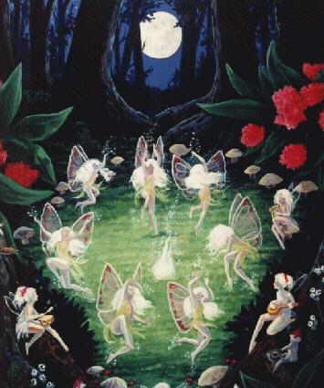

  
[Intangible Textual Heritage](../../../index)  [Sagas and
Legends](../../index)  [Celtic](../index) 

------------------------------------------------------------------------

<table width="75%">
<colgroup>
<col style="width: 50%" />
<col style="width: 50%" />
</colgroup>
<tbody>
<tr class="odd">
<td width="50%" data-valign="TOP"> 
</td>
<td width="50%" data-valign="TOP"><h1 id="tales-of-the-fairies-and-of-the-ghost-world" data-align="CENTER">Tales of the Fairies and of the Ghost World</h1>
<h2 id="by-jeremiah-curtin" data-align="CENTER">by Jeremiah Curtin</h2>
<h4 id="section" data-align="CENTER">[1895]</h4></td>
</tr>
</tbody>
</table>

------------------------------------------------------------------------

[Title Page](tfgw00)  
[Introduction](tfgw01)  
[John Connors and the Fairies](tfgw02)  
[Fitzgerald and Daniel O'Donohue](tfgw03)  
[The Fairies of Rahonain and Elizabeth Shea](tfgw04)  
[The Knights of Kerry - Rahonain Castle](tfgw05)  
[The Cattle Jobber of Awnascawil](tfgw06)  
[The Midwife of Listowel](tfgw07)  
[Daniel Crowley and the Ghosts](tfgw08)  
[Tom Daly and the Nut-Eating Ghost](tfgw09)  
[Tom Connors and the Dead Girl](tfgw10)  
[The Farmer of Tralee and the Fairy Cows](tfgw11)  
[The Two Gamblers and the Fairies](tfgw12)  
[The Girl and the Robber](tfgw13)  
[Maurice Griffin and the Fairy Doctor](tfgw14)  
[The Three Sisters and Their Husbands, Three Brothers](tfgw15)  
[John Shea and the Treasure](tfgw16)  
[note](tfgw17)  
[St. Martin's Eve](tfgw18)  
[James Murray and Saint Martin](tfgw19)  
[Fairy Cows](tfgw20)  
[John Reardon and the Sister Ghosts](tfgw21)  
[Maggie Doyle and the Dead Man](tfgw22)  
[Pat Doyle and the Ghost](tfgw23)  
[The Ghost of Sneem](tfgw24)  
[The Dead Mother](tfgw25)  
[Tim Sheehy Sent Back to This World to Prove His Innocence](tfgw26)  
[Tom Moore and the Seal Woman](tfgw27)  
[The Four-Leafed Shamrock](tfgw28)  
[note](tfgw29)  
[John Cokeley and the Fairy](tfgw30)  
[Tom Foley's Ghost](tfgw31)  
[note](tfgw32)  
[The Blood-Drawing Ghost](tfgw33)  
[Murderous Ghosts](tfgw34)  
