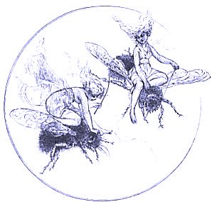

  
[Intangible Textual Heritage](../../../index.md)  [Sagas and
Legends](../../index)  [Celtic](../index.md) 

------------------------------------------------------------------------

<table width="75%">
<colgroup>
<col style="width: 50%" />
<col style="width: 50%" />
</colgroup>
<tbody>
<tr class="odd">
<td width="50%" data-valign="TOP"> 
</td>
<td width="50%" data-valign="TOP"><h1 id="the-fairy-mythology" data-align="CENTER">The Fairy Mythology</h1>
<h5 id="illustrative-of-the-romance-and-superstition-of-various-countries." data-align="CENTER">Illustrative of the Romance and Superstition of Various Countries.</h5>
<h2 id="by-thomas-keightley" data-align="CENTER">by Thomas Keightley</h2>
<h4 id="section" data-align="CENTER">[1870]</h4></td>
</tr>
</tbody>
</table>

------------------------------------------------------------------------

[Title Page](tfm000.md)  
[Table of Plates](tfm001.md)  
[Preface](tfm002.md)  
[Introduction](tfm003.md)  

### Oriental Romance

[Persian Romance](tfm004.md)  
[The Peri-Wife](tfm005.md)  
[Arabian Romance](tfm006.md)  

### Middle-Age Romance

[Middle-Age Romance](tfm007.md)  

### Fairy-Land

[Fairy-Land](tfm008.md)  

### Spenser's Faerie Queene

[Spenser's Faerie Queene](tfm009.md)  

### Eddas and Sagas

[Eddas and Sagas](tfm010.md)  
[The Alfar](tfm011.md)  
[The Duergar](tfm012.md)  
[Loki and the Dwarf](tfm013.md)  
[Thorston and the Dwarf](tfm014.md)  
[The Dwarf-Sword Tirfing](tfm015.md)  

### Scandanavia

[Scandanavia](tfm016.md)  
[Elves](tfm017.md)  
[Sir Olof in the Elve-Dance](tfm018.md)  
[The Elf Woman and Sir Olof](tfm019.md)  
[The Young Swain and the Elves](tfm020.md)  
[Svend Faelling and the Elle-Maid](tfm021.md)  
[The Elle-Maids](tfm022.md)  
[Maid Vae](tfm023.md)  
[The Elle-Maid near Ebeltoft](tfm024.md)  
[Hans Puntleder](tfm025.md)  
[Dwarfs or Trolls](tfm026.md)  
[Sir Thynnè](tfm027.md)  
[Proud Margaret](tfm028.md)  
[The Troll Wife](tfm029.md)  
[The Altar-Cup in Aagerup](tfm030.md)  
[Origin of Tiis Lake](tfm031.md)  
[A Farmer tricks a Troll](tfm032.md)  
[Skotte in the Fire](tfm033.md)  
[The Legend of Bodedys](tfm034.md)  
[Kallundborg Church](tfm035.md)  
[The Hill-Man invited to the Christening](tfm036.md)  
[The Troll turned Cat](tfm037.md)  
[Kirsten's Hill](tfm038.md)  
[The Troll-Labourer](tfm039.md)  
[The Hill-Smith](tfm040.md)  
[The Girl at the Troll-Dance](tfm041.md)  
[The Changeling](tfm042.md)  
[The Tile-Stove jumping over the Brook](tfm043.md)  
[Departure of the Trolls from Vendsyssel](tfm044.md)  
[Svend Faelling](tfm045.md)  
[The Dwarfs' Banquet](tfm046.md)  
[Nisses](tfm047.md)  
[The Nis Removing](tfm048.md)  
[The Penitant Nis](tfm049.md)  
[The Nis and the Boy](tfm050.md)  
[The Nis stealing Corn](tfm051.md)  
[The Nis and the Mare](tfm052.md)  
[The Nis Riding](tfm053.md)  
[The Nisses in Vosborg](tfm054.md)  
[Necks, Merman and Mermaids](tfm055.md)  
[The Power of the Harp](tfm056.md)  
[Duke Magnus and the Mermaid](tfm057.md)  

### Northern Islands

[Northern Islands](tfm058.md)  
[Iceland](tfm059.md)  
[Feroes](tfm060.md)  
[Shetland](tfm061.md)  
[Gioga's Son](tfm062.md)  
[The Mermaid Wife](tfm063.md)  
[Orkneys](tfm064.md)  
[Isle of Rugen](tfm065.md)  
[Adventures of John Dietrich](tfm066.md)  
[The Little Glass Shoe](tfm067.md)  
[The Wonderful Plough](tfm068.md)  
[The Lost Bell](tfm069.md)  
[The Black Dwarfs of Granitz](tfm070.md)  

### Germany

[Germany](tfm071.md)  
[Dwarfs](tfm072.md)  
[The Hill-Man at the Dance](tfm073.md)  
[The Dwarf's Feast](tfm074.md)  
[The Friendly Dwarfs](tfm075.md)  
[Wedding Feast of the Little People](tfm076.md)  
[Smith Riechert](tfm077.md)  
[Dwarfs stealing Corn](tfm078.md)  
[Journey of Dwarfs over the Mountain](tfm079.md)  
[The Dwarfs borrowing Bread](tfm080.md)  
[The Changeling](tfm081.md)  
[The Dwarf-Husband](tfm082.md)  
[Inge of Rantum](tfm083.md)  
[The Wild-Women](tfm084.md)  
[The Oldenburg Horn](tfm085.md)  
[Kobolds](tfm086.md)  
[Hinzelmann](tfm087.md)  
[Hödeken](tfm088.md)  
[King Goldemar](tfm089.md)  
[The Heinzelmänchen](tfm090.md)  
[Nixes](tfm091.md)  
[The Peasant and the Waterman](tfm092.md)  
[The Water-Smith](tfm093.md)  
[The Working Waterman](tfm094.md)  
[The Nix-Labour](tfm095.md)  

### Switzerland

[Switzerland](tfm096.md)  
[Gertrude and Rosy](tfm097.md)  
[The Chamois-Hunter](tfm098.md)  
[The Dwarfs on the Tree](tfm099.md)  
[Curiousity punished](tfm100.md)  
[The Rejected Gift](tfm101.md)  
[The Wonderful Little Pouch](tfm102.md)  
[Aid and Punishment](tfm103.md)  
[The Dwarf in search of Lodging](tfm104.md)  

### Great Britian

[Great Britian](tfm105.md)  
[England](tfm106.md)  
[The Green Children](tfm107.md)  
[The Fairy-Banquet](tfm108.md)  
[The Fairy-Horn](tfm109.md)  
[The Portunes](tfm110.md)  
[The Grant](tfm111.md)  
[The Luck of Eden Hall](tfm112.md)  
[The Fairy-Fair](tfm113.md)  
[The Fairies' Cauldron](tfm114.md)  
[The Cauld Lad of Hilton](tfm115.md)  
[The Pixy-Labour](tfm116.md)  
[Pixy-Vengence](tfm117.md)  
[Pixy-Gratitude](tfm118.md)  
[The Fairy Thieves](tfm119.md)  
[The Boggart](tfm120.md)  
[Addlers and Menters](tfm121.md)  
[The Fairy-Nursling](tfm122.md)  
[The Fairy-Labour](tfm123.md)  
[Ainsel and Puck](tfm124.md)  
[Scottish Lowlands](tfm125.md)  
[The Fairies' Nurse](tfm126.md)  
[The Fairy-Rade](tfm127.md)  
[The Changeling](tfm128.md)  
[Departure of the Fairies](tfm129.md)  
[The Brownie](tfm130.md)  

### Celts and Cymry

[Celts and Cymry](tfm131.md)  
[Ireland](tfm132.md)  
[Clever Tom and the Leprechaun](tfm133.md)  
[The Leprechaun in the Garden](tfm134.md)  
[The Three Leprechauns](tfm135.md)  
[The Little Shoe](tfm136.md)  
[Scottish Highlands](tfm137.md)  
[The Fairy's Inquiry](tfm138.md)  
[The Young Man in the Shian](tfm139.md)  
[The Two Fiddlers](tfm140.md)  
[The Fairy-Labour](tfm141.md)  
[The Fairy borrowing Oatmeal](tfm142.md)  
[The Fairy-Gift](tfm143.md)  
[The Stolen Ox](tfm144.md)  
[The Stolen Lady](tfm145.md)  
[The Changeling](tfm146.md)  
[The Wounded Seal](tfm147.md)  
[The Brownies](tfm148.md)  
[The Urisk](tfm149.md)  
[Isle of Man](tfm150.md)  
[The Fairy-Chapman](tfm151.md)  
[The Fairy-Banquet](tfm152.md)  
[The Fairies' Christening](tfm153.md)  
[The Fairy-Whipping](tfm154.md)  
[The Fairy-Hunt](tfm155.md)  
[The Fiddler and the Fairy](tfm156.md)  
[The Phynodderee](tfm157.md)  
[Wales](tfm158.md)  
[Tale of Elidurus](tfm159.md)  
[The Tylwyth Teg](tfm160.md)  
[The Spirit of the Van](tfm161.md)  
[Rhys at the Fairy Dance](tfm162.md)  
[Gitto Bach](tfm163.md)  
[The Fairies Banished](tfm164.md)  
[Brittany](tfm165.md)  
[Lai D'Ywenec](tfm166.md)  
[Lord Nann and the Korrigan](tfm167.md)  
[The Dance and Song of the Korred](tfm168.md)  
[Southern Europe](tfm169.md)  
[Greece](tfm170.md)  
[Italy](tfm171.md)  
[Spain](tfm172.md)  
[The Daughter of Peter de Cabinam](tfm173.md)  
[Origin of the House of Haro](tfm174.md)  
[La Infantina](tfm175.md)  
[Pepito el Corcovado](tfm176.md)  
[France](tfm177.md)  
[Legend of Melusina](tfm178.md)  

### Eastern Europe

[Eastern Europe](tfm179.md)  
[Finns](tfm180.md)  
[Slaves](tfm181.md)  
[Vilas](tfm182.md)  
[Deer and Vila](tfm183.md)  

### Africans, Jews, etc.

[Africans, Jews, etc.](tfm184.md)  
[Africans](tfm185.md)  
[Jews](tfm186.md)  
[The Broken Oaths](tfm187.md)  
[The Moohel](tfm188.md)  
[The Mazik-Ass](tfm189.md)  

### Conclusion

[Conclusion](tfm190.md)  

### Appendices

[The Harvest Dinner](tfm191.md)  
[The Young Piper](tfm192.md)  
[The Soul Cages](tfm193.md)  
[Barry of Cairn Thierna](tfm194.md)  
[Aileen a Roon](tfm195.md)  
[Rousseau's Dream](tfm196.md)  
[Alexander Selkirk's Dream](tfm197.md)  
[A Moonlight Scene](tfm198.md)  
[Lines Written in a Lady's Album](tfm199.md)  
[To Amanda](tfm200.md)  
[Lines](tfm201.md)  
[A Farewell](tfm202.md)  
[Verses](tfm203.md)  
[Father Cuddy's Song](tfm204.md)  
[The Praises of Mazenderan](tfm205.md)  
