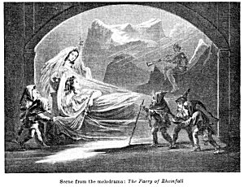
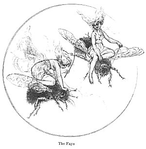

  
[Intangible Textual Heritage](../../../index)  [Sagas and
Legends](../../index)  [Celtic](../index)  [Index](index) 
[Previous](tfm002)  [Next](tfm004) 

------------------------------------------------------------------------

# THE FAIRY MYTHOLOGY.

 

### INTRODUCTION.

>   
> In olde days of the King Artour,  
> Of which that Bretons spoken gret honour,  
> All was this lond fulfilled of faërie;  
> The elf-qrene with hir jolts companie  
> Danced full oft in many a grene mede.  
> CHAUCER.

>  

> ORIGIN OF THE BELIEF IN FAIRIES.

> ACCORDING to a well-known law of our nature, effects suggest causes;
> and another law, perhaps equally general, impels us to ascribe to the
> actual and efficient cause the attribute of intelligence. The mind of
> the deepest philosopher is thus acted upon equally with that of the
> peasant or the savage; the only difference lies in the nature of the
> intelligent cause at which they respectively stop. The one pursues the
> chain of cause and effect, and traces out its various links till he
> arrives at the great intelligent cause of all, however he may
> designate him; the other, when unusual phenomena excite his attention,
> ascribes their production to the immediate agency of some of the
> inferior beings recognised by his legendary creed.

> The action of this latter principle must forcibly strike the minds of
> those who disdain not to bestow a portion of their attention on the
> popular legends and traditions of different countries. Every
> extraordinary appearance is found to have its extraordinary cause
> assigned; a cause always connected with the history or religion,
> ancient or modern, of the country, and not unfrequently varying with a
> change of faith. \[a\]

> The noises and eruptions of Aetna and Stromboli were, in ancient
> times, ascribed to Typhon or Vulcan, and at this day the popular
> belief connects them with the infernal regions. The sounds resembling
> the clanking of chains, hammering of iron, and blowing of bellows,
> once to be heard in the island of Barrie, were made by the fiends whom
> Merlin had set to work to frame the wail of brass to surround
> Caermarthen. \[b\] The marks which natural causes have impressed on
> the solid and unyielding granite rock were produced, according to the
> popular creed, by the contact of the hero, the saint, or the god:
> masses of stone, resembling domestic implements in form, were the
> toys, or the corresponding implements of the heroes and giants of old.
> Grecian imagination ascribed to the galaxy or milky way an origin in
> the teeming breast of the queen of heaven: marks appeared in the
> petals of flowers on the occasion of a youth's or a hero's untimely
> death: the rose derived its present hue from the blood of Venus, as
> she hurried barefoot through the woods and lawns; while the professors
> of Islam, less fancifully, refer the origin of this flower to the
> moisture that exuded from the sacred person of their prophet. Under a
> purer form of religion, the cruciform stripes which mark the back and
> shoulders of the patient ass first appeared, according to the popular
> tradition, when the Son of God condescended to enter the Holy City*,*
> mounted on that animal; and a fish only to be found in the sea \[the
> Haddock\] stills bears the impress of the finger and thumb of the
> apostle, who drew him out of the waters of Lake Tiberias to take the
> tribute-money that lay in his mouth. The repetition of the voice among
> the hills is, in Norway and Sweden, ascribed to the Dwarfs mocking the
> human speaker, while the more elegant fancy of Greece gave birth to
> Echo, a nymph who pined for love, and who still fondly repeats the
> accents that she hears. The magic scenery occasionally presented on
> the waters of the Straits of Messina is produced by the power of the
> Fata Morgana; the gossamers that float through the haze of an autumnal
> morning, are woven, by the ingenious dwarfs; the verdant circlets in
> the mead are traced beneath the light steps of the dancing elves; and
> St. Cuthbert forges and fashions the beads that bear his name, and lie
> scattered along the shore of Lindisfarne. \[c\]

> In accordance with these laws, we find in most countries a popular
> belief in different classes of beings distinct from men, and from the
> higher orders of divinities. These beings are usually believed to
> inhabit, in the caverns of earth, or the depths of the waters, a
> region of their own. They generally excel mankind in power and in
> knowledge, and like them are subject to the inevitable laws of death,
> though after a more prolonged period of existence.

> How these classes were first called into existence it is not easy to
> say; but if as some assert, all the ancient systems of heathen
> religion were devised by philosophers for the instruction of rude
> tribes by appeals to their senses, we might suppose that the minds
> which peopled the skies with their thousands and tens of thousands of
> divinities gave birth also to the inhabitants of the field and flood,
> and that the numerous tales of their exploits and adventures are the
> production of poetic fiction or rude invention. It may further be
> observed, that not unfrequently a change of religious faith has
> invested with dark and malignant attributes beings once the objects of
> love, confidence, and veneration. \[d\]

> It is not our intention in the following pages to treat of the awful
> or lovely deities of Olympus, Valhalla, or Meru. Our subject is less
> aspiring; and we confine ourselves to those beings who are our
> fellow-inhabitants of earth, whose manners we aim to describe, and
> whose deeds we propose to record. We write of FAIRIES, FAYS, ELVES,
>
> aut alio quo nomine gaudent.

>  

> ORIGIN OF THE WORD FAIRY.

>  

> Like every other word in extensive use, whose derivation is not
> historically certain, the word Fairy has obtained various and opposite
> etymons. Meyric Casaubon, and those who like him deduce everything
> from a classic source, however unlikely, derive Fairy from Φήρ, a
> Homeric name of the Centaurs; \[e\] or think that *fée,* whence Fairy,
> is the last syllable of *nympha.* Sir W. Ouseley derives it from the
> Hebrew לאפ (*peer*)*, to adorn;* Skinner, from the Anglo-Saxon
> *ranan*, *to fare, to go;* others from Feres, companions, or think
> that Fairy-folk is *quasi* Fair-folk. Finally, it has been queried if
> it be not Celtic. \[f\]

> But no theory is so plausible, or is supported by such names, as that
> which deduces the English Fairy from the Persian Peri. It is said that
> the Paynim foe, whom the warriors of the Cross encountered in
> Palestine, spoke only Arabic; the alphabet of which language, it is
> well known, possesses no *p*, and therefore organically substitutes an
> *f* in such foreign words as contain the former letter; consequently
> Peri became, in the mouth of an Arab, Feri, whence the crusaders and
> pilgrims, who carried back to Europe the marvellous tales of Asia,
> introduced into the West the Arabo-Persian word *Fairy.* It is further
> added, that the Morgain or Morgana, so celebrated in old romance, is
> Merjan Peri, equally celebrated all over the East.

> All that is wanting to this so very plausible theory is something like
> proof, and some slight agreement with the ordinary rules of etymology.
> Had Feërie, or Fairy, originally signified the individual in the
> French and English, the only languages in which the word occurs, we
> might feel disposed to acquiesce in it. But they do not: and even if
> they did, how should we deduce from them the Italian Fata, and the
> Spanish Fads or Hada, (words which unquestionably stand for the same
> imaginary being,) unless on the principle by which Menage must have
> deduced Lutin from Lemur--the first letter being the same in both? As
> to the fair Merjan Peri (D'Herbelot calls her Merjan Banou--D'Herbelot
> *titre* Mergian says, "C'est du nom de cette Fée quo nos anciens
> romans ont formé celui de *Morgante la* *Déconnue."* He here confounds
> Morgana with Urganda, and he has been followed in his mistake.
> D'Herbelot also thinks it possible that *Féerie* may come from *Peri;*
> but he regards the common derivation from *Fata* as much more
> probable. Cambrian etymologists, by the way, *say* that Morgain is Mor
> Gwynn, the *White Maid.*), we fancy a little too much importance has
> been attached to her. Her name, as far as we can leant, only occurs in
> the Cahermân Nâmeh, a Turkish romance, though perhaps translated from
> the Persian.

> The foregoing etymologies, it is to be observed, are all the
> conjectures of English scholars; for the English is the only language
> in which the name of the individual, Fairy, has the canine letter to
> afford any foundation for them.

> Leaving, then, these sports of fancy, we will discuss the true origin
> of the words used in the Romanic languages to express the being which
> we name Fairy of Romance. These are *Faée, Fée,* French; *Fada,*
> Provençal (whence *Hada,* Spanish); and *Fata,* Italian.

> The root is evidently, we think, the Latin *fatum*. In the fourth
> century of our aera we find this word made plural, and even feminine,
> and used as the equivalent of Parcae. On the reverse of a gold medal
> of the Emperor Diocletian are three female figures, with the legend
> *Fatis victricibus;* a *cippus,* found at Valencia in Spain, has on
> one of its sides *Fat.* Q. *Fabius ex voto,* and on the other, three
> female figures, with the attributes of the Moerae or Parcae. \[these
> two instances are given by Mdlle. Amélie Bosquet (La Normandie
> Romanesque, etc. p. 91.) from Dom Martin, *Rel. des Gautois,* ii. ch.
> 23 and 24.\] In this last place the gender is uncertain, but the
> figures would lead us to suppose it feminine. On the other hand,
> Ausonius \[Gryphus ternaril numeri\] has *tres Charites,, tria Fata;*
> and Procopius \[Do Bell. Got. i. 25\] names a building at the Roman
> Forum *τά τρία,* adding *οΰτω γάρ 'Ρωμας τάς μοίρας νενομίκαδι καλείν
> .* The Fate or Fata, then, being persons, and their name coinciding so
> exactly with the modem terms, and. it being observed that the Moerae
> were, at the birth of Meleager, just as the Fees were at that of Ogier
> le Danois, and. other heroes of romance and tale, their identity has
> been at once asserted, and this is now, we believe, the most prevalent
> theory. To this it may be added, that in Gervase of Tilbury, and other
> writers of the thirteenth century, the Fada or Fée seems to be
> regarded as a being different from human kind. \[g\]

> On the other hand, in a passage presently to be quoted from a
> celebrated old romance, we shall meet a definition of the word *Fée,*
> which expressly asserts that such a being was nothing more than a
> woman skilled in magic; and such, on examination, we shall find to
> have been all the Fées of the romances of chivalry and of the popular
> tales; in effect, that *f*é*e* is a participle, and the words *dame*
> or *femme* is--to be understood.

> In the middle ages there was in use a Latin verb, *fatare*, \[h\]
> derived from *fatum* or *fata,* and signifying to enchant. This verb
> was adopted *by* the Italian, Provençal \[i\] and Spanish languages;
> in French it became, according to the analogy of that tongue, *faer,
> féer.* Of this verb the past participle is *faé*, *fé;* hence in the
> romances we continually meet with *les chevalier, faés, les dames
> faées, Oberon la faé, le cheval étoit faé, la clef était fée,* and
> such like. We have further, we think, demonstrated \[see our Virgil,
> Excurs. ix.\] that it was the practice of the Latin language to elide
> accented syllables, especially in the past participle of verbs of the
> first conjugation, and. that this practice had been transmitted to the
> Italian, whence *fatato-a* would *form fato-a,* and *una donna fatata*
> might thus become *una fata.* Whether the same was the case in the
> Provençal we cannot affirm, as our knowledge of that dialect is very
> slight; but, judging from analogy, we would. say it was, for in
> Spanish *Hadada* and *Hada* are synonymous. In the Neapolitan
> Pentamerone *Fata* and *Maga* are the same, and a Fata sends the
> heroine of it to a sister of hers,
>
> pure fatata.

> Ariosto says of Medea--

> E perchè per virtu d' erbe e d'incanti  
> Delle Fate una ed immortal fatta era.  
> *I Cinque Canti,* ii. 106.

> The same poet, however, elsewhere says--

> Queste che or Fate e dagli antichi foro  
> Gia dette Ninfe e Dee con piu bel nome.  
> --Ibid. i. 9.

> and,

> Nascemmo ad un punto che d'ogni altro male  
> Siamo capaci fuorchè della morto.  
> --Orl. *Fur.* xliii. 48.

> which last, however, is not decisive. Bojardo also calls the
> water-nymphs Fate; and our old translators of the Classics named them
> *fairies*. From all this can only, we apprehend, be collected, that
> the ideas *of* the Italian poets, and others, were somewhat vague on
> the subject.

> From the verb *faer, féer,* to enchant, illude, the French made a
> substantive *faerie*, *féerie,* \[j\] illusion, enchantment, the
> meaning of which was afterwards extended, particularly after it had
> been adopted into the English language.

> We find the word Faerie, in fact, to be employed in four different
> senses, which we will now arrange and exemplify.

> 1\. Illusion, enchantment.

> Plusieurs parlent de Guenart,  
> Du Loup, de l'Asne, de Renart,  
> De *faeries* et de songes,  
> De phantosmes et do mensonges.  
>
> Gul. Giar. ap. Ducange

> Where we must observe, as Sir Walter Scott seems not to have been
> aware of it, that the four last substantives bear the same relation to
> each other as those in the two first verses do.

> Me bifel a ferly  
> Of *faerie,* me thought  
> *Vision of Piers Plowman,* v. 11.

> Maius that sit with so benigne a chere,  
> Hire to behold it seemed faerie.  
>
> Chaucer, Marchante's Tale.

> It *(the horse of brass)* was of *fairie* as the pople semed,  
> Diversè folk diversely han demed.  
> --
>
> Squier's Tale.

> The Emperor said on high,  
> Certes it is a *faerie,  
> *Or elles a vanité  
> --Emare.

> With phantasme and *faerie,*  
> Thus she bleredè his eye.  
> --Libeaus
>
> Disconus.

> The God of her has made an end,  
> And fro this worldes *faerie  
> *Hath taken her into companie.--  
> Gower,
>
> Constance.

> Mr. Ritson professes not to understand the meaning of *faerie* in this
> last passage. Mr. Ritson should, as Sir Hugh Evans says, have 'prayed
> his pible petter;' where, among other things that might have been of
> service to him, he would have learned that 'man walketh in a *vain*
> shew,' that 'all is *vanity,'* and that 'the fashion of this world
> passeth away;' and then he would have found no difficulty in
> comprehending the pious language of 'moral Gower,' in his allusion to
> the transitory and deceptive vanities of the world.

> 2\. From the sense of illusion simply, the transition was easy to that
> of the land of illusions, the abode of the Faés, who produced them;
> and Faerie next came to signify the country of the Fays. Analogy also
> was here aiding; for as a Nonnerie was a place inhabited by Nonnes, a
> Jewerie a place inhabited by Jews, so a Faerie was naturally a place
> inhabited by Fays. Its termination, too, corresponded with a usual one
> in the names of countries: Tartarie, for instance, and 'the regne of
> Feminie.'

> Here beside an elfish knight  
> Hath taken my lord in fight,  
> And hath him led with him away  
> Into the *Faerie,* sir, parmafay.--*Sir* *Guy.  
>   
> *La puissance qu'il avoit aur toutes *faeries* du monde.  
>
> Huon de Bordeaux.

> En effect, s'il me falloit retourner en *faerie,* je ne sçauroye ou
> prendre mon chemin.  
> --*Ogier*
>
> le Dannoys.

> That Gawain with his oldè curtesie,  
> Though he were come agen out of
>
> faerie.  
> Squier's Tale.

> He (Arthur) is a king y-crowned in *Faerie,  
> *With sceptre and pall, and with his regalty  
> Shailè resort, as lord and sovereigne,  
> Out of *Faerie* and reignè in Bretaine,  
> And repair again the ouldè Roundè Table.  
> *Lydgate, Fall* of *Princes,* bk. viii. c. 24.

> 3\. From the country the appellation passed to the inhabitants in
> their collective capacity, and the Faerie now signified the people of
> Fairy-land. \[k\]

> Of the fourth kind of Spritis called the Phairie.  
> *K. James, Demonologie,* 1.3.

> Full often time he, Pluto, and his quene  
> Proserpina, and alle hir *faerie,  
> *Disporten hem, and maken melodie  
> About that well  
>
> --Marchante's Tale

> The feasts that underground the *Faerie* did him make,  
> And there how he enjoyed the Lady of the Lake.  
> *Drayton, Poly-Olb., Song* IV.

> 4\. Lastly, the word came to signify the individual denizen of
> Fairy-land, and was equally applied to the full-sized fairy knights
> and ladies of romance, and to the pygmy elves that haunt the woods and
> dells. At what precise period it got this its last, and subsequently
> most usual sense, we are unable to say positively; but it was probably
> posterior to Chaucer, in whom it never occurs, and certainly anterior
> to Spenser, to whom, however, it seems chiefly indebted for its future
> general currency. \[l\] It was employed during the sixteenth century
> \[m\] for the Fays of romance, and also, especially by translators,
> for the Elves, as corresponding to the Latin Nympha.

> They believed that king Arthur was not dead, but carried awaie by the
> *Fairies* into some pleasant place, where he should remaine for a
> time, and then returne again and reign in as great authority as
> ever.  
> *Hollingshed,* bk. v. c. 14. Printed 1577.

> Semicaper Pan  
> Nunc tenet, at quodam tenuerunt tempore nymphae,  
> - *Ovid, Met.* xiv. 520.

> The halfe-goate Pan that howre  
> Possessed it, but heretofore it was the *Faries'* bower.  
> *Golding,* 1567.

> Haec nemora indigenae fauni nymphaeque tenebant,  
> Gensque virum truncis et duro robore nata.  
> *Virgil, Aeneis,* viii. 314.

> With nymphis and faunis apoun every side,  
> Qwhilk *Farefolkis* or than *Elfis* clepen we.  
>
> Gawin Dowglas.

> The weeds (quoth he) sometime both farms and nymphs, and gods of
> ground,  
> And *Fairy-queens* did keep, and under them a nation rough.  
> *Phaer,* 1562.

> Inter Hamadryadsa celeberrima Nonacrinas  
> Naias una fuit *.  
> --Ovid, Met.* l. i. 690.

> Of all the nymphes of Nonacris and *Fairie* ferre and neere,  
> In beautie and in personage this ladie had no peere.  
>
> Golding.

> Pan ibi dum teneris jactat sua carmina nymphis.  
> *Ov. Ib* .xi. 153.

> There Pan among the *Faire-elves,* that daunced round togither.  
>
> Golding.

> Solaque Naiadum celeri non nota Dianae--*Ov. Ib.* iv. 304.

> Of all the *water-fayries,* she alonely was unknowne.  
> To swift Diana.  
> --Golding.

> Nymphis latura coronas  
> --*Ov. Ib.* ix. 337

> Was to the *fairies* of the lake fresh garlands for to bear.  
>
> Golding.

> Thus we have endeavoured to trace out the origin, and mark the
> progress of the word Fairy, through its varying significations, and
> trust that the subject will now appear placed in a clear and
> intelligible light.

> After the appearance of the Faerie Queene, all distinctions were
> confounded, the name and attributes of the real Fays or Fairies of
> romance were completely transferred to the little beings who,
> according to the popular belief, made 'the green sour ringlets whereof
> the ewe not bites.' The change thus operated by the poets established
> itself firmly among the people; a strong proof, if this idea be
> correct, of the power of the poetry of a nation in altering the
> phraseology of even the lowest classes \[n\] of its society.

> Shakspeare must be regarded as a principal agent in the revolution;
> yet even he uses Fairy once in the proper sense of Fay; a sense it
> seems to have nearly lost, till it was again brought into use by the
> translators of the French Contes des Fées in the last century.

> To this great Fairy I'll commend thy acts.  
> *Anthony and Cleopatra,* act iv. sc. 8.

> And Milton speaks

> Of Faery damsels met in forests wide  
> By knights of Logres or of Lyones,  
> Lancelot, or Pelleas, or Pellinore.

> Yet he elsewhere mentions the

> Faery elves,  
> Whose midnight revels by a forest side  
> Or fountain some belated peasant sees.

> Finally, Randolph, in his Amyntas, employs it, for perhaps the last
> time, in its second sense, Fairy-land:

> I do think  
> There will be of Jocastus' brood in Fairy.  
> Act i. sc. 3.

> We must not here omit to mention that the Germans, along with the
> French romances, early adopted the name of the Fees. They called them
> Feen and Feinen. \[o\] In the Tristram of Gottfried von Strazburg we
> are told that Duke Gylan had a syren-like little dog,

> Dez sie dem Herzoge gesandt '  
> Twas sent unto the duke, pardé,  
> Uz Avalun, der *.Feinen* land,  
> From Avalun, the Fays' countrie,  
> Von omen Gottinne.--V. 1673.  
> By a gentle goddess.

> In the old German romance of Isotte and Blanscheflur, the hunter who
> sees Isotte asleep says, I doubt

> Des the menachlich sei,  
>    If she human be,  
> Sic ist schoner denn eine *Feine.  
>   * She is fairer than a Pay.  
> Von Fleische noch von Beine  
>    Of flesh or bone, I say,  
> Kunte nit gewerden  
>    Never could have birth  
> So schones auf den erden.  
>    A thing so fair on earth.

> Our subject naturally divides itself into two principal branches,
> corresponding to the different classes of beings to which the name
> Fairy has been applied. The first, beings of the human race, but
> endowed with powers beyond those usually allotted to men, whom we
> shall term FAYs, or FAIRIES OF ROMANCE. The second, those little
> beings of the popular creeds, whose descent we propose to trace from
> the cunning and ingenious Duergar or dwarfs of northern mythology, and
> whom we shall denominate ELVES or POPULAR FAIRIES.

> It cannot be expected that our classifications should vie in accuracy
> and determinateness with those of natural science. The human
> imagination, of which these beings are the offspring, works not, at
> least that we can discover, like nature, by fixed and invariable laws;
> and it would be hard indeed to exact from the Fairy historian the
> rigid distinction of classes and orders which we expect from the
> botanist or chemist. The various species so run into and are
> confounded with one another; the actions and attributes of one kind
> are so frequently ascribed to another, that scarcely have we begun to
> erect our system, when we find the foundation crumbling under our
> feet. Indeed it could not well be otherwise, when we recollect that
> all these beings once formed parts of ancient and exploded systems of
> religion, and that it is chiefly in the traditions of the peasantry
> that their memorial has been preserved.

> We will now proceed to consider the Fairies of romance; and as they
> are indebted, though not for their name, yet perhaps for some of their
> attributes, to the Peries of Persia, we will commence with that
> country. We will thence pursue our course through Arabia, till we
> arrive at the middle-age romance of Europe, and the gorgeous realms of
> Fairy-land; and thence, casting a glance at the Faerie Queene, advance
> to the mountains and forests of the North, there to trace the origin
> of the light-hearted, night-tripping elves.

------------------------------------------------------------------------

> \[a\] the mark on Adam's Peak in Ceylon is, by the Buddhists, ascribed
> to Buddha; by the Mohammedans, to Adam. It reminds one of the story of
> the lady and the vicar, viewing the moon through a telescope; they saw
> in it, as they thought, two figures inclined toward each other:
> "Methinks," says the lady," they are two fond lovers, meeting to pour
> forth their vows by earth-light." "Not at all," says the vicar, taking
> his turn at the glass; "they are the steeples of two neighbouring
> churches"  
>   
> \[b\] Faerie Queene, III. c. iii. st. 8, 9, 10, 11. Drayton,
> Poly-Olbion, Song VI. We fear, however, that there is only poetic
> authority for this belief. Mr. Todd merely quotes Warton, who says
> that Spenser borrowed it from Giraldus Cambrensis, who picked it up
> among the romantic traditions propagated by the Welsh bards. The
> reader will be, perhaps, surprised to hear that Giraldus says nothing
> of the demons. He mentions the sounds, and endeavours to explain them
> by natural causes. Hollingshed indeed (l. i. c. 24.) says, "whereof
> the superstitious sort do gather many toys."  
>   
> \[c\] for a well-chosen collection of examples, see the very learned
> and philosophical preface of the late Mr. Price to his edition of
> Warton's History of English Poetry, p.28 *et seq.  
>   
> *\[d\] in the Middle Ages the gods of the heathens were all held to be
> devils.  
>   
> \[e\] *Φήρ* is the Ionic form of *θήρ,* and is nearly related to the
> German *thier,* beast, animal. The Scandinavian *dyr,* and the
> Anglo-Saxon *deon*, have the same signification; and it is curious to
> observe the restricted sense which this last has gotten in the English
> *deer.  
>   
> *\[f\] preface to Warton, p. 44; and Breton philologists furnish us
> with an etymon; not, indeed, of Fairy, but of Fada. "Fada, fata,
> etc.," says M. de Cambry (Monumens Celtiques), "come from the Breton
> *mat* or *mad,* in construction *fat,* good; whence the English,
> maid."  
>   
> \[g\] see below, *France.* It is also remarked that in some of the
> tales of the Pentamerone, the number of the *Fate* is three; but to
> this it may be replied, that in Italy every thing took a classic
> tinge, and that the Fate of those tales are only Maghe; so in the
> Amadigi of Bernardo Tasso we meet with La *Fata* Urganda. In Spain and
> France the number would rather seem to have been seven. Cervantes
> speaks of "los siete castillos do las *siete* fadas;" in the Rom. de
> Ia Infantina it is said, *"siete* fadas me *fadaron,* en brazos de una
> ama mia," and the *Fées* are *seven* in La Belle au Bois dormant. In
> the romance, however, of Guillaume au Court-nez, the *Fées* who carry
> the sleeping Renoart out of the boat are *three* in number--See Grimm
> Deutsche Mythologie, p. 383.  
>   
> \[h\] a MS. Of the 13th century, quoted by Grimm (*ut sup*.
> p. 405), thus relates the origin of Aquisgrani (Aix la Chapelle):
> Aquisgrani dicitur Ays, et dicitur eo, quod Karolus tenebrat ibi
> quandum *mulierem fatatam*, sive quandum *fatum*. Quae alio nominee
> *nimpha* vel *dea* vel *adriades* (l. *dryas*) appellatur, et ad hanc
> consuetudinem habetat et eam cognoscebat; et ita erat, quod ipso
> accedente ad eam vivebat ipsa, ipso Karola recedente moriebatur.
> Contigit dum quadam vice ad ipsam accessisset ut cum ea delectaretur,
> radius solis intravit os ejus, et tune Karolus vidit *granum auri*
> lingue ejus affixum, quod facit abscindi et contingenti (l. in
> continenti) mortua est, nec postea revixit.  
>   
> \[i\] "Aissim *fadaro* tres serors / En aquella ora qu' ieu sui natz /
> Que totz temps fos enamoratz."--*Folquet de Romans*. (Thus three
> sisters *fated* in the hour that I was born, that I should be at all
> times in love.): "Aissi fuy de nueitz *fadatz* sobr' un
> puegau."--*Guilh. De Poitou.* (Thus was I *fated* by night on a
> hill.)--Grimm, *ut sup*. p. 383   
>   
> \[j\] following the analogy of the Gotho-German tongues, *zauberei,*
> Germ. *trylleri,* Dan. *trolleri,* Swed. illusion, enchantment. The
> Italian word is *fattucchiera.  
>   
> *\[k\] here too there *is perhaps* an analogy with *cavalry, infantry,
> squierie,* and similar collective terms. *  
>   
> *\[l\] the Faerie Queene was published some years before the Midsummer
> Night's Dream. Warton,(Obs. on the Faerie Queene) observes: "It
> appears from Marston's Satires, printed 1598, that the Faerie Queene
> occasioned many publications in which Faeries were the principal
> actors. Go buy some ballad of the FAERY KING*.--Ad Lectorem.*:  
> Out steps some Faery with quick motion, / And tells him wonders of
> some flowerie vale--/ Awakes, straight rubs his eyes, and prints his
> tale.--B. III. Sat. 6." *  
>   
> *\[m\] it is in this century that we first meet with *Faery* as a
> dissyllable, and with a plural. It is then used in its fourth and last
> sense. *  
>   
> *\[n\] the Fata Morgana of the Straits of Messina is an example; for
> the name of Morgana, whencesoever derived, was probably brought into
> Italy by the poets. *  
>   
> *\[o\] Dobenek, des deutschen Mittelalters und Volksglauben. Berlin,
> 1816.

------------------------------------------------------------------------

[Next: Persian Romance](tfm004)
