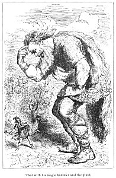

  
[Intangible Textual Heritage](../../../index.md)  [Sagas and
Legends](../../index)  [Celtic](../index)  [Index](index.md) 
[Previous](tfm012)  [Next](tfm014.md) 

------------------------------------------------------------------------

LOKI AND THE DWARF

 

> LOKI the son of Laufeiar, had out of mischief cut off all the hair of
> Sif. When Thor found this out he seized Loki, and would have broken
> every bone in his body, only that he swore to get the Suartalfar to
> make for Sif hair of gold, which would grow like any other hair.

> Loki then went to the Dwarfs that are called the sons of Ivallda. They
> first made the hair, which as soon as it was put on the head grew like
> natural hair; then the ship Skidbladni, \[a\] which always had the
> wind with it, wherever it would sail; and, thirdly, the spear Gugner,
> which always hit in battle.

> Then Loki laid his head against the dwarf Brock, that his brother
> Eitri could not forge three such valuable things as these were. They
> went to the forge; Eitri set the swine. skin (bellows) to the fire,
> and bid his brother Brock to blow, and not to quit the fire till he
> should have taken out the things he had put into it.

> And when he was gone out of the forge, and that Brock was blowing,
> there came a fly and settled upon his hand, and bit him; but he blew
> without stopping till the smith took the work out of the fire; and it
> was a boar, and its bristles were of gold.

> He then put gold into the fire, and bid him not to stop blowing till
> be came back. He went away, and then the fly came and settled on his
> neck, and bit him more severely than before; but he blew on till the
> smith came back and took out of the fire the gold-ring which is called
> Drupner. \[b\]

> Then he put iron into the fire, and bid him blow, and said that if he
> stopped blowing all the work would be lost. The fly now settled
> between his eyes, and bit so hard that the blood ran into his eyes, so
> that he could not see; so when the bellows were down be caught at the
> fly in all haste, and tore off its wings; but then came the smith, and
> said that all that was in the fire had nearly been spoiled. He then
> took out of the fire the hammer Miölner, \[c\] gave all the things to
> his brother Brock, and bade him go with them to Asgard and settle the
> wager.

> Loki also produced his jewels, and they took Odin, Thor, and Frey, for
> judges. Then Loki gave to Odin the spear Gugner, and to Thor the hair
> that Sif was to have, and to Frey Skidbladni, and told their virtues
> as they have been already related. Brock took out his jewels, and gave
> to Odin the ring, and said that every ninth night there would drop
> from it eight other rings as valuable as itself. To Frey he gave the
> boar, and said that he would run through air and water, by night and
> by day, better than any horse, and that never was there night so dark
> that the way by which he went would not be light from his hide. He
> gave the hammer to Thor, and said that it would never fail to hit a
> Troll, and that at whatever he threw it it would never miss it; and
> that he could never fling it so far that it would not of itself return
> to his band; and when he chose, it would become so small that he might
> put it into his pocket. But the fault of the hammer was that its
> handle was too short.

> Their judgment was, that the hammer was the best, and that the Dwarf
> had won the wager. Then Loki prayed hard not to lose his head, but the
> Dwarf said that could not be. "Catch me then," said Loki; and when he
> went to catch him he was far away, for Loki had shoes with which he
> could run through air and water. Then the Dwarf prayed Thor to catch
> him, and Thor did so. The Dwarf now went to cut off his head, but Loki
> said he was to have the head only, and not the neck. Then the Dwarf
> took a knife and a thong, and went to sew up his mouth; but the knife
> was bad, so the Dwarf wished that his brother's awl were there; and as
> soon as he wished itit was there, and he sewed his lips together.
> \[d\]

> \*

> Northern mythologists thus explain this very ancient fable. Sif is the
> earth, and the wife of Thor, the heaven or atmosphere; her hair is the
> trees, bushes, and plants, that adorn the surface of the earth. Loki
> is the Fire-God, that delights in mischief, *bene servit, male
> imperat.* When by immoderate heat he has burned off the hair of Sif,
> her husband compels him so by temperate heat to warm the moisture of
> the earth, that its former products may spring up more beautiful than
> ever. The boar is given to Freyr, to whom and his sister Freya, as the
> gods of animal and vegetable fecundity, the northern people offered
> that animal, as the Italian people did, to the earth. Loki's bringing
> the gifts from the under-ground people seems to indicate a belief that
> metals were prepared by subterranean fire, and perhaps the forging of
> Thor's hammer, the mythic emblem of thunder, by a terrestrial demon,
> on a subterranean anvil, may suggest that the natural cause of thunder
> is to be sought in the earth.

>  

------------------------------------------------------------------------

> \[a\] Skidbladni, like Pari Banou's tent, could expand and contract as
> required. It would carry all the Aeser and their arms, and when not in
> use it could be taken asunder and put in a purse. "A good ship," says
> Ganglar, " is Skidbladni, but great art must have been employed in
> making it." Mythologists say it is the clouds.

> \[b\] *i. e.* The *Dripper.  
>   
> *\[c\] *i. E.* The *Bruiser* or *Crusher,* from *Myla,* to bruise or
> crush. Little the Fancy know of the high connexions of their phrase
> *Mill.  
>   
> *\[d\] Edda Resenii, Daemisaga 59.

>  

>  

------------------------------------------------------------------------

[Next: Thorston and the Dwarf](tfm014.md)
