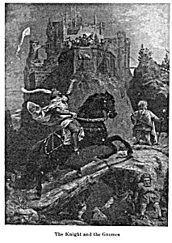

  
[Intangible Textual Heritage](../../../index.md)  [Sagas and
Legends](../../index)  [Celtic](../index)  [Index](index.md) 
[Previous](tfm071)  [Next](tfm073.md) 

------------------------------------------------------------------------

DWARFS

>  

> Fort, fort! Mich schau' die Sonne nicht,  
> Ich darf nicht langer harren;  
> Mich Elfenklnd vor ihren Licht  
> Sähst du zum Fels erstarren.

> La Motte Fouque.

> Away! let not the sun view me,  
> I dare no longer stay;  
> An Elfin-child thou wouldst me see,  
> To atone turn at his ray.

>  

> THESE beings are called Zwerge *(Dwarfs),* Berg- and Erdmänlein
> *(Hill* and *Ground-mannikins),* the Stille Volk *(Still-people),* and
> the Kleine Yolk *(Little-people).* \[a\] The following account of the
> Still-people at Plesse will give the popular idea respecting them.
> \[b\]

> At Plesse, a castle in the mountains in Hesse, are various springs,
> wells, clefts and holes in the rocks, in which, according to popular
> tradition, the Dwarfs, called the Still-people, dwell. They are silent
> and beneficent, and willingly serve those who have the good fortune to
> please them, if injured they vent their anger, not on mankind, but on
> the cattle, which they plague and torment. This subterranean race has
> no proper communication with mankind, but pass their lives within the
> earth, where their apartments and chambers are filled with gold and
> precious stones. Should occasion require their visit to the surface of
> the earth, they accomplish the business in the night, and not by day.
> This Hill-people are of flesh and bone, like mankind, they bear
> children and die, but in addition to the ordinary faculties of
> humanity, they have the power of making themselves invisible, and of
> passing through rocks and wails, with the same facility as through the
> air. They sometimes appear to men, lead them with them into clifts,
> and if the strangers prove agreeable to them, present them with
> valuable gifts. \[c\]

------------------------------------------------------------------------

> \[a\] Another term is Wicht and its dim. Wichtlein, answering to the
> Scandinavian Vattr and the Anglo-Saxon *wiht,* English *wight,* all of
> which signify a being, a person, and also a thing in general. Thus our
> words *aught* and *naught* were *anwiht* and
>
> nawiht.

> \[b\] See Grimm's Deutsche Sagen, vol. i. p. 38. As this work is our
> chief authority for the Fairy Mythology of Germany, our materials are
> to be considered as taken from it, unless when otherwise expressed.

> \[c\] In Lusatia (Lausatz) if not in the rest of Germany, the same
> idea of the Dwarfs being fallen angels, prevails as in other
> countries: see the tale of the Fairies'-sabbath in the work quoted
> above.

>  

>  

------------------------------------------------------------------------

[Next: The Hill-Man at the Dance](tfm073.md)
