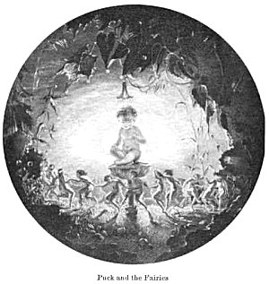
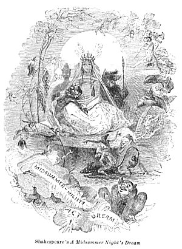

  
[Intangible Textual Heritage](../../../index)  [Sagas and
Legends](../../index)  [Celtic](../index)  [Index](index) 
[Previous](tfm123)  [Next](tfm125) 

------------------------------------------------------------------------

AINSEL and PUCK

>   
>   
> A WIDOW and her son, a little boy, lived, together in a cottage in or
> near the village of Rothley, Northumberland. One winter's evening the
> child refused to go to bed with his mother, as he wished to sit up for
> a while longer, "for," said he, "I am not sleepy." The mother finding
> remonstrance in vain, at last told him that if he sat up by himself
> the faries would most certainly come and take him away. The boy
> laughed as his mother went to bed, leaving him sitting by the fire; he
> had not been there long, watching the fire and enjoying its cheerful
> warmth, till a beautiful little figure, about the size of a child's
> doll, descended the chimney and alighted on the hearth! The little
> fellow was somewhat startled at first, but its prepossessing smile as
> it paced to and fro before him soon overcame his fears, and he
> inquired familiarly, "What do they ca' thou?" "Ainsel," answered the
> little thing haughtily, at the same time retorting the question, "And
> what do they ca' *thou?" "My* ainsel'," answered the boy; and they
> commenced playing together like two children newly acquainted. Their
> gambols continued quite innocently until the fire began to grow dim;
> the boy then took up the poker to stir it, when a hot cinder
> accidentally fell upon the foot of his playmate; her tiny voice was
> instantly raised to a most terrific roar, and the boy had scarcely
> time to crouch into the bed behind his mother, before the voice of the
> old fary-mother was heard shouting, "Who's done it? 'Who's done it?"
> "Oh! it was my ainsel!" answered the daughter. "Why, then," said the
> mother, as she kicked her up the chimney, "what 's all this noise for:
> there's nyon *(i.e.* no one) to blame."

>  

> Such is the sum of what we have been able to collect respecting the
> popular fairy-lore of England, the largest and most complete
> collection that, to our knowledge, has ever been made. We might
> venture to add that little more is ever likely to be collected, for
> the sounds of the cotton-mill, the steam-engine, and, more than all,
> the whistle of the railway train, more powerful than any exorcists,
> have banished, or soon will banish, the fairy tribes from all their
> accustomed haunts, and their name and their exploits will in future be
> found in works like the present rather than in village tradition.

> As the merry spirit, Puck, is so prominent an actor in the scenes
> forming our next division, this may be deemed no unfitting place for
> the consideration of his various appellations; such as Puck, Robin
> Good-fellow, Robin Hood, Hobgoblin.

> Puck is evidently the same with the old word *Pouke,* \[a\] the
> original meaning of which would seem to be devil, demon, or evil
> spirit. We first meet with it in the Vision of Piers Ploughman, where
> it undoubtedly signifies 'the grand adversary of God and man.'

> When, in this poem, \[b\] the Seer beholds Abraham, the
> personification of Faith, with his "wide clothes," within which lay a
> Lazar,

> Amonges patriarkes and prophetes,  
> Pleying togideres,

> and asks him what was there,

> Loo! quod he, and leet me see.                                 Ne no
> buyrn be oure borgh,  
> Lord mercy! I seide;                                                 
> Ne bringe us from his daunger;  
> This is a present of muche pris,                                 Out
> of the *pouke pondfold  
> *What prynce shal it have?                                         No
> maynprise may us fecche,  
> It is a precious present, quod he,                                Til
> he come that I carpe of,  
> Ac the *pouke* it hath attached,                                    
> Crist is his name,  
> And me theremyde, quod that                                     That
> shall delivere us som day  
> man,                                                                        
> Out of the *develes* power.  
> May no wed us quyte,

> Golding also must have understood Pooke in the sense of devil, when in
> the ninth book of his translation of Ovid, unauthorised however by the
> original, he applies it to the Chimaera,

> The country where Chymsara, that same *pooke  
> *Hath goatish body, lion's head and brist, and dragon's tayle.

> Spenser employs the word, and he clearly distinguishes it from
> hob-goblin:

> Ne let housefires nor lightnings helpless harms,  
> Ne let the *pouke* \[c\] nor other evil sprites,  
> Ne let mischievous witches with their charms,  
> No let *hob-goblins,* names whom sense we see not,  
> Fray us with things that be not--*Epithalamion,* v. 340.

> These terms are also distinguished in the poem named The Scourge of
> Venus:

> And that they may perceive the heavens frown,  
> The *poukes* and *goblins* pull the coverings down.

> In Ben Jonson's play of The Devil is an Ass, the unlucky fiend who
> gives origin to its name is called Pug, and in the same author's Sad
> Shepherd the personage named Puck-hairy is, as Gifford justly
> observes, "not the Fairy or Oriental Puck, though often confounded
> with him." \[d\] In truth, it is first in Shakespeare that we find
> Puck confounded with the House-spirit, and having those traits of
> character which are now regarded as his very essence, and have caused
> his name Pug to be given to the agile mischievous monkey, and to a
> kind of little dog.

> We will now discuss the origin of this far-famed appellation and its
> derivation.

> In the Slavonic tongues, which are akin to the Teutonic, *Bôg* is God,
> and there are sleights of etymology which would identify the two
> terms; the Icelandic Puki is an evil spirit, and such we have seen was
> the English Pouke, which easily became Puck, Pug, and Bug; finally, in
> Friesland the Kobold is called Puk, and in old German we meet with
> Putt or Butz as the name of a being not unlike the original English
> Puck.\[e\] The Devonshire fairies are called Pixies, and the Irish
> have their Pooka, and the Welsh their Pwcca, both derived from Pouke
> or Puck. From Bug comes the Scottish Bogle, (which Gawin Douglas
> expressly distinguishes from the Brownie) and the Yorkshire Boggart.
> \[f\] The Swedish language has the terms *spöka, spöke;* the Danish
> *spöge, spögelse,* the German, *spuken, spuk,* all used of spirits or
> ghosts, and their apparitions. Perhaps the Scottish *pawkey,* sly,
> knowing, may belong to the same family of words. Akin to Bogle was the
> old English term Puckle, noticed above, which is still retained in the
> sense of mischievous, as in Peregrine Pickle and Little Pickle. It has
> been conjectured \[g\] that *Picklehäring,* the German term for zany
> or merry-andrew, may have been properly *Picklehärin, i.e.* the hairy
> sprite, answering to Jonson1s Puck-hairy, and that he may
> have worn a vesture of hair or leaves to be rough like the Brownie and
> kindred beings.

> From Bug also come Bugbear, and Bugleboo, or Bugaboo. They owe their
> origin probably to the Ho! Ho! Ho! given to Puck or Robin Goodfellow,
> as it was to the Devil *(i.e.,* Pouke) in the Mysteries. Bull-beggar
> may be only a corruption of Bugbear. \[h\]

> The following passage from a writer of the present day proves that in
> some places the idea of Puck as a spirit haunting the woods and fields
> is still retained. "The peasantry" says Mr. Allies, \[i\] "of Alfrick
> and those parts of Worcestershire, say that they are sometimes what
> they call *Poake-ledden,* that is, that they are occasionally waylaid
> in the night by a mischievous sprite whom they call Poake, who leads
> them into ditches, bogs, pools, and. other such scrapes, and then sets
> up a loud laugh and leaves them quite bewildered in the lurch." This
> is what in Devon is called being *Pixy-led.* We may observe the
> likeness here to the Puck of Shakspeare and Drayton, who were both
> natives of the adjoining county.

> A further proof perhaps of Puck's rural and extern character is the
> following rather trifling circumstance. An old name of the fungus
> named *puffball* is *puck-fist*, which is plainly Puck's-fist, and not
> *puff-fist* as Nares conjectured; for its Irish name is
> *Cos-a-Phooka,* or Pooka's-foot, *i.e.,* Puck's-foot. We will add by
> the way, that the Anglo-Saxon, Wolf's-fist, is rendered in the
> dictionaries toadstool, mushroom, and we cannot help suspecting that
> as wolf and elf were sometimes confounded, and wolf and fist are, in
> fact, incompatible terms, this was originally Elf's-fist, and that the
> mushrooms meant were not the thick ugly toadstools, the "grislie
> todestooles," of Spenser, but those delicate fungi called in Ireland
> *fairy-mushrooms* and which perhaps in England also were ascribed to
> the fairies. \[j\]

> So much then for Puck; we will now consider some other terms.

> Robin Goodfellow, of whom we have given above a full account, is
> evidently a domestic spirit, answering in name and character to the
> Nisse God-dreng of Scandinavia, the Knecht Ruprecht, *i.e.,* Robin of
> Germany. He seems to unite in his person the Boggart and Barguest of
> Yorkshire.

> Hob-goblin is, as we have seen, another name of the same spirit.
> Goblin is the French *gobelin,* German Kobold; Hob is Rob, Robin, Bob;
> just as Hodge is Roger. We still have the proper names Hobbs, Hobson,
> like Dix, Dixon, Wills, Wilson; by the way, Hick, *i. e.* Dick, from
> Richard, still remains in Hicks, Hickson.

> Robin Hood, though we can produce no instance of it, must, we think,
> also have been an appellation of this spirit, and been given to the
> famed outlaw of merry Sherwood, from his sportive character and his
> abiding in the recesses of the greenwood. The hood is a usual
> appendage of the domestic spirit.

> Roguery and sportiveness are, we may see, the characteristics of this
> spirit. Hence it may have been that the diminutives of proper names
> were given to him, and even to the Ignis Fatuus, which in a country
> like England, that was in general dry and free from sloughs and
> bog-holes, was mischievous rather than dangerous. \[k\] But this seems
> to have been a custom of our forefathers, for we find the devil
> himself called Old Nick, and Old Davy is the sailor's familiar name
> for Death.

>  

> In the Midsummer Night's Dream the fairy says to Puck "Thou Lob of
> spirits;*"* Milton has the *lubber-fiend,* and Fletcher says, \[l\]
> "There is a pretty tale of a witch that had a giant to be her son that
> was called Lob Lie-by-the-fire." This might lead us to suppose that
> *Lob,* whence *loby* (looby), *lubbard, lubber,* \[m\] and adding the
> diminutive *kin,* Lubberkin, a name of one of the clowns in Gay's
> Pastorals, was an original name of some kind of spirit. We shall
> presently see that the Irish name of the Leprechaun is actually
> Lubberkin. As to the origin of the name we have little to say, but it
> may have had a sense the very opposite of the present one of *lubber,*
> and have been connected with the verb *to leap.* \[n\] Grimm \[o\]
> tells of a spirit named the Good Lubber, to whom the bones of animals
> used to be offered at Mansfield in Germany; but we see no resemblance
> between him and our Lob of spirits; we might rather trace a connexion
> with the French Lutin, Lubin. \[p\] The phrase of *being in* or
> *getting into Lob's Pound* (like the "Pouke's pondfold,") is easy of
> explanation, if we suppose Lob to be a sportive spirit. it is
> equivalent to being *Poake-ledden* or
>
> Pixy-led.

> Wight, answering to the German *Wicht,* seems to have been used in the
> time of Chaucer for elf or fairy, most probably for such as haunted
> houses, or it may have had the signification of *witch,* which is
> evidently another form of it. In the Miller's Tale the carpenter says,

> I crouchè thee from elves and from
>
> wights.

> And

> Jesu Crist, and Seint Benedight,  
> Blisse this house from every wicked *wight.* \[q\]

> Urchin is a term which, like *elf* and such like, we still apply to
> children, but which seems formerly to have been one of the
> appellations of the fairies. Reginald Scott, as we have seen, places
> it in his list, and we find it in the following places of the poets:

> Urchins

> Shall for the vast of night that they may work  
> All exercise on *thee.--Tempest,* i. 2.

>                             His spirits hear me,  
>             And yet I needs must curse; but they'll not pinch  
>             Fright me with *urchin-shows,* pitch me i' the mire,  
>             Nor lead me like a fire-brand in the dark  
>             Out of my way, unless he bid *'em.--lb.* ii. 2.

> Like *urchins,* ouphs, and fairies.

> Merry Wives of Windsor, iv. 4.  
>  

> Elves, *urchins,* goblins all, and little fairyes.

> Mad Pranks, etc., p.38.

>   
> Great store of goblins, fairies, bugs, nightmares,  
> *Urchins,* and elves, to many a house repairs.

> Old Poem, in Brand, ii. 514.

>   
> Trip it, litttle *urchins* all.

> Maid's Metamorphosis.

> Helping all *urchin-blasts* and ill-luck signs,  
> That the shrewd meddling elfe delights to make.

> Comas, 845.

>   
> Urchin is a hedgehog, as Stevens has justly observed,\[r\] and in
> these lines of Titus Andronicus (ii. 3.)

> A thousand fiends, a thousand hissing snakes,  
> Ten thousand swelling toads, as many
>
> urchins,

> it probably has this sense. We still call the *echinus marinus* the
> Sea-urchin. Still as we have no analogy, but rather the contrary, for
> transferring the name of an animal to the elves, we feel inclined to
> look for a different origin of the term as applied to these beings.
> The best or rather only hypothesis we have met with \[s\] is that
> which finds it in the hitherto unexplained word *Orcneas* in Beówulf
> which may have been *Orcenas,* and if, as we have supposed \[t\] the
> Anglo-Saxons sometimes pronounced *c* before *e* and *i* in the
> Italian manner, we should have, if needed, the exact word. We would
> also notice the old German *urkinde,* which Grimm renders *nanus.*
> \[u\]

> We now come to the poets.

> In Beówulf, an Anglo-Saxon poem, supposed not to be later than the
> seventh century, we meet with the following verse,

> "Eotenas, and Ylfe,  
> And Orcneas."

> The first of these words is evidently the same as the Iötunn or Giants
> of the northern mythology; the second is as plainly its Alfar, and we
> surely may be excused for supposing that the last may be the same as
> its Duergar.

> Layamon, in the twelfth century, in his poetic paraphrase of Wace's
> Brut, \[v\] thus expands that poet's brief notice of the birth of
> Arthur:

> "Ertur son nom; de sa bunte  
> Ad grant parole puis este."  
> So soon he came on earth,  
> Elves received him.  
> They enchanted that child  
> With magic most strong.  
> They gave him might  
> To be the best of all knights.  
> They gave him another king.  
> They gave him the third  
> That he should long live.  
> They gave to that kingly child  
> Virtues most good.  
> That he was most generous  
> Of all men alive.  
> This the Elves him gave,  
> vv 19254: *seq*.

> If we have made any discovery of importance in the department of
> romantic literature, it is our identification of Ogier le Danois with
> the Eddaic Helgi. \[w\] We have shown among other points of
> resemblance, that as the Norns were at the birth of the one, so the
> Fées were at that of the other. With this circumstance Layamon was
> apparently acquainted, and when he wished to transfer it to Arthur as
> the Norns were no longer known and the Fées had not yet risen into
> importance, there only remained for him to employ the Elves, which had
> not yet acquired tiny dimensions. Hence then we see that the progress
> was Norns, Elves, Fées, and these last held their place in the
> subsequent Fairy tales of France and Italy.

> These potent Elves are still superior to the popular Fairies which we
> first met with in Chaucer.

> Yet nothing in the passages in which he speaks of them leads to the
> inference of his conceiving them to be of a diminutive stature. His
> notions, indeed, on the subject seem very vague and unsettled; and
> there is something like a confusion of the Elves and Fairies of
> Romance, as the following passages will show:--

> The Wife of Bathes Tale is evidently a Fairy tale. It thus commences:

> In oldê dayès of the king Artoúr,  
> Of which that Bretons speken gret honoúr,  
> All was this lond fulfilled of faerie; \[x\]  
> The Elf-quene with her joly compagnie,  
> Danced ful oft in many a grenè mede.  
> This was the old opinion as I rede;  
> I speke of many hundred yeres ago.  
> But now can no man see non elvès mo,  
> For now the gretè charitee and prayéres  
> Of limitoures, and other holy freres,  
> That serchen every land and every streme,  
> As thikke as motes in the sonnè-beme,  
> Blissing halles, chambres, kichenès, and boures,  
> Citees and burghès, castles highe, and toures,  
> Thropès \[y\] and bernès, shepenes and dairiés,  
> This maketh that there ben no faëries;  
> For there as wont to walken was an elf,  
> There walketh now the limitour himself,  
> In undermelès, \[z\] and in morweninges,  
> And sayth his matines and his holy thinges,  
> As he goth in his limitatioun.  
> Women may now go safely up and down;  
> In every bush and under every tree  
> There is none other incubus but he,  
> And he ne will don hem no dishonoúr.

> The Fairies therefore form a part of the tale, and they are thus
> introduced:

> The day was come that homward must he turne;  
> And in his way it happed him to ride,  
> In all his care, under a forest side,  
> Wheras he saw upon a dancè go  
> Of ladies foure and twenty, and yet mo:  
> Toward this ilke dance he drow ful yerne,  
> In hope that he som wisdom shuldè lerne;  
> But certainly, er he came fully there,  
> Yvanished was this dance, he n'iste not wher;  
> No creäture saw he that barè lif,  
> Save on the grene he saw sitting a wif,  
> A fouler wight ther may no man devise.

> These ladies bear a great resemblance to the Elle-maids of
> Scandinavia. We need hardly inform our readers that this "foul wight"
> becomes the knight's deliverer from the imminent danger he is in, and
> that, when he has been forced to marry her, she is changed into a
> beautiful young maiden. But who or what she was the poet sayeth not.

> In the Marchantes Tale we meet the Faerie attendant on Pluto and
> Proserpina, their king and queen, a sort of blending of classic and
> Gothic mythology:

> for to tell

> The beautee of the gardin, and the well  
> That stood under a laurer alway grene;  
> Ful often time he Pluto, and his quene  
> Proserpina, and alle hir faerie \[aa\]  
> Disporten hem, and maken melodie  
> About that well, and daunced, as men told.

> Again, in the same Tale:

> And so befel in that bright morwe tide,  
> That, in the gardin, on the ferther side,  
> Pluto, that is the king of Faerie,  
> And many a ladye in his compagnie,  
> Folwing his wif, the quene Proserpina,  
> Which that he ravisshed out of Ethná,  
> While that she gadred floures in the mede,  
> (In Claudian ye may the story rede,  
> How that hire in his grisely carte he fette);  
> This king of Faërie adoun him sette  
> Upon a benche of turvès, fresh and grene.

>  

> ... to be continued ...

>  

> In the conversation which ensues between these august personages,
> great knowledge of Scripture is displayed; and the queen, speaking, of
> the "sapient prince," passionately exclaims--

> I setè nat of all the vilanie  
> That he of women wrote a boterflie;  
> I am a woman nedès moste I speke,  
> Or swell unto that time min hertè breke.

> Some might suspect a mystery in the queen's thus emphatically styling
> herself a woman, but we lay no stress upon it, as Faire Damoselle
> Pertelote, the hen, who was certainly less entitled to it, does the
> same.

> In the Man of Lawes Tale the word Elfe is employed, but whether as
> equivalent to witch or fairy is doubtful.

> This lettre spake, the quene delivered was  
> Of so horrible a fendliche creäture,  
> That in the castle, non so hardy was,  
> That any whilè dorste therein endure.  
> The mother was an *elfe* by áventure,  
> Y come, by charmès or by sorcerie,  
> And everich man hateth hire conlpagnie. \[ab\]

> The Rime of Sir Thopas has been already considered as belonging to
> romance.

> It thus appears that the works of manners-painting Chaucer give very
> little information respecting the popular belief in Fairies of his
> day. Were it not for the sly satire of the passage, we might be apt to
> suspect that, like one who lived away from the common people, he was
> willing to represent the superstition as extinct--" But now can no man
> see non elves mo." The only trait that he gives really characteristic
> of the popular elves is their love of dancing.

> In the poets that intervene between Chaucer and the Maiden Reign, we
> do not recollect to have noticed anything of importance respecting
> Fairies, except the employment, already adverted to, of that term, and
> that of Elves, by translators in rendering the Latin *Nymphae.* Of the
> size of these beings, the passages in question give no information.

> But in Elizabeth's days, "Fairies," as Johnson observes, "were much in
> fashion; common tradition had made them familiar, and Spenser's poem
> had made them great." A just remark, no doubt, though Johnson fell
> into the common error of identifying Spenser's Fairies with the
> popular ones.

> The three first books of the Faerie Queene were published in 1590,
> and, as Warton remarks, Fairies became a familiar and fashionable
> machinery with the poets and poetasters. Shakspeare, well acquainted,
> from the rural habits of his early life, with the notions of the
> peasantry respecting these beings, and highly gifted with the
> prescient power of genius, saw clearly how capable they were of being
> applied to the production of a species of the wonderful, as pleasing,
> or perhaps even more so, than the classic gods; and in the
> Midsummer-Night's Dream he presented them in combination with the
> heroes and heroines of the mythic age of Greece. But what cannot the
> magic wand of genius effect? We view with undisturbed delight the
> Elves of Gothic mythology sporting in the groves of Attica,, the
> legitimate haunts of Nymphs and Satyrs.

> Shakspeare, having the Faerie Queene before his eyes, seems to have
> attempted a blending of the Elves of the village with the Fays of
> romance. His Fairies agree with the former in their diminutive
> stature,--diminished, indeed, to dimensions inappreciable by village
> gossips,--in their fondness for dancing, their love of cleanliness,
> and their child-abstracting propensities. Like the Fays, they form a
> community, ruled over by the princely Oberon and the fair Titania.
> \[ac\] There is a court and chivalry: Oberon would have the queen's
> sweet changeling to be a "Knight of his train to trace the forest
> wild." Like earthly monarchs, he has his jester, "the shrewd and
> knavish sprite, called Robin Good-fellow."

> The luxuriant imagination of the poet seemed to exult in pouring forth
> its wealth in the production of these new actors on the mimic scene,
> and a profusion of poetic imagery always appears in their train. Such
> lovely and truly British poetry cannot be too often brought to view;
> we will therefore insert in this part of our work several of these
> gems of our Parnassus, distinguishing by a different character such
> acts and attributes as appear properly to belong to the Fairy of
> popular belief.

>  

> MIDSUMMER-NIGHTS DREAM.

> ACT II--SCENE I.

> Puck and a Fairy.  
> Puck. How now, spirit! whither wander you?  
> *Fai.* Over hill, over dale,  
> Thorough bush, thorough briar,  
> Over park, over pale,  
> Thorough flood, thorough fire.  
> I do wander every where,  
> Swifter than the moonès sphere,  
> And I serve the Fairy-queen,  
> To dew her orbs upon the green.  
> The cowslips tall her pensioners be;  
> In their gold coats spots you see.  
> Those be rubies, fairy favours,  
> In those freckles live their savours.  
> I must go seek some dew-drops here,  
> And hang a pearl in every cowslip's ear. \[ad\]  
> Farewell, thou lob of spirits! I'll be gone;  
> Our queen and all her elves come here anon.  
> *Puck.* The king doth keep his revels here to-night  
> Take heed the queen come not within his sight;  
> For Oberon is passing fell and wroth,  
> Because that she, as her attendant, hath  
> A lovely boy stolen from an Indian king,--  
> She never had so sweet a changeling;  
> And jealous Oberon would have the child  
> Knight of his train, to trace the forests wild;  
> But she, perforce, withholds the loved boy,  
> Crowns him with flowers, and makes him all her joy;  
> And now they never meet in grove or green,  
> By fountain clear, or spangled star-light sheen,  
> But they do square; that all their elves, for fear,  
> Creep into acorn cups, and hide them there.  
> *Fai.* Either I mistake your shape and making quite,  
> Or else you are that shrewd and knavish sprite  
> Call'd Robin Good-fellow. Are you not he  
> *That frights the maidens of the villagery,  
> Skims milk, and sometimes labours in the quern,  
> And bootless makes the breathless housewife churn;  
> And sometimes makes the drink to bear no barm;  
> Misleads night-wanderers, laughing at their harm?  
> Those that Hob-goblin call you, and sweet Puck.  
> You do their work, and they shall have* good *luck,  
> *Are not you he?  
> *Puck.* Thou speakest aright,  
> I am that merry wanderer of the night.  
> I jest to Oberon, and make him smile,  
> *When I a fat and bean-fed horse beguile,  
> Neighing in likeness of a filly-foal;  
> *And sometimes lurk I in a gossip's bowl,  
> In very likeness of a roasted crab,  
> And when she drinks, against her lips I bob,  
> And on her withered dewlap pour the ale.  
> The wisest aunt, telling the saddest tale,  
> Sometimes for three-foot stool mistaketh me:  
> Then slip I from her bum,--down topples she,  
> And *tailor* cries, and falls into a cough;  
> And then the whole quire hold their hips and loffe,  
> And waxen in their mirth, and neeze, and swear  
> A merrier hour was never wasted there.

> The haunts of the Fairies on earth are the most rural and romantic
> that can be selected. They meet

> On hill, in dale, forest or mead,  
> By paved fountain, or by rushy brook,  
> Or on the beached margent of the sea,  
> To dance their ringlets to the whistling wind.

> And the place of Titania's repose is

> A bank whereon the wild thyme blows,  
> Where oxlips and the nodding violet grows,  
> Quite over-canopied with lush woodbine,  
> With sweet musk-roses, and with eglantine.  
> There sleeps Titania, some time of the night  
> Lull'd in these flowers with dances and delight;  
> And there the snake throws her enamell'd skin,  
> Weed wide enough to wrap a fairy in.

> The powers of the poet are exerted to the utmost, to convey an idea of
> their minute dimensions; and time, with them, moves on lazy pinions.
> "Come," cries the queen,

> Come now, a roundel and a fairy song,  
> Then for the third part of a minute hence:  
> Some to kill cankers in the musk-rose buds;  
> Some war with rear-mice for their leathern wings,  
> To make my small elves coats.

> And when enamoured of Bottom, she directs her Elves that they should

> Hop in his walks and gambol in his eyes;  
> Feed him with apricocks and dewberries,  
> With purple grapes, green figs, and mulberries.  
> The honey-bags steal from the humble-bees,  
> And for night-tapers crop their waxen thighs,  
> And light them at the fiery glow-worm's eyes;  
> To have my love to bed, and to arise  
> And pluck the wings from painted butterflies,  
> To fan the moon-beams from his sleeping eyes.

> Puck goes "swifter than arrow from the Tartar's bow;" he says, "he'II
> put a girdle round about the earth in forty minutes;" and "We," says
> Oberon--

> We the globe can compass soon,  
> Swifter than the wandering moon.

> They are either not mortal, or their date of life is indeterminately
> long; they are of a nature superior to man, and speak with contempt of
> human follies. By night they revel beneath the light of the moon and
> stars, retiring at the approach of "Aurora's harbinger," \[ae\] but
> not compulsively like ghosts and "damned spirits."

>                 But we (says Oberon) are spirits of another sort;  
>             I with the morning's love have oft made sport,  
>             And like a forester the groves may tread,  
>             Even till the eastern gate, all fiery red,  
>             Opening on Neptune with fair blessed beams,  
>             Turns into yellow gold his salt-green streams.

> In the Merry Wives of Windsor, we are introduced to mock-fairies,
> modelled, of course, after the real ones, but with such additions as
> the poet's fancy deemed itself authorised to adopt.

> Act IV., Scene IV., Mrs. Page, after communicating to Mrs. Ford her
> plan of making the fat knight disguise himself as the ghost of Herne
> the hunter, adds--

> Nan Page, my daughter, and my little son,  
> And three or four more of their growth, we'll dress  
> Like urchins, ouphes, \[af\] and fairies, green and white,  
> With rounds of waxen tapers on their heads,  
> And rattles in their hands.

> \* \* \* \*

> Then let them all encircle him about,  
> And, *fairy-like, to-pinch* the unclean knight,  
> And ask him why that hour of fairy revel  
> In their so sacred paths he dares to tread  
> In shape profane.

> And

> My Nan shall be the queen of all the fairies,  
> Finely attired in a robe of white.

> In Act V., Scene V., the plot being all arranged, the Fairy rout
> appears, headed by Sir Hugh, as a Satyr, by ancient Pistol as
> Hobgoblin, and by Dame Quickly.

> Quick. Fairies black, grey, green, and white,  
> You moonshine revellers and shades of night,  
> You orphan heirs of fixed destiny, \[ag\]  
> Attend your office and your quality.  
> Crier Hob-goblin, make the fairy O-yes.  
> *Pist.* Elves, list your names! silence, you airy toys!  
> *Cricket,* to Windsor chimneys shalt thou leap;  
> *Where fires thou findest unraked, and hearthe waswept,  
> There pinch the maids as blue as bilberry:  
> Our radiant queen hates slats and sluttery.  
> Fals.* They are fairies; *he that speaks to them shall die.  
> *I'll wink and couch; no man their works must eye.  
> *Pist.* Where's Bead?--Go you, and where you find a maid  
> That, ere she sleep, has thrice her prayers said,  
> Raise up the organs of her fantasy,  
> Sleep she as sound as careless infancy;  
> But those as sleep and think not on their sins,  
> Pinch them, arms, legs, backs, shoulders, sides, and shins.  
> *Quick.* About, about,  
> Search Windsor castle, elves, within and out;  
> *Strew good luck, ouphes, on every sacred room,  
> *That it may stand till the perpetual doom,  
> In state as wholesome as in state 'tis fit;  
> Worthy the owner, and the owner it.  
> The several chairs of order look you scour  
> With juice of balm and every precious flower;  
> Each fair instalment, coat, and several crest,  
> With loyal blazon evermore be blest;  
> *And nightly, meadow-fairies, look, you sing,  
> *Like to the Garter's compass, *in a ring:  
> The expressure that it bears green let it be,  
> More fertile-fresh than all the field to see;  
> *And "Hony soit qui mal y pense" write,  
> In emerald tufts, flowers, purple, blue, and white;  
> Like sapphire, pearl, and rich embroidery,  
> Buckled below fair knighthood's bending knee:  
> Fairies use flowers for their charactery.  
> Away--disperse!--but, till 'tis one o'clock,  
> Our dance of custom, round about the oak  
> Of Herne the hunter, let us not forget.  
> *Era.* Pray you, lock hand in hand, yourselves in order set,  
> And twenty glow-worms shall our lanterns be,  
> To guide our measure round about the tree;  
> But stay, I smell a man of middle earth.  
> *Fal.* Heaven defend me from that Welsh fairy, lest  
> He transform me to a piece of cheese.  
> *Pist.* Vile worm! thou west o'erlook'd even in thy birth.  
> *Quick.* With trial fire touch we his finger-end:  
> If he be chaste the flame will back descend,  
> And turn him to no pain; but if he start,  
> it is the flesh of a corrupted heart.  
> *Pist.* A trial, come.  
> *Eva.* Come, will this wood take fire?  
> *Fal'.* Oh, oh, oh!  
> *Quick.* Corrupt, corrupt, and tainted in desire:  
> About him, fairies, sing a scornful rime;  
> And, as you trip, still pinch him to your time.

> In Romeo and. Juliet the lively and gallant Mercutio mentions a fairy
> personage, who has since attained to great celebrity, and completely
> dethroned Titania, we mean Queen Mab, \[ah\] a dame of credit and
> renown in Faëry.

> "I dreamed a dream to-night," says Romeo.

> "O then," says Mercutio:

> O then, I see Queen Mab hath been with you.  
> She is the fairies' midwife; and she comes,  
> In shape no bigger than an agate-stone  
> On the forefinger of an alderman,  
> Drawn with a team of little atomies,  
> Over men's noses as they lie asleep:  
> Her waggon-spokes made of long spinners' legs;  
> The cover, of the wings of grasshoppers;  
> The traces, of the smallest spider's web;  
> The collars of the moonshine's watery beams:  
> Her whip of cricket's bone; the lash of film:  
> Her waggoner, a small gray-coated gnat,  
> Not half so big as a round little worm  
> Prick'd from the lazy finger of a maid;  
> Her chariot is an empty hazel-nut,  
> Made by the joiner squirrel or old grub,  
> Time out of mind the fairies' coachmakers.

> \* \* \* \*

> This is that very Mab

> That pleats the manes of horses in the night;  
> And bakes the elf-locks in foul sluttish hairs,  
> Which once untangled, much misfortune bode.  
> This is the hag, \[ai\] *when maids lie on their backs,  
> *That
>
> presses them.

> In an exquisite and well-known passage of the Tempest, higher and.
> more awful powers are ascribed to the Elves: Prospero declares that by
> their aid he has "bedimmed the noon-tide sun;" called forth the winds
> and thunder; set roaring war "twixt the green sea and the azured
> vault;" shaken promontories, and plucked up pines and cedars. He thus
> invokes them:--

> Ye elves of hills, brooks, standing lakes, and groves; \[aj\]  
> And ye, that on the sands with printless foot  
> Do chase the ebbing Neptune, and do fly him,  
> When he comes back; you demi-puppets that  
> *By moonshine do the green-sour ringlets make,  
> Whereof the ewe not bites; and you whose pastime  
> Is to make midnight-mushrooms,* that rejoice  
> To hear the solemn curfew.

> The other dramas of Shakspeare present a few more characteristic
> traits of the Fairies, which should not be omitted.

> Some say that ever 'gainst that season comes  
> Wherein our Saviour's birth is celebrated,  
> This bird of dawning singeth all night long;  
> And then they say no spirit dares stir abroad;  
> The nights are wholesome; then no planet strikes,  
> *No fairy tales,* \[ak\] no witch hath power to charm,  
> So hallow'd and so gracious is that time.  
> *Hamlet,* Act i.sc. 1.

> King Henry IV. wishes it could be proved,

> That some night-tripping fairy had exchanged  
> In cradle-clothes our children where they lay,  
> And called mine--Percy, his--Plantagenet!

> The old shepherd in the Winter's Tale, when he finds Perdita,
> exclaims,

> It was told me, I should be rich, by the fairies: this is some
> changeling.

> And when his son tells him it is gold that is within the
> "bearing-cloth," he says,

> This is fairy-gold, boy, and 'twill prove so. We are lucky, boy, and
> *to be so still requires nothing but secresy.* \[al\]

> In Cymbeline, the innocent Imogen commits herself to sleep with these
> words:

> To your protection I commit me, gods!  
> *From fairies and the tempters of the night,  
> Guard me,* beseech ye!

> And when the two brothers see her in their cave, one cries--

> But that it eats our victuals, I should think  
> Here were a fairy.

> And thinking her to be dead, Guiderius declares--

> If he be gone, he'll make his grave a bed;  
> With female fairies will his tomb be haunted,  
> And worms will not come to thee.

>  

>  

> The Maydes Metamorphosis of Lylie was acted in 1600, the year the
> oldest edition we possess of the Midsummer Night's Dream was printed.
> In Act II. of this piece, Mopso, Joculo, and Frisio are on the stage,
> and "Enter the Fairies singing and dancing."

> By the moon we sport and play,  
> With the night begins our day;  
> As we dance the dew doth fall--  
> Trip it, little urchins all,  
> Lightly as the little bee,  
> Two by two, and three by three;  
> And about go we, and about go we.*  
> Jo.* What mawmets are these?  
> *Fris.* O they be the faieries that haunt these woods.  
> *Mop.* O we shall be pinched most cruelly!  
> 1st *Fai.* Will you have any music, sir?  
> 2d *Fai.* Will you have any fine music?  
> *3d Fai.* Most dainty music?  
> *Mop.* We must set a face on it now; there is no flying.  
> No, sir, we very much thank you.  
> *1st Fai.* O but you shall, sir.  
> *Fris.* No, I pray you, save your labour.  
> *2d Fai.* O, sir! it shall not cost you a penny.  
> *Jo.* Where be your fiddles?  
> *3d Fai.* You shall have most dainty instruments, sir?  
> *Mop.* I pray you, what might I call you?  
> *1st Fai.* My name is Penny.  
> *Mop.* I am sorry I cannot purse you.  
> *Fris.* I pray you, sir, what might I call you?  
> 2d *Fai.* My name is Cricket.*  
> Fris.* I would I were a chimney for your sake.  
> *Jo.* I pray you, you pretty little fellow, what's your name?  
> *3d* *Fai.* My name is little little Prick.  
> *Jo.* Little little Prick? O you are a dangerous faierie!  
> I care not whose hand I were in, so I were out of yours.  
> *1st Fai.* I do come about the coppes.  
> Leaping upon flowers' toppes;  
> Then I get upon a fly,  
> She carries me about the sky,  
> And trip and go.  
> *2d Fai.* When a dew-drop falleth down,  
> And doth light upon my crown.  
> Then I shake my head and skip,  
> And about I trip.  
> *3d* *Fai.* When I feel a girl asleep,  
> Underneath her frock I peep,  
> There to sport, and there I play,  
> Then I bite her like a flea,  
> And about I skip.  
> *Jo.* I thought where I should have you.  
> *1st Fai.* Will 't please you dance, sir?  
> *Jo.* Indeed, sir, I cannot handle my legs.  
> *2d Fai.* O you must needs dance and sing,  
> Which if you refuse to do,  
> We will pinch you black and blue;  
> And about we go.

> They all dance in a ring, and sing as followeth:

> Round about, round about, in a fine ring a,  
> Thus we dance, thus we dance, and thus we sing a;  
> Trip and go, to and fro, over this green a,  
> All about, in and out, for our brave queen a.  
> Round about, round about, in a fine ring a,  
> Thus we dance, thus we dance, and thus we sing a;  
> Trip and go, to and fro, over this green a,  
> All about, in and out, for our brave queen a.  
> We have danced round about, in a fine ring a,  
> We have danced lustily, and thus we sing a;  
> All about, in and out, over this green a,  
> To and fro, trip and go, to our brave queen a.

> The next poet, in point of time, who employs the Fairies, is worthy,
> long-slandered, and maligned Ben Jonson. His beautiful entertainment
> of the Satyr was presented in 1603, to Anne, queen of James I. and
> prince Henry, at Althorpe, the seat of Lord Spenser, on their way from
> Edinburgh to London. As the queen and prince entered the park, a Satyr
> came forth from a "little spinet" or copse, and having gazed the
> "Queen and the Prince in the face" with admiration, again retired into
> the thicket; then "there came tripping up the lawn a bevy of Fairies
> attending on Mab, their queen, who, falling into an artificial ring,
> began to dance a round while their mistress spake as followeth:"

> Mab. Hail and welcome, worthiest queen!  
> Joy had never perfect been,  
> To the nymphs that haunt this green,  
> Had they not this evening seen.  
> *Now they print it on the ground  
> With their feet, in figures round;  
> *Marks that will be ever found  
> To remember this glad stound.  
> *Satyr (peeping out of the bush).  
> *Trust her not, you bonnibell,  
> She will forty leasings tell;  
> I do know her pranks right well.  
> *Mab.* Satyr, we must have a spell,  
> For your tongue it runs too fleet.  
> *Sat.* Not so nimbly as your feet,  
> When about the cream-bowls sweet  
> You and all your elves do meet.

> (Here he came hopping forth, and mixing himself with the Fairies,
> skipped in, out, and about their circle, while they made many offers
> to catch him.)

> This is Mab, the mistress Fairy,  
> That doth nightly rob the dairy;  
> And can hurt or kelp the churning  
> As *she please,* without discerning.  
> *1st Fai.* Pug, you will anon take warning.  
> *Sat. She that pinches country wenches,  
> If they rub not clean their benches,  
> And, with sharper nail, remembers  
> When they roke not up their embers;  
> But if so they chance to feast her,  
> In a shoe she drops a tester.  
> 2d* *Fai.* Shall we strip the skipping jester?  
> *Sat. This is she that empties cradles,  
> Takes out children, puts in ladles;  
> *Trains forth midwives in their slumber,  
> With a sieve the holes to number,  
> And then leads them from her burrows,  
> Home through ponds and water-furrows. \[am\]  
> *1st Fai.* Shall not all this mocking stir us?  
> *Sat.* She can start our Franklin's daughters  
> In her sleep with shouts and laughters;  
> And on sweet St. Anna's \[an\] night  
> Feed them with a promised sight  
> Some of husbands, some of lovers,  
> Which an empty dream discovers.  
> *1st* *Fai.* Satyr, vengeance near you hovers.

> At length Mab is provoked, and she cries out,

> Fairies, pinch him black and blue.  
> Now you have him make him rue.  
> *Sat.* O hold, mistress Mab, I sue!

> Mab, when about to retire, bestows a jewel on the Queen, and concludes
> with,

> Utter not, we you implore,  
> Who did give it, nor wherefore.  
> And whenever you restore  
> Yourself to us you shall have more.  
> Highest, happiest queen, farewell,  
> But, beware you do not tell.

> The splendid Masque of Oberon, presented in 1610, introduces the Fays
> in union with the Satyrs, Sylvans, and the rural deities of classic
> antiquity; but the Fay is here, as one of them says, not

> The coarse and country fairy,  
> That doth haunt the hearth and dairy;

> it is Oberon, the prince of Fairy-land, who, at the crowing of the
> cock, advances in a magnificent chariot drawn by white bears, attended
> by Knights and Fays. As the car advances, the Satyrs begin to leap and
> jump, and a Sylvan thus speaks:

> Give place, and silence; you were rude too late--  
> This is a night of greatness and of state;  
> Not to be mixed with light and skipping sport--  
> A night of homage to the British court,  
> And ceremony due to Arthur's chair,  
> From our bright master, Oberon the Fair,  
> Who with these knights, attendants here preserved  
> In Fairy-land, for good they have deserved  
> Of yond' high throne, are come of right to pay  
> Their annual vows, and all their glories lay  
> At's feet.

> Another Sylvan says,

> Stand forth, bright faies and elves, and tune your lay  
> Unto his name; then let your nimble feet  
> Tread subtile circles, that may always meet  
> in point to him.

> In the Sad Shepherd, Alken says,

> There in the stocks of trees white fays \[ao\] do dwell,  
> And span-long elves that dance about a pool,  
> With each a little changeling in their arms!

> The Masque of Love Restored presents us "Robin Good-fellow, he that
> sweeps the hearth and. the house clean, riddles for the country maids,
> and does all their other drudgery, while they are at hot-cockles," and
> he appears therefore with his *broom* and his
>
> canles.

> In Fletcher's Faithful Shepherdess we read of

> A virtuous well, about whose flowery banks  
> The nimble-footed fairies dance their rounds,  
> By the pale moonshine; dipping oftentimes  
> Their stolen children, so to make them free  
> From dying flesh and dull mortality.

> And in the Little French Lawyer (iii. 1), one says, "You walk like
> Robin Goodfellow all the house over, and every man afraid of you."

> In Randolph's Pastoral of Amyntas, or the Impossible Dowry, a "knavish
> boy," called Dorylas, makes a fool of a "fantastique sheapherd,"
> Jocastus, by pretending to be Oberon, king of Fairy. In Act i., Scene
> 3, Jocastus' brother, Mopsus, "a foolish augur," thus addresses him:

> Mop. Jocastus, I love Thestylis abominably,  
> The mouth of my affection waters at her.  
> *Jo.* Be wary, Mopsus, learn of me to scorn  
> The mortals; choose a better match: go love  
> Some fairy lady! Princely Oberon  
> Shall stand thy Mend, and beauteous Mab, his queen,  
> Give thee a maid of honour.*  
> Mop.* How, Jocastus?  
> Marry a puppet? Wed a mote i' the sun?  
> Go look a wife in nutshells? Woo a gnat,  
> That's nothing but a voice? No, no, Jocastus,  
> I must have flesh and blood, and will have Thestylis;  
> A fig for fairies!

> Thestylis enters, and while she and Mopsus converse, Jocastus muses.
> At length he exclaims,

> Jo. It cannot choose but strangely please his highness.  
> *The.* What are you studying of Jocastus, ha?  
> *Jo.* A rare device; a masque to entertain  
> His Grace of Fairy with.  
> *The.* A masque! What is 't?  
> *Jo.* An anti-masque of fleas, which I have taught  
> To dance corrantos on a spider's thread.

> \* \* \* \*

> And then a jig of pismires  
> Is excellent.

> Enter Dorylas. *He salutes* Mossus,
>
> and then

> Dor. Like health unto the president of the jigs.  
> I hope King Oberon and his joyall Mab  
> Are well.  
> *Jo.* They are. I never saw their Graces  
> Eat such a meal before.  
> *Dor.* E'en much good do 't them!  
> *Jo.* They're rid a hunting.  
> *Dor.* Hare or deer, my lord?  
> *Jo.* Neither. A brace of snails of the first head.

>  

> Act I.--SCENE 6.

> Jo. Is it not a brave sight, Dorylas? Can the mortals Caper so
> nimbly?  
> *Dor.* Verily they cannot  
> *Jo.* Does not King Oberon bear a stately presence?  
> Mab is a beauteous empress.  
> *Dor.* Yet you kissed her  
> With admirable courtship.  
> *Jo.* I do think  
> There will be of Jocastus' brood in Fairy.

> \* \* \*

> The. But what estate shall he assure upon me?  
> *Jo.* A royal jointure, all in Fairyland.

> \* \* \*

> Dorylas knows it.

> A curious park--  
> *Dor.* Paled round about with pickteeth.  
> *Jo.* Besides a house made all of mother-of-pearl,  
> An ivory tennis-court.  
> *Dor.* A nutmeg parlour.  
> *Jo.* A sapphire dairy-room.  
> *Dor.* A ginger hall.  
> *Jo.* Chambers of agate.*  
> Dor.* Kitchens all of crystal  
> *Am.* O admirable! This it is for certain.  
> *Jo.* The jacks are gold.  
> *Dor.* The spits are Spanish needles.  
> *Jo.* Then there be walks--  
> *Dor.* Of amber.  
> *Jo.* Curious orchards--  
> *Dor.* That bear as well in winter as in summer.  
> *Jo.* 'Bove all, the fish-ponds, every pond is full--  
> *Dor.* Of nectar? Will this please you! Every grove Stored with
> delightful birds.

>  

> Act IlI--SCENE 2.

> Dorylas says,

> Have at Jocastus' orchard! Dainty apples,  
> How lovely they look! Why these are Dorylas' sweetmeats.  
> Now must I be the princely Oberon,  
> And in a royal humour with the rest  
> Of royal fairies attendant, go in state  
> To rob an orchard. I have hid my robes  
> On purpose in a hollow tree.

> Act III--SCENE 4.

> Dorylas with a bevy of Fairies.

> Dor. How like you now, my Grace? Is not my countenance  
> Royal and full of majesty? Walk not l  
> Like the young prince of pygmies? Ha, my knaves,  
> We'll fill our pockets. Look, look yonder, elves;  
> Would not yon apples tempt a better conscience  
> Than any we have, to rob an orchard? Ha!  
> Fairies, like nymphs with child, must have the things  
> They long for. You sing here a fairy catch  
> In that strange tongue I taught you, while ourself  
> Do climb the trees., Thus princely Oberon  
> Ascends his throne of state.  
> *Elves.* Nos beata Fauni proles,  
> Quibus non eat magna moles,  
> Quamvis Lunam incolamus.  
> Hortos saepe frequentamus.  
> Furto cuncta magis bella,  
> Furto dulcior puella,  
> Furto omnia decora,  
> Furto poma dulciora.  
> Cum mortales lecto jacent,  
> Nobis poma noctu placent;  
> Illa tamen sunt ingrata  
> Nisi furto sint parata.

> Jocastus and his man Bromius come upon the Elves while plundering the
> orchard: the latter is for employing his cudgel on the occasion, but
> Jocastus is overwhelmed by the condescension of the princely Oberon in
> coming to his orchard, when

> His Grace had orchards of his own more precious  
> Than mortals can have any.

> The Elves, by his master's permission, pinch Bromius, singing,

> Quoniam per te violarnur,  
> Ungues hic experiamur;  
> Statim dices tibi datam  
> Cutem valde variatam.

> Finally, when the coast is clear, Oberon cries,

> So we are got clean off; come, noble peers  
> Of Fairy, come, attend our royal Grace.  
> Let's go and share our fruit with our queen Mab  
> And the other dairy-maids; where of this theme  
> We will discourse amidst our cakes and cream.

> Cum tot poma habeamus,  
> Triumphos laeti jam canamus;  
> Faunos ego credam ortos,  
> Tantum ut frequentent hortos.  
> I domum, Oberon, ad illas,  
> Qum nos manent nunc, ancillas,  
> Quarum osculemur sinum,  
> Inter poma lac et vinum.

> In the old play of Fuimus Troes are the following lines: \[ap\]

> Fairies small,  
> Two foot tall,  
> With caps red  
> On their head,  
> Danse around  
> On the ground.

> The pastoral poets also employed the Fairy Mythology. Had they used it
> exclusively, giving up the Nymphs, Satyrs, and all the rural rout of
> antiquity, and joined with it faithful pictures of the scenery England
> then presented, with just delineations of the manners and character of
> the peasantry, the pastoral poetry of that age would have been as
> unrivalled as its drama. But a blind admiration of classic models, and
> a fondness for allegory, were the beset. ting sins of the poets. They
> have, however, left a few gems in this way.

> Britannia's Pastorals furnish the following passages: \[aq\]

> Near to this wood there lay a pleasant mead,  
> Where fairies often did their measures tread,  
> Which in the meadows made such circles green,  
> As if with garlands it had crowned been;  
> Or like the circle where the signs we track,  
> And learned shepherds call 't the Zodiac;  
> Within one of these rounds was to be seen  
> A hillock rise, where oft the fairy-queen  
> At twilight sate, and did command her elves  
> To pinch those maids that had not swept their shelves;  
> And, further, if by maiden's oversight,  
> Within doors water was not brought at night,  
> Or if they spread no table, set no bread,  
> They should have nips from toe unto the head;  
> And for the maid who had perform'd each thing,  
> She in the water-pail bade leave a ring.

> Song 2

> Or of the faiery troops which nimbly play,  
> And by the springs dance out the summer's day,  
> Teaching the little birds to build their nests,  
> And in their singing how to keepen rests.

> Song 4.

>             As men by fairies led fallen in a dream.  
>
>             Ibid.

> In his Shepherd's Pipe, also, Brown thus speaks of the Fairies:--

> Many times he hath been seen  
> With the fairies on the green,  
> And to them his pipe did sound  
> While they danced in a round.  
> Mickle solace they would make him,  
> And at midnight often wake him  
> And convey him from his room  
> To a field of yellow-broom;  
> Or into the meadows where  
> Mints perfume the gentle air,  
> And where Flora spreads her treasure;  
> There they would begin their measure.  
> If it chanced night's sable shrouds  
> Mused Cynthia up in clouds,  
> Safely home they then would see him,  
> And from brakes and quagmires free him.

> But Drayton is the poet after Shakespeare for whom the Fairies had the
> greatest attractions. Even in the Polyobion he does not neglect them.
> In Song xxi., Ringdale, in Cambridgeshire, says,

> For in my very midst there is a swelling ground  
> About which Ceres' nymphs dance many a wanton round;  
> The frisking fairy there, as on the light air borne,  
> Oft run at barley-break upon the ears of corn;  
> And catching drops of dew in their lascivious chases.  
> Do cast the liquid pearl in one another's faces.

> And in Song iv., he had spoken of

> The feasts that underground the faery did him (Arthur) make,  
> And there how he enjoyed the Lady of the Lake.

> Nymphidia is a delicious piece of airy and fanciful invention. The
> description of Oberon's palace in the air, Mab's amours with the
> gentle Pigwiggin, the mad freaks of the jealous Oberon, the pygmy
> Orlando, the mutual artifices of Puck and the Fairy maids of honour,
> Hop, Mop, Pip, Trip, and Co., and the furious combat of Oberon and the
> doughty Pigwiggin, mounted on their earwig chargers--present
> altogether an unequalled fancy-piece, set in the very best and most
> appropriate frame of metre.

> It contains, moreover, several traits of traditionary Fairy lore, such
> as in these lines:

> Hence shadows, seeming idle shapes  
> Of little frisking elves and apes,  
> To earth do make their wanton skapes  
> As hope of pastime hastes them;  
> Which maids think on the hearth they see,  
> When fires well near consumed be,  
> There dancing hays by two and three,  
> Just as their fancy casts them. \[ar\]  
> These make our girls their sluttery rue,  
> By pinching them both black and blue,  
> And put a penny in their shoe,  
> The house for cleanly sweeping;  
> And in their courses make that round,  
> In meadows and in marshes found,  
> Of them so call'd the fairy ground,  
> Of which they have the keeping.  
> These, when a child haps to be got,  
> That after proves an idiot,  
> When folk perceive it thriveth not,  
> The fault therein to smother,  
> Some silly, doating, brainless calf;  
> That understands things by the half;  
> Says that the fairy left this aulf;  
> And took away the other.

> And in these:

> Scarce set on shore but therewithal  
> He meeteth Puck, whom most men call  
> Hobgoblin, and on him doth fail  
> With words from frenzy spoken;  
> "Ho! ho!" quoth Puck, "God save your Grace!  
> Who drest you in this piteous case?  
> He thus that spoiled my sovereign's face,  
> I would his neck were broken.  
> This Puck seems but a dreaming dolt,  
> Still walking like a ragged colt,  
> And oft out of a bush doth bolt,  
> Of purpose to deceive us;  
> And leading us, makes us to stray  
> Long winter nights out of the way;  
> And when we stick in mire and clay,  
> He doth with laughter leave us.

> In his Poet's Elysium there is some beautiful Fairy poetry, which we
> do not recollect to have seen noticed any where. This work is divided
> into ten Nymphals, or pastoral dialogues. The Poet's Elysium is, we
> are told, a paradise upon earth, inhabited by Poets, Nymphs, and the
> Muses.

> The poet's paradise this is,  
> To which but few can come,  
> The Muses' only bower of bliss,  
> Their dear Elysium.

> In the eighth Nymphal,

> A nymph is married to a fay,  
> Great preparations for the day,  
> All rites of nuptials they recite you  
> To the bridal, and invite you.

> The dialogue commences between the nymphs Mertilla and Claia:

> M. But will our Tita wed this fay?  
> *C.* Yes, and to-morrow is the day.  
> *M.* But why should she bestow herself  
> Upon this dwarfish fairy elf?  
> *C.* Why, by her smallness, you may find  
> That she is of the fairy kind;  
> And therefore apt to choose her make  
> Whence she did her beginning take;  
> Besides he 's deft and wondrous airy,  
> And of the noblest of the fairy, \[as\]

> Chief of the Crickets, \[at\] of much fame,  
> In Fairy a most ancient name.

> The nymphs now proceed. to describe the bridal array of Tita: her
> jewels are to be dew-drops; her head-dress the "yellows in the
> full-blown rose;" her gown

> Of pansy, pink, and primrose leaves,  
> Most curiously laid on in threaves;

> her train the "cast slough of a snake;" her canopy composed of "moons
> from the peacock's tail," and. "feathers from the pheasant's head;"

> Mix'd with the plume (of so high price),  
> The precious bird of paradise;

> and it shall be

> Borne o'er our head (by our inquiry)  
> By elfs, the fittest of the fairy.

> Her buskins of the "dainty shell" of the lady-cow. The musicians are
> to be the nightingale, lark, thrush, and other songsters of the grove.

> But for still music, we will keep  
> The wren and titmouse, which to sleep  
> Shall sing the bride when she's alone,  
> The rest into their chambers gone;  
> And like those upon ropes that walk  
> On gossamer from stalk to stalk,  
> The tripping fairy tricks shall play  
> The evening of the wedding day.

> Finally, the bride-bed is to be of roses; the curtains, tester, and
> all, of the "flower imperial;" the fringe hung with harebells; the
> pillows of lilies, "with down stuft of the butterfly;"

> For our Tita is to-day,  
> To be married to a fay.

> In Nymphal iii.,

> The fairies are hopping,  
> The small flowers cropping,  
> And with dew dropping,  
> Skip thorow the greaves.  
> At barley-break they play  
> Merrily all the day:  
> At night themselves they lay  
> Upon the soft leaves.

> And in Nymphal vi. the forester says,

> The dryads, hamadryads, the satyrs, and the fawns,  
> Oft play at hide-and-seek before me on the lawns;  
> The frisking fairy oft, when horned Cynthia shines,  
> Before me as I walk dance wanton matachines.

> Herrick is generally regarded as the Fairy-poet, *par excellence;*
> but, in our opinion, without sufficient reason, for Drayton's Fairy
> pieces are much superior to his. Indeed Herrick's Fairy-poetry is by
> no means his best; and we doubt if he has anything to exceed. in that
> way, or perhaps equal, the light and fanciful King Oberon's Apparel of
> Smith. \[au\]

> Milton disdained not to sing

> How faery Mab the junkets eat.  
> She was pinch'd and pull'd, she said;  
> And he, by friar's lantern led, \[av\]  
> Tells how the drudging Goblin sweat  
> To earn his *cream bowl duly set,  
> *When in one night, ere glimpse of morn,  
> His shadowy flail bath thresh'd the corn  
> That ten day-labourers could not end;  
> Then lies him down, the lubber fiend,  
> And stretch'd out all the chimney's length,  
> Beaks at the fire his hairy dtrength,  
> And, crop-full, out of doors he flings,  
> Era the first cock his matin rings.

> Regardless of Mr. Gifford's sneer at "those who may undertake the
> unprofitable drudgery of tracing out the property of every word, and
> phrase, and idea in Milton," \[aw\] we will venture to trace a little
> here, and beg the reader to compare this passage with one quoted above
> from Harsenet, and to say if the resemblance be accidental. The truth
> is, Milton, reared in London, probably knew the popular superstitions
> chiefly or altogether from books; and almost every idea in this
> passage may be found in books that he must have read.

> In the hands of Dryden the Elves of Chaucer lose their indefiniteness.
> In the opening of the Wife of Bath her Tale,

> The king of elves and *little* fairy queen  
> Gamboled on heaths and danced on every green.

> And

> In vain the dairy now with mint is dressed,  
> The dairy-maid expects no fairy guest  
> To skim the bowls, and after pay the feast.  
> She sighs, and shakes her empty shoes in vain,  
> No silver penny to reward her pain.

> In the Flower and the Leaf, unauthorised by the old bard, he makes the
> knights and dames, the servants of the Daisy and of the Agnus Castus,
> Fairies, subject, like the Italian Fate, to "cruel Demogorgon."

> Pope took equal liberties with his original, as may be seen by a
> comparison of the following verses with those quoted above:

> About this spring, if ancient fame say true,  
> The dapper elves their moonlight sports pursae:  
> Their pigmy king and little fairy queen  
> In circling dances gamboled on the green,  
> While tuneful sprites a merry concert made,  
> And airy music warbled through the shade.

> January and May, 459.

> It so befel, in that fair morning tide,  
> The fairies sported on the garden's side,  
> And in the midst their monarch and his bride.  
> So featly tripp'd the light-foot ladies round,  
> The knight so nimbly o'er the greensward bound,  
> That scarce they bent the flowers or touch'd the ground.  
> The dances ended, all the fairy train  
> For pinks and daisies search'd the flowery plain. \[ax\]

> Ibid., 617.

> With the Kensington Garden \[ay\] of Tickell, Pope's contemporary, our
> Fairy-poetry may be said to have terminated. \[az\] Collins, Beattie,
> and a few other poets of the last century make occasional allusions to
> it, and some attempts to revive it have been made in the present
> century. But vain are such efforts, the belief is gone, and divested
> of it such poetry can produce no effect. The Fairies have shared the
> fate of the gods of ancient Hellas.

>  

------------------------------------------------------------------------

> \[a\] Probably pronounced *Poke,* as still in Worcestershire. Our
> ancestors frequently used *ou* or *oo* for the long *o* while they
> expressed the sound of *oc* by *o* followed by *e,* as *rote* root,
> *coke* cook, *more* moor, *pole* pool.

> \[b\] Passus xvii. *v.* ll,323 *seq.* ed. 1842. Comp. *vv.* 8363,
> 9300, 10,902.

> \[c\] *Mr.* Todd is right, in reading *pouke* for *ponke,* an evident
> typographic error: wrong in saying, " He is the Fairy, Robin
> Good-fellow, known by the name of Puck." Robin is the "hob-goblin"
> mentioned two lines after.

> \[d\] We know nothing of the Oriental origin of Puck, and cannot give
> our full assent to the character of our ancestry, as expressed in the
> remaining part of Mr. Gifford's note: "but a fiend engendered in the
> moody minds, and rude and gloomy fancies of the barbarous invaders of
> the North." It is full time to have done with describing the old
> Gothic race as savages.

> \[e\] *Der Putz würde uns über berg und thäler tragen.* To frighten
> children they say *Der Butz kommt!* see Grimm, Deut. Mythol. p. 474.

> \[f\] The former made by adding the Anglo-Saxon and English *el,* ie;
> the latter by adding the English
>
> art.

> \[g\] By Sir F. Palgrave, from whose article In the Quarterly Review,
> we have derived many of the terms named above. He adds that the
> Anglo-Saxon *paecan* is to deceive, seduce; the Low-Saxon *picken* to
> gambol; *pickeln* to play the fool; *pukra* in lcelandic to make a
> murmuring noise, to steal secretly; and *pukke* in Danish to scold. He
> further adds the Swedish *poika* boy, the Anglo-Saxon and Swedish
> *piga* and Danish *pige* girl. If, however, Pouke is connected with
> the Sclavonic Bog, these at the most can be only derivations from it.
> By the way *boy* itself seems to be one of these terms; the
> Anglo-Saxon *piga* was probably pronounced *piya,* and a is a
> masculine termination in that language.

> \[h\] In Low German, however, the Kobold is called Bullmann,
> Bullermann, Bullerkater, from *bullen, bullern,* to knock: see Grimm,
> *et sup*. p.473
>
> .

> \[i\] Essay on the Ignis Fatuus, quoted by Thoms.

> \[j\] And you whose pastime  
> Is to make midnight *mushrooms.--Tempest,* v. 1.

> \[k\] Jack-o'-the-lanthorn, Will-o'-the-wisp. In Worcestershire they
> call it Hob-and-his-lanthorn, and Hobany's--or Hobredy's-lanthorn.
> Allies,
>
> ut sup.

> \[l\] Knight of the Burning Pestle

> \[m\] *Ard* is the German *hart,* and is, like it, depreciatory. It is
> not an Anglo-Saxon termination, but from the Anglo-Saxon *dull,* we
> have *dullard.* May not *haggard* be *hawk-ard,* and the French
> *hagard* be derived from it, and not the reverse?

> \[n\] For in Anglo-Saxon *áttorcoppe (Poison-head?)* is spider, and
> from *áttorcoppe-web,* by the usual aphoeresis of the two first
> syllables we put *coppeweb,* cobweb. May not the same have been the
> case with *lob?* and may not the nasty *bug* be in a similar manner
> connected with Puck? As *dvergsnat* is in Swedish a cobweb, one might
> be tempted to suppose that this last, for which no good etymon has
> been offered, was *lob-web;* but the true etymon is *cop-web,* from
> its usual site.

> Upon the *cop* right of his nose he hedde  
> A wert .--Chaucer, *Cant. Tales, v.* 556.

> \[o\] Deut. Mythol. p. 492.

> \[p\] See *France. In* is a mere termination, perhaps. like *on,* a
> diminutive, as in *Catin* Kate, *Robin* Bob. *Lutin* was also spelt.
>
> Luyton.

> \[q\] The two lines which follow

> Fro the nightes mare the witè Paternoster!  
> Where wonest thou Seint Peter's suster?

> are rather perplexing. We would explain them thus. Bergerac, as quoted
> by Brand (Pop. Antiq. i. 312. Bohn's edit.) makes a magician say "I
> teach the shepherds the wolf's paternoster," *i. e.* one that keeps
> off the wolf. *Wite may* then be *i. q. wight,* and *wight
> paternoster* be a safeguard against the wights, and we would read the
> verse thus: "Fro the nightes mare the wite paternoster" *ac. blisse
> it* or *us*. St. Peter's *suster, i. e.* wife (see 1 Cor. ix. 5) may
> have been canonised in the popular creed, and held to be potent
> against evil beings. The term *suster* was used probably to obviate
> the scandal of supposing the first Pope to have been a married man.
> This charm is given at greater length and with some variations by
> Cartwright in his Ordinary, Act iii. sc.

> \[r\] He derives it from the French
>
> oursin.

> \[s\] Athenaeum, Oct. 9, 1847

> \[t\] Hist. of England, 1. 478, 8vo edit.

> \[u\] Deut. Mythol. p. 419

> \[v\] Layamon's Brut, etc., by Sir Frederick Madden.

> \[w\] Tales and Popular Fictions, ch. viii. We do not wonder that this
> should have eluded previous observation, but it is really surprising
> that we should have been the first to observe the resemblance between
> Ariosto's tale of Giocondo and the introductory tale of the Thousand
> and One Nights. It is also strange that no one should have noticed the
> similarity between Ossian's Carthon and the tale of Soohrab in the
> Shah-nameh.

> \[x\] Both here and lower down we would take *faêrie* in its first
> sense.

> \[y\] *Thrope, thorpe,* or *dorp,* is a village, the German *dorf;*
> Dutch *dorp;* we may still find it in the names of places, as
> Althorpe. *Dorp'* occurs frequently in Drayton's Polyolbion; it is
> also usell by Dryden, Hind and Panther, *v.* l905.

> \[z\] *Undermeles,* i. e. *undertide* (p. 51), aftermeal, afternoon.

> \[aa\] This is the third sense of *Faerie.* In the next passage it is
> doubtful whether it be the second or third sense; we think the latter.

> \[ab\] This wife which is *fairie,  
> *Of such a childe delivered is,  
> Fro kindè which stante all amis.  
> Gower,
>
> Legende of Constance

> \[ac\] The derivation of Oberon has been already given. The
> Shakspearean commentators have not thought fit to inform us why the
> poet designates the Fairy-queen, Titania. It, however, presents no
> difficulty. It was the belief of those days that the Fairies were the
> same as the classic Nymphs, the attendants of Diana: "That fourth kind
> of spiritis," says King James, "quhilk be the gentilis was called
> Diana, and her wandering court, and amongst us called the *Phairie."*
> The Fairy-queen was therefore the same as Diana, whom Ovid (Met. iii.
> 173) styles Titania; Chaucer, as we have seen, calls her Proserpina.

> \[ad\] 'Twas I that led you through the painted meads,  
> Where the light Fairies danced upon the flowers,  
> Hanging on every leaf an orient pearl.  
> *Wisdom of Dr. Dodypoll,* 1600.
>
> Stevens.

> Men of fashion, in that age, wore earrings.

> \[ae\] And the yellow-skirted Fayes  
> Fly after the night-steeds, leaving their moon-loved maze.  
> MILTON, *Ode on the Nativity,* 235.

> \[af\] *Ouph,* Steevens complacently tells us, in the Teutonic
> language, is a fairy; if by Teutonic he means the German, and we know
> of no other, he merely showed his ignorance. Ouph is the same as *oaf*
> (formerly spelt *aulf),* and is probably to be pronounced in the same
> manner. It is formed from *elf* by the usual change of *l* into *u*.

> \[ag\] After all the commentators have written, this line is still
> nearly unintelligible to us. It may relate to the supposed origin of
> the fairies. For *orphan,* Warburton conjectured *ouphen,* from
>
> ouph.

> \[ah\] The origin of Mab is very uncertain; it maybe a contraction of
> Habundia, see below *France.* "Mab," says Voss, one of the German
> translators of Shakspeare, "is not the Fairy-queen, the same with
> Titania, as some, misled by the word *queen,* have thought. That word
> in old English, as in Danish, designates the female sex." Voss is
> perhaps right and *elf-queen* may have been used in the same manner as
> the Danish *Elle-quinde, Elle-kone* for the female Elf. We find Phaer
> using *Fairy-queen,* as a translation for
>
> Nympha.

> \[ai\] *i. e,* Night-mare. "Many times," says Gull the fairy, "I get
> on men and women, and so lie on their stomachs, that I cause them
> great pain; for which they call me by the name of Hagge or
> Night-mare." *Merry Pranks,* etc. p.42

> \[aj\] Auraeque et venti, montesque, amnesque, lacuaque,  
> Dique omnes nemorum, dique omnes noctis, adeste.  
> *Ovid, Met.* 1. vii. 190.

> Ye ayres and winds, ye *elves* of hills, of brooks, of woods, alone,  
> Of standing lakes, and of the night--approach ye everich one.

> GOLDING.

> Golding seems to have regarded, by chance or with knowledge, the Elves
> as a higher species than the Fairies. Misled by the word *elves,*
> Shakspeare makes sad confusion of classic and Gothic mythology.

> \[ak\] *Take* signifies here, to strike, to injure.  
> And there he blasts the tree and *takes* the cattle.  
> *Merry Wives of Windsor,* iv. 4

> Thou farest as fruit that with the frost is taken.  
> Surrey, *Poems,* p. 13, AId, edit.

> In our old poetry *take* also signifies, to give.

> \[al\] But not a word of it,--'tis fairies' treasure,  
> Which but revealed brings on the blabber's ruin.  
> MASSINGER, *Fatal Dowry,* Act iv. sc. 1.

> A prince's secrets are like fairy favours,  
> Wholesome if kept, but poison if discovered.  
>
> Honest Man's Fortune.

> \[am\] We do not recollect having met with any account of this prank;
> but Jonson is usually so correct, that we may be certain it was a part
> of the popular belief.

> \[an\] Whalley was certainly right in proposing to road Agnes. This
> ceremony is, we believe, still practised in the north of England on
> St. Agnes' night. See Brand, i. 34.

> \[ao\] Shakespeare gives different colours to the Fairies; and in some
> places they are still thought to be white.

> \[ap\] Act i. Sc. 5*.* Dodsley's Old Plays, vii. p. 394. We quote this
> as the first notice we have met of the red caps of the fairies.

> \[aq\] Brown, their author, was a native of Devon, the Pixy region;
> hence their accordance with the Pixy legends given above.

> \[ar\] This is perhaps the dancing on the hearth of the fairy-ladies
> to which Milton alludes: "Doth not the warm zeal of an Englishman's
> devotion make them maintain and defend the social hearth as the
> sanctuary and chief place of residence of the tutelary lares and
> household gods, and the only court where the *lady-fairies convene to
> dance and revel!"--*Paradoxical Assertions, etc. 1664, quoted by
> Brand, ii. p. 504.

> \[as\] The reader will observe that the third sense of Fairy is the
> most usual one in Drayton. It occurs in its second sense two lines
> further on, twice in Nymphidia, and in the following passage of his
> third Eclogue,

> For learned Colin (Spenser) lays his pipes to gage,  
> And is to *Fayrie* gone a pilgrimage,  
> The more our moan.

> \[at\] Mr. Chalmers does not seem to have known that the Crickets were
> a family of note in Fairy. Shakapeare *(Merry Wives of Windsor)*
> mentions a Fairy named Cricket; and no hint of Shakspeare's was lost
> upon Drayton.

> \[au\] In the Musarum Deliciae.

> \[av\] This is a palpable mistake of the poet's. The Friar is the
> celebrated Friar Rush, who haunted houses, not fields, and was never
> the same with Jack-o'-the-Lanthorn. It was probably the name Rush,
> which suggested *rushlight,* that caused Milton's error. He is the
> Brüder Rausch of Germany, the Broder Ruus of Denmark. His name is
> either as Grimm thinks, *noise*, or as Wolf (Von Bruodor Rauschen, p.
> xxviii.) deems *drunkenness,* our old word, *rouse.* Sir Walter Scott
> in a note on Marmion, says also "Friar Rush, *alias* Wili-o'-the-Wisp.
> He was also a sort of Robin Goodfellow and Jack-o'-Lanthorn," which is
> making precious confusion. Reginald Scot more correctly describes him
> as being "for all the world such another fellow as this Hudgin,"
> *i.e.* Hödeken.

> \[aw\] Ben jonson's Works, vol. ii. p. 499. We shall never cease to
> regret that the state to which literature has come in this country
> almost precludes even a hope of our ever being able to publish our
> meditated edition of Milton's poems for which we have been collecting
> materials these five and twenty years. It would have been very
> different from Todd's. \[Published in 1859.\]

> \[ax\] Evidently drawn from Dryden's Flower and Leaf.

> \[ay\] We meet here for the last time with Fairy in its collective
> sense, or rather, perhaps, as the country:  
> All Fairy shouted with a general voice.

> \[az\] In Mr. Halliwell's Illustrations of Fairy Mythology, will be
> found a good deal of Fairy poetry, for which we have not had space in
> this work.

>  

>  

------------------------------------------------------------------------

[Next: Scottish Lowlands](tfm125)
