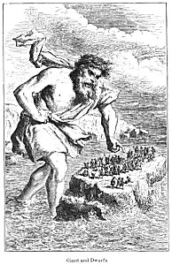

  
[Intangible Textual Heritage](../../../index.md)  [Sagas and
Legends](../../index)  [Celtic](../index)  [Index](index.md) 
[Previous](tfm176)  [Next](tfm178.md) 

------------------------------------------------------------------------

FRANCE

>  

> Porquol faut-il s'dmerveiller  
> Que la raison la mteux sensée,  
> Lasse souvent do veiller,  
> Par des contes d'ogre et de fée  
> Ingenieusement bercée,  
> Prenne plaisir à sommelier?  
>
> Perrault.

> THE Fairy mythology of France may be divided, as respects its
> locality, into two parts, that of Northern and that of Southern
> France, the Langue d'Oil and the Langue d'Oc. We will commence with
> the latter, as adjacent to Spain. Of its mythology, Gervase of
> Tilbury, who resided in the kingdom of Arles, has left us some
> interesting particulars, and other authorities enable us to trace it
> down to the present day. Speaking of the inhabitants of Arles, Gervase
> thus expresses himself:

> "They also commonly assert, that the Dracs assume the human form, and
> come early into the public market-place without any one being thereby
> disturbed. These, they say, have their abode in the caverns of rivers,
> and occasionally, floating along the stream in the form of gold rings
> or cups, entice women or boys who are bathing on the banks of the
> river; for, while they endeavour to grasp what they see, they are
> suddenly seized and dragged down to the bottom: and this, they say,
> happens to none more than to suckling women, who are taken by the
> Dracs to rear their unlucky offspring; and sometimes, after they have
> spent seven years there, they return to our hemisphere. These women
> say that they lived with the Dracs and their wives in ample palaces,
> in the caverns and banks of riven. We have ourselves seen one of these
> women, who was taken away while washing clothes on the banks of the
> Rhone. A wooden bowl floated along by her, and, in endeavouring to
> catch it, having got out into the deep water, she was carried down by
> a Drac, and made nurse to his son below the water She returned
> uninjured, and wäs hardly recognised by her husband and friends after
> seven years' absence.

> "After her return she related very wonderful things, such as that the
> Dracs lived on people they had carried off, and turned themselves into
> human forms; and she said that one day, when the Drac gave her an
> eel-pasty to eat, she happened to put her fingers, that were greasy
> with the fat, to one of her eyes and one side of her face, and she
> immediately I became endowed with most clear and distinct vision under
> the water. When the third year of her time was expired, and she had
> returned to her family, she very early one morning met the Drac in the
> market-place of Beaucaire. She knew him at once, and saluting him,
> inquired about the health of her mistress and the child. To this the
> Drac replied: 'Harkye,' said he, 'with which eye do you see me?' She,
> pointed to the eye she had touched with the fat: the Drac, immediately
> thrust his finger into it, and he was no longer visible to any one."
> \[a\]

> Respecting the Dracs, Gervase farther adds:

> "There is also on the banks of the Rhone, under a house, at the
> North-gate of the city of Arles, a great pool of the river . . . . In
> these deep places, they say that the Dracs are often seen of bright
> nights, in the shape of men. A few years ago there was, for three
> successive days, openly heard the following words in the place outside
> the gate of the city, which I have mentioned, while the figure as it
> were of a man ran along the bank: 'The hour is passed, and the man
> does not come.' On the third day, about the ninth hour, while that
> figure of a man raised his voice higher than usual, a young man ran
> simply to the bank, plunged in, and was swallowed up; and the voice
> was heard no more."

> The word Drac is apparently derived from Draco; but we are inclined to
> see its origin in the Northern *Duerg.* We must recollect that the
> Visigoths long occupied Provence and Languedoc. It is, we apprehend,
> still in use. *Fa le.Drac,* in Provençal, signifies *Fairre le
> diable.*\[b\] Goudelin, a provençal poet of the seventeenth century,
> begins his Castel en l'Ayre with these lines:

> Belomen qu' yeu *faré le Drac  
> *Se jamay trobi dins un sac  
> Cinc o siés milante pistolos  
> Espessos como de redolos.

> The following curious narrative also occurs in Gervase's work, and
> might seem to belong to Provence:

> "Seamen tell that one time as a ship was sailing in the Mediterranean
> sea, which sea we call ours, she was surrounded by an immense number
> of porpoises *(delphinos),* and that when an active young man, one of
> the crew, had wounded one of them with a weapon, and all the rest of
> them had rapidly sought the bottom, a sudden and awful tempest
> enveloped the ship. While the sailors were in doubt of their lives,
> lo! one in the form of a knight came borne on a steed on the sea, and
> demanded that, for the salvation ef all the rest, the person who had
> wounded the porpoise should be delivered up to him. The sailors were
> in an agony between their own danger and their aversion to expose
> their comrade to death, which seemed to them to be most cruel, and
> they thought it infamous to consult their own safety at the expense of
> the life of another. At last the man himself, deeming it better that
> all should be saved at the cost of one, as they were guiltless, than
> that such a number of people should run the risk of destruction on
> account of his folly, and lest by defending him they should become
> guilty, devoted himself to the death he merited, and voluntarily
> mounted the horse behind the rider, who went over the firm water,
> taking his road along it as if it had been the solid land. In a short
> time he reached a distant region, where he found lying in a
> magnificent bed the knight whom he had wounded the day before as a
> porpoise. He was directed by his guide to pull out the weapon which
> was sticking in the wound, and when he had done so, *the,guilty right
> hand gave aid to the wound.* This being done, the sailor was speedily
> brought back to the ship, and restored to his companions. Hence it is,
> that from that tune forth sailors have ceased to hunt the porpoises."
> \[c\]

> Gervase also describes the Kobold, or House-spirit, the Esprit Follet,
> or Goblin of the North of France.

> "There are," says he, "other demons, commonly called Follets, who
> inhabit the houses of simple country people, and can be kept away
> neither by water nor exorcisms; and as they are not seen, they pelt
> people as they are going in at the door with stones, sticks, and
> domestic utensils. Their words are heard like those of men, but their
> form does not appear. I remember to have met several wonderful stories
> of them in the Vita Abbreviata, et Miraculis beatissimi Antonii."
> \[d\]

> Elsewhere \[e\] he speaks of the beings which he says are called
> Lamiae, who, he relates, are used to enter houses suddenly, ransack
> the jars and tubs, pots and pitchers, take the children out of the
> cradles, light lamps or candles, and sometimes oppress those who are
> sleeping.

> Either Gervase mistook, or the Fadas of the south of France were
> regarded as beings different from mankind. The former is, perhaps, the
> more likely supposition. He thus speaks of them: "This, indeed, we
> know to be proved every day by men who are beyond all exception; that
> we have heard of some who were lovers of phantoms of this kind which
> they call Fadas; \[f\] and when they married other women, they died
> before consummating the marriage. We have seen most of them live in
> great temporal felicity, who when they with-drew themselves from the
> embraces of these Fadas, or discovered the secret, lost not only their
> temporal prosperity, but even the comfort of wretched lifé." \[g\]

> "In the legend of St. Armentaire, composed about 1800, by Raymond, a
> gentleman of Provence, we read of the Fée Esterelle, and of the
> sacrifices to her, who used to give barren women beverages to drink,
> to make them fruitful; and of a stone called *La Lauza de la Fuda;*
> that is the Fairy-stone on which they used to sacrifice to her." \[h\]

> Even at the present day the belief in the Fadas seems to linger in
> Provence and the adjoining districts.

> "On the night of the 31st of December," says Du Mege, \[i\] the "Fees
> *(Hadas)* enter the dwellings of their worshipers. They bear good-luck
> in their right, ill-luck in their left-hand. Care has been taken to
> prepare for them in a clean retired. room, such a repast as is suited
> to them. The doors and windows are left open; a white cloth is laid on
> a table with a loaf, a knife, a vessel full of water or wine, and a
> cup. A lighted candle or wax taper is set in the centre of the table.
> It is the general belief that those who present them with the best
> food may expect all kinds of prosperity for their property and their
> family; while those who acquit themselves grudgingly of their duty
> toward the Fées, or who neglect to make preparations worthy of these
> divinities, may expect the greatest misfortunes."

> From the following passage of the Roman de Guillaume au Court-Nez it
> would appear that three was the number of the Hadas.

> Coustume avoient lee gens, par véritez,  
> Et *en Provence* et en autres regnez.  
> Tables métoient et siéges ordenez,  
> Et sur la table iij blans pains bulétez,  
> Iij poz do vine et iij hénez de lès  
> Et par encoste iert li enfès posez. \[j\]

> Some years ago a lady, named Marie Aycard, published a volume named
> "Ballades et Chants populaires de la Provence," two of which seem to
> be founded on popular legends. She names the one La Fée aux Cheveux
> Verts, and in it relates the story of a young mariner of Marseilles
> who was in the habit of rowing out to sea by himself in the evening.
> On one of these occasions he felt himself drawn down by an invisible
> power, and on reaching the bottom found himself at the gate of a
> splendid palace, where he was received by a most beautiful fairy, only
> her hair was green. She at once told him her love, to which he
> responded as she wished, and after detaining him some time she
> dismissed him, giving him two fishes, that he might account for his
> absence by saying that he had been fishing The same invisible power
> brought him back to his boat, and he reached home at sunrise. The size
> and form of his fishes, such as had never been seen, excited general
> wonder; but he feared the fairy too much to reveal his secret. An
> invincible attraction still drew him to the submarine palace, but at
> last he saw a maiden whose charms, in his eyes, eclipsed those of the
> fairy. He now fled the sea shore, but every time he approached his
> mistress he received an invisible blow, and he continually was haunted
> by threatening voices. At length he felt an irresistible desire to go
> out again to sea. When there he was drawn down as before to the
> palace, but the fairy now was changed, and saying, "You have betrayed
> me--you shall die," she caused him to be devoured by the sea-monsters.
> But other accounts say that she kept him with her till age had
> furrowed his brow with wrinkles, and then sent him back to poverty on
> earth.

> The other legend named Le Lutin tells how seven little boys,
> regardless of the warnings of their old grandmother, would go out at
> night on various affairs. As they went along a pretty little black
> horse came up to them, and they all were induced to mount on his back.
> When they met any of their playmates they invited them also to mount,
> and the back of the little horse, stretched so that at last he had on
> him not less than thirty little boys. He then made with all speed for
> the sea, and plunging into it with them they were all drowned. \[k\]

> Passing to Auvergne we find Gregory of Tours in the sixth century thus
> relating an event which happened in his youth. A man was going one
> morning to the forest, and he took the precaution to have his
> breakfast, which he was taking with him, blessed before he set out.
> Coming to the river, before it was yet day, he drove his bullock-cart
> into the ferry-boat *(in ponte qui super navem est),* and when he was
> about half-way over he heard a voice saying, "Down with him! down with
> him! be quick!" *(Merge, merge, ne moreris!)* to which another
> replied, "I should have done it without your telling me if something
> holy did not prevent me; for I would have you to know that he is
> fortified with the priest's blessing, so that I cannot hurt him."
> \[l\]

> Miss Costello \[m\] heard in Auvergne a story of a changeling, which
> the mother, by the direction of the Curé, took to the market-place,
> where she whipped it well, till its mother, La Fée du Grand Cascade,
> brought her back her own child. She also relates at great length a
> legend which she styles La Blonde de in Roche, in which a young lady,
> instructed by her nurse, learns to change her form, and thus become a
> companion of the Fées, who are beings of tiny dimensions. Afterwards,
> when she is married, they take away her children, but she manages to
> recover them.

> "La Tioul de las Fadas is within five and a half leagues of St. Flour,
> at Pirols, a village of Haute Auvergne. It is composed of six large
> rude stones, covered by a seventh, larger and more massive than the
> rest; it is twelve feet long, and eight and a half wide. The tradition
> relates that a Fée who was fond of keeping her sheep on the spot
> occupied by this monument, resolved to shelter herself from the wind
> and ram. For this purpose she went far, very far, *(bien loin, bien
> loin)* in search of such masses of granite, as six yoke of oxen could
> not move, and she gave them the form of a little house. She carried,
> it is said, the largest and heaviest of them on the top of her
> spindle, and so little was she incommoded by the weight of it, that
> she continued to spin all the way." \[n\]

> The following legend is traditional in Périgord:

> Embosomed in the forest of the canton of La Double, near the road
> leading from Périgueux to Ribérac, is a monument named Roque Brun. It
> consists of four enormous rocks placed two and two, so as to form an
> alley ten feet long and six wide. A fifth rock, higher and thicker
> than the others, closes this space on the west. The whole is covered
> by a huge mass of rock, at least twelve feet by seven, and from three
> to four feet thick. There can be no doubt of its being the work of
> man, and it is remarkable that the stone composing it is different
> from that of the soil on which it stands. \[o\] The tradition of the
> canton, however, is, that many thousand years ago there was a Fée who
> was the sovereign of the whole country, and having lost her husband in
> a battle fought in this very place she resolved to bury him on the
> spot. She therefore called six of her pages, and ordered them to
> fetch, each one of these stones, and to place them in the order which
> they still maintain. They instantly obeyed, and they carried and
> arranged the huge masses as easily as if they had been only
> rose-leaves. When the tomb was completed, the Fairy ascended it, and
> turning to the east, she thrice cursed, in a voice of thunder,
> whoever, should henceforth dare even to touch this monument of her
> royal spouse. Many an instance is still recorded by the peasantry of
> those who dared and were puxiished. \[p\]

> The Fairy-lore of the North of France, at least of Normandy, is, as
> was to be expected, similar to that of the other portions of the
> Gotho-G-erman race. We meet it in the *f*é*es* or fairies, and the
> *lutins* or *gobelins,* which answer to the Kobolds, Nisses, and such
> like of those nations \[q\]

> The Fees are small and handsome in person; they are fond of dancing in
> the night-time, and in their dances which are circular they form the
> *Cercles des F*ée*s,* or fairy-rings. If any one approaches their
> dance, he is irresistibly impelled to take part in it. He is admitted
> with the greatest courtesy; but as the whirling movement increases,
> and goes faster and faster, his head becomes giddy, and he falls to
> the ground utterly exhausted. Sometimes the *f*é*es* amuse themselves
> by flinging him up to a great height in the air, and, if not killed by
> the fall, he is found next morning full of bruises. These little
> beings, it is also said, haunt solitary springs, where they wash their
> linen, which they then dry by way of preference on the Druidic stones,
> if at hand, and lay up in the hollows of rocks or barrows, thence
> named *Chambres* or *Grottes des.F*é*es.* But, further, it is said of
> them, like the *Lutins,* they select particular farms to which they
> resort at night, and there making use of horses, harness and utensils
> of all kinds, they employ themselves at various kinds of work, of
> which, however, no traces remain in the morning. They are fond of
> mounting and galloping the horses; their seat is on the neck, and they
> tie together locks of the mane to form stirrups. Their presence,
> however, always brings luck, the cattle thrive where they are, the
> utensils of which they have made use, if broken are mended and made as
> good as new. They are altogether most kind and obliging, and have been
> known to give cakes to those to whom they have taken a fancy.

> The Fées of Normandy are, like others, guilty of child-changing. A
> countrywoman as she was one day carrying her child on her arm met a
> Fée similarly engaged, who proposed an exchange. But she would not
> consent, even though, she said, the Fée's babe were *nine times finer
> than her own.* A few days after, having left her child in the house
> when she went to work in the fields, it appeared to her on her return
> that it had been changed. She immediately consulted a neighbour, who
> to put the matter to the proof, broke a dozen eggs and ranged the
> shells before the child, who instantly began to cry out, *Oh! what a
> number of cream-pots! Oh! what a number of cream-pots!* The matter was
> now beyond doubt, and the neighbour next advised to make it cry
> lustily in order to bring its real mother to it. This also succeeded;
> the Fee came imploring them to spare her child, and the real one
> should be restored.

> There is another kind of Fées known in Normandy by the name of *Dames
> Blanches,* or White Ladies, who are of a less benevolent character.
> These lurk in narrow places, such as ravines, fords and bridges, where
> passengers cannot well avoid them, and there seek to attract their
> attention. The Dame Blanche sometimes requires him whom she thus meets
> to join her in a dance, or to hand her over a plank. If he does so she
> makes him many courtesies, and then vanishes. One of these ladies
> named La Dame d' Aprigny, used to appear in a winding narrow ravine
> which occupied the place of the present Rue Saint Quentin at Bayeux,
> where, by her involved dances, she prevented any one from passing. She
> meantime held out her hand, inviting him to join her, and if he did so
> she dismissed him after a round or two; but if he drew back, she
> seized him and flung him into one of the ditches which were full of
> briars and thorns. Another Dame Blanche took her station on a narrow
> wooden bridge over the Dive, in the district of Falaise, named the
> Pont d' Angot. She sat on it and would not allow any one to pass
> unless he went on his knees to her; if he refused, the Fee gave him
> over to the *lutins,* the cats, owls, and other beings which, under
> her sway, haunt the place, by whom he was cruelly tormented.

> Near the village of Puys, half a league to the north-east of Dieppe,
> there is a high plateau, surrounded on all sides by large
> entrencbments, except that over the sea, where the cliffs render it
> inaccessible. It is named *La Cit*é *de Limes* or *La* *Camp de César*
> or simply *Le Catel* or *Castel.* Tradition tells that the Fées used
> to hold a fair there, at which all sorts of magic articles from their
> secret stores were offered for sale, and the most courteous entreaties
> and blandishments were employed to induce those who frequented it to
> become purchasers. But the moment any one did so, and stretched forth
> his hand to take the article he had selected, the perfidious Fées
> seized him and hurled him down the cliffs.

> Such are the accounts of the Fées stifi current in Normandy. To these
> we may add that of Dame Abonde or ITabonde, current in the middle
> ages. William of Auvergne, bishop of Paris, who died in the year 1248,
> thus writes:

> "Sunt et aliae ludificationes malignorum spiritorum quas faciunt
> interdum in nemoribus et locis amoenis, et frondosis arboribus, ubi
> apparent in similtudine *puellarum* aut *matronarum* ornatu muliebri
> et *candido;* interdum etiam *in stabulis, cum luminaribus cereis, ex
> quibus apparent distillationes in comis et collis equorum et comae
> ipsorum diligenter tricatae;* et audies eos, qui talia se vidisse
> fatentur, dicentes veram ceram esse quae de luminaribus hujusmodi
> stillaverat. De illis vero substantiis quae apparent in domibus quas
> *dominas nocturnas* et *principem* earum vocant *Dominam Abundiam* pro
> eo quod domibus, quas frequentant, abundantiam bonorum temporalium
> praestare putantur non aliter tibi sentiendum est neque aliter quam
> quemadmodum de illis audivisti. Quapropter eo usque invaluit stultitia
> hominum et insania vetularum ut vasa vini et receptacula ciborum
> discooperta relinquant, et omnino nec obstruent neque claudant eis
> noctibus quibus ad domos suos eas credunt adventuras; ea de causa
> videlicet ut cibos et potus quasi paratos inveniant, et eos absque
> difilcultate apparitionis pro beneplacito sumant." \[r\]

> Dame Abonde is also mentioned in the same century in the celebrated
> Roman de la Rose as follows:--

> Qui les cinc sens ainsine decoit  
> Par les fantosmes qu'il recoit,  
> Dont maintes gens par br folie  
> Cuident estre par nuit estries *(allés)  
> Errans* avecques *Dame Habonde.  
> *Et dient que par tout le monde  
> Si tiers enfant de nacion *(naisaance)  
> *Sunt de ceste condicion,  
> Qu'ils vont trois fois en la semaine,  
> Li cum destinée lea maine *(mène),  
> *Et par tous ces ostex *(hotels)* se boutent,  
> Ne cles ne barres ne redoutent.  
> Ains sen entrent par lea fendaces *(fentes)  
> *Par chatieres et par crevaces.  
> Et se partent des cors les ames  
> Et vont avec lea *bonnes dames  
> *Par leur forains et par maisons.  
> Et le prcuvent par tiex *(ces)* raisons:  
> Que les diversités veues  
> Ne sont pas en lor liz *(lits)* venues,  
> Ains *(anzi* It.) sunt lor ames que laborent  
> Et par le monde ainsinc sen corent. \[s\]

> In these places we find that Abundia is a queen or ruler over a band
> of what we may call fairies, who enter houses at night, feast there,
> twist the horses' manes, etc. This may remind us at once of
> Shakespeare's Queen Mab, whom, though only acquainted with Habundia
> through a passage in Heywood, \[t\] we conjectured to have derived her
> name from that of this French dame. \[u\] Chaucer, by the way, always
> spells *habundance* with an *h,* which may have become *m* as it does
> *n* in Numps from Humphrey; so Edward makes Ned, Oliver Noll, etc.

> The Lutin or Gobelin \[v\] of Normandy hardly differs in any respect
> from the domestic spirit of Scandinavia and Germany. He is fond of
> children and horses; and if the proverb

> Ou il y *a* belle fille et bon yin  
> Là aussi hante le lutin

> lie not, of young maidens also. He caresses the children, and gives
> them nice things to eat, but he also whips and. pinches them if
> naughty. \[w\] He takes great care of the horses, gallops them at
> times, and *lutines* their manes, *i.e., elfs* or plaits and twists
> them in an inexplicable manner. So fond, indeed, is he of this
> amusement, that it is related that when one time two young girls fell
> asleep in a stable, he *lutined* their hair in such a way that they
> had to cut it all off. Sometimes the Lutin takes the form of a young
> villager, and struts about with great complacency. On such occasions
> it is necessary to call him Bon Garçon, a thing the Norman peasant
> never neglects to do. At other times he appears under the form of a
> horse ready bridled and saddled. If any peasant, weary after his day's
> work, is induced to mount him in order to ride home, he begins to kick
> and fling and. rear and bound, and ends by jerking him into a marsh or
> a ditch full of water. When he takes this form he is called Le Cheval
> Bayard, probably after the famous steed of the Paladin Rinaldo.

> The following tradition of *"Le Lutin, ou le Fé* *amoureux*," is
> related in the neighbourhood of Argentan:

> A Fé was fond of a pretty young *paysanne,* and used to come every
> evening when she was spinning at her fireside, and take his seat on a
> stool opposite to her, and. keep gazing on her fair face. The
> ungrateful object of this respectful attention, however, told her
> husband the whole story, and in his jealous mood. he resolved to have
> his revenge of the amorous Lutin. Accordingly, he heated the girdel
> *(galetiere)* red-hot, and placed it on the seat which he used to
> occupy, and then dressing himself in his wife's clothes, he sat in her
> place, and began to spin as well as he could. The Fé came as usual,
> and instantly perceived the change. "Where," said he, "is La-belle
> belle of yesterday evening, who draws, draws, and keeps always
> twirling, while you, you turn, turn, and never twirl?" He, however,
> went and took his usual seat, but immediately jumped up, screaming
> with pain. His companions, who were at hand, inquired the cause. "I am
> burnt," cried he. "Who burned you?" cried they. "Myself," replied he;
> for this the woman had told him was her husband's name. At this they
> mocked at him and went away.\[x\]

> The best way, it is said, to banish a Lutin who haunts a house, is to
> scatter flax-seed in the room that he most frequents. His love of
> neatness and regularity will not allow him to let it lie there, and he
> soon gets tired of picking it up, and so be goes away.

> A Lutin, named the Nain Rouge, haunts the coast of Normandy. He is
> kind in his way to the fishermen, and often gives them valuable aid;
> but be punishes those who do not treat him with proper respect. Two
> fishermen who lived near Dieppe, were going one day to Pollet. On
> their way they found a little boy sitting on the road-side; they asked
> him what he was doing there. "I am resting myself" said he, "for I am
> going to Berneville" (a village within a league of Pollet.) They
> invited him to join company; he agreed, and amused them greatly with
> his tricks as they went alone. At last, when they came to a pond near
> Berneville, the malicious urchin caught up one of them, and flung him,
> like a shuttlecock, up into the air over it; but, to his great
> disappointment, he saw him land safe and sound at the other side.
> "Thank your patron-Saint," cried he, with his cracked voice, "for
> putting it into your mind to take some holy water when you were
> getting up this morning. But for that you 'd have got a nice dip."

> A parcel of children were playing on the strand at Pollet, when Le
> Petit Homme Rouge came by. They began to make game of him, and he
> instantly commenced pelting them with stones at such a rate that they
> found it necessary to seek refuge in a fishing-boat, where, for the
> space of an hour, as they crouched under the hatches, they heard the
> shower of stones falling so that they were sure the boat must be
> buried under them. At length the noise ceased, and when they ventured
> to peep out, not a stone was to be seen.

> There is also in Normandy a kind of spirits called Lubins, which take
> the form of wolves, and enter the churchyards under the guidance of a
> chief who is quite black. They are very timorous, and at the least
> noise they fly, crying *".Robert eat mort! .Robert est mort!"* People
> say of a timorous man, *"Il a peur de Lubin .!"* \[y\]

> A belief in Fées, similar to those which we nave denominated Fairies
> of Romance, seems to have prevailed all over France during the middle
> ages.

> The great Bertrand Duguesclin married a lady named Tiphaine, "extraite
> do noble lignée," says his old biographer; "laqueile avoit environ
> vingt-quatre ans, ne onques n'avoit été mariée et éstoit bonne et
> sage, et moult experte aux arts d'astronomie; aucuns disoient qu'elle
> éstoit *faée* mais non éstoit, mais éstoit sinsi inspirée et de la
> Grace de Dieu."

> One of the chief articles of accusation against the heroic and
> unfortunate Maid. of Orleans, was "Que souvent alloit à une belle
> fontaine au pais de Lorraine, laquelle elle nommoit *bonne fontaine
> aux F*é*es* nostre Seigneur, et en icelui lieu tous ceulx de pays
> quand ils avoient fiebvre ils alloient pour recouvrer garison, et Ia
> alloit souvent la dite Jehanne la Pucelle, sous un grand arbre qui la
> fontaine ombroit, et s'apparurent à elle St. Katerine et St.
> Marguerite." \[z\] She was also asked "Si elle sçait rien de *ceux qui
> vont avecq les F*ées?"

> Of these Fées the most celebrated is Melusina, who was mazrried to the
> Count of Lusignan. Toward the end of the fourteenth century, Jean
> d'Arras collected the traditions relating to her, and composed what he
> called her "Chronicle." Stephen, a Dominican of the house of Lusignan,
> took up the history written *by* Jean D'Arras, gave it consistency,
> and cast such splendour about his heroine, that several noble houses
> were ambitious of showing a descent from her. Those of Luxembourg and
> Rohan even falsified their genealogies for that purpose; and the house
> of Sassenage, though it might claim its descent from a monarch,
> preferred Melusina, and to gratify them it was feigned that when she
> quitted Lusignan she retired to the grot of Sassenage, in Dauphiny.

> The following is a slight sketch of the story of the fair Melusina.
> \[aa\]

> Ange par Ia figure, et serpent par le reste.  
>
> De Lille

>  

------------------------------------------------------------------------

> \[a\] *Otia Imperialia,* p. 987

> \[b\] Like the Irish
>
> Play me Puck

> \[c\] *Otia limper.* p 981: It does not appear that the abode ot these
> porpoise-knights was beneath the water.

> \[d\] *Otia Imper.* p. 897. Orthone, the House-spirit, who, according
> to Froissart, attended the Lord of Corasse, in Gascony, resembled
> Hlnzelmann in many points.

> \[e\] Ibid.

> \[f\] *Hujusmodi larvarum.* He classes the Fadas 'with Sylvans and
> Pans.

> \[g\] Page 989. Speaking of the wonderful horse of Giraldus de
> Cabreriis; Gervase says, *Si Fadus e'rat, i. e.* says Leibnitz,
> incantatus, ut *Fadae, Fatae, F*ées

> \[h\] Cambry, Monumens Celtiques, p. 342. The author says, that
> Esterelle, as well as all the Fairies, was the moon. This we very much
> doubt. He derives her name from the Breton *Escler,* Brightness,
> Lauza, from *Lac'h* (Irish *Clock),* a flat stone.

> \[i\] Monuments religieux des Voices Tectosages, *ap.* Mile. Bosquet,
> Normandie, etc., p. 92

> \[j\] See Leroux de Lincy, *ap.* Mile. Bosquet, p. 93, who adds "In
> Lower Normandy, in the arrondissement of Bayeux, they never neglect
> laying a table for the protecting genius of the babe about to be
> born;" see our note on Virg. Buc. iv. 63. In a collection of decrees
> of Councils made by Burchard of Worms, who died in 1024, we read as
> follows: "Fecisti, ut quaedam mulieres in quibusdam temporibus anni
> facere solent, ut in domo tua *rnensam praepares* et tuos cibos et
> potum cum *tribus cultelluis* supra mensam poneres, ut si venissent
> *tres illae sorores* quas antiqua posteritas et antiqua stultitia.
> Parcas nominavit, ibi reficirentur ... ut credens illas quas tu dicis
> esse sorores tibi posse aut hic aut in futuro prodesse?" Grimm. *Deut.
> Mythol. Anhang,* p. xxxviii, where we are also told that these Pares
> could give a man at his birth the power of becoming a Werwolf. All
> this, however, does not prove that they wore the Origin of the *F*é
>
> es.

> \[k\] This may remind us of the Neck or Kelpie above. It seems
> confirmatory of our theory respecting the Visigoths.

> \[l\] Greg. Tur. De Glor. Confess. ch. xxxi., *ap.* Grimm. p. 466.

> \[m\] Pilgrimage to Auvergne, ii. p. 294,
>
> seq.

> \[n\] Cambry, Monuments Celtiques, p. 232.

> \[o\] It is evidently a *cromleach.* What is said of the nature of the
> stones is also true of Stonehenge.

> \[p\] Lettres de Madame S. à sa Fille. Périgueux, 1830: by M. Jouannet
> of Bordeaux.

> \[q\] See Mile. Bosquet, La Normandie Romanesque et Merveilleuse, and
> the works there quoted by this learned and ingenious lady. What
> follows is so extremely like what we have seen above of the Korrigan
> of the adjacent Brittany, that we hope she has been careful not to
> transfer any of their traits to her Fees.

> \[r\] Opera i. 1036; Paris, 1674, *ap.* Grimm, Deut. Mythol. p. 263.

> \[s\] *Ap.* Grimm, *ut* *sup.* Douce (Ill, of Shak. i. 382) was, we
> believe, the first who directed attention to Abundia. He quotes from
> an old
>
> fabliau:

> Ceste richesse nus abonde,  
> Nos l'avons de par Dame Abonde.

> \[t\] One kind of these the Italians Fate name;

> Fée the French; we Sybils; and the same  
> Others White Nymphs;  
> and those that have them seen,  
> Night Ladies some, of which Habundia queen.  
> *Hierarchie,* viii. p.507.

> \[u\] Mr. Thoms prefers a derivation from the Cymric, *Mab,* boy,
> child.

> \[v\] There is no satisfactory derivation of *Lutin,* for we cannot
> regard as such Grimm's à *luctu. Gobelin, Goblin,* or *Goubelin,* is
> evidently the same as *Kobold. Follet* (from *fol, fou)* and
> *Farfadet,* are other names. Both *Gobelin* and *Lutin* were in use in
> the 11th century. Orderic Vitalis, speaking of the demon whom St.
> Taurin drove out of the temple of Diana, says, *Hunc vulgus Gobelinum
> appellat,* and Wace (Roman de Rou, *v.* 9715) says of the familiar of
> bishop Manger who excommunicated the Conqueror

> Ne sei s'esteit lutin ou non.

> \[w\] Mothers also threaten their children with him. *Le gobelin vous
> mangera, le gobelin vous emportera.* Père\~ L'ABBE, *Etymologie,* i.
> p. 262.

> \[x\] In another French tale a man to deceive a Fée, put on his wife's
> clothes and was minding the child, but she said as she came in, "Non,
> tu ne point la belle d'hier au soir, tu ne files, ni ne vogues, ni ton
> fuseau ne t'enveloppes," and to punish him she turned some apples that
> were roasting on the hearth into peas. Schreiber *ap.* GRIMM, p. 385.

> \[y\] Lubin may be only another form of Lutin, and connected with the
> English Lob. Its likeness to *loup* may have given occasion to the
> fiction of their taking the lupine form.

> \[z\] Chattier.

> \[aa\] Histoire de Mélusine, tirée des Chroniques do Poftou. Paris,
> l698 Dobenek, des Deutschen Mittelalter und Volksglauben.

>  

------------------------------------------------------------------------

[Next: Legend of Melusina](tfm178.md)
