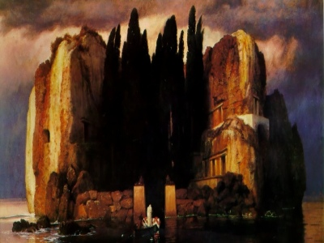

  
[Intangible Textual Heritage](../../../index)  [Legends and
Sagas](../../index)  [Celtic](../index) 

------------------------------------------------------------------------

[Buy this Book at
Amazon.com](https://www.amazon.com/exec/obidos/ASIN/B0028RY8F6/internetsacredte)

------------------------------------------------------------------------

<table width="75%">
<colgroup>
<col style="width: 50%" />
<col style="width: 50%" />
</colgroup>
<tbody>
<tr class="odd">
<td width="50%" data-valign="TOP"> 
Arnold Bocklin, Island of the Dead [1880] (Public Domain Image)</td>
<td width="50%" data-valign="CENTER"><h1 id="true-irish-ghost-stories" data-align="CENTER">True Irish Ghost Stories</h1>
<h2 id="by-st.-john-d.-seymour-and-harry-l.-neligan" data-align="CENTER">by St. John D. Seymour and Harry L. Neligan</h2>
<h4 id="section" data-align="CENTER">[1914]</h4></td>
</tr>
</tbody>
</table>

------------------------------------------------------------------------

[Contents](#contents)    [Start Reading](tigs00)    [Page
Index](pageidx)    [Text \[Zipped\]](tigs.txt.gz)

------------------------------------------------------------------------

|                                                                                                                           |
|---------------------------------------------------------------------------------------------------------------------------|
|  |

There are numerous books about Irish Fairies, but this was one of the
first to focus on the Irish Ghost. The text visits haunted houses from
one end of the island to the other. We learn about garden-variety ghosts
as well as poltergeists and Banshees, and find out what to do if a
'Headless Coach' shows up. Seymour solicited the stories from newspaper
readers, and many of them are from respectable military, clergymen, and
gentry. Seymour also wrote [Irish Witchcraft and
Demonology](../../../pag/iwd/index). True Irish Ghost Stories is a
unique and very entertaining read, particularly for fans of Irish tales,
as well as the paranormal investigator.--J.B. Hare, May 6th, 2009.

------------------------------------------------------------------------

 [Title Page](tigs00)  
[Foreword](tigs01)  
[Contents](tigs02)  
[Chapter I. Haunted Houses in or near Dublin](tigs03)  
[Chapter II. Haunted Houses in Conn's Half](tigs04)  
[Chapter III. Haunted Houses in Mogh's Half](tigs05)  
[Chapter IV. Poltergeists](tigs06)  
[Chapter V. Haunted Places](tigs07)  
[Chapter VI. Apparitions At or After Death](tigs08)  
[Chapter VII. Banshees, and Other Death-Warnings](tigs09)  
[Chapter VIII. Miscellaneous Supernormal Experiences](tigs10)  
[Chapter IX. Legendary and Ancestral Ghosts](tigs11)  
[Chapter X. Mistaken Identity—Conclusion](tigs12)  
[Index of Place Names](tigs13)  
