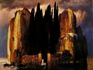

  
[Intangible Textual Heritage](../../../index)  [Legends and
Sagas](../../index)  [Celtic](../index)  [Index](index)  [Next](tigs01) 

------------------------------------------------------------------------

[Buy this Book at
Amazon.com](https://www.amazon.com/exec/obidos/ASIN/B0028RY8F6/internetsacredte)

------------------------------------------------------------------------

  
*True Irish Ghost Stories*, by St. John D. Seymour and Harry L. Neligan,
\[1914\], at Intangible Textual Heritage

------------------------------------------------------------------------

# True Irish Ghost Stories

### compiled by St. John D. Seymour and Harry L Neligan

#### Dublin, Hodges, Figgis & Co., ltd.;

#### \[1914\]

Scanned, proofed and formatted at Intangible Textual Heritage May 2009,
by John Bruno Hare. This text is in the public domain in the US because
it was published prior to 1923.

TO  
THREE LIVELY POLTERGEISTS  
W—, J—, AND G—,  
THIS BOOK IS DEDICATED  
BY  
THE COMPILERS

------------------------------------------------------------------------

[Next: Foreword](tigs01)
