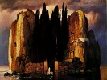

  
[Intangible Textual Heritage](../../../index)  [Legends and
Sagas](../../index)  [Celtic](../index)  [Index](index) 
[Previous](tigs08)  [Next](tigs10) 

------------------------------------------------------------------------

[Buy this Book at
Amazon.com](https://www.amazon.com/exec/obidos/ASIN/B0028RY8F6/internetsacredte)

------------------------------------------------------------------------

  
*True Irish Ghost Stories*, by St. John D. Seymour and Harry L. Neligan,
\[1914\], at Intangible Textual Heritage

------------------------------------------------------------------------

p. 175

### CHAPTER VII

#### BANSHEES, AND OTHER DEATH-WARNINGS

Of all Irish ghosts, fairies, or bogies,
the Banshee (sometimes called locally the "Bohēēntha" or "Bankēēntha")
is the best known to the general public: indeed, cross-Channel visitors
would class her with pigs, potatoes, and other fauna and flora of
Ireland, and would expect her to make manifest her presence to them as
being one of the sights of the country. She is a spirit with a lengthy
pedigree—how lengthy no man can say, as its roots go back into the dim,
mysterious past. The most famous Banshee of ancient times was that
attached to the kingly house of O'Brien, Aibhill, who haunted the rock
of Craglea above Killaloe, near the old palace of Kincora. In A.D. 1014
was fought the battle of Clontarf, from which the aged king, Brian Boru,
knew that he would never come away alive, for the previous night Aibhill
had appeared to him to tell him of his impending fate.

p. 176

\[paragraph continues\] The Banshee's
method of foretelling death in olden times differed from that adopted by
her at the present day: now she wails and wrings her hands, as a general
rule, but in the old Irish tales she is to be found washing human heads
and limbs, or bloodstained clothes, till the water is all dyed with
human blood—this would take place before a battle. So it would seem that
in the course of centuries her attributes and characteristics have
changed somewhat.

Very different descriptions are given of her personal appearance.
Sometimes she is young and beautiful, sometimes old and of a fearsome
appearance. One writer describes her as "a tall, thin woman with
uncovered head, and long hair that floated round her shoulders, attired
in something which seemed either a loose white cloak, or a sheet thrown
hastily around her, uttering piercing cries." Another person, a
coachman, saw her one evening sitting on a stile in the yard; she seemed
to be a very small woman, with blue eyes, long light hair, and wearing a
red cloak. Other descriptions will be found in this chapter. By the way,
it does not seem to be true that the Banshee exclusively follows

p. 177

families of Irish descent, for the last incident had reference to the
death of a member of a Co. Galway family English by name and origin.

One of the oldest and best-known Banshee stories is that related in the
*Memoirs* of Lady Fanshaw. [1](#fn_9) In 1642 her
husband, Sir Richard, and she chanced to visit a friend, the head of an
Irish sept, who resided in his ancient baronial castle, surrounded with
a moat. At midnight she was awakened by a ghastly and supernatural
scream, and looking out of bed, beheld in the moonlight a female face
and part of the form hovering at the window. The distance from the
ground, as well as the circumstance of the moat, excluded the
possibility that what she beheld was of this world. The face was that of
a young and rather handsome woman, but pale, and the hair, which was
reddish, was loose and dishevelled. The dress, which Lady Fanshaw's
terror did not prevent her remarking accurately, was that of the ancient
Irish. This apparition continued to exhibit itself for some time, and
then vanished with two

p. 178

shrieks similar to that which had first excited Lady Fanshaw's
attention. In the morning, with infinite terror, she communicated to her
host what she had witnessed, and found him prepared not only to credit,
but to account for the superstition. "A near relation of my family,"
said he, "expired last night in this castle. We disguised our certain
expectation of the event from you, lest it should throw a cloud over the
cheerful reception which was your due. Now, before such an event happens
in this family or castle, the female spectre whom you have seen is
always visible. She is believed to be the spirit of a woman of inferior
rank, whom one of my ancestors degraded himself by marrying, and whom
afterwards, to expiate the dishonour done to his family, he caused to be
drowned in the moat." In strictness this woman could hardly be termed a
Banshee. The motive for the haunting is akin to that in the tale of the
Scotch "Drummer of Cortachy," where the spirit of the murdered man
haunts the family out of revenge, and appears before a death.

Mr. T. J. Westropp, M.A., has furnished

p. 179

the following story: "My maternal grandmother heard the following
tradition from her mother, one of the Miss Ross-Lewins, who witnessed
the occurrence. Their father, Mr. Harrison Ross-Lewin, was away in
Dublin on law business, and in his absence the young people went off to
spend the evening with a friend who lived some miles away. The night was
fine and lightsome as they were returning, save at one point where the
road ran between trees or high hedges not far to the west of the old
church of Kilchrist. The latter, like many similar ruins, was a simple
oblong building, with long side-walls and high gables, and at that time
it and its graveyard were unenclosed, and lay in the open fields. As the
party passed down the long dark lane they suddenly heard in the distance
loud keening and clapping of hands, as the country-people were
accustomed to do when lamenting the dead. The Ross-Lewins hurried on,
and came in sight of the church, on the side wall of which a little
gray-haired old woman, clad in a dark cloak, was running to and fro,
chanting and wailing, and throwing up her arms. The girls were

p. 180

very frightened, but the young men ran forward and surrounded the ruin,
and two of them went into the church, the apparition vanishing from the
wall as they did so. They searched every nook, and found no one, nor did
anyone pass out. All were now well scared, and got home as fast as
possible. On reaching their home their mother opened the door, and at
once told them that she was in terror about their father, for, as she
sat looking out the window in the moonlight, a huge raven with fiery
eyes lit on the sill, and tapped three times on the glass. They told her
their story, which only added to their anxiety, and as they stood
talking, taps came to the nearest window, and they saw the bird again. A
few days later news reached them that Mr. Ross-Lewin had died suddenly
in Dublin. This occurred about 1776."

Mr. Westropp also writes that the sister of a former Roman Catholic
Bishop told his sisters that when she was a little girl she went out one
evening with some other children for a walk. Going down the road, they
passed the gate of the principal demesne near the town. There was a
rock, or large

p. 181

stone, beside the road, on which they saw something. Going nearer, they
perceived it to be a little dark, old woman, who began crying and
clapping her hands. Some of them attempted to speak to her, but got
frightened, and all finally ran home as quickly as they could. Next day
the news came that the gentleman, near whose gate the Banshee had cried,
was dead, and it was found on inquiry that he had died at the very hour
at which the children had seen the spectre.

A lady who is a relation of one of the compilers, and a member of a Co.
Cork family of English descent, sends the two following experiences of a
Banshee in her family. My mother, when a young girl, was standing
looking out of the window in their house at Blackrock, near Cork. She
suddenly saw a white figure standing on a bridge which was easily
visible from the house. The figure waved her arms towards the house, and
my mother heard the bitter wailing of the Banshee. It lasted some
seconds, and then the figure disappeared. Next morning my grandfather
was walking as usual into the city of Cork. He accidentally

p. 182

fell, hit his head against the curbstone, and never recovered
consciousness.

"In March 1900, my mother was very ill, and one evening the nurse and I
were with her arranging her bed. We suddenly heard the most
extraordinary wailing, which seemed to come in waves round and under her
bed. We naturally looked everywhere to try and find the cause, but in
vain. The nurse and I looked at one another, but made no remark, as my
mother did not seem to hear it. My sister was downstairs sitting with my
father. She heard it, and thought some terrible thing had happened to
her little boy, who was in bed upstairs. She rushed up, and found him
sleeping quietly. My father did not hear it. In the house next door they
heard it, and ran downstairs, thinking something had happened to the
servant; but the latter at once said to them, 'Did you hear the Banshee?
Mrs. P—must be dying.'"

A few years ago (*i.e.* before 1894) a curious incident occurred in a
public school in connection with the belief in the Banshee. One of the
boys, happening to become ill, was at once placed in a room by himself,

p. 183

where he used to sit all day. On one occasion, as he was being visited
by the doctor, he suddenly started up from his seat, and affirmed that
he heard somebody crying. The doctor, of course, who could hear or see
nothing, came to the conclusion that the illness had slightly affected
his brain. However, the boy, who appeared quite sensible, still
persisted that he heard someone crying, and furthermore said, "It is the
Banshee, as I have heard it before." The following morning the
head-master received a telegram saying that the boy's brother had been
accidentally shot dead. [1](#fn_10)

That the Banshee is not confined within the geographical limits of
Ireland, but that she can follow the fortunes of a family abroad, and
there foretell their death, is clearly shewn by the following story. A
party of visitors were gathered together on the deck of a private yacht
on one of the Italian lakes, and during a lull in the conversation one
of them, a Colonel, said to the owner, "Count, who's that queer-looking
woman you have on board?" The Count replied that there was nobody except
the

p. 184

ladies present, and the stewardess, but the speaker protested that he
was correct, and suddenly, with a scream of horror, he placed his hands
before his eyes, and exclaimed, "Oh, my God, what a face!" For some time
he was overcome with terror, and at length reluctantly looked up, and
cried:

"Thank Heavens, it's gone!"

"What was it?" asked the Count.

"Nothing human," replied the Colonel—"nothing belonging to this world.
It was a woman of no earthly type, with a queer-shaped, gleaming face, a
mass of red hair, and eyes that would have been beautiful but for their
expression, which was hellish. She had on a green hood, after the
fashion of an Irish peasant."

An American lady present suggested that the description tallied with
that of the Banshee, upon which the Count said:

"I am an O'Neill—at least I am descended from one. My family name is, as
you know, Neilsini, which, little more than a century ago, was O'Neill.
My great-grandfather served in the Irish Brigade, and on its dissolution
at the time of the French Revolution had the good fortune to escape

p. 185

the general massacre of officers, and in company with an O’Brien and a
Maguire fled across the frontier and settled in Italy. On his death his
son, who had been born in Italy, and was far more Italian than Irish,
changed his name to Neilsini, by which name the family has been known
ever since. But for all that we are Irish."

"The Banshee was yours, then!" ejaculated the Colonel. "What exactly
does it mean?"

"It means," the Count replied solemnly, "the death of some one very
nearly associated with me. Pray Heaven it is not my wife or daughter."

On that score, however, his anxiety was speedily removed, for within two
hours he was seized with a violent attack of angina pectoris, and died
before morning. [1](#fn_11)

Mr. Elliott O’Donnell, to whose article on "Banshees" we are indebted
for the above, adds: "The Banshee never manifests itself to the person
whose death it is prognosticating. Other people may see or hear it, but
the fated one never, so that when everyone present is aware of it but
one, the fate

p. 186

of that one may be regarded as pretty well certain."

We must now pass on from the subject of Banshees to the kindred one of
"Headless Coaches," the belief in which is widespread through the
country. Apparently these dread vehicles must be distinguished from the
phantom coaches, of which numerous circumstantial tales are also told.
The first are harbingers of death, and in this connection are very often
attached to certain families; the latter appear to be spectral phenomena
pure and simple, whose appearance does not necessarily portend evil or
death.

"At a house in Co. Limerick," writes Mr. T. J. Westropp, "occurred the
remarkably-attested apparition of the headless coach in June 1806, when
Mr. Ralph Westropp, my great-grandfather, lay dying. The story was told
by his sons, John, William, and Ralph, to their respective children, who
told it to me. They had sent for the doctor, and were awaiting his
arrival in the dusk. As they sat on the steps they suddenly heard a
heavy rumbling, and saw a huge dark coach drive into the paved court
before

p. 187

the door. One of them went down to meet the doctor, but the coach swept
past him, and drove down the avenue, which went straight between the
fences and hedges to a gate. Two of the young men ran after the coach,
which they could hear rumbling before them, and suddenly came full tilt
against the avenue gate. The noise had stopped, and they were surprised
at not finding the carriage. The gate proved to be locked, and when they
at last awoke the lodge-keeper, he showed them the keys under his
pillow; the doctor arrived a little later, but could do nothing, and the
sick man died a few hours afterwards."

Two other good stories come from Co. Clare. One night in April 1821, two
servants were sitting up to receive a son of the family, Cornelius
O'Callaghan, who had travelled in vain for his health, and was returning
home. One of them, Halloran, said that the heavy rumble of a coach
roused them. The other servant, Burke, stood on the top of the long
flight of steps with a lamp, and sent Halloran down to open the carriage
door. He reached out his hand to do so, saw a skeleton looking

p. 188

out, gave one yell, and fell in a heap. When the badly-scared Burke
picked himself up there was no sign or sound of any coach. A little
later the invalid arrived, so exhausted that he died suddenly in the
early morning.

On the night of December 11, 1876, a servant of the MacNamaras was going
his rounds at Ennistymon, a beautiful spot in a wooded glen, with a
broad stream falling in a series of cascades. In the dark he heard the
rumbling of wheels on the back avenue, and, knowing from the hour and
place that no mortal vehicle could be coming, concluded that it was the
death coach, and ran on, opening the gates before it. He had just time
to open the third gate, and throw himself on his face beside it, when he
heard a coach go clanking past. On the following day Admiral Sir Burton
Macnamara died in London.

Mr. Westropp informs us that at sight or sound of this coach all gates
should be thrown open, and then it will not stop at the house to call
for a member of the family, but will only foretell the death of some
relative at a distance. We hope our readers

p. 189

will carefully bear in mind this simple method of averting fate.

We may conclude this chapter with some account of strange and varied
death-warnings, which are attached to certain families and foretell the
coming of the King of Terrors.

In a Co. Wicklow family a death is preceded by the appearance of a
spectre; the doors of the sitting-room open and a lady dressed in white
satin walks across the room and hall. Before any member of a certain
Queen's Co. family died a looking-glass was broken; while in a branch of
that family the portent was the opening and shutting of the avenue gate.
In another Queen's Co. family approaching death was heralded by the cry
of the cuckoo, no matter at what season of the year it might occur. A
Mrs. F— and her son lived near Clonaslee. One day, in mid-winter, their
servant heard a cuckoo; they went out for a drive, the trap jolted over
a stone, throwing Mrs. F— out, and breaking her neck. The ringing of all
the house-bells is another portent which seems to be attached to several
families. In another the æolian harp is heard at or before death; an
account

p. 190

of this was given to the present writer by a clergyman, who declares
that he heard it in the middle of the night when one of his relatives
passed away. A death-warning in the shape of a white owl follows the
Westropp family. This last appeared, it is said, before a death in 1909,
but, as Mr. T. J. Westropp remarks, it would be more convincing if it
appeared at places where the white owl does not nest and fly out every
night. No doubt this list might be drawn out to much greater length.

A lady correspondent states that her cousin, a Sir Patrick Dun's nurse,
was attending a case in the town of Wicklow. Her patient was a
middle-aged woman, the wife of a well-to-do shopkeeper. One evening the
nurse was at her tea in the dining-room beneath the sick-room, when
suddenly she heard a tremendous crash overhead. Fearing her patient had
fallen out of bed, she hurried upstairs, to find her dozing quietly, and
there was not the least sign of any disturbance. A member of the family,
to whom she related this, told her calmly that that noise was always
heard in their house before the death of any of them,

p. 191

and that it was a sure sign that the invalid would not recover. Contrary
to the nurse's expectations, she died the following day.

Knocking on the door is another species of death-warning. The Rev. D. B.
Knox writes: "On the evening before the wife of a clerical friend of
mine died, the knocker of the hall-door was loudly rapped. All in the
room heard it. The door was opened, but there was no one there. Again
the knocker was heard, but no one was to be seen when the door was again
opened. A young man, brother of the dying woman, went into the
drawing-room, and looked through one of the drawing-room windows. The
full light of the moon fell on the door, and as he looked the knocker
was again lifted and loudly rapped."

The following portent occurs in a Co. Cork family. At one time the lady
of the house lay ill, and her two daughters were aroused one night by
screams proceeding from their mother's room. They rushed in, and found
her sitting up in bed, staring at some object unseen to them, but which,
from the motion of her eyes, appeared to be moving across the floor.
When she became

p. 192

calm she told them, what they had not known before, that members of the
family were sometimes warned of the death, or approaching death, of some
other member by the appearance of a ball of fire, which would pass
slowly through the room; this phenomenon she had just witnessed. A day
or two afterwards the mother heard of the death of her brother, who
lived in the Colonies.

A strange appearance, known as the "Scanlan Lights," is connected with
the family of Scanlan of Ballyknockane, Co. Limerick, and is seen
frequently at the death of a member. The traditional origin of the
lights is connected with a well-known Irish legend, which we give here
briefly. Scanlan Mor (died A.D. 640), King of Ossory, from whom the
family claim descent, was suspected of disaffection by Aedh mac Ainmire,
Ard-Righ of Ireland, who cast him into prison, and loaded him with
fetters. When St. Columcille attended the Synod of Drom Ceat, he
besought Aedh to free his captive, but the Ard-Righ churlishly refused;
whereupon Columcille declared that he should be freed, and that that
very night

p. 193

he should unloose his (the Saint's) brogues. Columcille went away, and
that night a bright pillar of fire appeared in the air, and hung over
the house where Scanlan was imprisoned. A beam of light darted into the
room where he lay, and a voice called to him, bidding him rise, and
shake off his fetters. In amazement he did so, and was led out past his
guards by an angel. He made his way to Columcille, with whom he was to
continue that night, and as the Saint stooped down to unloose his
brogues Scanlan anticipated him, as he had prophesied. [1](#fn_12)

Such appears to be the traditional origin of the "Scanlan lights." Our
correspondent adds: "These are always seen at the demise of a member of
the family. We have ascertained that by the present head of the family
(Scanlan of Ballyknockane) they were seen, first, as a pillar of fire
with radiated crown at the top; and secondly, inside the house, by the
room being lighted up brightly in the night. By other members of the
family now living these lights have

p. 194

been seen in the shape of balls of fire of various sizes." The above was
copied from a private manuscript written some few years ago. Our
correspondent further states: "I also have met with four persons in this
county \[Limerick\] who have seen the lights on Knockfierna near
Ballyknockane before the death of a Scanlan, one of the four being the
late head of the family and owner, William Scanlan, J.P., who saw the
flames on the hill-side on the day of his aunt's death some years ago.
The last occasion was as late as 1913, on the eve of the death of a
Scanlan related to the present owner of Ballyknockane."

In front of the residence of the G— family in Co. Galway there is, or
formerly was, a round ring of grass surrounded by a low evergreen hedge.
The lady who related this story to our informant stated that one evening
dinner was kept waiting for Mr. G—, who was absent in town on some
business. She went out on the hall-door steps in order to see if the
familiar trot of the carriage horses could be heard coming down the
road. It was a bright moonlight night, and as she stood there she

p. 195

heard a child crying with a peculiar whining cry, and distinctly saw a
small childlike figure running round and round the grass ring inside the
evergreen hedge, and casting a shadow in the moonlight. Going into the
house she casually mentioned this as a peculiar circumstance to Mrs. G—,
upon which, to her great surprise, that lady nearly fainted, and got
into a terrible state of nervousness. Recovering a little, she told her
that this crying and figure were always heard and seen whenever any
member met with an accident, or before a death. A messenger was
immediately sent to meet Mr. G—, who was found lying senseless on the
road, as the horses had taken fright and bolted, flinging him out, and
breaking the carriage-pole.

But of all the death-warnings in connection with Irish families surely
the strangest is the Gormanstown foxes. The crest of that noble family
is a running fox, while the same animal also forms one of the supporters
of the coat-of-arms. The story is, that when the head of the house is
dying the foxes—not spectral foxes, but creatures of flesh and
blood—leave the coverts and congregate at Gormanstown Castle.

p. 196

Let us see what proof there is of this. When Jenico, the 12th Viscount,
was dying in 1860, foxes were seen about the house and moving towards
the house for some days previously. Just before his death three foxes
were playing about and making a noise close to the house, and just in
front of the "cloisters," which are yew-trees planted and trained in
that shape. The Hon. Mrs. Farrell states as regards the same that the
foxes came in pairs into the demesne, and sat under the Viscount's
bedroom window, and barked and howled all night. Next morning they were
to be found crouching about in the grass in front and around the house.
They walked through the poultry and never touched them. After the
funeral they disappeared.

At the death of Edward, the 13th Viscount, in 1876, the foxes were also
there. He had been rather better one day, but the foxes appeared,
barking under the window, and he died that night contrary to
expectation.

On October 28, 1907, Jenico, the 14th Viscount, died in Dublin. About 8
o'clock that night the coachman and gardener saw two foxes near the
chapel (close to the

p. 197

house), five or six more round the front of the house, and several
crying in the "cloisters." Two days later the Hon. Richard Preston,
R.F.A., was watching by his father's body in the above chapel. About 3
A.M. he became conscious of a slight noise, which seemed to be that of a
number of people walking stealthily around the chapel on the gravel
walk. He went to the side door, listened, and heard outside a continuous
and insistent snuffling or sniffing noise, accompanied by whimperings
and scratchings at the door. On opening it he saw a full-grown fox
sitting on the path within four feet of him. Just in the shadow was
another, while he could hear several more moving close by in the
darkness. He then went to the end door, opposite the altar, and on
opening it saw two more foxes, one so close that he could have touched
it with his foot. On shutting the door the noise continued till 5 A.M.,
when it suddenly ceased. [1](#fn_13)

------------------------------------------------------------------------

### Footnotes

[177:1](tigs09.htm#fr_9) Scott's *Lady of the
Lake*, notes to Canto III (edition of 1811).

[183:1](tigs09.htm#fr_10) A. G. Bradley, *Notes
on some Irish Superstitions*, p. 9.

[185:1](tigs09.htm#fr_11) *Occult Review* for
September, 1913.

[193:1](tigs09.htm#fr_12) Canon Carrigan, in his
*History of the Diocese of Ossory* (l. 32 intro.), shows that this
legend should rather be connected With Scanlan son of Ceannfaeladh.

[197:1](tigs09.htm#fr_13) *New Ireland Review*
for April 1908, by permission of the publishers, Messrs Sealy Bryers, &
Walker.

------------------------------------------------------------------------

[Next: Chapter VIII. Miscellaneous Supernormal Experiences](tigs10)
