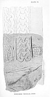

  
[Intangible Textual Heritage](../../../index.md) 
[Legends/Sagas](../../index)  [Celtic](../index.md) 
[Iceland](../../ice/index)  [Index](index)  [Previous](tnm03.md) 
[Next](tnm05.md) 

------------------------------------------------------------------------

[  
Click to enlarge](img/pl01.jpg.md)  
PLATE I. UNINSCRIBED CROSS-SLAB, JURBY.  
ODIN CARRIES THE HERO TO VALHALL.  

[  
Click to enlarge](img/pl02.jpg.md)  
UNINSCRIBED CROSS-SLAB, JURBY. (obverse)  

### II.--ODIN CARRIES THE HERO TO VALHALL.

We are now able, by means of the old Norse Mythology, to explain a
strange figure on an uninscribed fragment from Jurby. To understand it
aright we must bear in mind that Odin is ever eager to bring the
greatest champions to Valhall to share in the joyous lives of the gods,
and to be ready at the great Day of Doom to sally forth with them and do
battle with the monsters and the demons. We must remember, too, that it
is by *hanging* a man is dedicated to Odin.

At the left of the lower part of the shaft of a cross we

p. 19

see a man with a pole over his shoulder, from the end of which a smaller
being is hanging [1](#fn_15.md) ([pl.
I.](#img_pl01).md).

Now there is in the Norse heroic Sagas an old story of the sacrifice of
King Wiker by Starkad, Odin's foster-son, who *marked him with the
spear*, and dedicated him to Odin. [2](#fn_16.md)
But, as Professor Sophus Bugge points out, [3](#fn_17.md) the motives from the Volsunga Saga are
those most frequently represented on the Manks stones, and it seems
altogether more likely that the reference here is to Randver,
Jormanrek's son, whom Odin, under the guise of Bikke, the evil
counsellor, persuaded his aged father to sacrifice by hanging, as
related in the "Prose Edda, Gudrúnarhvot."

There are other instances of Odin's intervention to secure the death of
heroes, and so bring them to Valhalla. That it is meant for Odin is
confirmed by the fact that it has a bird's head, and Arnhofði
(Eagle-headed) is one of Odin's names.

The bearded figure above in a long robe, armed with a trident, may
possibly be intended for the aged Jormanrek.

On the other side of the cross Valhall is signified by the figures of
the Boar and the sacred Hart--

"Eikthyrnir the hart is called  
that stands o’er Odin's hall,  
and bites from Lærad's branches;  
from his horns fall  
drops into Hvirgelmir,  
whence all waters rise."--Grimnis-mal.

Above is the Boar Sæhrimner, food of the heroes in Valhall, who hunt and
slay and feast upon him, and afterwards Thor waves his hammer over the
bones and restores him to life. An interesting point to us is that the
Boar

p. 20

is of Celtic origin. The great Irish Sea-god, after whom our island is
supposed to be named--Mannu--owned the pig which was killed and eaten
and again restored to life!

Above the Boar we see remains of a design which may be intended for a
shield, as suggested by Dr. S. Bugge, representing the shield-panelling
of Valhall.

On the other face of the stone ([pl. II.](#img_pl02).md) is a curious
circular design of agglomerated flat pellets within a border of
step-pattern Can this be a reference to the roof of golden shields?

------------------------------------------------------------------------

### Footnotes

[19:1](tnm04.htm#fr_15.md) In a paper on Saga
Illustrations on Manks Monuments, Viking Club Saga Book, 1895-6, I took
this to be the capture of Loki, but the above seems a more likely
explanation.

[19:2](tnm04.htm#fr_16.md) Gautreks S., ch.
7--"Corp. Poet. Bor.", I, 466-7.

[19:3](tnm04.htm#fr_17.md) Nordiske Runeindskifter,
&c., Saertryk of Aarb. for Nord Oldkynd og Hist., 1899, p. 253.

------------------------------------------------------------------------

[Next: III.--View of Valhalla](tnm05.md)
