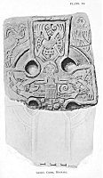

  
[Intangible Textual Heritage](../../../index) 
[Legends/Sagas](../../index)  [Celtic](../index) 
[Iceland](../../ice/index)  [Index](index)  [Previous](tnm04) 
[Next](tnm06) 

------------------------------------------------------------------------

[  
Click to enlarge](img/pl03.jpg)  
PLATE III.  
FIG. 1.                                         FIG. 2.  
RUMUND CROSS, MICHAEL.  

[  
Click to enlarge](img/pl04.jpg)  
PLATE IV. GRIM'S CROSS, MICHAEL.  

### III.--VIEW OF VALHALLA.

Two fragments of a cross at Michael ([pl. III.](#img_pl03)) erected by
Grim to Rumund (Hrómund), give us a view of Odin in Valhall, and of the
sports and pastimes there of the champions, *Einherja*.

At the right of the shaft of the cross, on one face (fig. 1), is the
figure of a man with a long spear in his right hand, his left on the
hilt of a short, pointed sword, and clothed in a kirtle or tunic; he is
bird-headed. Above is the figure of a Wolf, and the smaller fragment
shows the forepaws of another similar figure above it. This is
undoubtedly Odin with his spear Gungnir, accompanied by his wolves Geri
and Freki.

Below may be seen a large fish--the great Fish in the stream which runs
through Valhalla.

At the other side (left) of the shaft is the figure of a Boar
([Sæhrimner](errata.htm#1)), who affords the champions sport by day and
food at night. Above are two bird-headed figures, one feet uppermost,
having in his hand a pointed sword, the other in the act of sheathing
his. These represent the noted champions, bird-headed as being now one
with the gods, the grim delights of battle being greater than the

p. 21

pleasures of the chase. The one, head down, has been slain, but will
rise at even to banquet with his victor and the gods and fight again
another day.

But what is this figure immediately under the head of the cross?
Long-robed, his hands clasping in front of him a crutch-headed or
tau-shaped Staff, under his left arm a Book, around his head a Nimbus of
peculiar design, with fringes, as in the case of the Christ on [Grim's
cross, Michael](#img_pl04), and upon one of the Virgin Mary on Roolwer's
cross, Maughold. Like these also it bears three small crosslets,
reminding one of the nimbus in the Book of Kells. This, I think, is
intended for Christ, and signifies that now He and not Odin is King of
Heaven, the material joys of which are depicted at either side of the
Tree of Life, Odin's steed, Christ's palfry!

------------------------------------------------------------------------

[Next: IV.--Valkyrie](tnm06)
