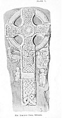

  
[Intangible Textual Heritage](../../../index) 
[Legends/Sagas](../../index)  [Celtic](../index) 
[Iceland](../../ice/index)  [Index](index)  [Previous](tnm05) 
[Next](tnm07) 

------------------------------------------------------------------------

[  
Click to enlarge](img/pl05.jpg)  
PLATE V.  
MAL LOMCHON CROSS, MICHAEL.  

### IV.--VALKYRIE.

A very beautiful cross at the Church gates, Michael ([pl.
V.](#img_pl05)), erected by Mal-Lomchon to Malworrey, his foster-mother,
daughter of Dugald and wife of Athisl, bears the figure of a Harper
seated, and approached by a long-robed figure offering a drinking horn.
Significance lies in the fact that the harp was unknown among the
Norsemen until their intercourse with the Irish. There is, however, a
lost story of Viking age concerning a Harper, known only by one or two
references, as, for example, in Voluspa--"There Eggtheow the gladsome,
the Giantesses Harper, sat on a mound tuning his Harp!" By that time,
therefore, not only was the instrument known to the Scandinavians, but
they themselves became players, "Eggtheow the Glad-some"--what a charm
lies in the epithet--being a Scandinavian name. And, if they enjoyed the
harp at their earthly feasts we may be sure they would expect their
heroes to be entertained by it in Valhall.

p. 22

Here, then, to the right of the cross, just below the circle, we have a
figure of Eggtheow the gladsome.

The long-robed figure is one of the Valkyrie offering welcome to the
musician as she would to a great hero.

------------------------------------------------------------------------

[Next: V.--Odin, Thor, Giants, Demons, Dwarves](tnm07)
